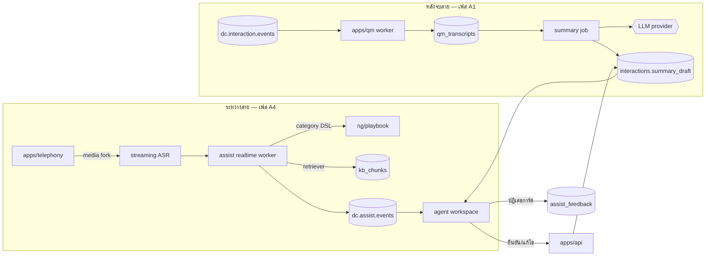

# D-Contact — Agent Assist (ผู้ช่วยของเอเจนต์)

> ตัดสินใจเชิงสถาปัตยกรรมอยู่ที่ [ADR-014](adr/014-agent-assist.md)

## 1. โมดูลนี้ทำอะไร (และไม่ทำอะไร)

| ทำ | ไม่ทำ |
|---|---|
| ร่างสรุปหลังจบงานให้ agent ตรวจแล้วกดยืนยัน | บันทึกสรุปเองโดยไม่ผ่านคน |
| เสนอบทความจากคลังความรู้ระหว่างคุย | ตอบลูกค้าแทน agent |
| เตือนเมื่อพลาดขั้นตอนบังคับ (เช่น ไม่ยืนยันตัวตน) | ตัดสินคะแนนคุณภาพ (นั่นคืองานของ QM) |
| เสนอ next best action จาก playbook | ส่งข้อความ/อีเมลโดยอัตโนมัติ |
| **นำบทสนทนาทีละขั้นตามสคริปต์ที่คนเขียน + เก็บหลักฐานว่าเดินถึงไหนจริง** (§3 A6) | **เขียนสคริปต์ให้เอง หรือแก้ถ้อยคำระหว่างสาย** |

**KPI ของโมดูล:** ACW ที่ลดลง (นาที/สาย) และ **acceptance rate ของการ์ดคำแนะนำ**
ทั้งสองตัวต้องอยู่บนหน้าจอเดียวกับการตั้งค่า — ฟีเจอร์ที่ acceptance ต่ำกว่า 30% ให้ปิดทิ้ง

## 2. สถาปัตยกรรม



**เส้นบนกับเส้นล่างเป็นคนละ latency budget โดยสิ้นเชิง** — เส้นล่างวัดเป็นวินาทีถึงนาที,
เส้นบนวัดเป็นมิลลิวินาที นี่คือเหตุผลเดียวที่ยอมให้มี worker แยกในเฟส A4

## 3. ฟีเจอร์ 4 ตัว เรียงตามลำดับที่ต้องทำ

### A1 — Auto wrap-up summary (หลังจบสาย)

```
interaction.ended → transcript พร้อม (มีอยู่แล้วจาก QM)
  → prompt: สรุป 3 ส่วน "ลูกค้าติดต่อเรื่องอะไร / ทำอะไรไปแล้ว / ต้องทำอะไรต่อ"
  → เสนอ disposition ที่น่าจะใช่ (จากรายการของ tenant) + แท็ก
  → เขียน interactions.summary_draft (สถานะ DRAFT)
  → agent เห็นในหน้า wrap-up: กดยืนยัน / แก้แล้วยืนยัน / เขียนเอง
  → บันทึกทั้ง draft และ final + ใครแก้ (หลักฐาน + ข้อมูลปรับปรุง)
```

ค่าที่วัด: ACW เฉลี่ยก่อน/หลังเปิดใช้, สัดส่วนที่ยืนยันโดยไม่แก้, สัดส่วนที่เขียนใหม่ทั้งหมด

### A2 — Knowledge suggest (ระหว่างสาย, ไม่ต้องมี ASR)

ทำงานจากสิ่งที่ **พิมพ์** ได้ทันทีในช่องทาง digital และจาก metadata ของสาย (คิว, flow, ข้อมูล CRM)
การ์ดบทความขึ้นด้านขวา พร้อมปุ่ม "แทรกข้อความ" (agent ยังต้องกดส่งเอง) และ "ไม่เกี่ยว"

### A3 — Compliance & checklist nudge

ใช้ category DSL ตัวเดียวกับ QM ([quality-management §6](quality-management.md)) —
กฎที่ QM ใช้ตรวจย้อนหลัง เอามาเตือนตอนกำลังคุยได้เลย โดยไม่ต้องเขียนกฎสองชุด

```jsonc
{ "name": "ยังไม่ยืนยันตัวตน",
  "when": { "afterSeconds": 45, "notMatched": { "anyPhrase": ["ขอทราบเลขบัตร", "ยืนยันตัวตน"] } },
  "nudge": { "level": "warn", "text": "ยังไม่ได้ยืนยันตัวตนลูกค้า" } }
```

### A4 — Real-time guidance (ต้องผ่านเกณฑ์ latency ก่อนถึงจะปล่อย)

เงื่อนไขปล่อย: streaming ASR ภาษาไทย **WER ≤ 25%** และการ์ดขึ้นภายใน **2.5 วินาที**
หลังประโยคจบ ถ้าไม่ผ่าน ให้อยู่ที่ A1–A3 ต่อไปโดยไม่ต้องรู้สึกผิด

### A6 — Guided script (สคริปต์นำบทสนทนา)

A1–A4 ตอบคำถามว่า *"ตอนนี้น่าจะพูดอะไร"* — A6 ตอบคนละคำถามคือ
***"ต้องพูดอะไร ตามลำดับไหน และพูดครบหรือยัง"***

งานขาย งานทวงถาม และงานที่มีถ้อยคำบังคับตามกฎหมาย ไม่ได้ต้องการคำแนะนำที่ถูก 80% ของเวลา —
ต้องการ**ถ้อยคำชุดเดียวกันทุกสาย**และ**หลักฐานว่าพูดจริง** นี่คือช่องว่างที่การ์ด assist ปิดไม่ได้
และเป็นเหตุผลว่าทำไม prompt "แนะนำประโยคปิดการขาย" ถึงถูกปิดที่ acceptance 19% — ปัญหาไม่ได้อยู่ที่ prompt
แต่อยู่ที่เอาเครื่องมือเดาไปทำงานที่ต้องการความแน่นอน

| | การ์ด assist (A2–A4) | สคริปต์ (A6) |
|---|---|---|
| ที่มาของเนื้อหา | โมเดล + retriever | **คนเขียนและ publish เป็นเวอร์ชัน** |
| ผ่าน LLM ไหม | ผ่าน | **ไม่ผ่านแม้แต่ขั้นเดียว** |
| เอเจนต์ไม่ทำตาม | ปกติ — วัดเป็น acceptance rate | **ต้องบันทึกเหตุผล** ถ้าขั้นนั้นบังคับ |
| ตัวชี้วัด | acceptance rate | completion rate + จุดที่คนเลิกเดินกลางทาง |
| ฝ่ายกำกับยอมรับเป็นหลักฐานไหม | ไม่ | **ใช่ — `assist_script_run.path`** |

**สคริปต์ไม่ผ่าน LLM เลย** คือข้อจำกัดที่ทำให้ฟีเจอร์นี้ขายได้กับงาน collection และงานที่มี
mini-Miranda / ข้อความแจ้งบันทึกเสียง ถ้าวันไหนมีคนเสนอให้ "ให้ AI ปรับถ้อยคำให้เข้ากับลูกค้า"
คำตอบคือไม่ — นั่นทำให้หลักฐานใช้ไม่ได้ทั้งชุด

#### node 5 ชนิด (คุมจำนวนแบบเดียวกับ flow engine)

| ชนิด | ทำอะไร | ข้อจำกัด |
|---|---|---|
| `SAY` | ถ้อยคำที่ต้องพูด/ส่ง — ช่องทางข้อความมีปุ่มแทรกลง composer (ยังต้องกดส่งเอง) | แก้ข้อความบนหน้าจอเอเจนต์ไม่ได้ |
| `ASK` | ถามแล้วเก็บคำตอบลงฟิลด์ (`ob_record.attrs` / custom field ของเคส) | ต้องระบุปลายทางเสมอ ห้ามเก็บลอย ๆ |
| `BRANCH` | ลูกค้าตอบแบบไหน → ไปขั้นไหน | ทางแยกไม่เกิน 5 ทาง และต้องมีทางที่ครอบคลุม "อื่น ๆ" |
| `KB` | อ้างบทความในคลังความรู้ | **อ้างเท่านั้น ห้ามคัดลอกเนื้อหามาเก็บซ้ำ** (§5) |
| `ACTION` | เสนอ disposition · สร้างเคส · เพิ่มเข้า DNC · นัดโทรกลับ | เสนอเท่านั้น เอเจนต์เป็นคนกด |

**ไม่มี node เงื่อนไขอิสระและไม่มีลูป** — สคริปต์ที่ต้องคิดแทนคนแปลว่ามันควรเป็น
[flow](flow-engine.md) หรือ [journey](journey-orchestration.md) ไม่ใช่สคริปต์

#### ผูกกับงานยังไง

ผูกได้ 3 ที่: **คิว** (inbound) · **แคมเปญ** (outbound) · **ประเภทเคส**
เลือกตอนงานถูกมอบหมาย ไม่ใช่ตอน render — ที่เจาะจงกว่าชนะ (แคมเปญ > ประเภทเคส > คิว)

**pin เวอร์ชันต่อ interaction เหมือน flow** ([flow-engine §6](flow-engine.md)) — publish สคริปต์ใหม่
ระหว่างที่มี 40 สายกำลังคุยอยู่ ต้องไม่มีใครเห็นข้อความสลับกลางประโยค

#### ขั้นบังคับ

`required: true` ทำให้ปิดงานไม่ได้จนกว่าจะติ๊กว่าทำแล้ว **หรือ**ระบุเหตุผลที่ข้าม —
กติกาเดียวกับ `ob_disposition.requiresNote` ที่มีอยู่แล้ว

เส้นที่ห้ามข้าม: **บล็อกได้แค่หน้าสรุปงาน ห้ามบล็อกการรับสายหรือการคุย** — หลักเดียวกับ
[ADR-009](adr/009-plan-entitlement-licensing.md) ที่ว่าสิทธิ์หมดอายุแล้วยังต้องรับสายได้

#### วัดอะไร

| ตัวเลข | ใช้ตัดสินอะไร |
|---|---|
| completion rate | สคริปต์ยาวเกินจริงไหม |
| **จุดที่คนเลิกเดินกลางทาง (drop-off step)** | ขั้นไหนที่เขียนแล้วใช้ไม่ได้จริง — ตัวเลขที่มีค่าที่สุดของโมดูลนี้ |
| สัดส่วนของแต่ละทางแยก | ทางแยกที่ไม่เคยถูกเลือกเลย = ลบทิ้ง |
| conversion ต่อเวอร์ชัน | สคริปต์ใหม่ดีกว่าเก่าจริงไหม (A/B ในเฟส A7) |

**completion rate ห้ามไหลเข้า scorecard ของคนโดยอัตโนมัติ** — เหตุผลเดียวกับ acceptance rate ใน §6
ถ้าจะให้คะแนนเรื่องนี้ ต้องผ่าน [QM](quality-management.md) ที่มีหลักฐาน มีคนตรวจ และมีสิทธิ์โต้แย้ง

## 4. Data model

```prisma
model assist_prompt   { id String @id  tenantId String?  kind String // SUMMARY|SUGGEST|NUDGE
                        version Int  body String  model String  params Json
                        status String  createdBy String }   // registry ร่วมกับ auto-QM
model assist_card     { id String @id  interactionId String  agentId String  kind String
                        payload Json                        // ข้อความ/บทความ/คำเตือน
                        sources Json                        // บังคับมี — บทความ/ช่วงเวลาในสาย
                        shownAt DateTime  latencyMs Int
                        action String }                     // ACCEPTED|INSERTED|DISMISSED|IGNORED
model assist_summary  { id String @id  interactionId String  promptVersion Int
                        draft String  final String?  editedBy String?  editDistance Int?
                        dispositionSuggested String?  dispositionFinal String?
                        acceptedAt DateTime? }

// ---- A6: guided script ----
model assist_script      { id String @id  tenantId String  name String
                           purpose String   // SALES|COLLECTION|VERIFY|SUPPORT|RETENTION
                           locale String  version Int
                           status String    // DRAFT|PUBLISHED|ARCHIVED
                           ownerId String   reviewAt DateTime?
                           graph Json }     // node 5 ชนิด + ทางแยก — ไม่มี LLM ในเส้นทางนี้
model assist_script_bind { id String @id  scriptId String
                           scope String     // QUEUE|CAMPAIGN|CASE_TYPE
                           refId String  priority Int }
model assist_script_run  { id String @id  interactionId String  agentId String
                           scriptId String  scriptVersion Int      // pin ตอนเริ่ม ไม่เปลี่ยนกลางสาย
                           path Json        // [{stepId, enteredAt, ms, branchTaken}] — หลักฐาน
                           captured Json    // คำตอบของ node ASK
                           requiredMissed String[]  skipReasons Json
                           completedPct Int  outcome String? }
```

`assist_card.action` คือแหล่งข้อมูลของ acceptance rate — ต้องเก็บทุกใบรวมทั้งใบที่ถูกเมิน
(`IGNORED` = แสดงแล้วไม่มีปฏิสัมพันธ์จนสายจบ) ไม่งั้นตัวเลขจะสวยแบบไม่จริง

`assist_script_run.path` เก็บ **เวอร์ชันที่เอเจนต์เห็นจริงตอนนั้น** ไม่ใช่ `scriptId` เปล่า ๆ —
เวลาถูกร้องเรียนย้อนหลัง 8 เดือน คำถามคือ "ตอนนั้นบนจอเขียนว่าอะไร" ซึ่งตอบไม่ได้ถ้าไม่ pin เวอร์ชัน
เก็บ 24 เดือนเท่า `ob_screening_log`

## 5. เส้นแบ่งกับโมดูลอื่น (สำคัญ)

| ถ้าคำถามคือ | เจ้าของคือ |
|---|---|
| "ตอบลูกค้าแทนเราได้ไหม" | [virtual agent](virtual-agent-knowledge.md) — ไม่ใช่ assist |
| "สายนี้คุยดีไหม" | [QM](quality-management.md) |
| "คำตอบที่ถูกต้องคืออะไร" | [knowledge base](virtual-agent-knowledge.md) — assist เป็นแค่ผู้ส่งมอบ |
| "agent คนนี้เก่งขึ้นไหม" | [performance](performance-gamification.md) |
| "ระบบควรทำอะไรต่อเองโดยไม่ใช้คน" | [flow](flow-engine.md) / [journey](journey-orchestration.md) — ไม่ใช่สคริปต์ |
| "คนควรพูดอะไรต่อ ตามลำดับไหน" | **assist A6 — สคริปต์** |

assist **ไม่มีคลังความรู้ของตัวเอง ไม่มี ASR ของตัวเอง ไม่มีคะแนนของตัวเอง** —
ถ้าวันไหนมันเริ่มมี แปลว่าเรากำลังสร้างระบบซ้อนระบบ

**สคริปต์ (A6) เป็นข้อยกเว้นเดียวและมีเงื่อนไข**: มันเก็บ*ลำดับและถ้อยคำ* ซึ่งเป็นของที่คลังความรู้
ไม่มีรูปแบบให้เก็บ (บทความคือคำตอบ ไม่ใช่บทสนทนา) แต่ node `KB` **อ้าง** บทความเท่านั้น
ห้ามคัดลอกเนื้อหามาแปะไว้ในสคริปต์ — วันที่นโยบายคืนเงินเปลี่ยน ต้องแก้ที่เดียว

## 6. สิทธิ์และความเป็นส่วนตัวของ agent

- agent ปิดแผง assist ของตัวเองได้ (แต่ nudge ระดับ compliance ปิดไม่ได้ และ**แผงสคริปต์ที่มีขั้นบังคับก็ปิดไม่ได้**)
- **ข้อมูล acceptance rate รายบุคคลใช้เพื่อปรับปรุงฟีเจอร์ ไม่ใช่เพื่อประเมินคน** —
  ห้ามส่งเข้า scorecard ของ [performance](performance-gamification.md) โดยอัตโนมัติ
- หัวหน้าเห็นภาพรวมของทีมได้ แต่ไม่เห็นว่าใครกดปฏิเสธการ์ดไหนเป็นรายใบ

## 7. UI (`mockups/ai.html` — กลุ่ม Agent assist + แผงใน `workspace.html`)

| view | หน้าที่ |
|---|---|
| `assist-settings` | เปิด/ปิดรายฟีเจอร์ + latency budget + ช่องทางที่ใช้ |
| `assist-prompts` | **list/new/edit** prompt + เวอร์ชัน + ทดสอบกับสายจริง 5 สาย |
| `assist-playbooks` | **list/new/edit** กฎ nudge (ใช้ category DSL ร่วมกับ QM) |
| `assist-scripts` | **list/new/edit** สคริปต์ + เวอร์ชัน + ผูกกับคิว/แคมเปญ/ประเภทเคส + completion & drop-off |
| `assist-quality` | acceptance rate ต่อฟีเจอร์, latency p95, ACW ก่อน/หลัง |
| แผงใน workspace | การ์ดคำแนะนำ + ปุ่มยืนยัน/ไม่เกี่ยว + **แผงสคริปต์ทีละขั้น** + กล่องสรุปหลังจบสาย |

แผงสคริปต์อยู่ **คอลัมน์เดียวกับ context อื่น ๆ ของงาน** (ลูกค้า/เคส/journey) ไม่ใช่ modal —
ของที่ต้องอ่านขณะพูดห้ามบังบทสนทนา

## 8. แผนเฟส

| เฟส | ได้อะไร | เงื่อนไข |
|---|---|---|
| **A1** | auto summary + เสนอ disposition + วัด ACW | ต้องมี transcript (Q3 ของ QM) |
| **A2** | knowledge suggest ในช่องทาง digital | ต้องมี KB (B1) |
| **A3** | compliance nudge จาก category DSL | Q4 ของ QM |
| **A4** | real-time guidance (voice) | streaming ASR ผ่านเกณฑ์ + latency p95 ≤ 2.5s |
| **A5** | ผูก next-best-action กับข้อมูล CRM | [integration](integration-platform.md) |
| **A6** | **guided script**: ตัวเดินสคริปต์ในหน้าเอเจนต์ + ตัวเขียนสคริปต์ + ผูกคิว/แคมเปญ + `assist_script_run` | **ไม่มีเงื่อนไข AI ใด ๆ** — ทำคู่ขนานกับ A1 ได้ตั้งแต่ต้น ([O1](outbound-campaign.md) ทำให้มีคนใช้จริง) |
| **A7** | A/B สคริปต์ 2 เวอร์ชันในแคมเปญเดียว + conversion ต่อเวอร์ชัน | A6 + สถิติจริง ≥ 500 สายต่อเวอร์ชัน |

**A6 ไม่ต้องรอ A1** และตั้งใจให้เป็นแบบนั้น — มันเป็นฟีเจอร์เดียวในโมดูลนี้ที่ไม่พึ่ง transcript
ไม่พึ่ง KB และไม่พึ่งโมเดล ทำให้ปล่อยพร้อม voice MVP ได้ และเป็นตัวที่ทีมขายต้องการก่อนตัวอื่นทั้งหมด

## 9. ความเสี่ยง

| ความเสี่ยง | ทางรับมือ |
|---|---|
| การ์ดรกจน agent ปิดทิ้ง | จำกัดไม่เกิน 2 การ์ดพร้อมกัน + วัด acceptance + ตัดฟีเจอร์ที่ต่ำกว่า 30% |
| สรุปผิดกลายเป็นบันทึกทางการ | DRAFT เสมอ + คนกดยืนยัน + เก็บทั้งร่างและฉบับแก้ |
| latency เกินจนไร้ประโยชน์ | latency budget เป็นเงื่อนไขปล่อยฟีเจอร์ + วัด p95 ตลอดเวลา |
| PII ไหลออก provider | redaction ก่อนส่ง prompt + สลับ provider ในองค์กรได้ |
| ถูกใช้เป็นเครื่องมือจับผิด agent | acceptance rate ห้ามเข้า scorecard; หัวหน้าเห็นแค่ภาพรวมทีม |
| ต้นทุน token | quota `assistSummariesPerMonth` + สรุปเฉพาะสายที่ยาวเกิน N วินาที |
| **สคริปต์ยาวจนเอเจนต์อ่านออกเสียงแบบหุ่นยนต์** | จำกัด `SAY` ที่ ~40 คำต่อขั้น + วัด drop-off step + ทบทวนขั้นที่ถูกข้ามบ่อยทุกเดือน |
| **สคริปต์กลายเป็นคลังความรู้เงา** | node `KB` อ้างบทความเท่านั้น + สคริปต์ต้องมีเจ้าของและ `reviewAt` เหมือนบทความ ([ADR-013](adr/013-virtual-agent-knowledge.md)) |
| **ขั้นบังคับกลายเป็นตัวขวางการปิดงาน** | บล็อกได้แค่หน้าสรุปงาน + ข้ามได้เสมอถ้าระบุเหตุผล + รายงานเหตุผลที่ถูกใช้บ่อยกลับไปหาคนเขียนสคริปต์ |

## รายงานที่โมดูลนี้เป็นเจ้าของ

`assist.acceptance` · `assist.latency` · `assist.acw.delta` · `assist.summary.edit` ·
`assist.script.completion` · `assist.script.dropoff` · `assist.script.required`

รายละเอียดของแต่ละใบ (dataset · grain · มิติบังคับ · entitlement · ชั้น · drill-down · เฟส) อยู่ที่
[reporting-data-platform §7.6](reporting-data-platform.md) ซึ่งเป็น**แหล่งความจริงเดียว** —
ใบใหม่ต้องไปลงทะเบียนที่นั่นก่อน ห้ามตั้งใบรายงานขึ้นเองในโมดูล

ทุกใบเป็น**ระดับทีมเท่านั้น** — acceptance rate รายบุคคลห้ามแสดงและห้ามไหลเข้า scorecard (§6 ของเอกสารนี้)

## เอกสารเกี่ยวข้อง

[ADR-014](adr/014-agent-assist.md) · [quality-management.md](quality-management.md) ·
[virtual-agent-knowledge.md](virtual-agent-knowledge.md)
