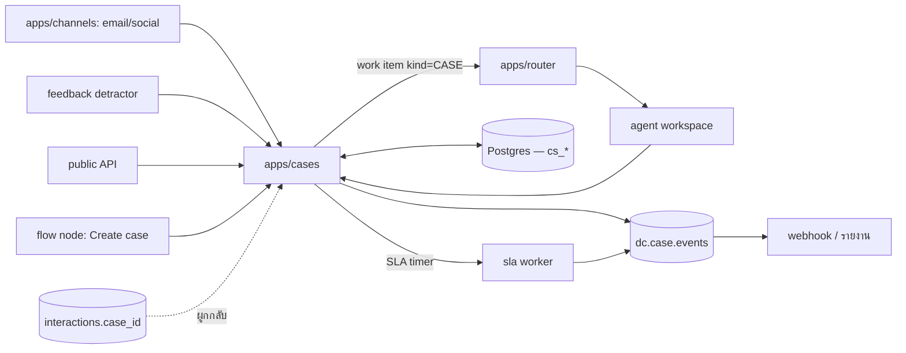

# D-Contact — Case Management (งานที่ไม่จบในครั้งเดียว)

> ตัดสินใจเชิงสถาปัตยกรรมอยู่ที่ [ADR-016](adr/016-case-management.md)

## 1. เคสกับ interaction ต่างกันอย่างไร

| | Interaction | Case |
|---|---|---|
| หมายถึง | การติดต่อหนึ่งครั้ง | เรื่องหนึ่งเรื่องของลูกค้า |
| อายุ | วินาที–ชั่วโมง | ชั่วโมง–สัปดาห์ |
| ช่องทาง | หนึ่งช่องทาง | ข้ามช่องทางได้ |
| SLA | รับทันไหม (วินาที) | แก้จบทันไหม (ชั่วโมง/วัน) |
| เจ้าของ | agent ที่รับตอนนั้น | เจ้าของเคส (เปลี่ยนมือได้ มีประวัติ) |
| จบเมื่อ | วางสาย/ปิดแชท | ลูกค้าได้สิ่งที่ต้องการ |

```
Case CS-4821 "เคลมสินค้าชำรุด"  ── SLA: แก้จบใน 3 วันทำการ
 ├─ INT-88012  email   จ. 09:12   ลูกค้าแจ้งเรื่อง            (agent: สมหญิง)
 ├─ INT-88190  voice   อ. 14:03   โทรตามความคืบหน้า           (agent: สมชาย)
 ├─ task       —       พ. 10:00   รอฝ่ายคลังยืนยันสต็อก        (ไม่ใช่ interaction)
 └─ INT-88455  line    ศ. 16:40   แจ้งผลและปิดเรื่อง          (agent: สมหญิง)
```

## 2. สถาปัตยกรรม



`apps/cases` เป็น TS service เล็ก — งานหนักที่สุดคือ SLA timer ซึ่งเป็น worker ธรรมดา

## 3. Data model

```prisma
model cs_case      { id String @id  tenantId String  number String  // CS-4821
                     typeId String  subject String  contactId String
                     status String        // NEW|OPEN|PENDING_CUSTOMER|PENDING_INTERNAL|RESOLVED|CLOSED
                     priority String  ownerId String?  teamId String?  queueId String
                     fields Json          // custom fields ตามประเภทเคส
                     slaPolicyId String  dueAt DateTime?  firstResponseAt DateTime?
                     resolvedAt DateTime?  reopenCount Int  source String }
model cs_type      { id String @id  tenantId String  name String  prefix String
                     fieldSchema Json  statuses Json  defaultSlaId String  formLayout Json }
model cs_sla       { id String @id  tenantId String  name String
                     firstResponseMins Int  resolutionMins Int
                     businessHoursId String   // ใช้ปฏิทินตัวเดียวกับ routing
                     escalations Json }       // [{atPct:80, notify:["supervisor"]}]
model cs_activity  { id String @id  caseId String  kind String
                     // NOTE|STATUS|ASSIGN|INTERACTION|TASK|EMAIL_OUT|ATTACHMENT
                     body String?  interactionId String?  actorId String  at DateTime
                     visibility String }      // INTERNAL|CUSTOMER
model cs_task      { id String @id  caseId String  title String  assigneeId String?
                     dueAt DateTime?  status String }
model cs_link      { id String @id  caseId String  kind String  // PARENT|CHILD|DUPLICATE|RELATED
                     otherCaseId String }
```

**`cs_activity` เป็นไทม์ไลน์เดียวของเคส** — ทั้งข้อความภายในและสิ่งที่ลูกค้าเห็น
อยู่ในตารางเดียวแยกด้วย `visibility` (แยกตารางแล้วจะเรียงลำดับเวลาให้ถูกต้องยาก)

## 4. SLA — จุดที่โมดูลนี้พังบ่อยที่สุด

| กฎ | เหตุผล |
|---|---|
| นับเฉพาะเวลาทำการ (ใช้ปฏิทินเดียวกับ [routing](interaction-data-flow.md)) | ไม่งั้นเคสที่เปิดเย็นวันศุกร์เกิน SLA ทุกใบ |
| **หยุดนาฬิกาเมื่อสถานะ = PENDING_CUSTOMER** | รอลูกค้าตอบไม่ใช่ความผิดของทีม |
| แจ้งเตือนที่ 80% ของเวลา ไม่ใช่ตอนเกินแล้ว | เตือนหลังเกินคือรายงาน ไม่ใช่การจัดการ |
| การ reopen รีเซ็ตนาฬิกาแบบมีเงื่อนไข + นับ `reopenCount` | reopen rate คือตัวชี้วัดคุณภาพจริงของเคส |
| SLA คนละตัวสำหรับ first response กับ resolution | ตอบเร็วแต่ไม่จบ ≠ จบช้าแต่ตอบครบ |

## 5. การมอบหมาย

- เคสใหม่เข้าคิว (`queueId`) → router จับคู่เหมือน work item อื่น ([ADR-016](adr/016-case-management.md) ข้อ 3)
- โหมด **pull** เป็นค่าเริ่มต้น: agent หยิบจากคิวเองเมื่อว่างจากงาน realtime
- โหมด **push** สำหรับเคสด่วน — กินโควตา concurrency ของ agent เหมือนแชท
- เคสมี **เจ้าของถาวร** ต่างจาก interaction: ลูกค้าโทรกลับเข้ามาแล้ว flow ตรวจว่ามีเคสเปิดอยู่
  → เสนอต่อสายหาเจ้าของเคสก่อน (ผูกกับ node `Route to case owner` ใน flow)

## 6. สิทธิ์

| ทำได้ | ADMIN | SUPERVISOR | AGENT |
|---|---|---|---|
| ตั้งค่าประเภทเคส/SLA | ✓ | — | — |
| เห็นทุกเคสของ tenant | ✓ | ทีมตัวเอง | ที่ตัวเองเป็นเจ้าของ/เกี่ยวข้อง |
| เปลี่ยนเจ้าของ | ✓ | ✓ | ส่งต่อได้ (ต้องมีเหตุผล) |
| ปิดเคส | ✓ | ✓ | ✓ |
| ลบเคส | — | — | — (ไม่มีใครลบได้ — ใช้ VOID + audit) |

## 7. UI (`mockups/cases.html`)

| view | หน้าที่ |
|---|---|
| `cases` | **list** ทุกเคส + ตัวกรอง (สถานะ/SLA เหลือเท่าไหร่/เจ้าของ/ประเภท) |
| `case-detail` | ไทม์ไลน์ + interaction ที่ผูก + งานย่อย + แผงข้อมูลลูกค้า + SLA นับถอยหลัง |
| `case-form` | **new/edit**: ประเภท, ลูกค้า, ความสำคัญ, ฟิลด์ตามประเภท, มอบหมาย |
| `case-types` | **list/new/edit** ประเภทเคส + ฟิลด์ + สถานะ + ฟอร์ม |
| `case-sla` | **list/new/edit** นโยบาย SLA + escalation |
| `my-cases` | เคสของฉัน เรียงตามเวลาที่เหลือ |

## 8. แผนเฟส

| เฟส | ได้อะไร |
|---|---|
| **C1** | `cs_*` + เคสจาก agent/อีเมล + ไทม์ไลน์ + ผูก interaction |
| **C2** | ประเภทเคส + custom fields + สถานะกำหนดเอง (metadata-driven) |
| **C3** | SLA + หยุดนาฬิกา + escalation + คิว/มอบหมายผ่าน router |
| **C4** | เคสจาก feedback detractor + API ภายนอก + webhook + รายงาน reopen/aging |
| **C5** | พอร์ทัลให้ลูกค้าดูสถานะเคสเอง (ผูกกับ KB self-service) |

## 9. ความเสี่ยง

| ความเสี่ยง | ทางรับมือ |
|---|---|
| กลายเป็น Jira/ITSM ที่ไม่มีใครใช้ | จำกัดขอบเขต: ไม่มี workflow engine ตัวที่สอง; ซับซ้อนกว่านี้ให้เรียก flow |
| เคสค้างสะสมโดยไม่มีใครเห็น | หน้า aging + แจ้งเตือนที่ 80% + รายงาน backlog รายวันบังคับมี |
| agent สร้างเคสซ้ำเรื่องเดียวกัน | เสนอเคสที่เปิดอยู่ของลูกค้ารายนี้ก่อนกดสร้าง + `cs_link(DUPLICATE)` |
| SLA นอกเวลาทำการทำให้ตัวเลขไร้ความหมาย | ผูกปฏิทินธุรกิจตั้งแต่วันแรก ไม่ใช่ค่อยเพิ่ม |
| เคสแย่ง agent กับสายเข้า | capacity ของงาน deferrable แยกจาก realtime + pull เป็นค่าเริ่มต้น |

## รายงานที่โมดูลนี้เป็นเจ้าของ

`cs.backlog` · `cs.aging` · `cs.sla` · `cs.reopen` · `cs.load` · `cs.task.completion` · `cs.source.mix`

รายละเอียดของแต่ละใบ (dataset · grain · มิติบังคับ · entitlement · ชั้น · drill-down · เฟส) อยู่ที่
[reporting-data-platform §7.12](reporting-data-platform.md) ซึ่งเป็น**แหล่งความจริงเดียว** —
ใบใหม่ต้องไปลงทะเบียนที่นั่นก่อน ห้ามตั้งใบรายงานขึ้นเองในโมดูล

`cs.backlog` เป็น**ใบบังคับมี**ตาม §9 ของเอกสารนี้ — เคสค้างที่ไม่มีใครเห็นคือความเสี่ยงหลักของโมดูล

## เอกสารเกี่ยวข้อง

[ADR-016](adr/016-case-management.md) · [interaction-data-flow.md](interaction-data-flow.md) ·
[customer-360.md](customer-360.md) · [feedback-survey.md](feedback-survey.md)
