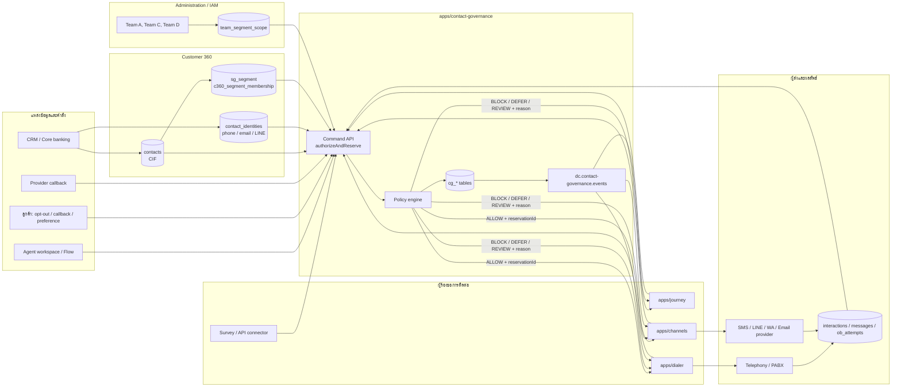
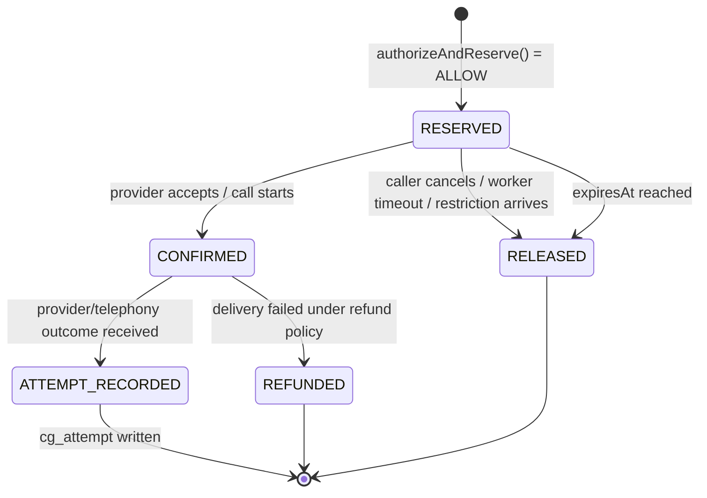
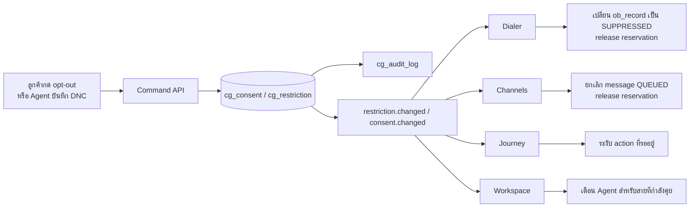

# D-Contact — Contact Governance Data Flow

> โมดูลกลางที่ตัดสินว่า **ติดต่อ CIF นี้ ผ่าน identity/channel นี้ เพื่อ purpose นี้ได้หรือไม่**
> รายละเอียด policy/data model อยู่ที่ [contact-governance.md](contact-governance.md) และการตัดสินใจ
> สถาปัตยกรรมอยู่ที่ [ADR-027](adr/027-contact-governance.md)

## 1. ขอบเขตและหลักการไหลข้อมูล

Contact Governance เป็น **Policy Decision Point (PDP)** ไม่ได้โทรหรือส่งข้อความเอง
แต่เป็นด่านกลางที่ทุกระบบขาออกต้องเรียกแบบ synchronous ก่อนทำงานจริง ส่วน event และรายงานทำงาน
แบบ asynchronous เพื่อไม่ให้ Kafka/reporting อยู่บน critical path ของการตัดสิน



## 2. หน่วยข้อมูลที่ใช้ร่วมกัน

| หน่วย | ความหมาย | เจ้าของข้อมูล |
|---|---|---|
| `contactId` / CIF | ลูกค้าหนึ่งราย ซึ่งอาจมาจาก CRM CIF ผ่าน `contacts.externalRefs` | Customer 360 / CRM integration |
| `identityId` | จุดติดต่อหนึ่งรายการ เช่น เบอร์ E.164, Email, LINE user ID | Customer 360 |
| `purpose` | เหตุผลการติดต่อ เช่น `MARKETING`, `COLLECTION`, `SERVICE`, `SURVEY`, `CALLBACK` | Contact Governance policy |
| `channel` | `VOICE`, `SMS`, `LINE`, `WHATSAPP`, `EMAIL` | Contact Governance policy |
| `teamId` | ทีมที่ Agent สังกัด หรือทีมเจ้าของ Campaign/Journey | Workspace / Administration |
| `segmentId` | กลุ่มธุรกิจของ CIF เช่น `LOND`, `CARD`; ใช้ได้มากกว่าหนึ่งกลุ่ม | Customer 360 |
| `source` / `sourceId` | ระบบที่ร้องขอ เช่น Journey, Campaign, Survey, Agent และ ID ต้นทาง | โมดูลผู้ร้องขอ |
| `actionKey` | คีย์ idempotency ของการกระทำหนึ่งครั้ง | โมดูลผู้ร้องขอ |
| `reservationId` | สิทธิ์ชั่วคราวที่ต้องแนบกับคำสั่งส่งจริง | Contact Governance |

`contactId` เป็นกุญแจหลักของ policy ความถี่ ส่วน `identityId` ใช้ตอบโจทย์ข้อห้ามเฉพาะเบอร์หรือช่องทาง
หาก resolve CIF/identity ไม่ได้หรือ ambiguity สูง ระบบคืน `REVIEW` และห้ามส่งจนกว่าจะยืนยันตัวตน
ก่อนเข้า Policy Engine จะต้องตรวจว่า `teamId` มี `CONTACT` scope กับ segment ปัจจุบันของ CIF หรือไม่
หากไม่ผ่าน ระบบปฏิเสธคำขอด้วย `403 TEAM_SEGMENT_NOT_ALLOWED` ซึ่งเป็น authorization failure ไม่ใช่ PDPA block

## 3. Flow A — ป้อนและเปลี่ยนสิทธิการติดต่อ

ใช้เมื่อ CRM sync, ลูกค้ากด opt-out, Agent บันทึกคำขอ, Flow รับ DTMF “ไม่ให้ติดต่อ” หรือ Provider ส่ง
unsubscribe callback เข้ามา

```mermaid
sequenceDiagram
  autonumber
  participant S as CRM / ลูกค้า / Agent / Flow
  participant I as apps/integrations หรือ API
  participant C as Customer 360
  participant G as Contact Governance
  participant D as cg_* tables
  participant K as Kafka event
  participant O as Dialer / Channels / Journey

  S->>I: CIF + identity + command
  I->>C: resolve / upsert contacts, contact_identities, customer attributes
  C->>C: evaluate sg_segment and c360_segment_membership
  C-->>I: contactId + identityId + confidence
  I->>G: create/revoke consent, preference, restriction or exception
  G->>D: transaction: write canonical record + cg_audit_log
  G->>K: restriction.changed / consent.changed / preference.changed
  C->>K: customer.segment.changed เมื่อ membership เปลี่ยน
  K-->>O: invalidate cache; re-filter/cancel queued work; release reservation
  O-->>G: acknowledgement / release result
```

### กฎที่สำคัญ

1. การเพิ่ม `cg_restriction` หรือถอน `cg_consent` มีผลทันทีและส่ง event หลัง commit
2. Dialer/Channels ตรวจ event เพื่อยกเลิกเฉพาะงานที่ยังไม่ส่ง; สายที่กำลังคุยยกเลิกไม่ได้ แต่ Workspace
   ต้องรับ event เพื่อเตือน Agent
3. การปลด hard restriction ห้าม update ตรง ต้องผ่านสิทธิ Compliance และมี `cg_audit_log`
4. ต้องไม่ใช้การ import list เพื่อเขียนทับ DNC หรือ Consent เพราะ import เป็นเพียง source of candidate
   contact ไม่ใช่ source of authority ด้านสิทธิ

### Flow A.2 — กำหนดขอบเขตทีมและย้ายกลุ่ม CIF

```mermaid
sequenceDiagram
  autonumber
  participant A as Admin / Supervisor
  participant S as Administration / IAM
  participant C as Customer 360
  participant K as Kafka event
  participant W as Workspace / Dialer / Journey

  A->>S: grant Team A, Team C -> LOND; Team D -> CARD
  S->>S: write team_segment_scope + audit
  S->>K: team.segment-scope.changed
  C->>C: CRM attribute change re-evaluates membership
  C->>K: customer.segment.changed (LOND -> CARD)
  K-->>W: filter view/queue; cancel or reassign pending work
  W-->>S: acknowledgement
```

`c360_segment_membership` เป็น materialized result ของนิยาม `sg_segment` เพื่อให้ตรวจสิทธิ์ได้เร็ว ไม่ใช่
source of truth แบบรายชื่อที่ผู้ใช้แก้เอง เมื่อ CIF ย้ายจาก `LOND` ไป `CARD` งานที่ยังไม่ confirm ต้องถูก
ตรวจ scope ซ้ำและ release reservation หากทีมเดิมไม่มีสิทธิ์แล้ว

## 4. Flow B — การตัดสินก่อนติดต่อออก

นี่คือ critical flow ของ Voice, Message และ Manual contact ทุกแบบ

```mermaid
sequenceDiagram
  autonumber
  participant R as Journey / Campaign / Agent / Connector
  participant G as Contact Governance API
  participant S as Team scope authorization
  participant P as Policy engine
  participant D as cg_* tables
  participant X as Dialer / Channels
  participant V as Voice / Message provider

  R->>G: authorizeAndReserve(..., trusted sourceOwnerTeamId, actionKey)
  G->>S: resolve authenticated team + current customer segment membership
  alt no CONTACT scope for this CIF
    G->>D: append cg_audit_log(AUTHORIZATION_DENIED)
    G-->>R: 403 TEAM_SEGMENT_NOT_ALLOWED
  else team scope allowed
    G->>P: resolve applicable policy
    P->>D: lock contactId; read restriction, consent, preference, policy, exception, attempt
    alt hard restriction or invalid permission
      P->>D: insert cg_decision_log(BLOCK)
      P-->>R: BLOCK + reasonCode + decisionId
    else eligible later
      P->>D: insert cg_decision_log(DEFER)
      P-->>R: DEFER + nextEligibleAt + reasonCode
    else needs approval
      P->>D: insert cg_decision_log(REVIEW)
      P-->>R: REVIEW + reasonCode
    else allowed
      P->>D: insert cg_reservation(RESERVED) + cg_decision_log(ALLOW)
      P-->>R: ALLOW + reservationId + expiresAt
      R->>X: originate/send(reservationId, actionKey)
      X->>V: send/telephony command
    end
  end
```

### ลำดับการอ่านของ Policy Engine

| ลำดับ | ตาราง/ข้อมูลที่อ่าน | คำตอบที่เกิดได้ |
|---:|---|---|
| 1 | caller context, `team_segment_scope`, `c360_segment_membership` | HTTP `403 TEAM_SEGMENT_NOT_ALLOWED` เมื่อ Team ไม่มี `CONTACT` scope |
| 2 | `contacts`, `contact_identities` | `REVIEW` เมื่อ CIF/identity ไม่แน่ชัด |
| 3 | `cg_restriction` | `BLOCK` เมื่อ DNC, objection, revoked consent หรือ regulatory block ยังมีผล |
| 4 | `cg_consent`, `cg_policy` | `BLOCK` เมื่อ purpose/channel ไม่มีสิทธิหรือไม่มี lawful basis ที่ policy รับรอง |
| 5 | `cg_preference` | `BLOCK`/`DEFER` ตามช่องทางหรือเวลา preference |
| 6 | กฎเฉพาะโมดูลที่ caller ส่งมา | `BLOCK`/`DEFER` เช่น retry เกิน, survey suppression |
| 7 | `cg_policy` + timezone/holiday | `DEFER` เมื่อ quiet hours หรือวันหยุด |
| 8 | `cg_attempt`, `cg_reservation` | `DEFER` เมื่อถึง Attempt/Touch cap หรือ min-gap |
| 9 | `cg_exception` | `ALLOW` เฉพาะกฎ operational ที่ override ได้และข้อยกเว้นยัง valid |
| 10 | `cg_sender_identity` | `BLOCK` เมื่อ DID/Sender ID/Channel account ไม่ได้รับอนุมัติ |
| 11 | `cg_reservation`, `cg_decision_log` | เขียนผลและจองสิทธิ์ใน transaction เดียว พร้อม team/segment snapshot |

## 5. Flow C — ผลส่งจริง, Attempt และ Reservation lifecycle

การ `ALLOW` ไม่เท่ากับลูกค้าได้รับการติดต่อ จึงต้องแยกผลการตัดสิน, การพยายาม และ Touch ออกจากกัน



| จุดที่เกิด | ผู้เขียน | ตารางที่เขียน | ความหมาย |
|---|---|---|---|
| ก่อนส่ง | Contact Governance | `cg_reservation = RESERVED`, `cg_decision_log = ALLOW` | กันโควตาชั่วคราว 15 นาที |
| Provider รับคำสั่ง / เริ่มโทร | Dialer/Channels → Governance | `cg_reservation = CONFIRMED` | การจองเริ่มกินโควตาจริง |
| ได้ผล Voice/Message | Telephony/Provider → Dialer/Channels → Governance | `cg_attempt` | บันทึก outcome และ flags `countsAsAttempt`, `countsAsTouch` |
| ส่งล้มเหลวและ policy คืนโควตา | Dialer/Channels → Governance | `cg_reservation = REFUNDED` | คืนโควตาเมื่อไม่มีการส่งที่มีความหมาย |
| งานถูกยกเลิกหรือ worker ตาย | Caller/Reservation sweeper | `cg_reservation = RELEASED` | คืนสิทธิ์ที่ยังไม่ใช้ |

`ob_attempts` ยังเก็บรายละเอียดโทรเฉพาะ Campaign เช่น AMD, Agent, disposition ส่วน `cg_attempt` เป็นบันทึก
กลางสำหรับนับ frequency ข้ามทุก module ดังนั้นไม่ใช้ `ob_attempts` เป็น source เดียวของ policy

## 6. Flow D — การถอน Consent / เพิ่ม DNC ระหว่างมีงานค้าง



การเปลี่ยนสิทธิ์ต้อง commit ก่อน publish event และ consumer ทุกตัวต้อง idempotent ด้วย event ID/action key
เพื่อให้ retry Kafka ไม่ลบงานหรือคืน reservation ซ้ำ

## 7. Table ownership และการจัดเก็บ

### 7.1 Customer identity และผลการติดต่อ

| Table | เจ้าของ | ใช้เก็บ | Key/Index สำคัญ | ผู้ใช้หลัก |
|---|---|---|---|---|
| `contacts` | Customer 360 | Contact หลัก, attribute, external CRM refs/CIF | `tenantId`, `externalRefs`, `mergedInto` | ทุก module |
| `contact_identities` | Customer 360 | เบอร์/Email/LINE และ normalized value | `(tenantId, kind, normalized)` | Governance, Router, Channels |
| `sg_segment` | Customer 360 / Journey | นิยาม customer segment เช่น LOND, CARD จาก attribute/เหตุการณ์ | `tenantId`, `name`, definition version | Segment evaluator, Journey |
| `c360_segment_membership` | Customer 360 | ผลประเมินปัจจุบันของ CIF ต่อ segment สำหรับ filter/scope check | `(tenantId, contactId, segmentId)`, `evaluatedAt` | Workspace, Governance, Dialer, Journey |
| `interactions` | Kernel | สาย/งานที่เกิดจริง และ link `campaign_id`, `attempt_id` | `tenantId`, `contactId`, `campaignId` | Router, QM, reporting |
| `messages` | Channels/Kernel | outbox และ delivery state ของข้อความ | `status`, `nextAttemptAt`, `clientToken` | Channels, reporting |
| `ob_attempts` | Outbound | รายละเอียดผลการโทรต่อ record | `recordId`, `interactionId`, `result` | Dialer, QM |

### 7.2 Team access scope

| Table | เจ้าของ | ใช้เก็บ | Key/Index สำคัญ | ผู้ใช้หลัก |
|---|---|---|---|---|
| `teams` | Administration | หน่วยงานปฏิบัติงาน เช่น Team A, Team C, Team D | `(tenantId, name)` | Workspace, Outbound, Journey |
| `team_segment_scope` | Administration / IAM | ความสัมพันธ์ Team → segment พร้อม `VIEW`/`WORK`/`CONTACT`, allow/deny และ effective period | `(tenantId, teamId, segmentId)`, `expiresAt` | API authorization, Workspace, Governance |

### 7.3 Contact Governance canonical store (`cg_*`)

| Table | เก็บอะไร | เขียนเมื่อ | อ่านโดย |
|---|---|---|---|
| `cg_policy` | versioned rules: frequency, quiet hours, purpose/channel, exception rules | Draft/publish policy | Policy engine, Console |
| `cg_restriction` | DNC, objection, revoked-consent, regulatory, inbound safety | opt-out, Agent, Compliance, import ที่อนุมัติ | Policy engine, Workspace, Console |
| `cg_consent` | consent/lawful basis ตาม CIF/identity/purpose/channel พร้อม evidence | consent grant/revoke/expire | Policy engine, Customer 360 |
| `cg_preference` | ช่องทาง/เวลา/Timezone ที่ลูกค้าเลือก | preference center, Agent, CRM sync | Policy engine, Customer 360 |
| `cg_exception` | operational override ที่มี scope, approval, expiry | supervisor request / Compliance approval | Policy engine, Console |
| `cg_sender_identity` | DID, SMS Sender ID, LINE OA, WhatsApp account ที่องค์กรอนุมัติ | integration setup/verification | Policy engine, Dialer, Channels |
| `cg_reservation` | สิทธิ์ชั่วคราว/ยืนยันแล้ว/คืนแล้วของ action หนึ่ง พร้อม team/segment snapshot | authorize/confirm/release/refund | Policy engine, Dialer, Channels |
| `cg_attempt` | ผลพยายามติดต่อ และ flags นับ Attempt/Touch | telephony/provider outcome | Frequency policy, reporting |
| `cg_decision_log` | trace ทุก ALLOW/BLOCK/DEFER/REVIEW | ทุก authorize request | Decision Explorer, reporting, complaint response |
| `cg_audit_log` | ใครแก้ policy, restriction, exception, sender identity | ทุก privileged mutation | Compliance, audit export |

### 7.4 ตารางของผู้ร้องขอที่อ้างอิง Governance

| Module | Tables เดิม | จุดเชื่อมกับ Governance |
|---|---|---|
| Outbound/Dialer | `ob_campaign`, `ob_list`, `ob_record`, `ob_attempt`, `ob_callback` | Campaign เก็บ owner team/target segment; ก่อน originate ต้องผ่าน team scope และมี `reservationId`; ด้านผลลัพธ์ส่ง `confirm/release/refund/record-attempt` |
| Journey | `jr_journey`, `jr_enrollment`, `jr_step_log`, `jr_event_inbox`, `sg_segment` | Journey เก็บ owner team/target segment; ก่อน action ทุกครั้งเรียก authorize; เมื่อ `DEFER` เก็บ wait time, เมื่อ `BLOCK` เขียน step result `SUPPRESSED` |
| Channels | `messages` | รับคำสั่งที่มี reservation เท่านั้น; provider callback สร้าง `cg_attempt` และจัดการ reservation |
| Customer 360 | `contacts`, `contact_identities`, `sg_segment`, `c360_segment_membership`, `contact_merge_log` | เป็น identity/segment source; แสดง read model ของ `cg_*` ไม่ใช่เจ้าของ policy |
| Reporting | semantic datasets | consume decision/attempt/audit event; ใช้ aggregate ไม่ใช่ส่ง PII ออกโดยไม่จำเป็น |

## 8. API และ Kafka contract

| ประเภท | ชื่อ | ใช้เมื่อ | ต้องมี idempotency |
|---|---|---|---|
| Sync command | `POST /contact-governance/authorize-and-reserve` | ก่อนติดต่อออก; resolve trusted team context + segment scope ก่อน policy | `tenantId + actionKey` |
| Sync command | `POST /reservations/{id}/confirm` | Provider รับคำสั่ง/เริ่มโทร | `reservationId + providerRef` |
| Sync command | `POST /reservations/{id}/release` | ยกเลิกก่อนส่ง/หมดอายุ | `reservationId + reason` |
| Sync command | `POST /reservations/{id}/refund` | ส่งล้มเหลวตาม policy | `reservationId + outcomeRef` |
| Sync command | `POST /attempts` | ได้ผลจาก provider/telephony | `source + outcomeRef` |
| Sync command | `POST /restrictions`, `/consents`, `/preferences`, `/exceptions` | สิทธิ/ความต้องการ/ข้อยกเว้นเปลี่ยน | request ID |
| Kafka topic | `dc.contact-governance.events` | propagate policy/restriction/consent/exception/reservation/attempt change | `eventId` |
| Kafka topic | `dc.customer.events`, `dc.admin.events` | `customer.segment.changed` และ `team.segment-scope.changed` ให้ consumer re-filter/reassign work | `eventId` |
| Kafka topic | `dc.dialer.events`, `dc.interaction.events`, channel delivery events | ผลงานจริงเข้า Governance/Reporting | source event ID |

ตัวอย่าง event envelope ที่ใช้ได้กับทุก consumer:

```json
{
  "eventId": "cg-event-001",
  "tenantId": "tenant-acme",
  "type": "restriction.changed",
  "occurredAt": "2026-08-30T10:42:18+07:00",
  "contactId": "contact-123",
  "identityId": "identity-456",
  "restrictionId": "restriction-001",
  "actionKey": "campaign-789:record-42:attempt-2",
  "version": 1
}
```

Event ไม่ควรใส่เบอร์โทร, Email, เนื้อหาข้อความ หรือหลักฐาน consent เต็มชุด หาก consumer ต้องดูรายละเอียด
ให้ใช้ `contactId`/`decisionId` ผ่าน API ที่บังคับ RBAC แทน

## 9. Read model สำหรับแต่ละหน้าจอ

| หน้าจอ | อ่านจาก | วัตถุประสงค์ |
|---|---|---|
| Contact Governance Overview | aggregate จาก `cg_decision_log`, `cg_reservation`, `cg_attempt` | health, block/defer rate, latency, reason mix |
| Decision Explorer | `cg_decision_log.trace` + restriction/consent/policy version ที่อ้างอิง | อธิบาย “ทำไมติดต่อไม่ได้/ได้” |
| Restrictions / Consent / Preferences | `cg_restriction`, `cg_consent`, `cg_preference` | บริหารสิทธิระดับ CIF/identity |
| Exceptions | `cg_exception` + `cg_audit_log` | Maker–Checker และ expiry |
| Sender & Caller IDs | `cg_sender_identity` | ควบคุมตัวตนขององค์กรที่ใช้ติดต่อออก |
| Team scopes | `teams`, `team_segment_scope` + `sg_segment` | ตั้ง Team A/C → LOND และ Team D → CARD พร้อม effective period |
| Customer 360 | `contacts`, `contact_identities`, `c360_segment_membership` + read-only summary จาก `cg_*` | แสดงสถานะก่อน Agent ติดต่อ และกรองตาม scope ของทีม |
| Outbound monitor | `ob_*` + decision/reservation aggregate | เห็นสาเหตุรายการถูกตัดและข้อมูล pacing |
| Reporting/Compliance | aggregate/event sink ของ `cg_*` + audit | export และ trend โดยลด PII |

## 10. Data lifecycle, retention และการลบ

| ข้อมูล | หลักการจัดเก็บ |
|---|---|
| Restriction/DNC | เก็บตามอายุที่ policy/gฎหมาย/เหตุผลกำหนด; ห้ามลบแบบเงียบ ต้อง expire/revoke พร้อม audit |
| Consent evidence | เก็บหลักฐาน, notice version, timestamp และ source เท่าที่จำเป็นต่อการพิสูจน์สิทธิ |
| Decision/Audit log | append-only; retention ต้องกำหนดโดย tenant compliance policy; index ตาม `tenantId`, `contactId`, `decidedAt` |
| Attempt/Reservation | online store ตามช่วงที่ใช้ policy/reporting; archive aggregate ตาม retention policy |
| Segment membership / Team scope | เก็บ definition version, effective period และ audit; membership ที่ stale ต้อง re-evaluate ก่อนใช้เป็นสิทธิ์ |
| PII ใน event/reporting | ใช้ `contactId` และ minimization; mask/anonymize ตอน export ที่ไม่ต้องเห็นตัวบุคคล |
| DSAR/erasure | Customer 360 เป็น orchestrator: mask PII ตามสิทธิ, รักษา aggregate ที่ไม่ระบุตัวบุคคล, และรักษา audit เท่าที่มีหน้าที่ตามกฎหมาย |

## 11. Acceptance checks ของ flow

1. Campaign และ Journey สองตัวเรียกพร้อมกันต่อ CIF เดียว แล้วได้ reservation ได้ไม่เกินเพดาน
2. Opt-out ที่เกิดระหว่างงาน `QUEUED` ทำให้ Dialer/Channels ยกเลิกงานและ release reservation ภายใน SLA
3. Manual call ที่ไม่มี `reservationId` ถูก Dialer ปฏิเสธ
4. Approved exception ยกเว้น quiet hours ได้ แต่ไม่สามารถข้าม `DNC_GLOBAL` หรือ `PURPOSE_OBJECTED`
5. Provider callback ซ้ำไม่สร้าง `cg_attempt` หรือ confirm/refund ซ้ำ
6. Decision Explorer อธิบายผลได้ด้วย policy version, gate และ reason code โดยไม่ต้องอ่าน log ของหลาย module
7. Customer merge/split ไม่ทำให้ restriction ของ CIF หรือ identity หลุดโดยไม่มี audit
8. Team A และ Team C ติดต่อ CIF กลุ่ม `LOND` ได้, Team D ถูกปฏิเสธด้วย `403 TEAM_SEGMENT_NOT_ALLOWED`;
   เมื่อ CIF ย้าย `LOND` → `CARD` งานค้างของ Team A/C ต้องถูก re-filter และ Team D เห็นเฉพาะเมื่อมีสิทธิ์

## เอกสารเกี่ยวข้อง

[contact-governance.md](contact-governance.md) · [outbound-campaign.md](outbound-campaign.md) ·
[journey-orchestration.md](journey-orchestration.md) · [customer-360.md](customer-360.md) ·
[interaction-data-flow.md](interaction-data-flow.md) · [reporting-data-platform.md](reporting-data-platform.md)
