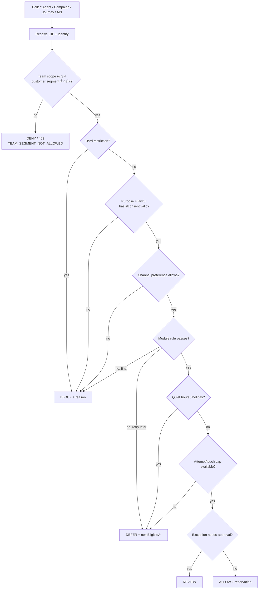

# D-Contact — Contact Governance

> **ชื่อไทย:** การกำกับสิทธิการติดต่อ
> **ชื่อเดิมในภาพแนวคิด:** D-Block
> ตัดสินใจเชิงสถาปัตยกรรมอยู่ที่ [ADR-027](adr/027-contact-governance.md)
> แผนภาพการเชื่อมต่อระบบ, ลำดับข้อมูล และ ownership ของทุก table อยู่ที่
> [Contact Governance Data Flow](contact-governance-data-flow.md)

## 1. หน้าที่ของโมดูล

Contact Governance เป็น policy decision point กลางที่ตอบคำถามเดียว:

> ตอนนี้องค์กรติดต่อ CIF นี้ ผ่าน identity/channel นี้ เพื่อวัตถุประสงค์นี้ได้หรือไม่?

โมดูลนี้ครอบคลุม Voice, SMS, Email, LINE, WhatsApp และช่องทางใหม่ในอนาคต ผู้เรียกประกอบด้วย Agent,
Campaign, Journey, Broadcast, Survey, Callback และระบบภายนอกผ่าน Integration API

โมดูล **ไม่ส่งสายหรือข้อความเอง** แต่ตัดสินและจองสิทธิ์ก่อนส่ง ผู้ส่งจริงยังเป็น Dialer/Channels ตามเดิม

## 2. คำศัพท์

| คำ | ความหมาย |
|---|---|
| Contact/CIF | ลูกค้าหนึ่งรายซึ่งอาจมีหลาย identity |
| Identity | จุดติดต่อ เช่น เบอร์โทร อีเมล LINE user ID |
| Restriction | ข้อห้าม เช่น DNC, objection, revoked consent, safety block |
| Preference | ช่องทาง/เวลา/วัตถุประสงค์ที่ลูกค้ายอมรับ |
| Approved exception | ข้อยกเว้นที่มีขอบเขต เวลา เหตุผล และผู้อนุมัติ; ใช้ชื่อแทน Whitelist |
| Customer segment | กลุ่มธุรกิจของ CIF เช่น `LOND`, `CARD`; นิยามและ membership มาจาก Customer 360 |
| Team scope | สิทธิ์ที่ผูก Team เข้ากับ customer segment เพื่อควบคุมการค้นหา ดูข้อมูล และติดต่อ |
| Attempt | ความพยายามติดต่อ ไม่จำเป็นต้องถึงลูกค้า |
| Successful touch | การติดต่อที่ถึงลูกค้าตามนิยามของช่องทาง |
| Reservation | สิทธิ์ชั่วคราวที่กันไว้ก่อนส่ง ป้องกันหลายระบบใช้โควตาพร้อมกัน |

### 2.1 ปรับองค์ประกอบจากภาพแนวคิดเดิม

| ชื่อเดิม | อยู่ตรงไหนใน Contact Governance |
|---|---|
| Caller Allow | `Sender/Caller ID policy` ตรวจว่า Campaign/Agent ใช้หมายเลขหรือบัญชีผู้ส่งที่อนุมัติหรือไม่ |
| Whitelisting | `Approved exception` มีขอบเขต เหตุผล ผู้อนุมัติ และวันหมดอายุ |
| Attempt | `cg_attempt` + Attempt/Successful Touch policy รวมข้ามทุก source |
| Block list | `cg_restriction` ระดับ Platform/Tenant/CIF/Identity/Channel/Purpose |
| Check/Response status | `authorizeAndReserve()` คืน ALLOW/BLOCK/DEFER/REVIEW + reason code |
| Management/Report/ปลด block | หน้า Policies, Restrictions, Exceptions, Decision explorer และ Audit |

`Caller Allow` ไม่ใช่ Allowlist ของลูกค้า: มันควบคุม **ตัวตนของฝั่งองค์กรที่ใช้ติดต่อออก** เช่น DID,
SMS Sender ID, LINE OA หรือ WhatsApp account เพื่อป้องกัน Campaign ใช้ผู้ส่งที่ไม่ได้รับอนุมัติ

## 3. ผลตัดสินและ reason code

| Decision | ความหมาย | ตัวอย่างเหตุผล |
|---|---|---|
| `ALLOW` | ผ่านทุกด่าน พร้อม reservation | `POLICY_PASSED`, `CUSTOMER_REQUESTED_CALLBACK` |
| `BLOCK` | ห้ามติดต่อ | `DNC_GLOBAL`, `PURPOSE_OBJECTED`, `CONSENT_REVOKED` |
| `DEFER` | เลื่อนได้ | `QUIET_HOURS`, `MIN_GAP`, `DAILY_ATTEMPT_CAP` |
| `REVIEW` | ต้องอนุมัติ | `EXCEPTION_APPROVAL_REQUIRED`, `IDENTITY_AMBIGUOUS` |

ผลลัพธ์ต้องมี `decisionId`, `reasonCode`, `policyVersion`, `nextEligibleAt?`, `reservationId?`
และ trace รายด่าน ห้ามคืนเพียง Boolean เพราะ UI และทีม Compliance ต้องอธิบายเหตุผลได้

## 4. Scope และลำดับความสำคัญ

Restriction/Preference/Exception กำหนดขอบเขตได้ตาม:

- Platform → Tenant → Business unit → Campaign/Journey
- Contact/CIF → Identity
- Channel → Purpose → Contact kind
- มีผลถาวรหรือช่วงเวลา

เมื่อนโยบายชนกัน ใช้กฎ **ข้อห้ามที่เข้มที่สุดชนะ** ตามลำดับ:

```text
PLATFORM hard block
  > TENANT hard block
  > CIF hard block
  > identity/channel/purpose restriction
  > approved operational exception
  > default policy
```

Approved exception ห้ามข้าม `DNC_GLOBAL`, `PURPOSE_OBJECTED`, `CONSENT_REVOKED` หรือข้อห้ามที่ policy
ระบุ `overridable = false`

### 4.1 Customer Segment & Team Scope

Customer segment เป็น **ขอบเขตการทำงาน (access scope)** เพิ่มจาก policy ด้าน PDPA ไม่ใช่การ block ลูกค้า
Customer 360 ประเมินว่า CIF อยู่กลุ่มใด ส่วน Administration/IAM กำหนดว่า Team ใดทำงานกับกลุ่มนั้นได้

| Team | Customer segment ที่อนุญาต | สิทธิ์ตัวอย่าง |
|---|---|---|
| Team A | `LOND` | ค้นหา, เปิดโปรไฟล์, รับรายการ และติดต่อ CIF ในกลุ่ม LOND |
| Team C | `LOND` | ทำงานร่วมกับ Team A บนกลุ่ม LOND ได้ |
| Team D | `CARD` | ค้นหา, เปิดโปรไฟล์, รับรายการ และติดต่อ CIF ในกลุ่ม CARD |

ระบบรองรับความสัมพันธ์หลายต่อหลาย: CIF หนึ่งรายอาจอยู่หลาย segment และหลาย Team อาจใช้ segment เดียวกัน
แต่ทุกการเข้าถึงต้องตรวจ `team_segment_scope` กับ `c360_segment_membership` ที่เป็นปัจจุบัน โดยสิทธิ์
`DENY` ที่ระบุชัดเจนชนะ `ALLOW` เสมอ

การตรวจ team scope เป็น **authorization gate ก่อน Policy Engine**: หากไม่มีสิทธิ์ ให้ตอบ HTTP `403`
พร้อม `TEAM_SEGMENT_NOT_ALLOWED` และบันทึก access audit — ไม่ใช้ `BLOCK` ของ Contact Governance เพราะ
`BLOCK` ต้องสงวนไว้เพื่ออธิบายข้อจำกัดของลูกค้าตาม policy/PDPA

## 5. Decision flow



ทุกการติดต่อขาออกต้องผ่าน flow นี้ การ import list อาจ pre-screen ได้ แต่ต้องตรวจซ้ำทันทีก่อนส่งจริง

`teamId` ต้อง resolve จาก access token หรือ service context ที่เชื่อถือได้ ไม่รับค่าจาก browser โดยตรง;
Campaign/Journey ที่รันแบบ background ใช้ `sourceOwnerTeamId` ที่บันทึกและตรวจสิทธิ์ไว้ตั้งแต่ publish

## 6. Attempt และ Frequency policy

Policy รองรับอย่างน้อย:

- `maxAttemptsPerDay/Week/Month`
- `maxTouchesPerDay/Week/Month`
- `minGapBetweenAttempts`
- `minGapBetweenTouches`
- กฎแยกตาม channel, purpose, disposition และช่วงเวลา
- เพดานรวมข้ามทุก Campaign/Journey
- cool-down หลังปฏิเสธ ร้องเรียน หรือขอให้โทรภายหลัง

ตัวอย่างการนับ:

| เหตุการณ์ | Attempt | Successful touch |
|---|---:|---:|
| โทรแล้วไม่รับ/สายไม่ว่าง | ✓ | — |
| ลูกค้ารับสาย | ✓ | ✓ |
| SMS provider ปฏิเสธ | ✓ | — |
| SMS provider รับและส่งสำเร็จ | ✓ | ✓ ตาม policy ของ tenant |
| งานถูก Block ก่อนส่ง | — | — |

## 7. Approved exception และการอนุมัติ

Exception ต้องระบุ `scope`, `allowedRules`, `reason`, `ticketRef`, `startsAt`, `expiresAt`, `requestedBy`
และ `approvedBy` การสร้างและอนุมัติต้องเป็นคนละคนสำหรับกฎที่มีความเสี่ยงสูง

ตัวอย่างที่อนุญาต:

- ลูกค้าขอให้โทรกลับเวลาเฉพาะ
- เจ้าหน้าที่ต้องติดตามเหตุบริการที่ลูกค้าเปิดไว้
- เหตุฉุกเฉินที่ policy ขององค์กรรับรอง

ตัวอย่างที่ไม่อนุญาต:

- ใช้รายชื่อ VIP ข้ามการคัดค้านการตลาด
- Allowlist แบบไม่มีวันหมดอายุและไม่มีวัตถุประสงค์
- ปลด hard restriction ด้วยการ import รายชื่อใหม่

## 8. API contract

### ตัดสินและจอง

`POST /api/v1/contact-governance/authorize-and-reserve`

```json
{
  "contactId": "contact-123",
  "identityId": "identity-456",
  "channel": "VOICE",
  "senderIdentityId": "did-021234567",
  "purpose": "COLLECTION_REMINDER",
  "kind": "SERVICE",
  "source": "CAMPAIGN",
  "sourceId": "campaign-789",
  "sourceOwnerTeamId": "team-a",
  "actionKey": "campaign-789:record-42:attempt-2",
  "requestedAt": "2026-08-30T10:00:00+07:00"
}
```

```json
{
  "decision": "ALLOW",
  "decisionId": "decision-001",
  "reasonCode": "POLICY_PASSED",
  "policyVersion": 7,
  "reservationId": "reservation-001",
  "expiresAt": "2026-08-30T10:15:00+07:00"
}
```

คำสั่งประกอบ: `confirm`, `release`, `refund`, `record-attempt`, `record-touch` และ `explain/{decisionId}`
ทุกคำสั่งต้อง idempotent ด้วย `tenantId + actionKey`

`sourceOwnerTeamId` รับได้เฉพาะ service ที่ผ่านการยืนยันตัวตน และต้องตรงกับ owner context ของ Campaign,
Journey หรือ Agent session; API จะไม่เชื่อค่า team ที่ browser ส่งเอง

## 9. Data model

```prisma
model cg_policy      { id String @id  tenantId String  name String  version Int  status String
                       scope Json  rules Json  effectiveAt DateTime  retiredAt DateTime? }

/// Customer 360 เป็นเจ้าของ: ผลประเมินล่าสุด ไม่ใช่รายชื่อที่ freeze ถาวร
model c360_segment_membership { tenantId String  contactId String  segmentId String
                                definitionVersion Int  state String // IN|OUT|STALE
                                evaluatedAt DateTime  validUntil DateTime?
                                @@id([tenantId, contactId, segmentId]) }

/// Administration/IAM เป็นเจ้าของ: map ทีมไปยัง segment ที่ใช้งานได้
model team_segment_scope { id String @id  tenantId String  teamId String  segmentId String
                           permissions String[] // VIEW|WORK|CONTACT
                           effect String // ALLOW|DENY
                           startsAt DateTime  expiresAt DateTime?  version Int  createdBy String
                           @@unique([tenantId, teamId, segmentId]) }

model cg_restriction { id String @id  tenantId String  contactId String?  identityId String?
                       type String // DNC|OBJECTION|CONSENT_REVOKED|INBOUND_SAFETY|REGULATORY
                       channel String?  purpose String?  scope String  overridable Boolean
                       reasonCode String  source String  evidence Json?
                       startsAt DateTime  expiresAt DateTime?  createdBy String }

model cg_consent     { id String @id  tenantId String  contactId String  identityId String?
                       purpose String  channel String  status String // GRANTED|REVOKED|EXPIRED
                       lawfulBasis String  noticeVersion String?  evidence Json
                       grantedAt DateTime?  revokedAt DateTime?  expiresAt DateTime? }

model cg_preference  { id String @id  tenantId String  contactId String  channel String?
                       purpose String?  timezone String?  preferredWindows Json  state String }

model cg_exception   { id String @id  tenantId String  contactId String?  identityId String?
                       allowedRules String[]  scope Json  reason String  ticketRef String?
                       state String // PENDING|APPROVED|REJECTED|EXPIRED|REVOKED
                       requestedBy String  approvedBy String?  startsAt DateTime  expiresAt DateTime }

model cg_sender_identity { id String @id  tenantId String  channel String
                           value String  providerRef String?  scope Json
                           status String // PENDING|APPROVED|SUSPENDED|RETIRED
                           verifiedAt DateTime?  verifiedBy String? }

model cg_reservation { id String @id  tenantId String  contactId String  identityId String?
                       channel String  purpose String  source String  sourceId String  teamId String?
                       segmentSnapshot Json?  scopeVersion Int?  actionKey String
                       state String // RESERVED|CONFIRMED|RELEASED|REFUNDED
                       expiresAt DateTime  createdAt DateTime
                       @@unique([tenantId, actionKey])
                       @@index([contactId, state, createdAt]) }

model cg_attempt     { id String @id  tenantId String  contactId String  identityId String?
                       channel String  senderIdentityId String?  purpose String  source String  sourceId String
                       outcome String  countsAsAttempt Boolean  countsAsTouch Boolean  at DateTime }

model cg_decision_log { id String @id  tenantId String  contactId String?  identityId String?
                        channel String  senderIdentityId String?  purpose String  source String  sourceId String  teamId String?
                        segmentSnapshot Json?  scopeVersion Int?  actionKey String
                        decision String  reasonCode String  policyVersion Int  gate String
                        trace Json  reservationId String?  decidedAt DateTime }

model cg_audit_log    { id String @id  tenantId String  actorId String?  action String
                        targetType String  targetId String  before Json?  after Json?  reason String?
                        approvalId String?  at DateTime }
```

ข้อมูล legacy `ob_dnc`, `ob_consents`, `ob_screening_log`, `cp_policy`, `cp_reservation` และ
`cp_touch_log` ย้ายเข้า `cg_*` เมื่อเริ่มเฟส implementation; ระหว่างเปลี่ยนผ่านใช้ adapter/read model
เพื่อไม่ให้ Campaign/Journey หยุดทำงาน

## 10. สิทธิ์

| ทำได้ | ADMIN | COMPLIANCE | SUPERVISOR | AGENT |
|---|---:|---:|---:|---:|
| ดูสถานะและคำอธิบาย | ✓ | ✓ | ของทีม | เฉพาะลูกค้าที่กำลังดูแล |
| เพิ่ม hard restriction จากคำขอลูกค้า | ✓ | ✓ | ✓ | ✓ |
| แก้ policy | ✓ | ✓ | — | — |
| ขอ exception | ✓ | ✓ | ✓ | — |
| อนุมัติ exception | ✓ | ✓ | — | — |
| ปลด hard restriction | — | ✓ | — | — |
| Export audit | ✓ | ✓ | — | — |

การเพิ่ม restriction ทำได้ทันทีเพื่อคุ้มครองลูกค้า แต่การปลด restriction และอนุมัติ exception ต้อง audit
และใช้ maker-checker ตามระดับความเสี่ยง

สิทธิ์ทุกแถวข้างต้นยังถูกกรองด้วย `team_segment_scope`: role ตอบว่า *ทำอะไรได้* ส่วน team scope ตอบว่า
*ทำกับ CIF กลุ่มใดได้* จึงต้องผ่านทั้งสองเงื่อนไข

## 11. UI (`mockups/governance.html`)

เมนู **Contact Governance** ใน Console มี:

| View | หน้าที่ |
|---|---|
| Overview | สัดส่วน ALLOW/BLOCK/DEFER/REVIEW, opt-out และ policy health |
| Policies | เพดาน Attempt/Touch, quiet hours, purpose/channel rules และ versioning |
| Restrictions | DNC/objection/revoked consent ระดับ CIF/identity |
| Preferences & Consent | ช่องทาง เวลา วัตถุประสงค์ หลักฐานและสถานะ |
| Exceptions | ขอ/อนุมัติ/เพิกถอน พร้อมวันหมดอายุ |
| Decision explorer | ค้น CIF/action แล้วดูว่าแต่ละด่านตัดสินอย่างไร |
| Team scopes | ดู/เพิ่ม/แก้ไข/ลบความสัมพันธ์ Team → customer segment พร้อม `VIEW`/`WORK`/`CONTACT` และ `ALLOW`/`DENY` |
| Audit & reports | การปลด block, override, policy change และ export |

Customer 360 แสดง summary card และลิงก์เข้าหน้านี้ ส่วน Agent workspace แสดงสถานะก่อนกดติดต่อ
แต่ไม่มีสิทธิ์แก้ policy

## 12. Non-functional requirements

- Promotional contact ใช้ **fail-closed** เมื่อ service หรือ policy cache ไม่พร้อม
- p95 ของ cached decision ไม่เกิน 100 ms; cache invalidation หลังถอน consent/เพิ่ม restriction ไม่เกิน 5 วินาที
- tenant isolation + field-level access + encryption ตามมาตรฐานแพลตฟอร์ม
- decision/audit log append-only และ retention ตั้งค่าได้ตามนโยบายองค์กร
- policy publish ต้อง versioned, preview ผลกระทบ, rollback ได้ และมี test cases ก่อนใช้งาน
- API และ consumer ต้อง idempotent; reservation sweeper คืนโควตาของรายการหมดอายุ

## 13. แผนเฟส

| เฟส | ได้อะไร |
|---|---|
| **CG1** | canonical restriction/consent + CIF/identity lookup + decision log + adapter จาก Outbound |
| **CG2** | Attempt/Touch policy + `authorizeAndReserve` + เชื่อม Dialer/Channels/Journey |
| **CG3** | Preference center + opt-out realtime + quiet hours/timezone |
| **CG4** | Approved exception + maker-checker + policy version/test/rollback |
| **CG5** | external API, dashboard, anomaly alert และ compliance export |

## 14. ตัวชี้วัดและรายงาน

`cg.decision` · `cg.restriction` · `cg.frequency` · `cg.exception` · `cg.consent` ·
`cg.policy.health` · `cg.audit`

ทุก metric แยกตาม tenant, channel, purpose, source, decision และ reason code โดยข้อมูลลูกค้ารายบุคคล
เปิดดูได้เฉพาะผู้มีสิทธิ์

## เอกสารเกี่ยวข้อง

[outbound-campaign.md](outbound-campaign.md) · [journey-orchestration.md](journey-orchestration.md) ·
[customer-360.md](customer-360.md) · [integration-platform.md](integration-platform.md)
