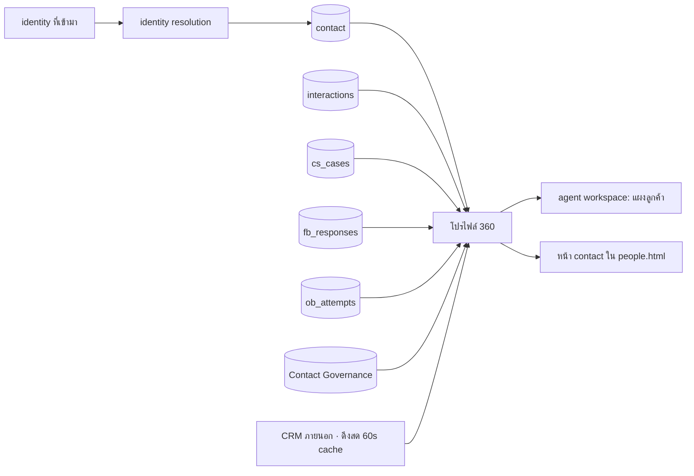

# D-Contact — Customer 360 & Identity Resolution

> ตัดสินใจเชิงสถาปัตยกรรมอยู่ที่ [ADR-020](adr/020-customer-360.md)

## 1. ปัญหาเป็นรูปธรรม

```
คุณนภา จันทร์เพ็ญ  โทรจาก +66 81 234 5678   → contact A (สร้างจากเบอร์)
                    ทักไลน์ @napha.c         → contact B (สร้างจาก LINE userId)
                    อีเมล napha@siamretail…  → contact C (สร้างจากอีเมล)
```
วันนี้ระบบมองเป็นลูกค้า 3 คน — agent เปิดประวัติแล้วเห็นแค่ 1 ใน 3 ของเรื่อง

เป้าหมาย: **1 คน = 1 contact ที่มีหลาย identity** และเปิดดูครั้งเดียวเห็นทุกอย่าง

## 2. โครงข้อมูล

```prisma
model contact          { id String @id  tenantId String  displayName String  company String?
                         attrs Json                    // custom fields ต่อ tenant
                         externalRefs Json             // {salesforce:"003...", crmCustomerNo:"C-8812"}
                         verifiedAt DateTime?          // ยืนยันตัวตนแล้วเมื่อไหร่ ด้วยวิธีใด
                         mergedInto String?            // ไม่ลบแถว — ชี้ไปตัวหลัก
                         vip Boolean  tags String[] }
model contact_identity { id String @id  contactId String  kind String
                         // PHONE|EMAIL|LINE|FACEBOOK|WHATSAPP|WEBCHAT_COOKIE|CRM_ID
                         value String  normalized String   // เบอร์เป็น E.164 เสมอ
                         confidence String  // CONFIRMED|LIKELY|GUESS
                         firstSeenAt DateTime  lastSeenAt DateTime  verifiedAt DateTime?
                         @@unique([tenantId, kind, normalized]) }
model contact_merge_log{ id String @id  tenantId String  primaryId String  mergedId String
                         reason String  by String  at DateTime  snapshot Json   // ใช้ย้อนกลับ
                         revertedAt DateTime? }
```

Consent, preference และ restriction ไม่อยู่ใน Customer 360; เป็น `cg_*` ของ
[Contact Governance](contact-governance.md) และถูกประกอบเป็น read model ตอนเปิดโปรไฟล์

**`normalized` เป็นคอลัมน์ที่ทำให้ทุกอย่างทำงาน** — เบอร์ไทยเขียนได้ 5 แบบ
(`0812345678`, `+66812345678`, `66812345678`, `081-234-5678`, `081 234 5678`)
ถ้าไม่ normalize ตั้งแต่ชั้นข้อมูล การจับคู่จะพลาดตลอดไป

## 3. กติกาการจับคู่

| ระดับ | เงื่อนไข | ทำอะไร |
|---|---|---|
| **CONFIRMED** | identity ตรงกับที่ยืนยันแล้ว หรือมี CRM ID เดียวกัน | ผูกเข้า contact เดิมอัตโนมัติ |
| **LIKELY** | เบอร์/อีเมลตรงแต่ชื่อไม่ตรง · LINE display name ตรงกับชื่อในระบบ | เข้าคิว "รอยืนยันการรวม" ให้คนกด |
| **GUESS** | ชื่อคล้าย, บริษัทเดียวกัน | แสดงเป็น "อาจเกี่ยวข้อง" ในโปรไฟล์ ไม่ผูกอะไร |

**ไม่มีการรวมอัตโนมัติจากระดับ LIKELY หรือ GUESS** ([ADR-020](adr/020-customer-360.md) ข้อ 2)

การยืนยันตัวตนในสาย (ถามเลขบัตร/OTP ผ่าน flow node) จะยกระดับ identity นั้นเป็น CONFIRMED
และบันทึก `verifiedAt` — ตัวเลขนี้เป็นสิ่งที่ทีมกฎหมายถามหาเวลามีข้อพิพาท

## 4. โปรไฟล์ 360 (มุมมอง ไม่ใช่ตาราง)



สิ่งที่ต้องเห็นในหน้าเดียว: ตัวตนทุกช่องทาง · ไทม์ไลน์การติดต่อทุกช่องทาง · เคสที่เปิดอยู่ ·
คะแนน CSAT ล่าสุด · ความยินยอม/สถานะ DNC · ข้อมูลจาก CRM · แท็ก/VIP · บันทึกภายใน

**สถานะ DNC/consent ต้องอยู่บนหัวโปรไฟล์เสมอ** — agent ที่กำลังจะโทรกลับต้องเห็นก่อนกด

## 5. เส้นทางในสายจริง

```
สายเข้าจาก +66 81 234 5678
  → normalize → ค้น contact_identity (CONFIRMED)
  → เจอ contact → flow node "Lookup contact" ได้ตัวแปร {vip, openCases, lastAgentId}
  → ใช้จัดลำดับความสำคัญ / ส่งหาเจ้าของเคสเดิม (last agent routing)
  → agent เห็นโปรไฟล์เต็มก่อนรับสาย (screen pop ผ่าน CTI ถ้าต่อ CRM)
ไม่เจอ
  → สร้าง contact ชั่วคราว (displayName = เบอร์) + identity GUEST
  → agent เติมชื่อระหว่างคุย → ยกระดับเป็น contact จริง
```

## 5.1 Attribute & Segment — ฐานของการเล็งกลุ่ม ([ADR-025](adr/025-journey-orchestration.md))

โปรไฟล์ 360 ตอบว่า *"คนนี้เป็นใคร"* แต่ CX automation ต้องตอบ *"ใครบ้างที่เข้าเงื่อนไขนี้"*
ซึ่งต้องมีสองอย่างที่ต่างกัน:

| | Attribute | Segment |
|---|---|---|
| คือ | คุณสมบัติของลูกค้าหนึ่งคน | นิยามของกลุ่ม |
| ที่มา | ฟิลด์ของเราเอง · ดึงจาก CRM · คำนวณจากพฤติกรรม (เช่น `lastPurchaseAt`, `openCases`) | เงื่อนไขบน attribute + เหตุการณ์ + ประวัติ interaction |
| เก็บยังไง | `contact.attrs` (JSONB) + `contact_computed` (ค่าที่คำนวณตามรอบ) | `sg_segment.definition` — **นิยาม ไม่ใช่รายชื่อ** |

**segment เป็นนิยามที่ประเมินตอนใช้ ไม่ใช่รายชื่อที่แช่แข็ง** — รายชื่อที่ freeze จะตกรถทุกครั้งที่ข้อมูลเปลี่ยน
แต่ตอนที่ลูกค้าถูกดึงเข้า journey ต้อง **snapshot เหตุผล** ไว้ เพื่อตอบคำถาม
*"ทำไมฉันถึงได้ข้อความนี้"* ซึ่งเป็นสิทธิ์ตาม PDPA (§6)

**attribute ที่ดึงสดจาก CRM ใช้ทำ segment ไม่ได้** — เพราะประเมินกลุ่มทีละแสนคนแปลว่ายิง CRM แสนครั้ง
ค่าที่ต้องใช้เล็งกลุ่มต้องถูก sync มาเป็น `contact_computed` ตามรอบ และหน้าจอต้องบอกชัดว่าค่าไหนสด ค่าไหนตามรอบ

### 5.2 Customer Segment สำหรับขอบเขตทีม

นอกจากใช้เล็งกลุ่มใน Journey แล้ว segment ยังเป็นขอบเขตข้อมูลและงานของทีมได้ เช่น `LOND` และ `CARD`
โดย Customer 360 เป็นเจ้าของว่า CIF อยู่ในกลุ่มใด ส่วน Administration/IAM เป็นเจ้าของสิทธิ์ว่า Team ใดใช้กลุ่มนั้นได้

| ตาราง | เจ้าของ | หน้าที่ |
|---|---|---|
| `sg_segment` | Customer 360 / Journey | นิยามกลุ่มจาก attribute/เหตุการณ์ เช่น “productGroup = LOND” |
| `c360_segment_membership` | Customer 360 | ผลประเมินล่าสุดของ CIF ต่อ segment สำหรับ query และตรวจสิทธิ์อย่างรวดเร็ว |
| `team_segment_scope` | Administration / IAM | map Team → segment พร้อมสิทธิ์ `VIEW`, `WORK`, `CONTACT` และช่วงเวลาที่มีผล |

ตัวอย่าง baseline ของ tenant:

| Team | Segment | สิทธิ์ |
|---|---|---|
| Team A | `LOND` | `VIEW`, `WORK`, `CONTACT` |
| Team C | `LOND` | `VIEW`, `WORK`, `CONTACT` |
| Team D | `CARD` | `VIEW`, `WORK`, `CONTACT` |

`c360_segment_membership` เป็น materialized projection ที่ refresh ตาม version ของ `sg_segment` ไม่ใช่รายชื่อ
ที่ผู้ใช้แก้เป็น source of truth; เมื่อลูกค้าย้ายกลุ่ม ต้องส่ง `customer.segment.changed` เพื่อให้ Workspace,
Dialer และ Journey re-filter งานค้างทันที สิทธิ์ใน `team_segment_scope` ถูก resolve ฝั่ง server เสมอ ห้ามใช้
segment หรือ team ที่ browser ส่งมาเป็นหลักฐานสิทธิ์

## 6. PDPA — สิทธิของเจ้าของข้อมูล

| สิทธิ | ทำที่ไหน | ครอบคลุมอะไร |
|---|---|---|
| ขอดูข้อมูล (access) | หน้า contact → "ส่งออกข้อมูลของบุคคลนี้" | ทุกโมดูลที่อ้าง contactId + transcript + รายการเสียง |
| ขอแก้ไข | หน้า contact | ข้อมูลที่เราเป็นเจ้าของ (ไม่รวม CRM ภายนอก) |
| ขอลบ (erasure) | คำขอที่ต้องอนุมัติ | ปิดบังข้อมูลระบุตัวตน + ลบเสียง/transcript ตาม retention + คง aggregate ไว้ |
| ถอนความยินยอม | หน้า contact หรือ opt-out link | เขียน `cg_consent` + `cg_restriction` ทันที (มีผลรอบ pacing ถัดไป) |

การลบต้อง **คงข้อมูลสถิติแบบไม่ระบุตัวตนไว้** ไม่งั้นรายงานย้อนหลังจะเปลี่ยนตัวเลขทุกครั้งที่มีคำขอลบ

## 7. UI (`mockups/people.html` — ขยายจากเมนู Contacts เดิม)

| view | หน้าที่ |
|---|---|
| `contacts` | **list** เดิม + คอลัมน์จำนวน identity + สถานะ DNC |
| `contact-form` | **new/edit** ข้อมูลหลัก + custom fields + แท็ก |
| `contact-360` | **โปรไฟล์เต็ม**: identity, ไทม์ไลน์ทุกช่องทาง, เคส, CSAT, consent/DNC, CRM, บันทึก |
| `identity-merge` | คิว "รอยืนยันการรวม" (LIKELY) + เทียบข้อมูลสองฝั่ง + ปุ่มรวม/ไม่ใช่คนเดียวกัน + ประวัติการรวม (ย้อนกลับได้) |

## 8. แผนเฟส

| เฟส | ได้อะไร |
|---|---|
| **U1** | แยก `contact_identities` + normalize เบอร์/อีเมล + ผูก identity อัตโนมัติระดับ CONFIRMED |
| **U2** | โปรไฟล์ 360 (ไทม์ไลน์ข้ามช่องทาง) + แผงลูกค้าใน workspace |
| **U3** | คิวยืนยันการรวม + merge/unmerge + merge log |
| **U4** | ดึงข้อมูล CRM สดผ่าน [integration](integration-platform.md) + screen pop |
| **U5** | เครื่องมือ PDPA (ส่งออก/ลบ/ถอนความยินยอม) ครบทุกโมดูล |

## 9. ความเสี่ยง

| ความเสี่ยง | ทางรับมือ |
|---|---|
| รวมผิดคน — ข้อมูลลูกค้าสองคนปนกัน | รวมอัตโนมัติเฉพาะ CONFIRMED + merge ย้อนกลับได้ 90 วัน + audit ทุกครั้ง |
| เบอร์ที่ใช้ร่วมกัน (เบอร์บ้าน/บริษัท) | รองรับ 1 identity : N contact สำหรับ `PHONE` ที่ถูกทำเครื่องหมายว่าใช้ร่วม |
| โปรไฟล์โหลดช้าเพราะดึง CRM สด | timeout 1.5 วินาที + แสดงส่วนที่มีก่อน + cache 60 วินาที |
| ข้อมูลลูกค้าถูกเปิดดูเกินความจำเป็น | สิทธิ์ระดับฟิลด์ + บันทึกการเข้าถึงโปรไฟล์ (เหมือน access log ของ QM) |
| คำขอลบทำให้รายงานย้อนหลังเปลี่ยน | ลบข้อมูลระบุตัวตน แต่คง aggregate |

## รายงานที่โมดูลนี้เป็นเจ้าของ

`c360.identity.coverage` · `c360.merge.queue` · `c360.merge.history` · `c360.consent` · `c360.pdpa`

รายละเอียดของแต่ละใบ (dataset · grain · มิติบังคับ · entitlement · ชั้น · drill-down · เฟส) อยู่ที่
[reporting-data-platform §7.13](reporting-data-platform.md) ซึ่งเป็น**แหล่งความจริงเดียว** —
ใบใหม่ต้องไปลงทะเบียนที่นั่นก่อน ห้ามตั้งใบรายงานขึ้นเองในโมดูล

ใบเหล่านี้รายงาน**ตัวเลขรวม** — คำขอลบตาม PDPA ลบข้อมูลระบุตัวตนแต่คง aggregate ไว้ ไม่งั้นรายงานย้อนหลังจะเปลี่ยนทุกครั้งที่มีคำขอ

## เอกสารเกี่ยวข้อง

[ADR-020](adr/020-customer-360.md) · [case-management.md](case-management.md) ·
[outbound-campaign.md](outbound-campaign.md) · [contact-governance.md](contact-governance.md) ·
[integration-platform.md](integration-platform.md)
