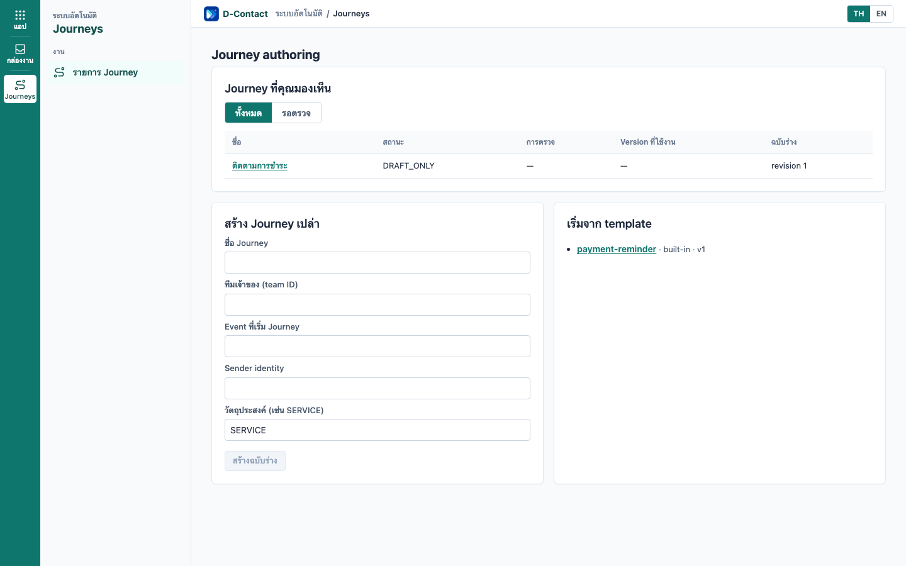
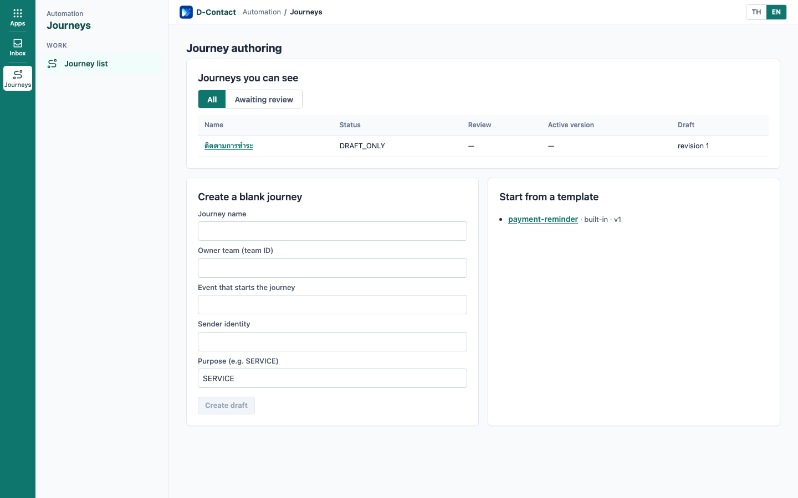
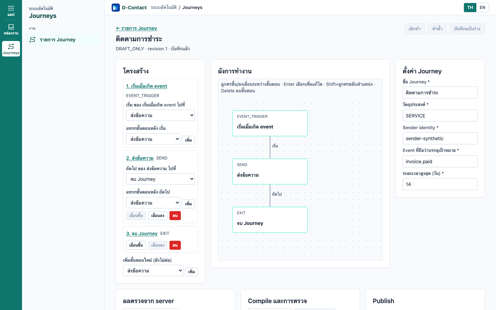
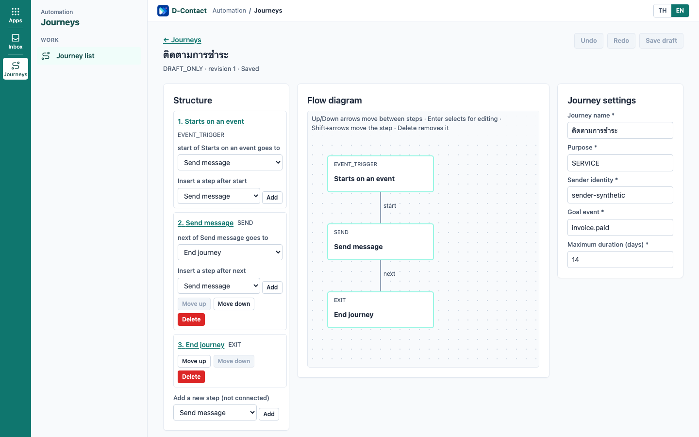
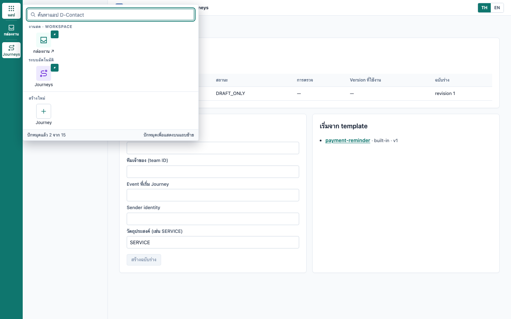
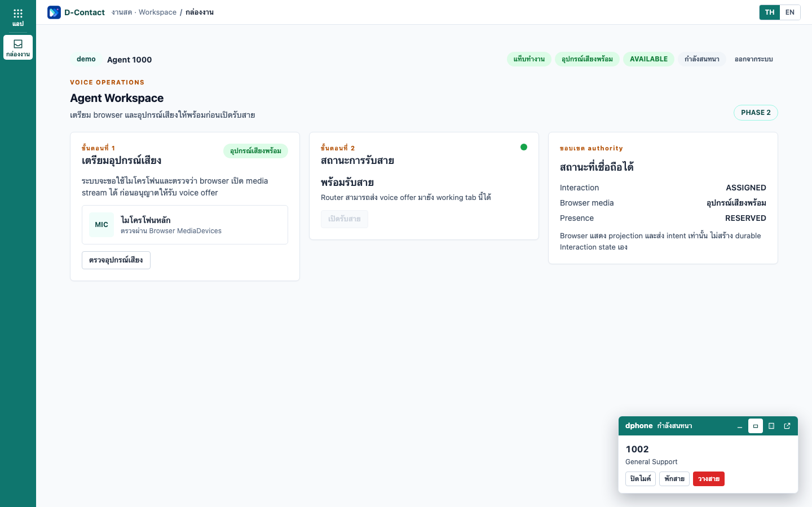
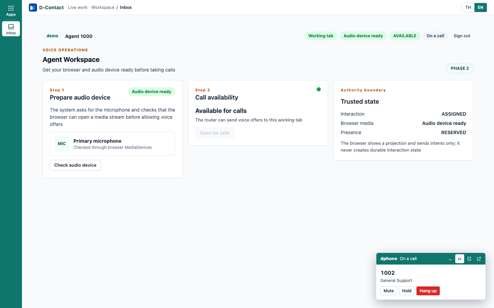
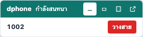
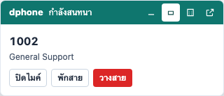
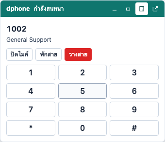

# D1 — App shell, i18n และ dphone: acceptance และ rollout (D1.16 #455)

เอกสารนี้สำหรับทีมที่เปิด shell ใหม่ (`ui.shell.v2`) ให้ tenant และผู้ตรวจ acceptance ของ map D1 (#420)
authority คือ [Phase Contract D1.8 #428](https://github.com/Kitti-Nualsalee/dcontact/issues/428#issuecomment-5818874305)

## ตัวควบคุม: flag `ui.shell.v2` ระดับ tenant

- ปิดโดย default; เก็บใน `tenant_ui_flags` (+ `tenant_ui_flag_audit_events` แบบ append-only)
- แอปอ่านได้อย่างเดียว (`dcontact_app` ไม่มีสิทธิ์เขียน) — เปลี่ยนได้เฉพาะ platform operator ผ่าน role
  `dcontact_platform` (`PLATFORM_DATABASE_URL`)
- Console และ Workspace อ่าน flag จาก `features.shellV2` ของ `GET /api/v1/me/navigation` ตอนโหลดหน้า
  ถ้า Navigation API ล้มเหลว หน้าจะกลับไปใช้ shell เดิม (fail-safe)

```bash
# เปิด — ต้องยืนยัน gate ของ #77 ด้วย --ack-voice-pilot
pnpm d1:shell-flag -- --tenant <slug> --on --reason "<เหตุผล>" --actor <operator> --ack-voice-pilot
# ปิด (rollback) — ไม่ต้อง ack
pnpm d1:shell-flag -- --tenant <slug> --off --reason "<เหตุผล>" --actor <operator>
```

| ผลลัพธ์ | ความหมาย |
| --- | --- |
| `{"type":"d1.tenant-ui-flag","status":"PASS",...}` | เปลี่ยนแล้วและมีแถว audit |
| `VOICE_PILOT_ACK_REQUIRED` | เปิดโดยไม่ได้ยืนยัน gate ของ #77 |
| `TENANT_NOT_FOUND` / `UNKNOWN_FLAG` | slug หรือชื่อ flag ผิด |
| `REASON_REQUIRED` / `ACTOR_REQUIRED` | ต้องมีเหตุผล 3–500 ตัวอักษรและผู้ดำเนินการ |

**ห้ามเปิด flag ให้ tenant ที่ใช้เก็บหลักฐาน voice pilot (#77) จนกว่าผู้ใช้ยืนยัน** — `--ack-voice-pilot`
คือการยืนยันว่าได้ตรวจเงื่อนไขนี้แล้ว ไม่ใช่การข้าม

## ลำดับ rollout

1. migration แบบ additive: `pnpm db:migrate && pnpm db:rls`
   (`20260925100000_add_d1_12_navigation_pins`, `20260925110000_add_d1_13_tenant_ui_flags`)
2. Keycloak: `pnpm infra:identity:locale` — เปิด internationalization `th`/`en`, attribute `zoneinfo` และ
   `account/manage-account` ที่ผู้ใช้ต้องมีเพื่อบันทึกภาษาของตัวเอง (idempotent)
3. deploy API (Navigation API + tenant locale) แล้ว Console และ Workspace — flag ยังปิด ผู้ใช้เห็นหน้าเดิม
4. เปิด flag ให้ tenant dev/UAT ก่อน แล้วตรวจตามหัวข้อ "ตรวจหลังเปิด"
5. ขยายทีละ tenant; tenant ของ #77 ต้องรอผู้ใช้ยืนยัน

## ตรวจหลังเปิด

- rail, launcher และหมุดแสดงเฉพาะแอปที่ role/plan เห็น (หมุดสูงสุด 15)
- สลับ TH/EN แล้วไม่ reload และภาษาอยู่ต่อหลัง login ใหม่ (เก็บใน Keycloak `locale`)
- Workspace: dphone ลอย 3 ขนาด, แยกหน้าต่าง `/dphone` และดึงกลับได้ระหว่างสาย
- รันบน dev stack: `pnpm d1:real-call` (ด้านล่าง)

## Rollback

- `--off` มีผลกับผู้ใช้ตอนโหลดหน้าครั้งถัดไป ไม่ต้อง deploy; ผู้ใช้ที่เปิดหน้าอยู่ยังเห็น shell ใหม่จนกว่าจะ reload
  จึงไม่ตัดสายที่คุยอยู่
- ข้อมูลหมุด (`navigation_*`) และภาษา/timezone ใน Keycloak คงอยู่ เปิดใหม่แล้วได้ค่าเดิม
- migration เป็น additive — ไม่ต้อง roll back schema

## Acceptance ของ Phase Contract

ผลบน branch `feat/d1-16-acceptance` (2026-09-25) หลัง D1.9–D1.15 merge เข้า `main`

| ข้อ | หลักฐาน | ผล |
| --- | --- | --- |
| **ห้าม waive:** ไม่ reload และไม่ตัดสาย/WS ระหว่างสลับภาษาและเปลี่ยนขนาด dphone บนสายจริง | `pnpm d1:real-call` — เอเจนต์จริงใน Chromium (Keycloak PKCE, fake media, SIP.js ผ่าน WS กับ FreeSWITCH) รับสายจาก SIPp ผ่าน Router; 7 ขั้น (แถบ, ขยาย + DTMF, กะทัดรัด, EN, แยกหน้าต่าง + พัก/กลับเข้าสาย, TH ขณะแยก, ดึงกลับ) SIP session ID, WS connection ID, `performance.timeOrigin`/navigation และ leg ของ FreeSWITCH เท่าเดิมทุกขั้น; DTMF ถึงผู้โทร (SIP INFO `Signal=5`); เอเจนต์วางสายแล้ว SIPp จบแบบ Successful — [`evidence/d1/real-call-evidence.json`](evidence/d1/real-call-evidence.json) | ผ่าน 3/3 รอบ |
| **ห้าม waive:** แอปที่ไม่มีสิทธิ์ไม่อยู่ใน response ของ Navigation API | `apps/api/src/navigation-api.integration.ts` บน Postgres จริงด้วย `dcontact_app` (RLS) — role/plan, two-tenant isolation, แอปไม่มีสิทธิ์ตอบเหมือนแอปที่ไม่มีอยู่ | 8/8 |
| **ห้าม waive:** ไม่มี PII ใน URL ข้ามแอป | `packages/ui-react/e2e/shell.spec.ts` (deep link ด้วย ID เท่านั้น) และ `navigation-registry.test.ts` (path ไม่มี placeholder ของ PII) | ผ่าน (e2e 19/19, unit 7/7) |
| axe 0 serious/critical สองหน้าเป้าหมาย TH/EN และ preview | Console e2e (Journeys ใน shell TH/EN), Workspace e2e (Agent Workspace + dphone ทุกขนาด TH/EN, หน้าต่าง `/dphone`), ui-react e2e (preview + shell) | 37/37, 18/18, 19/19 |
| i18n coverage | `i18n:literals` ของ Console/Workspace ไม่มีข้อความ hardcode; `i18n:check` และ `pnpm test:d1-i18n` key ครบ th/en รวม ui-react | ผ่าน |
| token lint | stylelint (`packages/ui-react/.stylelintrc.json`) ของ ui-react, `journey-authoring/*.css` และ `agent-workspace.css`/`dphone/*.css` | ผ่าน |
| test/typecheck/build | `packages/ui` (contrast 46/46), `packages/ui-react`, `apps/console` (unit 17), `apps/workspace` (unit 34) | ผ่าน |
| flag และ audit | `apps/platform-control/src/tenant-ui-flags.integration.ts` — เปิด/ปิดต่อ tenant, audit, ต้อง ack #77, แอปเขียนเองไม่ได้ | 1/1 |

ช่องว่างที่รู้ตัวและยกมาจากก่อน D1 (ตัวตรวจ contrast รายงานแยกไว้ รอการตัดสินใจ ไม่อยู่ใน acceptance ของ
D1): ขอบ input ตอนพัก `--dc-border-default` 1.48:1 และแถบสถานะว่าง `--dc-neutral-solid` 2.56:1 เทียบเกณฑ์
WCAG 1.4.11 ที่ 3:1

### ภาพหลักฐาน

Journeys ใน Console (flag เปิด, ข้อมูล synthetic) และ App launcher

| TH | EN |
| --- | --- |
|  |  |
|  |  |



Agent Workspace ระหว่างสายจริง (จาก `pnpm d1:real-call`)

| TH | EN |
| --- | --- |
|  |  |

dphone 3 ขนาดระหว่างสายจริง

| แถบ | กะทัดรัด | ขยายพร้อมแป้นกด |
| --- | --- | --- |
|  |  |  |

สร้างภาพ Console ใหม่: `D1_VISUAL_EVIDENCE_DIR=<dir> pnpm --filter @d-contact/console exec playwright test -g "visual evidence"`

## `pnpm d1:real-call` (dev stack)

ต้องมี `infra/docker` dev compose ทำงาน, Keycloak ที่ link identity แล้ว (`pnpm infra:identity:link`) และ port
3000/5173 ว่าง

- สร้าง DB แยก `dcontact_d1_16` ใหม่ทุกรอบ (เปลี่ยนด้วย `D1_REAL_CALL_DATABASE`) — migrate + RLS + seed
  โดย tenant demo และ agent1000 ใช้ id ตาม claim ที่ Keycloak ออกให้อยู่แล้ว ไม่แก้ user ใน Keycloak และไม่แตะ
  DB `dcontact`
- เปิด `ui.shell.v2` เฉพาะ tenant demo ใน DB แยก แล้วรัน API, Router, Telephony และ Workspace
  (`http://localhost:5173` ตาม redirect URI ของ `agent-desktop`)
- ผล: `D1_REAL_CALL_ACCEPTANCE_PASS`; หลักฐาน/log (SIP ของ browser, console, SIPp, ภาพ) อยู่ที่
  `apps/workspace/test-results-real/evidence/` (ไม่ commit); `D1_REAL_CALL_VERBOSE=1` แสดง log ของ service

FreeSWITCH dev ต้องมี `apply-candidate-acl` และ `local-network-acl` ตาม `infra/freeswitch/conf` (D1.16)
ไม่อย่างนั้นสายจาก browser บนเครื่อง host จะล้มด้วย `INCOMPATIBLE_DESTINATION` — หลังดึง config ใหม่ให้รัน
`fs_cli -x reloadacl`, `fs_cli -x reloadxml` และ `fs_cli -x "sofia profile internal restart"`
