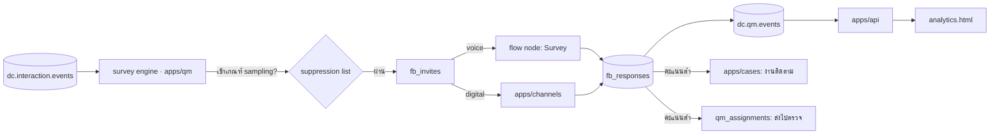

# D-Contact — Feedback & Survey (เสียงลูกค้า)

> ตัดสินใจเชิงสถาปัตยกรรมอยู่ที่ [ADR-012](adr/012-feedback-survey.md)

## 1. โมดูลนี้ตอบคำถามอะไร

QM ตอบว่า *"เราคุยดีตามมาตรฐานของเราหรือเปล่า"* — Feedback ตอบว่า *"ลูกค้ารู้สึกยังไง"*
สองอย่างนี้ **ไม่เท่ากันบ่อยมาก** และช่องว่างระหว่างมันคือข้อมูลที่มีค่าที่สุดที่ contact center มีได้

| ตัวชี้วัด | คำถาม | สเกล | ใช้ตอน |
|---|---|---|---|
| **CSAT** | พอใจกับการบริการครั้งนี้แค่ไหน | 1–5 | หลังจบทุกงาน |
| **NPS** | จะแนะนำเราให้เพื่อนไหม | 0–10 | รายไตรมาส/ตามรอบ |
| **CES** | แก้ปัญหาได้ง่ายแค่ไหน | 1–7 | หลังงาน self-service / เคสยาว |
| **FCR (ถาม)** | เรื่องนี้จบในครั้งเดียวไหม | ใช่/ไม่ใช่ | คู่กับ CSAT |

## 2. สถาปัตยกรรม



### วงจรของแบบสำรวจหนึ่งใบ

```
interaction.ended
  → เข้าเงื่อนไข fb_plan ไหม (คิว/ช่องทาง/disposition/ทีม/สุ่ม %)
  → ลูกค้าคนนี้เพิ่งถูกถามใน 30 วันหรือเปล่า (suppression — **กฎเฉพาะโมดูล = ด่านชั้นที่ 2**)
  → contact policy ระดับลูกค้าอนุมัติและจองสิทธิ์ให้หรือไม่ (**ด่านชั้นที่ 3 — ด่านสุดท้าย**)
     ดู [journey-orchestration §5.1](journey-orchestration.md) · ถูกกดชั้นไหนบันทึกแยกกัน
  → สร้าง fb_invite (พร้อม token หมดอายุ)
  → voice: park สายไว้ให้ flow node Survey ถาม / digital: ส่งลิงก์หรือ quick reply
  → ลูกค้าตอบ → fb_response + fb_answers
  → ถ้า detractor → dc.qm.events(feedback.detractor) → เปิดเคส + แจ้งหัวหน้าทีม
  → invite ที่ไม่ถูกตอบใน 72 ชม. → EXPIRED (นับใน response rate)
```

## 3. Data model

```prisma
model fb_survey   { id String @id  tenantId String  name String  type String // CSAT|NPS|CES|CUSTOM
                    version Int  status String // DRAFT|PUBLISHED|ARCHIVED
                    channels String[]          // ถามได้ในช่องทางไหนบ้าง
                    locales Json               // ข้อความต่อภาษา (th/en)
                    frozenAt DateTime? }
model fb_question { id String @id  surveyId String  order Int  kind String
                    // SCALE|NPS|YESNO|CHOICE|TEXT|VOICE_COMMENT
                    text Json  required Boolean  scaleMin Int?  scaleMax Int? }
model fb_plan     { id String @id  tenantId String  surveyId String  name String
                    match Json      // { queues:[], channels:[], dispositions:[], teams:[] }
                    samplePct Int   // สุ่มกี่ % ของงานที่เข้าเกณฑ์
                    suppressDays Int @default(30)
                    deliver String  // IVR|SMS|LINE|EMAIL|IN_CHAT
                    active Boolean }
model fb_invite   { id String @id  planId String  interactionId String  contactId String?
                    channel String  token String  sentAt DateTime  expiresAt DateTime
                    status String } // SENT|OPENED|ANSWERED|EXPIRED|BOUNCED
model fb_response { id String @id  inviteId String  interactionId String  agentId String?
                    queueId String  surveyVersion Int  score Int   // คะแนนหลักที่ normalize แล้ว 0–100
                    sentiment String?  answeredAt DateTime  durationSec Int }
model fb_answer   { id String @id  responseId String  questionId String  value Json
                    comment String?  recordingId String? }  // VOICE_COMMENT เก็บเป็นไฟล์เสียง
```

**`fb_response.score` เก็บค่า normalize 0–100 คู่กับค่าดิบ** — เพื่อให้กราฟเดียวเทียบ
CSAT/NPS/CES ข้ามแบบสำรวจได้ สูตร normalize เป็นค่าคงที่ในโค้ด ห้าม tenant แก้
(ไม่งั้นเทียบข้าม tenant ตอนทำ benchmark ไม่ได้)

## 4. การถามในแต่ละช่องทาง

| ช่องทาง | วิธี | ข้อควรระวัง |
|---|---|---|
| Voice | flow node `Survey` — ถามก่อนวางสาย (transfer จาก agent) | ต้องบอกก่อนโอนว่า "ขอเวลา 20 วินาที" ไม่งั้นวางสายทิ้ง |
| Voice (ทางเลือก) | ส่ง SMS/LINE หลังวางสาย | มีค่าใช้จ่ายต่อข้อความ — เข้า quota |
| Web chat | การ์ดในห้องแชทเดิมทันทีที่ปิดงาน | response rate ดีที่สุดในบรรดาทั้งหมด |
| LINE / FB / WA | quick reply ในห้องเดิม | ต้องอยู่ในหน้าต่าง 24 ชม. ของ provider |
| Email | ลิงก์ในอีเมลตอบกลับ | response rate ต่ำสุด ใช้เป็นทางเลือกสุดท้าย |

**หลักที่ถือ:** ถามในห้องเดิมที่เพิ่งคุยกันจบ > ส่งลิงก์ไปช่องทางอื่น เสมอ

## 5. Closed loop — ส่วนที่ทำให้โมดูลนี้ไม่ใช่แค่รายงาน

```
detractor (CSAT ≤ 2 หรือ NPS ≤ 6)
  → เปิด case อัตโนมัติ (case type = "customer recovery") มอบให้หัวหน้าทีมของ agent
  → SLA ติดต่อกลับ 24 ชม. (นับใน case SLA ปกติ)
  → interaction ต้นเรื่องถูกใส่ qm_assignments ให้ตรวจ (ผูกกับ quality plan)
  → ผลการตรวจ + ผลติดต่อกลับ ปิดวงกลับมาที่ fb_response.followupStatus
```

ตัวชี้วัดของวงนี้คือ **detractor recovery rate** และ **time to first contact** —
สองตัวนี้อยู่บนหน้าเดียวกับ CSAT เสมอ ไม่งั้นคนจะดูแต่ค่าเฉลี่ย

## 6. รายงานที่ต้องมีตั้งแต่ v1

- CSAT/NPS รายวัน–รายเดือน แยกตาม คิว / ช่องทาง / ทีม / agent
- **response rate + expired rate** (ถ้าไม่แสดงคู่กัน ค่าเฉลี่ยจะโกหก)
- distribution ไม่ใช่แค่ค่าเฉลี่ย (5 คนให้ 5 กับ 10 คนให้ 3 ได้ค่าเฉลี่ยเท่ากันแต่คนละเรื่อง)
- ความสัมพันธ์ CSAT ↔ คะแนน QM ↔ AHT (ไปอยู่ใน [interaction-analytics](interaction-analytics.md))
- คอมเมนต์ปลายเปิด จัดกลุ่มด้วย category ของ QM ([quality-management §6](quality-management.md))

## 7. สิทธิ์

| ทำได้ | ADMIN | SUPERVISOR | AGENT |
|---|---|---|---|
| สร้าง/แก้แบบสำรวจ + แผน | ✓ | — | — |
| ดูผลรวมทั้ง tenant | ✓ | ทีมตัวเอง | ของตัวเอง |
| เห็นคอมเมนต์ที่ระบุตัวลูกค้า | ✓ | ✓ | ✓ (เฉพาะของตัวเอง) |
| รับงาน recovery | ✓ | ✓ | — |

## 8. UI (`mockups/analytics.html` — กลุ่ม Voice of customer)

| view | หน้าที่ |
|---|---|
| `fb-overview` | CSAT/NPS + response rate + distribution + แนวโน้ม |
| `fb-surveys` | **list** แบบสำรวจ + เวอร์ชัน + สถานะ |
| `fb-survey-form` | **new/edit**: ชนิด, คำถาม (เพิ่ม/ลบ/เรียง), ข้อความ 2 ภาษา, preview |
| `fb-plans` | **list/new/edit** แผนการถาม: เงื่อนไข, % สุ่ม, suppression, ช่องทางส่ง |
| `fb-responses` | คำตอบรายใบ + คอมเมนต์ + ลิงก์ไปสาย + สถานะ recovery |

## 9. แผนเฟส

| เฟส | ได้อะไร |
|---|---|
| **F1** | `fb_*` + survey builder + CSAT ในแชท/LINE + หน้ารายงานพื้นฐาน |
| **F2** | flow node `Survey` (voice IVR) + sampling/suppression + response rate |
| **F3** | NPS/CES + คอมเมนต์ + จัดกลุ่มคอมเมนต์ด้วย category ของ QM |
| **F4** | closed loop → case + ส่งเข้าคิว QM อัตโนมัติ + detractor recovery rate |
| **F5** | ผูกเข้า performance scorecard ([ADR-018](adr/018-performance-gamification.md)) โดยต้องตั้งใจเปิด |

## 10. ความเสี่ยง

| ความเสี่ยง | ทางรับมือ |
|---|---|
| response rate ต่ำจนตัวเลขไม่มีความหมาย | แสดง n และ response rate คู่ค่าเฉลี่ยเสมอ; ซ่อนผลเมื่อ n < 10 |
| ลูกค้ารำคาญเพราะถูกถามบ่อย | suppression เป็นข้อบังคับ ไม่ใช่ตัวเลือก |
| agent ขอคะแนนจากลูกค้าตรง ๆ (score begging) | ตรวจด้วย category ของ QM + ตัดคะแนนที่มาจากสายที่ agent พูดถึงแบบสำรวจ |
| ใช้ CSAT ตัดสินคน | ค่าเริ่มต้นไม่เข้า KPI + ต้องมี n ขั้นต่ำก่อนแสดง |
| ต้นทุน SMS บานปลาย | quota `surveyInvitesPerMonth` + ค่าเริ่มต้นคือถามในห้องเดิม (ฟรี) |

## รายงานที่โมดูลนี้เป็นเจ้าของ

`fb.score` · `fb.response.rate` · `fb.distribution` · `fb.recovery` · `fb.comments.grouped`

รายละเอียดของแต่ละใบ (dataset · grain · มิติบังคับ · entitlement · ชั้น · drill-down · เฟส) อยู่ที่
[reporting-data-platform §7.8](reporting-data-platform.md) ซึ่งเป็น**แหล่งความจริงเดียว** —
ใบใหม่ต้องไปลงทะเบียนที่นั่นก่อน ห้ามตั้งใบรายงานขึ้นเองในโมดูล

`fb.response.rate` ต้องแสดง expired/bounced คู่กันเสมอ และ `fb.score` แยกรายบุคคลได้เฉพาะเมื่อ tenant ตั้งใจเปิด (F5) — เมื่อเปิดแล้วใบนั้นเลื่อนเป็นชั้นบุคคล

## เอกสารเกี่ยวข้อง

[ADR-012](adr/012-feedback-survey.md) · [quality-management.md](quality-management.md) ·
[case-management.md](case-management.md) · [performance-gamification.md](performance-gamification.md)
