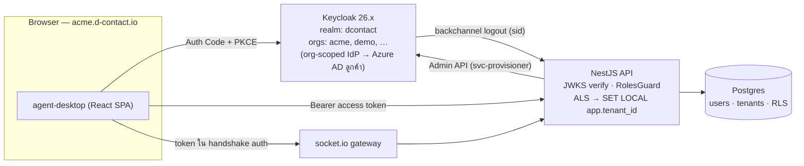

# D-Contact — สถาปัตยกรรม IAM (Keycloak)

> เอกสารออกแบบประกอบ [ADR-004](adr/004-keycloak-iam.md) — decision-complete พร้อมลงมือใน Phase A–C
> สถานะ: **แผน (ยังไม่ implement)** · อัปเดตล่าสุด 2026-07-15

## 1. ภาพรวม



- **Keycloak เป็นเจ้าของ identity**: credentials, MFA, sessions, brute-force lockout, email verification, IdP links
- **Postgres เป็นเจ้าของ domain data**: extension, skills, team, concurrency, agent state
- **Kafka ไม่เกี่ยวกับ user token**: services คุยกันใน network boundary เดิม (roadmap: SASL/mTLS ที่ broker)

## 2. Realm & Organizations

| รายการ | ค่า |
|---|---|
| Realm | `dcontact` (เดียวต่อ environment) |
| Organization ต่อ tenant | alias = tenant `slug`, domain = `<slug>.d-contact.io` |
| Org attributes | `tenant_id` (UUID จาก Postgres), `tenant_slug` |
| Issuer | `https://auth.d-contact.io/realms/dcontact` (dev: `http://localhost:8081/realms/dcontact`) |

เหตุผล single realm vs realm-per-tenant → ดู ADR-004 ข้อ 2

## 3. OIDC clients

| Client | ชนิด | Flow | หมายเหตุ |
|---|---|---|---|
| `agent-desktop` | public | Authorization Code + **PKCE (S256)** — ปิด implicit/direct grant | redirect `http://localhost:5173/*` (dev), `https://*.d-contact.io/*` (prod) |
| `dcontact-api` | confidential (bearer-only usage) | — | มีไว้ให้ token มี `aud: dcontact-api` |
| `svc-provisioner` | confidential | client credentials | service account ได้ role `manage-users`, `view-users`, `manage-organizations` |
| `svc-channels`, `svc-router` | confidential | client credentials | เฉพาะเมื่อ service นั้นต้องเรียก REST API; ได้ realm role `service` |

**Token lifetimes** (ออกแบบตามกะของ contact center):

- Access token **10 นาที** · SSO session idle **10 ชม.** / max **14 ชม.** (คลุมกะ + OT, บังคับ login ใหม่ทุกวัน)
- Refresh rotation เปิด (`Revoke Refresh Token = on`, reuse window 0); offline token ปิดสำหรับ `agent-desktop`
- SPA เก็บ token **ใน memory เท่านั้น** (ไม่ใช้ localStorage) — reload หน้า = silent re-auth ผ่าน KC session cookie
- Library ฝั่ง React: `oidc-client-ts` + `react-oidc-context`
- Logout: RP-initiated + **backchannel logout** → `POST /api/auth/backchannel-logout` (ตรวจ logout token กับ JWKS แล้วตัด WebSocket ทุกตัวที่ `sid` ตรง)

## 4. Token claims

```json
{
  "iss": "https://auth.d-contact.io/realms/dcontact",
  "sub": "b3e0…-keycloak-user-uuid",
  "aud": ["dcontact-api"],
  "azp": "agent-desktop",
  "typ": "Bearer",
  "sid": "kc-session-id",
  "email": "agent1000@acme.co.th",
  "name": "สมชาย วงศ์ประเสริฐ",
  "tenant_id": "0b7c…-postgres-tenant-uuid",
  "tenant_slug": "acme",
  "dc_user_id": "9f21…-postgres-users.id",
  "realm_access": { "roles": ["agent"] }
}
```

Protocol mappers (กำหนดครั้งเดียวใน realm import, ผูกกับ client scope ของ `agent-desktop`):

1. `tenant_id`, `tenant_slug` — **organization-attribute → claim** (ถ้า mapper ประเภทนี้มีปัญหาบน
   เวอร์ชันที่ pin → fallback เป็น user-attribute ที่ stamp ตอน provisioning; claim shape เดิม)
2. `dc_user_id` — user-attribute mapper → API ไม่ต้อง lookup DB ต่อ request
3. audience mapper เพิ่ม `dcontact-api`

**สิ่งที่ไม่อยู่ใน token**: `extension`, `teamId`, skills — เป็น domain data ดึงจาก `GET /api/me`
(token เล็ก และย้าย extension ได้โดยไม่ต้องออก token ใหม่)

## 5. การตรวจ token ใน NestJS

แทนที่ `JwtAuthGuard` เดิมทั้งหมด (คงสไตล์ไม่ใช้ Passport):

- `jose`: `createRemoteJWKSet(KEYCLOAK_JWKS_URI)` — cache + refresh key อัตโนมัติ
- ตรวจ: ลายเซ็น, `iss`, `aud` มี `dcontact-api`, `exp`, `typ === 'Bearer'`
- **Global guard ผ่าน `APP_GUARD`** (ปิด foot-gun "ลืมแปะ guard บน controller ใหม่") + `@Public()`
  สำหรับ health check และ backchannel-logout
- **`RolesGuard`** (global, รันหลัง auth): อ่าน `@Roles()` / `@RequirePermission()` เทียบ `realm_access.roles`
- Cross-check: ถ้า `Host` เป็น tenant subdomain ให้ reject token ที่ `tenant_slug` ไม่ตรง
- Service token (`svc-*`): ไม่มี `tenant_id` → guard ตั้ง `req.user.isService = true`;
  endpoint ฝั่ง service ต้องรับ `tenantId` แบบ explicit + validate เอง

## 6. Roles & permission matrix

Realm roles แบบ **composite**: `admin` ⊃ `supervisor` ⊃ `agent` (+ `service` สำหรับ service accounts)

Matrix บังคับใน NestJS — เขียนครั้งเดียวที่ `packages/shared/src/permissions.ts`
(`Record<Permission, MinRole>`) ให้ตรงกับหน้า Permission matrix ใน `mockups/admin.html`:

| Permission | AGENT | SUPERVISOR | ADMIN |
|---|:-:|:-:|:-:|
| workspace / handle interactions | ✓ | ✓ | ✓ |
| monitor / whisper / barge | — | ✓ | ✓ |
| force agent state | — | ✓ | ✓ |
| listen to recordings | — | ✓ | ✓ |
| edit queues / routing / channels | — | — | ✓ |
| manage users / billing | — | — | ✓ |

ไม่ใช้ Keycloak Authorization Services (UMA) — matrix เล็ก คงที่ และอยู่บนเส้น call-control ที่ไวต่อ latency
**Custom roles ต่อ tenant (อนาคต)**: ตาราง `tenant_role_overrides` ใน Postgres map ชื่อ role → permission set
— ไม่สร้าง role ต่อ tenant ใน Keycloak

### 6.1 Team Segment Scope

Role บอกว่าผู้ใช้ **ทำอะไรได้** แต่ไม่ได้บอกว่าทำกับลูกค้ากลุ่มใด จึงเก็บ `team_segment_scope` ใน Postgres
เป็น domain data คู่กับ `teams` ไม่ใส่ลง JWT:

| ตัวอย่าง | Segment | สิทธิ์ |
|---|---|---|
| Team A | `LOND` | `VIEW`, `WORK`, `CONTACT` |
| Team C | `LOND` | `VIEW`, `WORK`, `CONTACT` |
| Team D | `CARD` | `VIEW`, `WORK`, `CONTACT` |

API resolve `teamId` จาก `dc_user_id`/session หรือ trusted service context แล้วเทียบกับ segment membership
ปัจจุบันจาก Customer 360; ห้ามเชื่อ `teamId` หรือ `segmentId` ที่ browser ส่งมาเอง หากไม่ผ่าน ให้ตอบ
`403 TEAM_SEGMENT_NOT_ALLOWED` และ audit access denial ก่อนเรียก Contact Governance policy

## 7. User data split & provisioning

| Keycloak | Postgres `users` |
|---|---|
| password, WebAuthn, MFA, required actions | `extension`, `teamId`, skills, concurrency |
| sessions, lockout, email verification, IdP links | `displayName` (authoritative; push ไป KC เพื่อ greeting) |
| `enabled` | `isActive` (mirror สองทาง: disable = ปิดทั้งคู่) |

Schema change (Phase A): เพิ่ม `keycloakId String @unique @db.Uuid`, **ลบ `passwordHash`**,
เปลี่ยน `sipPassword` → `sipPasswordEnc` (ดู §10)

**Invite flow** (`POST /api/users`, guard `@Roles('ADMIN')`) — dual-write saga:

1. สร้าง KC user (email, attributes `tenant_id`/`tenant_slug`) → assign realm role → add เข้า org
2. สร้างแถว Postgres พร้อม `keycloakId` → stamp `dc_user_id` กลับไปที่ KC user
3. ยิง `execute-actions-email` (`UPDATE_PASSWORD` + `VERIFY_EMAIL`) = **อีเมลเชิญ** — รหัสผ่านไม่ผ่านระบบเรา
4. ถ้าขั้นไหนล้มหลังสร้าง KC user → **compensate: ลบ KC user** (บันทึก saga นี้ใน code comment)
   ; roadmap: reconcile job เทียบสองระบบ

## 8. Tenant resolution & onboarding

**Login**: SPA ที่ `acme.d-contact.io` ตัด slug จาก hostname (dev: `?tenant=demo`) →
auth request ใส่ `scope: 'openid organization:acme'` → Keycloak จำกัด login ที่ org นั้น
(branding + org IdP routing) — issuer เดียวคงที่ ไม่มีปัญหา realm discovery

**Onboarding tenant ใหม่** (module `apps/api/src/tenants/` + CLI `provision-tenant <slug> <name>`):

1. สร้างแถว `Tenant` (slug, sipDomain)
2. ผ่าน `svc-provisioner`: สร้าง Organization (alias, domains, attributes)
3. สร้าง ADMIN คนแรกด้วย flow §7
4. ไม่มีการสร้าง client/role/mapper ต่อ tenant — ทุกอย่างระดับ realm มาจาก realm import ใน git

## 9. WebSocket & service-to-service

- **WS handshake**: access token ใน socket.io `auth` payload (**ห้าม query string** — รั่วลง log)
  → verify ด้วย verifier เดียวกับ REST → ผูก `{ userId, tenantId, sid }` กับ socket
- **หมดอายุกลาง session**: server ตั้งเช็คที่ `exp`; client ยิง `auth:refresh` พร้อม token ใหม่ก่อนถึงเวลา
  ไม่งั้นถูกตัดพร้อม reconnect-hint (ถ้าข้ามข้อนี้ agent จะหลุดกลางการรับสาย)
- **Backchannel logout** ตัดทุก socket ที่ `sid` ตรง
- **Kafka**: ไม่ใส่ user JWT บน message — tenant isolation ใช้ `tenantId` ใน header/payload ตาม ADR-003;
  broker auth (SASL/SCRAM + mTLS) เป็น roadmap
- **REST S2S**: client-credentials token, endpoint แปะ `@Roles('service')`

## 10. SIP credentials (นอกขอบเขต IAM แต่เกี่ยวข้อง)

- แทน `sipPassword` plaintext ด้วย `sip_password_enc`: secret สุ่ม 24 ตัวอักษรตอน provisioning,
  เข้ารหัส **AES-256-GCM** ฝั่งแอปด้วย `SIP_SECRET_KEY` จาก env (Vault/KMS = roadmap)
- Softphone ดึง `{ extension, sipPassword, sipDomain, wssUrl }` จาก `GET /api/me/sip-credentials`
  (คืนให้เฉพาะเจ้าของ token) — **ไม่แสดงใน admin UI**
- FreeSWITCH: ย้ายจาก static XML directory → `mod_xml_curl` lookup ผ่าน API (rotation ได้ทันที) — Phase C/stretch

## 11. RLS wiring (ทำ `rls.sql` ให้ทำงานจริง)

1. หลัง guard ผ่าน → interceptor เก็บ `{ tenantId }` ลง **AsyncLocalStorage**
   (`apps/api/src/tenancy/tenant-context.ts`)
2. **Prisma client extension** ใน `prisma.service.ts` ห่อทุก operation:

   ```ts
   const [, result] = await base.$transaction([
     base.$executeRaw`SELECT set_config('app.tenant_id', ${tenantId}, true)`,
     query(args),
   ]);
   ```

   (`set_config(…, true)` = `SET LOCAL` — ปลอดภัยกับ connection pooling)
3. งานฝั่ง service plane (router consume Kafka, provisioning) ตั้ง ALS จาก payload เอง;
   call-site ที่ใช้ `$transaction` ตรง ๆ ให้ใช้ helper `forTenant(tenantId)`
4. Production ต่อ DB ด้วย role **`dcontact_app`** (NOBYPASSRLS — มีใน `rls.sql` แล้ว);
   dev ยังต่อเป็น owner (RLS bypass) แต่ CI เพิ่ม integration test ต่อเป็น `dcontact_app`
   ยืนยันว่า cross-tenant read ได้ 0 แถว
5. Service-layer `where: { tenantId }` **คงไว้** — RLS เป็น defense-in-depth ชั้นที่สอง ไม่ใช่ตัวแทน

## 12. Dev environment

เพิ่มใน `infra/docker/docker-compose.dev.yml`:

- `keycloak`: `quay.io/keycloak/keycloak:26.x` (pin ตอน implement), `start-dev --import-realm`,
  port **`8081:8080`** (8085 = Redpanda Console, 5433 = Postgres, 9092 = Kafka — ไม่ชน),
  `KC_DB=postgres` ใช้ database `keycloak` ใน Postgres container เดิม
  (init ผ่าน `infra/docker/initdb/01-keycloak-db.sql` — รันเฉพาะ volume ใหม่;
  เครื่อง dev เดิมต้อง `CREATE DATABASE keycloak;` เอง — ใส่ไว้ใน README)
- เปิด feature Organizations ถ้าเวอร์ชันนั้นยังไม่ default (`--features=organization`)
- `infra/keycloak/realm-dcontact.dev.json`: realm + roles + clients + client scopes/mappers +
  org `demo` + dev users (รหัสผ่านตรงกับ seed เดิม)
- **Seed เป็นตัว linker**: `packages/db/prisma/seed.ts` เพิ่มขั้น lookup KC user ตาม email →
  เขียน `keycloak_id` ลง Postgres + stamp `dc_user_id`/`tenant_id` attributes กลับไปที่ KC
  (UUID เป็นค่า runtime — ใส่ล่วงหน้าใน realm JSON ไม่ได้)
- env ใหม่ใน `.env.example`: `KEYCLOAK_ISSUER`, `KEYCLOAK_JWKS_URI`,
  `KEYCLOAK_ADMIN_CLIENT_ID/SECRET`, `VITE_KC_ISSUER`, `VITE_KC_CLIENT_ID`, `SIP_SECRET_KEY`

## 13. Phased rollout

Pre-launch → **clean cut** ไม่มีช่วง dual-auth; bcrypt hash เดิมทิ้งได้ (dev users ได้รหัสจาก realm import)

### Phase A — Identity plane
1. compose: keycloak + initdb script
2. เขียน `infra/keycloak/realm-dcontact.dev.json`
3. Prisma migration: `keycloak_id`, ลบ `password_hash`, `sip_password` → `sip_password_enc`
4. seed: ตัด bcrypt, เพิ่มขั้น KC-link
5. **verify Organizations mapper บนเวอร์ชันที่ pin ตั้งแต่ตอนนี้** (จุดเสี่ยงอันดับหนึ่ง)

### Phase B — API cutover
1. `apps/api/src/auth/`: `oidc.guard.ts` (jose+JWKS), `roles.guard.ts`, decorators; ลงทะเบียนเป็น `APP_GUARD`
2. **ลบ** login/refresh ใน `auth.service.ts`/`auth.controller.ts`, ถอด `@nestjs/jwt`/`bcryptjs`;
   เพิ่ม `jose`, `@keycloak/keycloak-admin-client`
3. `keycloak-admin.service.ts` + rewrite `users.service.ts` เป็น saga §7; แปะ `@Roles()` ตาม matrix §6
4. `tenant-context.ts` (ALS) + Prisma RLS extension + `packages/shared/src/permissions.ts`
5. `POST /api/auth/backchannel-logout` (`@Public()`)

### Phase C — SPA / WS / onboarding / SIP
1. agent-desktop: `oidc-client-ts` + `react-oidc-context`, protected shell, in-memory token + silent renew;
   softphone เปลี่ยนมาใช้ `GET /api/me` + `GET /api/me/sip-credentials`
2. WS handshake auth + `auth:refresh` + ตัดตาม `sid`
3. `apps/api/src/tenants/` + CLI provision-tenant
4. SIP encryption helper (+ stretch: mod_xml_curl)

### Phase D — Roadmap (ยังไม่มี task)
per-org enterprise SSO federation · per-org MFA policy (custom browser flow) ·
API keys สำหรับ public REST API · SCIM 2.0 · session limits ต่อ tenant ·
Kafka SASL/mTLS · Vault/KMS

## 14. ความเสี่ยง

| ความเสี่ยง | การรับมือ |
|---|---|
| Keycloak ops burden (JVM stateful + DB + upgrade) | pin เวอร์ชัน, realm JSON ใน git, upgrade notes ในเอกสารนี้ |
| Organizations ใหม่กว่า realm (mapper/`scope=organization:` อาจต่างตามเวอร์ชัน) | verify ต้น Phase A; fallback = user-attribute mapper (claim shape เดิม) |
| Blast radius ระดับ realm ครอบทุก tenant | ยอมรับ; escape hatch = แยก realm เฉพาะลูกค้าที่มีข้อสัญญา |
| Dual-write KC ↔ Postgres ไม่ atomic | saga + compensating delete; reconcile job เป็น roadmap |
| ทุก query กลายเป็น transaction (RLS extension) | overhead เล็กน้อย ยอมรับ; จุด `$transaction` ตรง ๆ ต้องใช้ `forTenant` — ใส่ checklist ตอน review |
| Token 10 นาที กับ WS ที่เปิดยาว | โปรโตคอล `auth:refresh` §9 — ห้ามข้าม ไม่งั้น agent หลุดกลางสาย |

## 15. Verification checklist (ใช้ตอนจบแต่ละ Phase)

1. `docker compose up` → KC healthy ที่ :8081, realm `dcontact` import สำเร็จ, org `demo` มีอยู่
2. `curl …/realms/dcontact/.well-known/openid-configuration` + JWKS เข้าถึงได้จาก env ของ API
3. seed รันแล้ว dev users ทั้งหมดมี `keycloak_id` และ KC attributes ครบ
4. Browser: `localhost:5173/?tenant=demo` → KC login → กลับมาพร้อม token ที่มี
   `tenant_id`/`dc_user_id`/`realm_access.roles`
5. `GET /api/users`: agent token → 403, admin token → 200, ไม่มี token → 401, token หมดอายุ → 401
6. สร้าง user ผ่าน API → โผล่ทั้ง KC (org member + role + invite email) และ Postgres;
   จำลอง failure → KC user ถูกลบ (compensate)
7. RLS test ต่อเป็น `dcontact_app`: ไม่ตั้ง `app.tenant_id` → 0 แถว; tenant ผิด → 0 แถว
8. WS handshake ปฏิเสธ token หาย/หมดอายุ; backchannel logout ตัด socket
9. `sip_password_enc` เป็น ciphertext ใน DB; `/api/me/sip-credentials` คืนเฉพาะเจ้าของ; softphone register ได้
10. `provision-tenant acme "Acme"` → org + tenant row + admin คนแรก login ที่ `?tenant=acme` ได้

## รายงานที่โมดูลนี้เป็นเจ้าของ

`iam.login.failures` · `iam.role.changes` · `iam.permission.denied` · `adm.retention.jobs`

รายละเอียดของแต่ละใบ (dataset · grain · มิติบังคับ · entitlement · ชั้น · drill-down · เฟส) อยู่ที่
[reporting-data-platform §7.13](reporting-data-platform.md) ซึ่งเป็น**แหล่งความจริงเดียว** —
ใบใหม่ต้องไปลงทะเบียนที่นั่นก่อน ห้ามตั้งใบรายงานขึ้นเองในโมดูล

ทั้งกลุ่มเป็นชั้นกำกับ — เก็บ 36 เดือน ไม่ลดตามแพ็กเกจ และเป็นเงื่อนไขของการขายเข้าองค์กรที่มีผู้ตรวจสอบ จึงอยู่ในเฟส R1–R3 โดยไม่ขึ้นกับว่าโมดูลอื่นพร้อมหรือยัง
