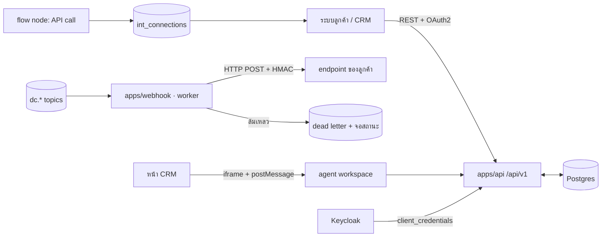

# D-Contact — Integration Platform (API, Webhook, Connector, CTI)

> ตัดสินใจเชิงสถาปัตยกรรมอยู่ที่ [ADR-015](adr/015-integration-platform.md)

## 1. สี่ทางที่ระบบภายนอกคุยกับ D-Contact ได้

| ทาง | ทิศทาง | ใช้เมื่อ |
|---|---|---|
| **Public REST API** | เข้า | สร้าง/อ่านข้อมูล, สั่งโทร, ดึงรายงาน, จัดการผู้ใช้ |
| **Webhook** | ออก | ระบบลูกค้าอยากรู้ทันทีที่มีสายจบ/เคสเปลี่ยนสถานะ |
| **CTI / Embedded agent** | สองทาง | ฝังหน้าจอ agent ลงใน CRM ของลูกค้า |
| **Data feed** | ออก (ก้อนใหญ่) | BI/คลังข้อมูล — ดู [reporting-data-platform.md](reporting-data-platform.md) |

## 2. สถาปัตยกรรม



**`apps/webhook` เป็น consumer ของ Kafka** — ไม่มีโค้ดของโมดูลนี้อยู่ในเส้นทางการรับสาย
([ADR-015](adr/015-integration-platform.md) ข้อ 3)

## 3. Public API

```
POST   /api/v1/interactions/{id}/notes
GET    /api/v1/interactions?from=&to=&queueId=&cursor=
POST   /api/v1/calls                      # click-to-call / สั่งโทรจาก CRM
GET    /api/v1/agents/{id}/state
PATCH  /api/v1/agents/{id}/state           # บังคับสถานะจากระบบภายนอก (ต้องมีสิทธิ์)
POST   /api/v1/contacts:search             # ค้นลูกค้าข้ามช่องทาง (customer-360)
POST   /api/v1/campaigns/{id}/records      # ป้อนรายชื่อเข้าแคมเปญจากระบบลูกค้า
GET    /api/v1/reports/{key}/data          # ดึงข้อมูลรายงานสำเร็จรูป
POST   /api/v1/cases                       # เปิดเคสจากระบบภายนอก
```

| กติกา | ค่า |
|---|---|
| ยืนยันตัวตน | OAuth2 `client_credentials` ต่อ tenant (Keycloak) — ไม่มี API key แบบ static |
| ขอบเขต | scope ต่อโดเมน (`interactions:read`, `calls:write`, …) ผูกกับ entitlement |
| Rate limit | `modules.api.rateLimitRps` ต่อ tenant + ตอบ `429` พร้อม `Retry-After` |
| หน้า | cursor-based เท่านั้น (offset พังเมื่อข้อมูลไหลตลอดเวลา) |
| เวอร์ชัน | ใน path; breaking change = `/v2` + ประกาศล่วงหน้า 6 เดือน |
| Idempotency | `Idempotency-Key` บังคับสำหรับทุก POST ที่สร้างของ |
| สัญญา | OpenAPI generate จากโค้ด + CI ตรวจ breaking change |

**ทุก endpoint บังคับ tenant scope จาก token เท่านั้น** — ไม่มี `tenantId` เป็นพารามิเตอร์
ให้ส่งเข้ามาได้ (ถ้ามี วันหนึ่งจะมีคนส่งของคนอื่น) ตาม [multi-tenancy §7](multi-tenancy.md)

## 4. Webhook

```jsonc
// POST ไปยัง endpoint ของลูกค้า
// Headers: X-DContact-Event: interaction.ended
//          X-DContact-Delivery: 018f...        (eventId — ใช้ทำ idempotent)
//          X-DContact-Signature: sha256=...    (HMAC ของ body ด้วย secret ต่อ endpoint)
{
  "eventId": "018f9c...",
  "type": "interaction.ended",
  "occurredAt": "2026-08-08T03:12:44.812Z",
  "tenantId": "acme",
  "data": { "interactionId": "INT-88077", "channel": "voice", "queueId": "q_general",
            "agentId": "usr_1000", "durationSec": 271, "disposition": "resolved" }
}
```

| เรื่อง | กติกา |
|---|---|
| การส่ง | at-least-once — ผู้รับต้อง idempotent ตาม `eventId` |
| Retry | 1s → 5s → 30s → 5m → 30m → 2h (สูงสุด 6 ครั้ง) |
| ปิดอัตโนมัติ | ล้มเหลวติดกัน 100 ครั้ง หรือ 24 ชม. → พัก endpoint + แจ้ง tenant + เข้า DLQ |
| ความปลอดภัย | HMAC + timestamp กันเล่นซ้ำ + ต้องเป็น HTTPS + IP allowlist (ทางเลือก) |
| กรอง | สมัครรับเฉพาะ event type และเฉพาะคิว/ทีมที่เลือกได้ |
| ตรวจสอบ | หน้า delivery log ย้อนหลัง 7 วัน + ปุ่มยิงซ้ำรายใบ |

Event ที่เปิดให้สมัครใน v1: `interaction.*`, `agent.state.*`, `case.*`, `feedback.response.*`,
`campaign.*`, `evaluation.published`

## 5. Connector (แอปสำเร็จรูป)

| Connector | ทำอะไร | เฟส |
|---|---|---|
| **Salesforce** | screen pop, บันทึก activity, embedded agent, click-to-call | I3 |
| **Microsoft Dynamics** | เหมือนกัน | I4 |
| **Zendesk / Freshdesk** | ผูกเคส ↔ interaction, ticket จากสาย | I4 |
| **ServiceNow** | incident จาก interaction | I5 |
| **LINE OA CRM (ไทย)** | ผูก LINE userId ↔ ลูกค้า, บันทึกประวัติ | I3 |
| **Custom (webhook + REST)** | ทุกอย่างที่เหลือ — คือ connector ที่ SI ไทยใช้จริงมากที่สุด | I1 |

connector ทุกตัวเก็บ credential ใน `int_credentials` (เข้ารหัสต่อ tenant, อ่านคืนไม่ได้)
และมี **หน้าสถานะสุขภาพ**: เชื่อมต่อล่าสุดเมื่อไหร่, ล้มเหลวกี่ครั้ง, token หมดอายุเมื่อไหร่

## 6. CTI / Embedded agent

```jsonc
// หน้า CRM ฝัง: <iframe src="https://acme.d-contact.io/embed/agent?token=...">
// สื่อสารด้วย postMessage — สัญญาเวอร์ชัน 1
{ "type": "dc:interaction.assigned", "payload": { "interactionId": "...", "ani": "+6681...", "queue": "..." } }
{ "type": "dc:screenpop.request",    "payload": { "match": { "phone": "+6681..." } } }
{ "type": "crm:record.opened",       "payload": { "objectType": "Contact", "id": "003..." } }
{ "type": "crm:call.request",        "payload": { "phone": "+6681...", "campaignId": null } }
```

กติกา: iframe ต้องระบุ `allow="microphone"` (WebRTC), token อายุสั้นและผูกกับ origin ของ CRM,
และ**ทุกข้อความมี `type` ขึ้นต้นด้วย namespace** เพื่อไม่ชนกับสคริปต์อื่นในหน้า CRM

## 7. Data model

```prisma
model int_app         { id String @id  tenantId String  name String  kind String
                        // SALESFORCE|DYNAMICS|ZENDESK|SERVICENOW|LINE_CRM|CUSTOM
                        status String  installedBy String  config Json  health Json }
model int_credential  { id String @id  appId String  kind String  // OAUTH|BASIC|APIKEY
                        cipher Bytes  keyVersion Int  expiresAt DateTime?  lastUsedAt DateTime? }
model int_connection  { id String @id  tenantId String  name String  baseUrl String
                        auth Json  timeoutMs Int  retry Json }   // ใช้ร่วมกับ flow node API call
model wh_endpoint     { id String @id  tenantId String  url String  secret Bytes
                        events String[]  filters Json  status String  // ACTIVE|PAUSED|DISABLED
                        failStreak Int  lastOkAt DateTime? }
model wh_delivery     { id String @id  endpointId String  eventId String  type String
                        attempt Int  httpStatus Int?  latencyMs Int?  error String?
                        deliveredAt DateTime? }
model api_client      { id String @id  tenantId String  name String  keycloakClientId String
                        scopes String[]  rateLimitRps Int  createdBy String  revokedAt DateTime? }
```

## 8. UI (`mockups/integrations.html`)

**ทุกอย่างที่ต่อกับของนอกระบบอยู่ใน area เดียวชื่อ Integrations** (เดิมชื่อ Channels) แบ่ง 3 กลุ่ม
เพราะเป็นคนละคนดูแลและคนละความถี่ในการแก้ — แต่เป็นคำเดียวเวลาคุยกับลูกค้า

| กลุ่ม | view | หน้าที่ |
|---|---|---|
| — | `overview` | **ทุกการเชื่อมต่อในตารางเดียว + สถานะสุขภาพ** — คำถามแรกของแอดมินคือ "ตอนนี้อะไรพัง" |
| ช่องทางที่รับงาน | `numbers` · `webchat` · `social` · `email` | สิ่งที่ **ผลิต interaction** (ของเดิม) |
| ระบบภายนอก | `apps` / `integration-form` | **list/new/edit** แอปที่ติดตั้ง (CRM/CTI) + credential + map ฟิลด์ + ทดสอบ |
| ระบบภายนอก | `connectors` / `connector-form` | **list/new/edit** `int_connections` — ปลายทางที่ flow node `API call`, บอต L3 และ visual app ใช้ร่วมกัน |
| ระบบภายนอก | `contact-sync` | ข้อมูลลูกค้าอ่านมาจากไหน + กติกาการจับคู่ตัวตน ([customer-360](customer-360.md)) |
| ระบบภายนอก | `ai-providers` | ASR/LLM/TTS/embedding ต่อ tenant + โควตา + ชั้นปกปิด PII ก่อนส่งออก |
| นักพัฒนา | `api-clients` / `api-client-form` | API client + scope + rate limit (แสดง secret ครั้งเดียว) |
| นักพัฒนา | `webhooks` / `webhook-form` | endpoint + event ที่สมัคร + secret + ส่งทดสอบ + **delivery log** + ยิงซ้ำ |
| นักพัฒนา | `visual-apps` / `visual-app-form` | **list/new/edit** แอปของลูกค้าที่ฝังในพื้นที่ทำงานเอเจนต์ (§11) |
| นักพัฒนา | `streaming` | สรุปทุกสายที่ไหลออก: webhook · data feed · WS realtime · media fork (ยังไม่เปิด) |
| นักพัฒนา | `event-catalog` | รายการ event ที่สมัครได้ + OpenAPI + สัญญาความเข้ากันได้ + ประกาศการเปลี่ยนแปลง |

กลุ่ม "สำหรับนักพัฒนา" ผูกกับสิทธิ์ ADMIN — แอดมินหน้างานที่มาแก้เบอร์ DID ไม่ต้องเดินผ่านของ dev

## 9. Visual apps — ทิศทางตรงข้ามกับ CTI

| | CTI / Embedded agent (§6) | Visual app |
|---|---|---|
| ใครฝังใคร | หน้าจอ**ของเรา**ฝังใน CRM ของลูกค้า | หน้าจอ**ของลูกค้า**ฝังในพื้นที่ทำงานของเรา |
| ใช้เมื่อ | ทีมทำงานอยู่ใน CRM เป็นหลัก | ทีมทำงานอยู่ใน D-Contact เป็นหลัก แต่ต้องดูข้อมูลอีกระบบ |
| สัญญา | postMessage เวอร์ชัน 1 | **ชุดเดียวกัน** |

```jsonc
// เราส่งให้แอป
{ "type": "dc:context",           "payload": { "interactionId": "...", "contactId": "...", "channel": "voice" } }
{ "type": "dc:interaction.ended", "payload": { "interactionId": "...", "disposition": "resolved" } }
// แอปส่งกลับ — เสนอได้เท่านั้น เอเจนต์เป็นคนยืนยัน
{ "type": "app:note.append",         "payload": { "text": "ออกใบแทนแล้ว #A2291" } }
{ "type": "app:disposition.suggest", "payload": { "code": "order_replaced" } }
{ "type": "app:resize",              "payload": { "height": 640 } }
```

**visual app แก้ข้อมูลของเราโดยตรงไม่ได้** — ทำได้แค่เสนอ แล้วเอเจนต์กดยืนยัน
(หลักเดียวกับ [agent assist](agent-assist.md): ระบบที่พิมพ์แทนคนได้ จะพิมพ์สิ่งที่ผิดแทนคนได้ด้วย)

ตำแหน่งที่ฝังได้ใน v1: **แท็บ "แอป" ในแผงบริบทของงาน** ([interaction-data-flow §4.4](interaction-data-flow.md)) ·
แท็บในแผงลูกค้า · หน้าจอสรุปงาน (wrap-up)
token อายุสั้นผูกกับ origin ที่ลงทะเบียน และทุกข้อความต้องมี namespace `dc:` / `app:`

**แอปได้ `dc:context` ก็ต่อเมื่องานนั้นระบุตัวตนลูกค้าแล้ว** — `contactId` เป็น `null` ตอนที่ยังเป็น
guest ดังนั้น screen pop จึงยังทำงานไม่ได้ และแอปต้องแสดงสถานะ "ไม่พบเรคคอร์ด" ให้เอเจนต์ค้นเอง
ไม่ใช่เดาจากเบอร์หรือชื่อที่พิมพ์มาในแชท ([customer-360](customer-360.md) — รวมอัตโนมัติเฉพาะระดับแน่นอน)

## 10. Connectors — ปลายทางที่ใช้ซ้ำได้

`int_connections` ถูกออกแบบไว้ตั้งแต่ §7 แต่มีหน้าจอของตัวเองเพราะมันถูกใช้จาก **สามที่**:
flow node `API call` · บอต L3 ([virtual-agent §3](virtual-agent-knowledge.md)) · visual app
ตั้ง URL/credential/timeout/retry ที่เดียว ไม่ต้องกรอกซ้ำในทุก flow และเปลี่ยน endpoint ตอนย้าย
environment ได้ที่จุดเดียว

**Timeout ของตัวเชื่อมที่ถูกเรียกระหว่างสายต้องไม่เกิน 3 วินาที** และ flow ต้องมีทางออกเมื่อ API
ไม่ตอบเสมอ — ลูกค้ารออยู่ปลายสาย

## 11. แผนเฟส

| เฟส | ได้อะไร |
|---|---|
| **I1** | `/api/v1` (interactions/agents/contacts) + OAuth2 client + OpenAPI + rate limit + **connectors** (ใช้ร่วมกับ flow node `API call`) |
| **I2** | `apps/webhook` + endpoint CRUD + retry/DLQ + delivery log |
| **I3** | CTI embedded agent (postMessage) + Salesforce + LINE OA CRM |
| **I4** | Dynamics / Zendesk + field mapping UI |
| **I5** | ServiceNow + **visual apps** (แอปลูกค้าฝังในพื้นที่ทำงาน) + แคตตาล็อกแอป + คู่มือพาร์ตเนอร์ (ecosystem จริง) |

## 12. ความเสี่ยง

| ความเสี่ยง | ทางรับมือ |
|---|---|
| endpoint ลูกค้าช้า/ล่ม ลาก throughput เรา | webhook เป็น consumer แยก + timeout 5s + circuit breaker ต่อ endpoint |
| ลูกค้าเรียก API ถล่มระบบ | rate limit ต่อ tenant เป็น entitlement + 429 + burst bucket |
| secret รั่ว | แสดงครั้งเดียวตอนสร้าง, เก็บเป็น hash, หมุนเวียนได้, audit ทุกการใช้ |
| API เปลี่ยนแล้วพาร์ตเนอร์พัง | OpenAPI จาก CI + ตรวจ breaking change + ประกาศ 6 เดือน |
| connector กลายเป็นงานสั่งตัดรายลูกค้า | primitive ชุดเดียว ไม่มีทางลัดภายใน + custom connector มาก่อน connector แบรนด์ |
| ข้อมูลลูกค้าไหลออกโดยไม่ตั้งใจ | scope ต่อโดเมน + field-level filter บน webhook + audit การเข้าถึงผ่าน API |

## รายงานที่โมดูลนี้เป็นเจ้าของ

`int.api.usage` · `int.webhook.delivery` · `int.connector.health` · `int.cti.latency` · `int.export.audit`

รายละเอียดของแต่ละใบ (dataset · grain · มิติบังคับ · entitlement · ชั้น · drill-down · เฟส) อยู่ที่
[reporting-data-platform §7.13](reporting-data-platform.md) ซึ่งเป็น**แหล่งความจริงเดียว** —
ใบใหม่ต้องไปลงทะเบียนที่นั่นก่อน ห้ามตั้งใบรายงานขึ้นเองในโมดูล

`int.export.audit` บันทึกการส่งออก**ทุกครั้ง**จากทุกใบในระบบ (ใคร ใบไหน ปลายทางไหน กี่แถว) — เป็นของคู่กับข้อ 'ข้อมูลรั่วผ่าน export' ใน §10 ของ reporting

## เอกสารเกี่ยวข้อง

[ADR-015](adr/015-integration-platform.md) · [iam-architecture.md](iam-architecture.md) ·
[reporting-data-platform.md](reporting-data-platform.md) · [customer-360.md](customer-360.md)
