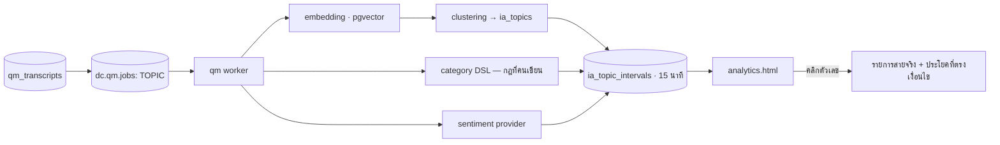

# D-Contact — Interaction Analytics (วิเคราะห์ทุกบทสนทนา)

> ตัดสินใจเชิงสถาปัตยกรรมอยู่ที่ [ADR-017](adr/017-interaction-analytics.md)

## 1. ตอบคำถามอะไร

| คำถามของธุรกิจ | สิ่งที่ต้องมี |
|---|---|
| ลูกค้าโทรมาเรื่องอะไรมากที่สุดเดือนนี้ | topic + category ครบทุกสาย |
| เรื่องไหนกำลังโตเร็วผิดปกติ | แนวโน้มรายช่วงเวลา + การตรวจจับความผิดปกติ |
| เรื่องไหนทำให้สายยาว / ต้องโอน / ต้องโทรซ้ำ | ความสัมพันธ์ topic ↔ AHT / transfer / repeat |
| แคมเปญการตลาดที่ปล่อยเมื่อวานทำให้สายเข้าพุ่งไหม | หัวข้อรายวันเทียบ baseline |
| ทำไม CSAT ตกในคิวนี้ | topic ↔ CSAT ↔ คะแนน QM |
| มีสายที่พูดคำเสี่ยงทางกฎหมายไหม | category แบบกฎ (แม่นยำ อธิบายได้) |

## 2. สถาปัตยกรรม



**ไม่มี service ใหม่** — เป็น job ชนิดใหม่ของ worker เดิมใน `apps/qm`

## 3. สองระบบจัดหมวดที่อยู่ด้วยกัน

| | Category (กฎที่คนเขียน) | Topic (ค้นพบอัตโนมัติ) |
|---|---|---|
| ที่มา | DSL ใน [quality-management §6](quality-management.md) | clustering จาก embedding |
| ความแม่นยำ | สูง อธิบายได้ ใช้กับ compliance ได้ | ปานกลาง ใช้สำรวจ |
| ตอบคำถาม | "มีกี่สายที่เข้าเงื่อนไขนี้" | "มีเรื่องอะไรที่เราไม่รู้ว่ามี" |
| วงจร | คนเขียน → ใช้ตลอด | ค้นพบ → คนตั้งชื่อ → **เลื่อนขั้นเป็น category** |

การเลื่อนขั้น (promote) คือหัวใจ: หัวข้อที่ค้นพบและมีคนยืนยันแล้ว จะถูกแปลงเป็นกฎที่นับได้แน่นอน
ตั้งแต่วันนั้นเป็นต้นไป — ระบบจึงฉลาดขึ้นเรื่อย ๆ โดยไม่ต้องเชื่อ clustering ตลอดกาล

## 4. Data model

```prisma
model ia_topic          { id String @id  tenantId String  label String  // คนตั้งชื่อ
                          autoLabel String                              // ที่โมเดลเสนอ
                          centroid Unsupported("vector")  size Int
                          status String   // DISCOVERED|CONFIRMED|PROMOTED|IGNORED
                          promotedCategoryId String?  firstSeenAt DateTime }
model ia_interaction_tag{ id String @id  interactionId String  kind String // TOPIC|CATEGORY
                          refId String  score Float  evidence Json }      // ช่วงเวลา+ข้อความ
model ia_topic_interval { id String @id  tenantId String  bucketStart DateTime  // 15 นาที
                          refId String  kind String  queueId String?  channel String?
                          count Int  avgHandleSec Int  transferRate Float
                          repeatRate Float  csatAvg Float?  qmAvg Float?  sentimentAvg Float }
model ia_saved_search   { id String @id  tenantId String  name String  query Json
                          ownerId String  shared Boolean  alert Json? }   // แจ้งเตือนเมื่อเกินเกณฑ์
```

`ia_topic_interval` ใช้โครงเดียวกับ `wfm_interval_stats` โดยตั้งใจ — ทำให้เอาข้อมูลสองฝั่ง
มาวางบนแกนเวลาเดียวกันได้ (เช่น "หัวข้อนี้พุ่งตอนที่กำลังคนขาด")

## 5. ตัวชี้วัดที่ต้องมีตั้งแต่ v1

- **Volume by topic** + แนวโน้ม + % การเติบโตเทียบสัปดาห์ก่อน
- **Cost driver**: topic × AHT × ปริมาณ = เวลารวมที่หมดไปกับเรื่องนั้น (แปลงเป็นเงินได้)
- **Repeat contact rate ต่อ topic** — เรื่องที่ต้องโทรซ้ำคือเรื่องที่ระบบตอบไม่จบ
  (คือ input โดยตรงของ [virtual agent](virtual-agent-knowledge.md) และ KB)
- **Silence / talk-over / speech rate** (มีอยู่แล้วจาก QM) จับคู่กับ topic
- **การตรวจจับความผิดปกติ**: หัวข้อที่โตเกิน 3σ ของ baseline 4 สัปดาห์ → แจ้งเตือน

## 6. Saved search + alert

ค้นด้วยเงื่อนไขผสม (คำพูด + คิว + ช่องทาง + ผลลัพธ์ + คะแนน) แล้ว **บันทึกเป็นการค้นหาถาวร**
ตั้งแจ้งเตือนได้ (เช่น "มีสายที่พูดคำว่า 'ฟ้องร้อง' เกิน 5 สายในหนึ่งวัน") →
แจ้งเข้า `dc.qm.events` และเปิดเคสได้ตาม [case-management](case-management.md)

## 7. UI (`mockups/analytics.html` — กลุ่ม Interaction analytics)

| view | หน้าที่ |
|---|---|
| `ia-overview` | หัวข้อยอดนิยม + แนวโน้ม + หัวข้อที่โตผิดปกติ + cost driver |
| `ia-topics` | **list** หัวข้อ (ค้นพบ/ยืนยัน/เลื่อนขั้นแล้ว) + ปุ่มตั้งชื่อและเลื่อนขั้น |
| `ia-topic-detail` | หัวข้อเดียว: แนวโน้ม, คิวที่เจอ, AHT, CSAT, **สายจริง 20 สาย** |
| `ia-search` | ค้นข้ามบทสนทนา + ตัวกรอง + บันทึกเป็น saved search |
| `ia-searches` | **list/new/edit** saved search + การแจ้งเตือน |
| `ia-correlation` | topic ↔ CSAT ↔ คะแนน QM ↔ AHT (ตารางความสัมพันธ์ + คำเตือนเรื่องสหสัมพันธ์ ≠ สาเหตุ) |

## 8. แผนเฟส

| เฟส | ได้อะไร | ต้องมีก่อน |
|---|---|---|
| **N1** | ขยาย category ให้ทำงานกับ **ทุก** transcript + `ia_topic_intervals` | QM Q3–Q4 |
| **N2** | หน้าค้นหาข้ามบทสนทนา + saved search + alert | N1 |
| **N3** | topic discovery (embedding + clustering) + ตั้งชื่อ + เลื่อนขั้นเป็น category | N1 + pgvector |
| **N4** | ความสัมพันธ์กับ CSAT/QM/AHT + การตรวจจับความผิดปกติ | N1 + [feedback](feedback-survey.md) F1 |
| **N5** | ส่งออกไป BI ของลูกค้า ([reporting-data-platform](reporting-data-platform.md)) | I2 |

## 9. ความเสี่ยง

| ความเสี่ยง | ทางรับมือ |
|---|---|
| topic ที่ค้นพบไม่มีความหมายกับธุรกิจ | ต้องมีคนยืนยันและตั้งชื่อก่อนขึ้นหน้ารายงาน; ที่ยังไม่ยืนยันอยู่ในหน้าสำรวจเท่านั้น |
| sentiment ภาษาไทยแม่นไม่พอ | ใช้เป็นแนวโน้มกลุ่มเท่านั้น + เขียนข้อจำกัดบนหน้าจอ |
| ตัวเลขสวยแต่ไม่มีใครกล้าใช้ | ทุกตัวเลขคลิกลงไปเห็นสายจริงได้เสมอ |
| ต้นทุนวิเคราะห์ 100% บานปลาย | quota `analyzedMinutesPerMonth` + วิเคราะห์เฉพาะสายยาวกว่า N วินาที + งานนอกชั่วโมงเร่ง |
| สหสัมพันธ์ถูกอ่านเป็นสาเหตุ | หน้า correlation มีคำเตือนถาวรและแสดงขนาดตัวอย่างเสมอ |

## รายงานที่โมดูลนี้เป็นเจ้าของ

`ia.topic.volume` · `ia.cost.driver` · `ia.repeat.topic` · `ia.anomaly` · `ia.correlation`

รายละเอียดของแต่ละใบ (dataset · grain · มิติบังคับ · entitlement · ชั้น · drill-down · เฟส) อยู่ที่
[reporting-data-platform §7.9](reporting-data-platform.md) ซึ่งเป็น**แหล่งความจริงเดียว** —
ใบใหม่ต้องไปลงทะเบียนที่นั่นก่อน ห้ามตั้งใบรายงานขึ้นเองในโมดูล

แสดงได้เฉพาะ topic ที่คนยืนยันชื่อแล้ว — cluster ดิบอยู่ในหน้าสำรวจเท่านั้น ไม่ขึ้นรายงาน

## เอกสารเกี่ยวข้อง

[ADR-017](adr/017-interaction-analytics.md) · [quality-management.md](quality-management.md) ·
[reporting-data-platform.md](reporting-data-platform.md)
