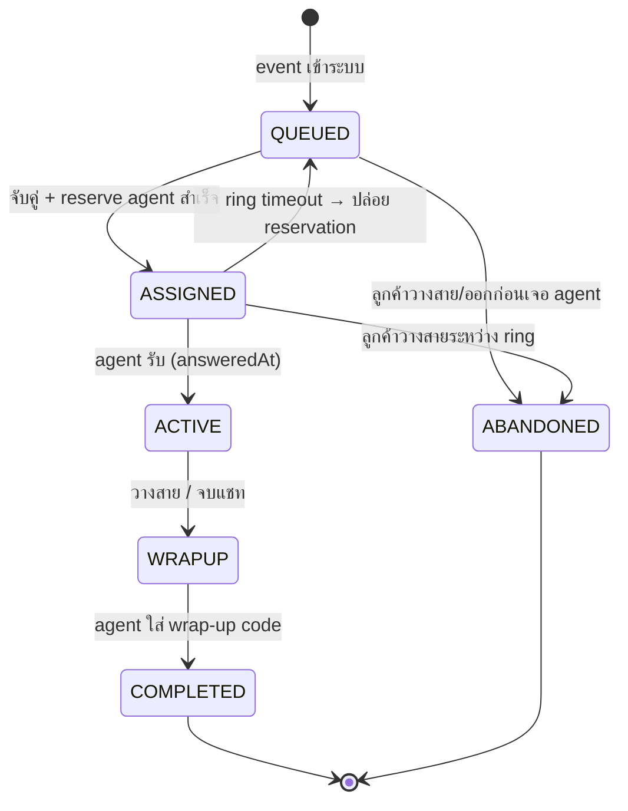
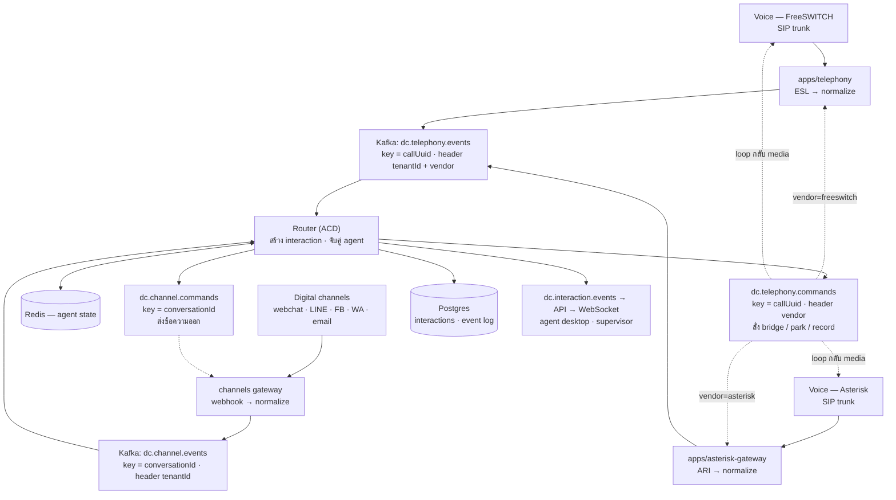
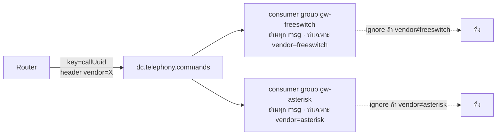
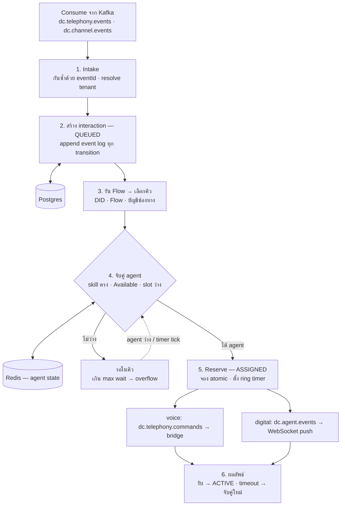

# D-Contact — Interaction Data Flow

> ขยายความ [ADR-001 (Unified Interaction Model)](adr/001-unified-interaction-model.md) —
> อธิบาย lifecycle ของ interaction และการทำงานภายใน Router (ACD) · อัปเดต 2026-07-15

## 1. Interaction คืออะไร

**1 งานจากลูกค้า = 1 interaction** ไม่ว่าจะเป็นสายโทร, เว็บแชท, LINE, FB, WhatsApp หรืออีเมล
ทุกช่องทางถูกแปลงเป็น record กลางหน้าตาเดียวกัน (ตาราง `interactions`):
`channel`, `direction`, `state`, `queueId`, `agentId`, `contactId` + timestamps ทุกจุด
(`queuedAt → assignedAt → answeredAt → endedAt`) — router ตัวเดียวจึงกระจายงานได้ทุกช่องทาง
และหน้า History/Reports ใช้ตารางเดียวแสดงทั้ง call และ chat

### 1.1 สามชั้นที่ชื่อคล้ายกันแต่คนละเรื่อง ([ADR-023](adr/023-conversation-vs-interaction.md))

| ชั้น             | คือ                                             | หน่วยของอะไร                      | อายุ             |
| ---------------- | ----------------------------------------------- | --------------------------------- | ---------------- |
| **Conversation** | ห้อง/thread ที่เราคุยกับลูกค้าคนนี้บนช่องทางนี้ | ประวัติและตัวตน                   | ตลอดความสัมพันธ์ |
| **Interaction**  | งานหนึ่งชิ้นที่มอบให้ agent                     | **routing · SLA · AHT · billing** | นาที–ชั่วโมง     |
| **Case**         | เรื่องหนึ่งเรื่องที่กินหลายงานหลายวัน           | ความคืบหน้าของปัญหา               | ชั่วโมง–สัปดาห์  |

```
Conversation (ห้อง LINE ของคุณนภา)
├─ Interaction #1  จ. 09:00  พัสดุล่าช้า      ── Case CS-4700 (ปิดแล้ว)
├─ Interaction #2  พ. 14:30  ใบกำกับภาษี      ── ไม่มีเคส (จบในครั้งเดียว)
└─ Interaction #3  ศ. 11:00  ตามเรื่องเคลม     ── Case CS-4821 (เปิดอยู่)
```

**voice ไม่มี conversation** (`conversationId = null`) — เราไม่สร้าง thread ปลอมให้ครบทุกช่องทาง
เพราะสายโทรไม่มี "ห้อง" ที่ลูกค้ากลับมาพิมพ์ต่อได้

## 2. State machine



> **งานที่ `COMPLETED` แล้วไม่มีทางกลับ** — ลูกค้าพิมพ์กลับใน 30 นาทีจะได้ **interaction ใบใหม่**
> ที่ชี้กลับด้วย `reopenedFromInteractionId` (§4.3, [ADR-023](adr/023-conversation-vs-interaction.md) ข้อ 4)
> ตัวเลขของงานที่ปิดไปแล้วจึงไม่เปลี่ยนย้อนหลัง

**ทุก transition ทำ 2 อย่างพร้อมกันเสมอ**: append แถวลง `interaction_events` (log ถาวร —
system of record) และ produce ลง `dc.interaction.events` (realtime fan-out + billing/reporting)

## 3. End-to-end: สายโทรเข้า 1 สาย



> **Multi-vendor:** FreeSWITCH และ Asterisk มี gateway ของตัวเองแต่ produce ลง `dc.telephony.events`
> เดียวกัน — router มองเห็นเหมือนกันหมด รายละเอียดเส้น command ขากลับดู §3b และ [ADR-006](adr/006-multi-vendor-telephony-gateway.md)

ลำดับเหตุการณ์:

1. **สายเข้า FreeSWITCH** → dialplan สั่ง `park` (ลูกค้าฟังเพลงรอ) — FreeSWITCH เป็นแค่
   media layer ไม่ตัดสินใจเอง (ADR-002)
2. **telephony** ได้ `CHANNEL_CREATE` ผ่าน ESL → normalize เป็น envelope
   (`eventId, tenantId, callUuid, caller, destination`) → produce `dc.telephony.events`
   **key = callUuid** การันตี ordering ต่อสาย
3. **Router** สร้าง interaction `QUEUED` → หา agent จาก Redis → จอง → `ASSIGNED` (ดู §4)
4. Router produce `dc.telephony.commands` → telephony สั่ง FreeSWITCH **bridge** + record
5. Agent รับ → `CHANNEL_ANSWER` ไหลเข้าเส้นเดิม → `ACTIVE`; ไม่รับใน N วิ → requeue
6. วางสาย → `WRAPUP` → agent เลือก wrap-up code → `COMPLETED`

**Digital ต่างแค่ต้นทางกับเนื้อหา**: channels gateway รับ webhook แทน ESL, ตัวข้อความเก็บใน
`conversations`/`messages` แทน recording — ตั้งแต่ Kafka ลงไปใช้ router/queue/state machine
ชุดเดียวกัน สิ่งเดียวที่ต่างคือ concurrency: voice = 1 สาย, chat = หลายห้องพร้อมกัน
(ค่าต่อ agent ในหน้า People ของ mockup)

## 3b. Multi-vendor voice (FreeSWITCH + Asterisk)

จาก [ADR-006](adr/006-multi-vendor-telephony-gateway.md): voice รองรับสอง media server ผ่าน
gateway ที่ขนานกัน — **router ไม่รู้ว่าสายมาจาก vendor ไหน**

| ด้าน                       | apps/telephony (FreeSWITCH)                                                          | apps/asterisk-gateway (Asterisk)                 |
| -------------------------- | ------------------------------------------------------------------------------------ | ------------------------------------------------ |
| Control protocol           | ESL (Event Socket)                                                                   | ARI (REST + WebSocket, Stasis app)               |
| "ค้างสาย" ระหว่างรอ router | `park`                                                                               | เข้า Stasis app                                  |
| Event ต้นทาง               | `CHANNEL_CREATE`, `CHANNEL_ANSWER`, `CHANNEL_HANGUP`                                 | `StasisStart`, `ChannelStateChange`, `StasisEnd` |
| หน้าที่ร่วม                | normalize → **DC envelope กลาง** (`packages/shared`) → produce `dc.telephony.events` | เหมือนกันทุกประการ                               |

**ขาเข้า (event):** ทั้งสอง gateway แปลง vendor event → DC event type กลาง
(`call.created` / `call.answered` / `call.hangup`) แล้ว produce ลง `dc.telephony.events`
**key = callUuid** + header **`vendor`** (`freeswitch`|`asterisk`) คู่กับ `tenantId` —
router ตอน intake อ่าน `vendor` แล้ว **persist ลง interaction** (`metadata.vendor`) เพื่อจำว่า
สายนี้เจ้าของคือ vendor ไหน

**ขากลับ (command) — จุดที่ต้องระวัง:**



- gateway แต่ละตัวเป็น **consumer group แยก** → ทั้งคู่อ่าน `dc.telephony.commands` ครบทุก message
  แต่ **ลงมือเฉพาะ message ที่ `vendor` ตรงกับตัวเอง** — ตัวที่ไม่ตรงทิ้ง
- Router stamp `vendor` (จากที่ persist ไว้) บนทุก command → command ถึง gateway เจ้าของสายเสมอ,
  ordering ต่อสายคงเดิม (key=callUuid)
- **ไม่แยก topic ต่อ vendor** (ADR-003: shared topic + header) — cost คืออ่าน message ที่ไม่ใช่
  ของตัวเองแล้วทิ้ง ซึ่งถูกกว่าการดูแลหลาย topic มาก
- **Command set = ความสามารถร่วม** ของทั้งคู่ (bridge/park/hangup/record/playback/DTMF) —
  gateway แปลงเป็น ESL app / ARI operation ของตัวเอง; feature เฉพาะ vendor ไม่รั่วถึง router

**เคสหลัก = 1 vendor ต่อ deployment** (SaaS → FreeSWITCH, on-prem → Asterisk): deployment รัน gateway
ตัวเดียว → มี consumer เดียว → **เส้น command ขากลับข้างบนกลายเป็น no-op** (ไม่ต้อง filter จริง) —
kernel image เดียวกันทุก profile ต่างแค่ gateway container ที่ deploy

**Dual-stack (variant):** ถ้าอยากคละ vendor ในระบบเดียว แค่ deploy ทั้งสอง gateway — vendor ของสาย
กำหนดจาก media server ที่ SIP trunk ของ tenant ชี้อยู่ (tenant metadata, ADR-005), กลไก filter ข้างบน
คือสิ่งที่ทำให้เคสนี้ทำงานถูกต้อง ดู [ADR-006](adr/006-multi-vendor-telephony-gateway.md)

## 4. ภายใน Router (ACD)



รายละเอียดต่อขั้น:

1. **Intake** — Kafka เป็น at-least-once: event ซ้ำได้ตอน rebalance/retry → เช็ค `eventId`
   (processed ids ใน Redis ระยะสั้น); resolve SIP domain / channel account → tenant UUID
   แล้วโหลด tenant config (จาก cache — ดู multi-tenancy §4); สำหรับ voice เก็บ `vendor` header
   ลง interaction เพื่อให้ command ขากลับส่งถึง gateway ที่ถูกต้อง (§3b, ADR-006)
2. **สร้าง interaction ก่อนเรื่องอื่นเสมอ** — ถ้า router crash กลางทาง งานมีตัวตนใน DB
   เอากลับมา requeue ได้ ไม่หายเงียบ
3. **รัน Flow → เลือกคิว** — จุดนี้คือที่ที่ **Flow Engine** ทำงาน (ต้อนรับ, เมนู, เงื่อนไข,
   เรียก API) แล้วจบด้วยการเลือกคิว/ปลายทาง: voice เลือก flow จาก DID, digital จากบัญชีช่องทาง;
   นอกเวลาทำการหรือ deflect (voicemail/callback) จบตรงนี้โดยไม่เข้า matching —
   ดู [flow-engine.md](flow-engine.md)
4. **Matching** — ถาม Redis 3 เงื่อนไข: skill ครอบคลุม + Available + slot ว่างตาม channel;
   จัดอันดับด้วย strategy ของคิว (default: longest idle) — ใช้ Redis เพราะยิงถี่และต้องตอบ ms;
   ไม่มีใครว่าง → รอในคิว ปลุก matching ใหม่เมื่อ agent ว่าง (event) หรือ timer tick;
   เกิน max wait → overflow (ย้ายคิว/callback/voicemail)
5. **Reserve ต้อง atomic** (Lua/`SETNX`) — กัน 2 สายเลือก agent เดียวกันพร้อมกัน;
   จองแล้ว `ASSIGNED` + ring timer
6. **ผลลัพธ์** — รับ = `ACTIVE`; ring timeout/decline ใช้ policy ของ queue: requeue ทันที,
   cooldown แล้ว requeue (ค่าเริ่มต้น 60 วินาที) หรือ `ABANDONED`; ทุกทางปล่อย reservation แบบ
   atomic และ append event เพียงครั้งเดียว. ลูกค้าวางก่อนรับงาน = `ABANDONED`; วางหลังรับงาน =
   `WRAPUP` และ Agent อยู่ `ACW` จนเลือก wrap-up code ก่อนกลับ `AVAILABLE`. `maxWaitSec`
   ใช้ action ของคิวเพื่อ requeue รอบใหม่หรือ `ABANDONED` เมื่อเกินเวลารอ

### 4.1 สัญญาการรับงานฝั่ง digital (ต่างจาก voice ที่มีเสียงกริ่ง)

voice มี ring timer ที่ลูกค้าได้ยิน — digital ไม่มีอะไรบอกเลยว่างานถูกส่งไปแล้วหรือยัง
ถ้าไม่กำหนดให้ชัด **slot ของ agent จะถูกถือค้างโดยไม่มีใครรู้** และตัวเลข concurrency จะโกหก

|                           | Voice                          | Digital                                                   |
| ------------------------- | ------------------------------ | --------------------------------------------------------- |
| ส่งงาน                    | bridge สาย (ลูกค้าได้ยินกริ่ง) | push ผ่าน WS + แจ้งเตือนบนหน้าจอ                          |
| เวลาที่ให้ตอบรับ          | ring timeout 15–30 วิ          | **ack ภายใน 15 วินาที** (ตั้งได้ต่อ tenant)               |
| ไม่ตอบรับ                 | ปล่อย reservation → จับคู่ใหม่ | **เหมือนกัน** + ทำเครื่องหมาย agent ว่า `missed` ชั่วคราว |
| นับ slot ตั้งแต่เมื่อไหร่ | ตอน reserve                    | ตอน reserve เหมือนกัน — **แต่คืนทันทีถ้าไม่ ack**         |

**โหมด auto-accept** เปิดได้ต่อคิว (สำหรับทีมที่นั่งหน้าจอตลอด) แต่ **ค่าเริ่มต้นคือต้อง ack** —
auto-accept บนทีมที่ลุกจากโต๊ะได้ = ลูกค้าคุยกับเก้าอี้ว่างและไม่มีใครรู้จนกว่าจะร้องเรียน

### 4.2 แชทที่เงียบไป — idle auto-wrap คืน slot

ปัญหาที่เจ็บกว่าการไม่ ack คือ **แชทที่ลูกค้าหายไปเฉย ๆ แต่ยังกิน slot อยู่**
agent ที่ถือ 3 แชทซึ่งเงียบทั้งหมดจะดู "เต็ม" ทั้งที่ไม่ได้ทำอะไร ทำให้
[สูตร chat concurrency ใน WFM](workforce-management.md) คำนวณกำลังคนผิดทั้งกะ

```
ลูกค้าไม่ตอบ 5 นาที   → เตือน agent ("ยังอยู่ไหมคะ" template)
ลูกค้าไม่ตอบ 15 นาที  → interaction → WRAPUP อัตโนมัติ + คืน slot
                        conversation → IDLE (ห้องยังเปิด ลูกค้าพิมพ์กลับได้ตลอด)
ลูกค้าพิมพ์กลับ       → เข้ากติกา reopen window (§4.3 — ได้ interaction ใบใหม่ที่ชี้กลับใบเดิม)
```

ทั้ง 5 และ 15 นาทีเป็น tenant metadata · การ auto-wrap **ต้องบันทึกเหตุผล** (`wrapUpCode = auto_idle`)
เพื่อไม่ให้ปนกับงานที่ agent ปิดเอง — ไม่งั้นตัวเลข "งานที่จบแล้ว" จะรวมงานที่ลูกค้าหายไปเข้าไปด้วย

### 4.3 ลูกค้าพิมพ์กลับหลังปิดงาน — สร้างใบใหม่ ไม่แก้ใบเก่า

```
ข้อความเข้า thread เดิม
  → มี interaction ACTIVE/WRAPUP อยู่ไหม → ต่อที่งานนั้น
  → ปิดไป <= 30 นาที → interaction ใหม่ + reopenedFromInteractionId ชี้กลับใบเดิม
                        agent เดิม online + มี slot → ส่งให้คนเดิม · ไม่ว่าง → เข้าคิวปกติ
  → เกิน 30 นาที      → interaction ใหม่ ไม่มี reopenedFrom
  → conversation = BLOCKED → ไม่สร้างงาน (ข้อความยังถูกเก็บไว้)
```

**ห้ามแตะแถวของงานที่ปิดแล้ว** — `endedAt`, AHT, SLA, `interaction.ended` ที่ยิงเข้า metering
และผลประเมิน QM ของงานนั้นต้องคงที่ตลอดไป รายงานเดือนที่แล้วต้องให้คำตอบเดิมไม่ว่าจะรันวันไหน

**สิ่งที่ต้องรู้จัก chain (`reopenedFrom`) ไม่งั้นตัวเลขเพี้ยน:**

| ตัวชี้วัด            | กติกา                                         |
| -------------------- | --------------------------------------------- |
| FCR / repeat contact | ใบที่มี `reopenedFrom` ไม่นับเป็นการติดต่อซ้ำ |
| Metering / billing   | รายงานและแพ็กเกจยุบทั้ง chain เป็น 1 หน่วย    |
| การสุ่มตรวจ QM       | สุ่มได้ใบเดียวต่อ chain                       |
| AHT                  | คิดต่อใบตามปกติ ไม่รวมเวลาที่ลูกค้าหายไป      |

### 4.4 แผงบริบทบนหน้าเอเจนต์ — แท็บ ไม่ใช่คอลัมน์ที่ยาวขึ้นเรื่อย ๆ

ทุกโมดูลที่เพิ่มเข้ามาอยากมีที่ยืนบนหน้าจอของเอเจนต์: ลูกค้า 360 · เคส · ลำดับอัตโนมัติ ·
consult · คำแนะนำจากผู้ช่วย · สคริปต์ · แอปของลูกค้า **คอลัมน์เดียวรับไม่ไหวตั้งแต่ตัวที่ห้า** —
สิ่งที่เกิดขึ้นจริงคือเอเจนต์เลื่อนหาไม่เจอ แล้วเลิกใช้ทั้งคอลัมน์

โครงที่ใช้: **แท็บของบริบท** โดยที่แต่ละแท็บเป็นของโมดูลที่เป็นเจ้าของเนื้อหานั้น

| แท็บ       | เนื้อหา                                                  | เจ้าของ                                                                |
| ---------- | -------------------------------------------------------- | ---------------------------------------------------------------------- |
| ลูกค้า     | ตัวตน · ผูกตัวตน · ประวัติในห้องนี้ · ลิงก์โปรไฟล์ 360   | [customer-360](customer-360.md)                                        |
| สคริปต์    | ตัวเดินสคริปต์ทีละขั้น (ขึ้นเฉพาะงานที่มีสคริปต์ผูกอยู่) | [agent-assist §3 A6](agent-assist.md)                                  |
| งานค้าง    | เคสที่เกี่ยวข้อง + ลำดับอัตโนมัติของลูกค้า               | [case](case-management.md) · [journey](journey-orchestration.md)       |
| ขอความช่วย | consult ผู้เชี่ยวชาญ + การ์ดคำแนะนำ                      | [collaboration](internal-collaboration.md) · [assist](agent-assist.md) |
| แอป        | visual app ของลูกค้า (CRM ฯลฯ)                           | [integration §9](integration-platform.md)                              |

**สามกติกาที่ทำให้แท็บไม่กลายเป็นที่ซ่อนของ:**

| กติกา                                                                                               | ทำไม                                                                                                              |
| --------------------------------------------------------------------------------------------------- | ----------------------------------------------------------------------------------------------------------------- |
| แท็บที่ปิดอยู่ต้องมี **badge** และของด่วนต้องถูกยกขึ้น **แถบเตือนเหนือแท็บ** พร้อมปุ่มไปที่แท็บนั้น | ของที่ปิดงานไม่ได้ถ้าไม่ทำ (ขั้นบังคับของสคริปต์) หรือ SLA ที่กำลังจะหมด ห้ามหายไปเพราะเอเจนต์เปิดแท็บอื่นค้างไว้ |
| **ระบบห้ามสลับแท็บให้เอง** — เสนอปุ่มให้กดเท่านั้น                                                  | สลับหน้าจอใต้มือคนที่กำลังพิมพ์ตอบลูกค้า คือวิธีทำให้เขาพิมพ์ผิดที่                                               |
| แท็บที่เปิดอยู่ **จำแยกต่อชิ้นงาน** ไม่ใช่ค่าเดียวทั้งหน้าจอ                                        | เอเจนต์ถือ 4 งานพร้อมกัน แต่ละงานอยู่คนละขั้นของการทำงาน                                                          |

สิ่งที่**ไม่**อยู่ในแท็บโดยเจตนา: บทสนทนา, ปุ่ม Resolve, แถบสายที่กำลังคุย (`monbar`)
และประกาศที่เกิดกลางสาย เช่น "ลำดับอัตโนมัติบรรลุเป้าหมายแล้ว" ([journey §5.3](journey-orchestration.md))
— ของพวกนี้อยู่กลางจอเสมอ เพราะมันเปลี่ยนสิ่งที่เอเจนต์กำลังจะพูดในอีก 5 วินาทีข้างหน้า

#### ความกว้างของคอลัมน์เป็นของเอเจนต์ ไม่ใช่ของเรา

สัดส่วนที่ดีที่สุดไม่มีค่าเดียว — สคริปต์อ่านง่ายในคอลัมน์แคบ แต่แท็บแอปที่ฝัง CRM ต้องการที่กว้าง
และคนทำอีเมลอยากได้บทสนทนากว้างกว่าคนรับสาย **เอเจนต์ลากเส้นแบ่งปรับเองได้ทั้งสองเส้น**
(ดับเบิลคลิกที่เส้น = คืนค่าเริ่มต้น · โฟกัสแล้วกดลูกศรได้สำหรับคนที่ใช้คีย์บอร์ดอย่างเดียว)

| กติกา                                                                     | ทำไม                                                                                                                                                                                                                                                              |
| ------------------------------------------------------------------------- | ----------------------------------------------------------------------------------------------------------------------------------------------------------------------------------------------------------------------------------------------------------------- |
| เก็บเป็น **user preference ผูกกับคน** ไม่ใช่ tenant config                | [ADR-005](adr/005-multitenant-metadata-architecture.md) คุมการปรับแต่งของ _องค์กร_ — ความกว้างคอลัมน์เป็นรสนิยมของ _คนใช้_ mockup เก็บใน `localStorage`, ของจริงต้องเก็บฝั่ง server (เสนอ `users.prefs Json`) เพื่อให้ย้ายเครื่องหรือเปลี่ยนแท็บแล้วได้หน้าจอเดิม |
| **clamp ค่าที่บันทึกไว้ทุกครั้งที่โหลดและทุกครั้งที่จอเปลี่ยนขนาด**       | preference ที่ทำให้เอเจนต์มองไม่เห็นบทสนทนา คือ preference ที่ต้องถูกปฏิเสธ — และค่าจากจอ 27" ต้องไม่ทำให้คอลัมน์หายไปบนโน้ตบุ๊ก                                                                                                                                  |
| **ค่าที่ถูก clamp ห้ามเขียนทับค่าที่เอเจนต์ตั้งไว้**                      | ต่อจอเล็กชั่วคราวแล้วกลับมาที่โต๊ะ ต้องได้สัดส่วนเดิมคืน ไม่ใช่ค่าที่ถูกบีบตอนอยู่จอเล็ก                                                                                                                                                                          |
| **พื้นที่ทำงานสูงเต็มจอ แต่ละคอลัมน์เลื่อนในตัวเอง — ทั้งหน้าห้ามเลื่อน** | บทสนทนา ปุ่ม Resolve และแถบสายที่กำลังคุยต้องอยู่ตำแหน่งเดิมเสมอ คนที่กำลังพูดกับลูกค้าไม่ควรต้องเลื่อนหาปุ่มวางสาย                                                                                                                                               |

## 5. อะไรเก็บที่ไหน

| ที่เก็บ      | เก็บอะไร                                                                                                                                                                       | ทำไม                                                                                       |
| ------------ | ------------------------------------------------------------------------------------------------------------------------------------------------------------------------------ | ------------------------------------------------------------------------------------------ |
| **Postgres** | `interactions`, `interaction_events`, `conversations`/`messages`/`message_attachments`, `recordings` (metadata)                                                                | system of record — รายงานย้อนหลัง, ประวัติลูกค้า                                           |
| **Kafka**    | ทุก event ระหว่างทาง (`dc.telephony.events` · `dc.channel.events` · `dc.interaction.events` · `dc.agent.events` + commands 2 ตัว)                                              | ส่งต่อระหว่าง service, replay สำหรับ billing/audit (ADR-003, ชื่อ topic ตาม ADR-023 ข้อ 6) |
| **Redis**    | agent state, คิว ณ วินาทีนี้, processed eventIds, tenant config cache                                                                                                          | คำถาม realtime ต้องตอบระดับ ms                                                             |
| **MinIO/S3** | `recordings/` ไฟล์เสียง · `media/` ไฟล์ที่ลูกค้าส่งมา ([ADR-024](adr/024-message-delivery-media.md)) · `collab/` ไฟล์ในแชทภายใน ([ADR-022](adr/022-internal-collaboration.md)) | ไฟล์ใหญ่ ไม่อยู่ใน DB — แยก bucket เพราะสิทธิ์และอายุคนละชุด                               |

**ข้อความขาออกไม่มีตาราง outbox แยก** — แถวใน `messages` ที่สถานะ `QUEUED` _คือ_ outbox
(`status` + `attempts` + `nextAttemptAt`) ตาม [ADR-024](adr/024-message-delivery-media.md) ข้อ 1
และมี idempotency สองทาง: `providerMessageId` กัน webhook ซ้ำ · `clientToken` กันส่งซ้ำใส่ลูกค้า

## 6. Map กับหน้า mockup

| หน้า                                    | คือข้อมูลอะไร                                                                |
| --------------------------------------- | ---------------------------------------------------------------------------- |
| Workspace — My inbox                    | interactions ที่ `ASSIGNED/ACTIVE` ของ agent คนนั้น + แผงบริบทแบบแท็บ (§4.4) |
| History — Interactions                  | ตาราง `interactions` ทั้ง tenant + filters                                   |
| Dashboard / Wallboard                   | aggregate จาก state ปัจจุบัน (ผ่าน `dc.interaction.events`)                  |
| Reports — Queue SLA / Agent performance | aggregate จาก `interaction_events`                                           |
| Admin — Usage & plan                    | metering จาก `dc.interaction.events` ต่อ tenant                              |

## 7. สถานะ implementation

`apps/router/src/main.ts` ปัจจุบันมีแค่ consume + log (ข้อ 1 บางส่วน) —
ข้อ 2–6 คือเนื้องานหลักของ Phase 1 ลำดับที่แนะนำ: **2 → 4 → 5 → 6**
(ข้อ 3 hardcode คิวเดียวไปก่อนได้) และการ resolve SIP domain → tenant UUID
ยังเป็น TODO ใน telephony (ตอนนี้ใช้ domain เป็น tenant key ชั่วคราว)

**Multi-vendor (§3b):** `apps/telephony` (FreeSWITCH) เป็น gateway ตัวแรกที่ implement ใน Phase 1;
`apps/asterisk-gateway` เป็น Phase 1+ — envelope contract, `vendor` header, และ command routing
ถูกล็อกไว้แล้วใน ADR-006 เพื่อให้วาง interface ถูกตั้งแต่ telephony ตัวแรก ไม่ต้อง retrofit

## รายงานที่โมดูลนี้เป็นเจ้าของ

`queue.sla` · `queue.volume` · `queue.wait` · `queue.overflow` · `queue.nomatch` · `agent.productivity` · `agent.state.time` · `agent.handling.detail` · `channel.volume` · `channel.response` · `channel.delivery` · `channel.media.failure`

รายละเอียดของแต่ละใบ (dataset · grain · มิติบังคับ · entitlement · ชั้น · drill-down · เฟส) อยู่ที่
[reporting-data-platform §7.3](reporting-data-platform.md) ซึ่งเป็น**แหล่งความจริงเดียว** —
ใบใหม่ต้องไปลงทะเบียนที่นั่นก่อน ห้ามตั้งใบรายงานขึ้นเองในโมดูล

ช่องทางดิจิทัลนับเป็น **conversation** ไม่ใช่ interaction ([ADR-023](adr/023-conversation-vs-interaction.md)) และ `agent.productivity` เป็นใบชั้นบุคคล จึงต้องมี CSAT หรือ FCR อยู่บนใบเดียวกันเสมอ
