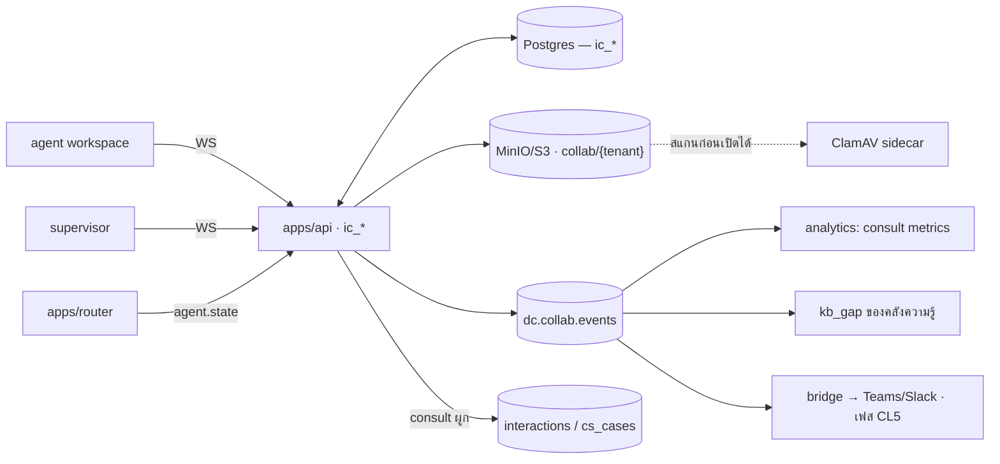

# D-Contact — Internal Collaboration (แชทภายใน · Consult · ไฟล์แนบ)

> ตัดสินใจเชิงสถาปัตยกรรมอยู่ที่ [ADR-022](adr/022-internal-collaboration.md)

## 1. โมดูลนี้แก้ปัญหาอะไร

| สถานการณ์จริงหน้างาน | วันนี้ทำยังไง | ปัญหา |
|---|---|---|
| เอเจนต์ติดกลางสาย อยากถามคนที่รู้ | ยกมือ / โทรหาหัวหน้า / ทัก LINE | ลูกค้ารอ · ไม่มีบันทึก · ไม่รู้ว่าถามเรื่องเดิมกี่ครั้งแล้ว |
| หัวหน้าเห็นเอเจนต์คุยนานผิดปกติ | เดินไปหา | ช้า และรบกวนกลางสาย |
| ส่งภาพหน้าจอ error / สลิป / เอกสาร | LINE ส่วนตัว | **ข้อมูลลูกค้าออกนอกระบบถาวร** |
| ส่งเวรข้ามกะ | สมุด / กลุ่มไลน์ | ตกหล่น หาไม่เจอ |
| ประกาศ "คิวล้น ใครว่างช่วยที" | ตะโกน | คนที่ break อยู่ก็ได้ยิน คนที่อยู่คนละไซต์ไม่ได้ยิน |

**สิ่งที่เราทำ:** แชทที่รู้จักงานตรงหน้า — ไม่ใช่แชททั่วไปที่เก่งกว่า Teams

## 2. สถาปัตยกรรม



**ไม่มี service ใหม่** — `ic_*` อยู่ใน `apps/api` และใช้ WS gateway เดิม
ของใหม่ชิ้นเดียวที่โมดูลนี้พาเข้ามาคือ **virus scanner** (จำเป็นเพราะมีไฟล์แนบ)

## 3. ห้องสนทนา 4 ชนิด — และเส้นที่ห้ามข้าม

| ชนิด | ใช้ทำอะไร | สมาชิก | อายุข้อมูล |
|---|---|---|---|
| `DM` | เอเจนต์ ↔ หัวหน้า, เอเจนต์ ↔ เพื่อนร่วมทีม | 2 คน | 180 วัน (ตั้งได้) |
| `TEAM` | ห้องของทีม/กะ · ส่งเวร · ประกาศประจำวัน | ตามทีมใน `teams` | 180 วัน |
| `CONSULT` | **ถามผู้เชี่ยวชาญ ผูกกับ interaction/เคสหนึ่งใบ** | ผู้ถาม + ผู้เชี่ยวชาญ (+ หัวหน้าถ้ายกระดับ) | **ตาม interaction/เคสนั้น** |
| `BROADCAST` | หัวหน้า/ผู้จัดการประกาศถึงคนที่อยู่บนพื้นตอนนี้ | ผู้รับตอบกลับไม่ได้ | 30 วัน |

**`CONSULT` มีอายุตามสิ่งที่มันผูกอยู่ ไม่ใช่ตาม retention ของแชท** — เวลามีข้อพิพาท
คำถามคือ "ตอนนั้นทีมคุยอะไรกันเรื่องสายนี้" ([ADR-022](adr/022-internal-collaboration.md) ข้อ 5)

## 4. Consult — หัวใจของโมดูล

```
เอเจนต์กำลังคุยกับลูกค้า → กด "ถามผู้เชี่ยวชาญ" → เลือกกลุ่ม (สินเชื่อ / เทคนิค / กฎหมาย)
  → matcher เล็ก ๆ ใน collab เลือกคน: มีสกิล + ออนไลน์ + ค้าง consult น้อยสุด
     (ไม่ใช่ router — แชทห้ามกิน capacity ตาม ADR-022 ข้อ 1)
  → ผู้เชี่ยวชาญเห็นการ์ดบริบท: ลูกค้าคือใคร · เรื่องอะไร · คุยมากี่นาที · เคสที่เกี่ยวข้อง
  → ตอบกลับ (ข้อความ/ไฟล์) → เอเจนต์คุยกับลูกค้าต่อได้เลย ไม่ต้องโอนสาย
  → ถ้าจำเป็น: ยกระดับเป็น conference (voice) / เพิ่มผู้ร่วม (digital)
  → ปิด consult → สรุปถูกแนบกลับเข้า interaction + ป้อนหัวข้อเข้า kb_gap
```

| ตัวชี้วัดที่ต้องมีตั้งแต่ v1 | อ่านยังไง |
|---|---|
| **เวลาตอบครั้งแรกของผู้เชี่ยวชาญ** | > 60 วินาที = ลูกค้าได้ยินความเงียบ → ต้องเพิ่มคนในกลุ่ม |
| **สัดส่วนสายที่ต้อง consult** | สูงในคิวไหน = คนในคิวนั้นยังไม่พร้อม หรือคลังความรู้ขาด |
| **หัวข้อที่ถูกถามบ่อย** | เข้าคิวเขียนบทความอัตโนมัติ ([kb_gap](virtual-agent-knowledge.md)) |
| **สัดส่วน consult ที่กลายเป็นการโอนสาย** | **ควรลดลงเรื่อย ๆ** ถ้าคลังความรู้ทำงาน — ถ้าไม่ลด แปลว่า consult กลายเป็นการโอนสายแบบไม่เป็นทางการ |

## 5. Presence — อ่านจากของจริง ไม่สร้างของใหม่

```
สถานะเอเจนต์จาก router  →  แชทแสดงเป็น 3 ระดับ
  ว่างให้ถาม     = available / acw
  ถามได้แต่ช้า   = busy (กำลังคุย) → ข้อความเข้าแบบเงียบ นับ unread
  ไม่รบกวน       = break / offline / กำลัง consult อยู่แล้ว 2 ใบ
```

หัวหน้าเห็นสถานะจริงเสมอ (`ADR-022` ข้อ 2) — ไม่มีปุ่ม "ตั้งสถานะเอง" ที่ขัดกับสถานะการทำงาน
เพราะจะได้ระบบที่ทุกคนตั้งเป็น "ไม่ว่าง" ตลอดเวลาแล้วไม่มีใครเชื่ออะไรอีกเลย

## 6. ไฟล์แนบ — รูปและเอกสาร (อยู่ใน v1)

| เรื่อง | กติกา |
|---|---|
| ชนิดที่อนุญาต | รูป (jpg/png/webp/heic) · PDF · Word/Excel/PowerPoint · txt/csv |
| ชนิดที่ห้าม | ไฟล์รันได้ (exe/sh/bat/apk) · archive (zip/rar) · วิดีโอ |
| ตรวจชนิดจริง | อ่าน magic bytes **ไม่เชื่อนามสกุล** — ไฟล์ที่ชื่อ `.pdf` แต่เป็น exe ถูกปฏิเสธ |
| ขนาด | ≤ 20 MB ต่อไฟล์ · ≤ 5 ไฟล์ต่อข้อความ · โควตารวมต่อ tenant (`collabStorageGb`) |
| สแกนไวรัส | อัปโหลดแล้วสถานะ `PENDING_SCAN` → **ดาวน์โหลดไม่ได้จนกว่าจะผ่าน** |
| การเข้าถึง | signed URL อายุ 5 นาที · ผูกกับผู้ใช้ที่ขอ · ไม่เสิร์ฟจากโดเมนหลัก |
| รูปย่อ | สร้าง thumbnail ให้รูปและหน้าแรกของ PDF · Office ดาวน์โหลดอย่างเดียว |
| การบันทึก | **ทุกการอัปโหลดและทุกการดาวน์โหลดเข้า audit** (ใคร ไฟล์ไหน เมื่อไหร่ จากที่ไหน) |
| อายุ | ตามห้อง — ไฟล์ใน `CONSULT` ตายพร้อม interaction ที่ผูกอยู่ |
| PDPA | ตอนแนบ ระบบเตือนถ้าตรวจพบรูปแบบเลขบัตรประชาชน/บัตรเครดิตในชื่อไฟล์หรือข้อความประกอบ |

**ทำไมต้องเข้มขนาดนี้:** ภาพหน้าจอที่พนักงานส่งกันคือข้อมูลลูกค้าเกือบทุกครั้ง —
ถ้าไม่วางกติกาตั้งแต่วันแรก อีกหกเดือนเราจะมีคลังภาพหน้าจอที่มีเลขบัตรประชาชนอยู่หลายพันไฟล์
โดยไม่มีใครรู้ว่ามันอยู่ตรงไหน ([ADR-010](adr/010-quality-management.md) ข้อ 3 บทเรียนเดียวกันกับ PCI)

## 7. การแจ้งเตือน — ยอมแพ้ให้งานตรงหน้า

| สถานะผู้รับ | พฤติกรรมเริ่มต้น |
|---|---|
| กำลังคุยกับลูกค้า (voice/chat) | **เงียบ** — ขึ้นตัวเลข unread เท่านั้น ไม่มี popup ไม่มีเสียง |
| ACW / ว่าง | แจ้งเตือนปกติ |
| Break / offline | เก็บไว้ให้เห็นตอนกลับมา |

หัวหน้าส่ง **ด่วน** ได้ (เด้งทับได้) แต่ต้องกดเลือกทุกครั้งและถูกบันทึกว่าใครส่งด่วนกี่ครั้ง —
ถ้าไม่นับ ทุกข้อความจะกลายเป็นด่วนภายในสองสัปดาห์

## 8. Data model

```prisma
model ic_channel  { id String @id  tenantId String  kind String  // DM|TEAM|CONSULT|BROADCAST
                    title String?  teamId String?
                    interactionId String?  caseId String?     // เฉพาะ CONSULT
                    retentionDays Int?                        // null = ตามสิ่งที่ผูกอยู่
                    createdBy String  createdAt DateTime  closedAt DateTime? }
model ic_member   { id String @id  channelId String  userId String  role String // MEMBER|OWNER|EXPERT
                    muted Boolean  lastReadAt DateTime?  joinedAt DateTime }
model ic_message  { id String @id  channelId String  senderId String
                    body String?  systemKind String?          // CONSULT_OPENED|ESCALATED|CLOSED|…
                    mentions String[]  urgent Boolean @default(false)
                    sentAt DateTime  editedAt DateTime?  deletedAt DateTime? }
model ic_attachment { id String @id  messageId String  tenantId String
                      fileName String  mime String  bytes Int
                      storageKey String                        // collab/{tenantId}/{yyyy}/{id}
                      scanStatus String                        // PENDING_SCAN|CLEAN|INFECTED
                      thumbKey String?  uploadedBy String  uploadedAt DateTime }
model ic_consult  { id String @id  tenantId String  channelId String
                    interactionId String  caseId String?
                    requesterId String  expertGroupId String  expertId String?
                    openedAt DateTime  firstResponseSec Int?  closedAt DateTime?
                    outcome String                             // ANSWERED|ESCALATED|TRANSFERRED|ABANDONED
                    topic String?  kbGapId String? }
model ic_expert_group { id String @id  tenantId String  name String  skills String[]
                        members String[]  maxConcurrent Int @default(2)
                        slaFirstResponseSec Int @default(60)  fallbackUserId String? }
model ic_access_log { id String @id  tenantId String  actorId String  action String
                      // SEARCH|OPEN_CHANNEL|DOWNLOAD_FILE|EXPORT
                      target String  at DateTime  ip String }
```

`ic_*` **ไม่มีคอลัมน์ไหนไหลเข้า `interactions`** — ความสัมพันธ์เป็น FK ทางเดียวเท่านั้น
(ADR-022 ข้อ 1) ทำให้ปิดโมดูลนี้ทั้งโมดูลได้โดยที่การรับสายไม่กระทบ

## 9. สิทธิ์

| ทำได้ | AGENT | SUPERVISOR | ADMIN | COMPLIANCE |
|---|:-:|:-:|:-:|:-:|
| DM กับเพื่อนร่วมทีมและหัวหน้าตัวเอง | ✓ | ✓ | ✓ | — |
| DM ข้ามทีม | ตั้งค่าได้ต่อ tenant | ✓ | ✓ | — |
| เปิด consult | ✓ | ✓ | ✓ | — |
| ตอบ consult | เฉพาะที่อยู่ในกลุ่มผู้เชี่ยวชาญ | ✓ | ✓ | — |
| ส่ง BROADCAST | — | ✓ (ทีมตัวเอง) | ✓ | — |
| ส่งแบบ **ด่วน** | — | ✓ | ✓ | — |
| ค้นข้ามห้องทั้ง tenant | — | — | — | ✓ (ทุกครั้งเข้า `ic_access_log`) |
| ส่งออก/legal hold | — | — | ✓ | ✓ |

**ไม่มีใครอ่าน DM ของคนอื่นได้จากหน้าจอปกติ** — การเข้าถึงเพื่อการสอบสวนเป็นสิทธิ์แยก
ที่ต้องมีเหตุผลและถูกบันทึก ไม่งั้นแชทภายในจะไม่มีใครใช้จริง

## 10. UI

| ที่ไหน | อะไร |
|---|---|
| **ทุกหน้าจอ** | ปุ่มแชทบน header + แผงเลื่อนออกด้านขวา (รายการสนทนา · เธรด · แนบไฟล์ · presence) |
| `workspace.html` | ปุ่ม **ถามผู้เชี่ยวชาญ** ในแถบเครื่องมือของงาน + การ์ด consult ที่มีบริบทครบ |
| `supervisor.html` | ปุ่มส่งข้อความจากการ์ดเอเจนต์ใน Team pulse + ปุ่มประกาศถึงคนบนพื้น |
| `analytics.html` | **Collaboration insights** — consult rate, เวลาตอบ, หัวข้อยอดฮิต, สัดส่วนที่กลายเป็นโอนสาย |
| `admin.html` | กลุ่มผู้เชี่ยวชาญ (list/new/edit) · นโยบายไฟล์และ retention · บันทึกการเข้าถึง |

## 11. แผนเฟส

| เฟส | ได้อะไร | ขนาด |
|---|---|---|
| **CL1** | DM + ห้องทีม + presence จากสถานะเอเจนต์ + แผงแชททุกหน้าจอ + **ไฟล์แนบครบกติกา §6** | กลาง |
| **CL2** | **Consult ผูกกับ interaction** + กลุ่มผู้เชี่ยวชาญ + ตัวชี้วัด + ป้อน `kb_gap` | กลาง (คุ้มที่สุด) |
| **CL3** | ยกระดับเป็น conference (voice) / เพิ่มผู้ร่วม (digital) + BROADCAST ถึงคนบนพื้น (ผูก WFM) | กลาง |
| **CL4** | compliance: ค้นหาแบบมีสิทธิ์ + legal hold + export + แนบเป็นหลักฐานใน QM | เล็ก–กลาง |
| **CL5** | **สะพานไป Teams/Slack/LINE** — presence + แจ้งเตือน + ผู้เชี่ยวชาญตอบจาก Teams ได้ | กลาง |
| **CL6** | มือถือ/push · เธรด · ไฟล์ขนาดใหญ่ — **ทำต่อเมื่อมีลูกค้าขอจริง** | — |

## 12. ความเสี่ยง

| ความเสี่ยง | ทางรับมือ |
|---|---|
| กลายเป็นโครงการ "ทำ Teams เอง" | รายการ "ไม่ทำ" อยู่ใน [ADR-022](adr/022-internal-collaboration.md) ข้อ 7 — เพิ่มฟีเจอร์ต้องแก้ ADR |
| เอเจนต์เสียสมาธิ / adherence ตก | แจ้งเตือนเงียบระหว่างสาย + วัด adherence ก่อน–หลังเปิดใช้ + จำกัด consult พร้อมกัน 2 ใบ |
| ไฟล์แนบกลายเป็นคลังข้อมูลลูกค้าที่ไม่มีใครดูแล | ชนิด/ขนาดจำกัด · สแกน · retention ตามห้อง · audit ทุกการดาวน์โหลด · เตือน PDPA ตอนแนบ |
| มัลแวร์ผ่านไฟล์แนบ | ตรวจ magic bytes + ClamAV + ดาวน์โหลดไม่ได้จนกว่าสแกนผ่าน |
| แชทภายในกลายเป็นหลักฐานในคดี | retention ชัด + legal hold + audit การค้นหา — คุยกับฝ่ายกฎหมายลูกค้าก่อนเปิดใช้ |
| consult กลายเป็นการโอนสายแบบไม่เป็นทางการ | วัด `TRANSFERRED` rate ต่อกลุ่ม แสดงคู่กับ kb_gap เสมอ |
| "ด่วน" เฟ้อจนไม่มีความหมาย | นับจำนวนครั้งที่แต่ละคนส่งด่วน + แสดงให้หัวหน้าเห็น |

## รายงานที่โมดูลนี้เป็นเจ้าของ

`ic.consult.rate` · `ic.expert.response` · `ic.consult.outcome` · `ic.topics` · `ic.expert.load` · `ic.access.log`

รายละเอียดของแต่ละใบ (dataset · grain · มิติบังคับ · entitlement · ชั้น · drill-down · เฟส) อยู่ที่
[reporting-data-platform §7.13](reporting-data-platform.md) ซึ่งเป็น**แหล่งความจริงเดียว** —
ใบใหม่ต้องไปลงทะเบียนที่นั่นก่อน ห้ามตั้งใบรายงานขึ้นเองในโมดูล

**ห้อง `DM` ไม่เป็น dataset ของ reporting เด็ดขาด** — ทุกใบในกลุ่มนี้ให้ตัวเลขระดับกลุ่ม/ผู้เชี่ยวชาญ ไม่ใช่เนื้อความ และการค้น/export ห้องสนทนาต้องผ่าน `collab.compliance` แล้วลง `ic.access.log`

## เอกสารเกี่ยวข้อง

[ADR-022](adr/022-internal-collaboration.md) · [virtual-agent-knowledge.md](virtual-agent-knowledge.md) ·
[case-management.md](case-management.md) · [workforce-management.md](workforce-management.md)
