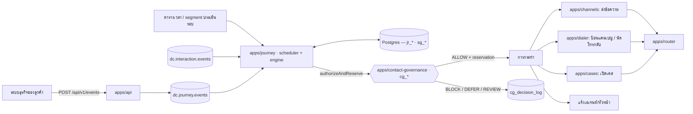

# D-Contact — Journey Orchestration (ชั้น CX automation)

> ตัดสินใจเชิงสถาปัตยกรรมอยู่ที่ [ADR-025](adr/025-journey-orchestration.md)

## 1. Journey คืออะไรในระบบนี้

**Journey = ลำดับการกระทำที่ผูกกับลูกค้าหนึ่งคน กินเวลาข้ามวัน และหยุดเมื่อบรรลุเป้าหมาย**

```
เหตุการณ์: จ่ายค่างวดไม่ผ่าน (ระบบบัญชีของลูกค้ายิงเข้ามาทาง API)
  วันที่ 0  09:00  ส่ง LINE แจ้งพร้อมลิงก์ชำระ           ← ยังไม่ใช้คน
  วันที่ 1  10:00  ยังไม่จ่าย → ส่ง SMS ย้ำ               ← ยังไม่ใช้คน
  วันที่ 3  14:00  ยังไม่จ่าย → ป้อนเข้าแคมเปญโทร (preview)  ← เริ่มใช้คน
  วันที่ 5         ยังไม่จ่าย → เปิดเคสให้ทีมติดตาม
  ทุกขั้น          จ่ายแล้ว → ออกจาก journey ทันที (goal)
```

สามอย่างที่ทำให้มันไม่ใช่ flow: **มีความจำข้ามวัน · เริ่มจากเหตุการณ์ไม่ใช่จากสาย ·
วัดผลด้วยผลลัพธ์ทางธุรกิจไม่ใช่ SLA**

| | Flow | Journey | Case |
|---|---|---|---|
| ผูกกับ | interaction | **contact** | เรื่องหนึ่งเรื่อง |
| ใครขับ | ลูกค้าที่ติดต่อเข้ามา | **ระบบ** | คนที่รับผิดชอบ |
| จบเมื่อ | งานเข้าคิว/ปิดสาย | **บรรลุ goal หรือหมดอายุ** | แก้ปัญหาจบ |

## 2. สถาปัตยกรรม



**`apps/journey` ไม่แตะ router และไม่สร้าง interaction เอง** ([ADR-025](adr/025-journey-orchestration.md) ข้อ 2)
ล้มทั้ง service ได้โดยการรับสายไม่กระทบ

## 3. Trigger 4 ชนิด

| ชนิด | ตัวอย่าง | มาจากไหน |
|---|---|---|
| **Event** | `payment.failed` · `order.shipped` · `subscription.expiring` | `POST /api/v1/events` หรือ webhook ของระบบลูกค้า |
| **Schedule** | ทุกวัน 09:00 · วันที่ 1 ของเดือน | ตัวจับเวลาใน journey engine |
| **Segment entry** | เข้ากลุ่ม "VIP ที่ยังไม่ต่ออายุใน 30 วัน" | ประเมิน segment ตามรอบ |
| **Interaction outcome** | CSAT ≤ 2 · disposition = "ขอยกเลิกบริการ" · สายที่ abandon | `dc.interaction.events` |

ชนิดสุดท้ายคือสะพานที่ทำให้ CCaaS กับ CXA เป็นระบบเดียวกันจริง — สิ่งที่เกิดในสายกลายเป็นจุดเริ่มของ
การติดตามอัตโนมัติ (closed loop ของ [feedback](feedback-survey.md) เป็นเคสแรกที่เราออกแบบไว้แล้ว)

## 4. การกระทำที่ journey สั่งได้

| การกระทำ | สั่งผ่าน | หมายเหตุ |
|---|---|---|
| ส่งข้อความ (LINE/SMS/WA/อีเมล) | `apps/channels` | ผ่าน contact policy เสมอ |
| ป้อนเข้าแคมเปญโทร | `apps/dialer` | ใช้ pacing/DNC ของแคมเปญนั้น |
| นัดโทรกลับ | `apps/dialer` | |
| เปิดเคส | `apps/cases` | พร้อมประเภท/เจ้าของ/SLA |
| ส่งแบบสำรวจ | `apps/qm` (fb_*) | นับใน `surveyInvitesPerMonth` |
| แจ้งเอเจนต์/หัวหน้า | แชทภายใน ([ADR-022](adr/022-internal-collaboration.md)) | |
| เรียก API ภายนอก | `int_connections` | ใช้ตัวเชื่อมเดียวกับ flow |
| รอ / แตกกิ่ง / ออก | engine เอง | เงื่อนไขใช้ `expression` sandbox เดิม |

**ไม่มีการกระทำ "สร้าง interaction"** — ถ้าอยากได้สายให้ป้อนแคมเปญ ถ้าอยากได้งานให้เปิดเคส

**ทุกการกระทำมี `actionKey` ที่คงที่: `enrollmentId:journeyVersion:stepId`**
ส่งต่อไปเป็น `clientToken` ของ [ADR-024](adr/024-message-delivery-media.md) ตรง ๆ —
engine ที่รันขั้นเดิมซ้ำ (worker restart · Kafka redeliver) จึงไม่ทำให้ลูกค้าได้ข้อความสองครั้ง
และมันคือคีย์ที่ใช้ **ยกเลิกงานที่ค้างอยู่** เมื่อลูกค้าบรรลุเป้าหมายก่อนเวลา (§5.2)

## 5. เชื่อม Contact Governance — ตรวจและจองสิทธิ์พร้อมกัน

Journey เป็นผู้ใช้ [Contact Governance](contact-governance.md) ไม่ได้เป็นเจ้าของ DNC, consent,
preference, frequency policy หรือ reservation เอง ค่าเริ่มต้นด้านล่างเป็น policy template ที่ Journey แนะนำ
แต่ถูกจัดเก็บและ version โดย Contact Governance

```
เพดานต่อลูกค้าหนึ่งคน (ค่าเริ่มต้น)
  <= 1 ครั้ง/วัน · <= 3 ครั้ง/สัปดาห์ · เว้นระยะขั้นต่ำ 20 ชั่วโมง
  ช่องทางที่ยอมรับ = ตาม consent ที่บันทึกไว้
  ยกเว้นได้: ข้อความ "ธุรกรรม" (OTP · ยืนยันนัด · แจ้งผลที่ลูกค้าขอเอง)
```

### 5.1 ลำดับด่าน — สามชั้น ห้ามสลับ

ทุกโมดูลที่ติดต่อลูกค้าขาออก (journey · แคมเปญ · broadcast · คำเชิญทำแบบสำรวจ) ใช้ลำดับนี้เหมือนกัน:

```
1. Contact Governance       ← restriction/consent/preference/เวลา/Attempt/Touch
2. กฎเฉพาะโมดูล            ← survey เว้น 30 วัน · retry rule ของแคมเปญ · maxTurns ของบอต
3. authorize + reserve       ← คำสั่งเดียวของ Contact Governance; ห้าม check-then-act
```

**รหัสเหตุผลต้องแยกกันคนละชั้น** — ไม่งั้น `suppressionRate` จะปนกันระหว่าง *"เราเลือกไม่ถาม"*
(ชั้น 2) กับ *"โควตาเต็ม"* (ชั้น 3) ซึ่งนำไปสู่การตัดสินใจคนละแบบโดยสิ้นเชิง

### 5.2 `authorizeAndReserve()` — ตรวจกับจองต้องเป็นก้าวเดียวกัน

การ "ตรวจแล้วค่อยส่ง" (check-then-act) พังเมื่อมีผู้เรียกพร้อมกัน — journey สองตัวกับแคมเปญหนึ่งตัว
อ่านพร้อมกันว่า *"สัปดาห์นี้ใช้ไป 2 จาก 3"* แล้วทั้งสามส่ง ลูกค้าได้ 5 ครั้งในวันเดียว
เป็นบั๊กชนิดเดียวกับที่ [ADR-024](adr/024-message-delivery-media.md) ข้อ 3 แก้ไว้ในกล่องส่งข้อความ

```sql
-- ทำในทรานแซกชันเดียว · ล็อกต่อ "ลูกค้าหนึ่งคน" ไม่ใช่ทั้งตาราง
SELECT pg_advisory_xact_lock(hashtext($tenantId || ':' || $contactId));
-- นับเฉพาะรายการที่ยัง "มีผล": ส่งสำเร็จแล้ว + ที่จองไว้และยังไม่หมดอายุ
SELECT count(*) FROM cg_reservation
 WHERE contact_id = $contactId AND purpose = 'MARKETING'
   AND (state = 'CONFIRMED' OR (state = 'RESERVED' AND expires_at > now()))
   AND created_at > now() - interval '7 days';
-- ผ่านเกณฑ์ → จองทันทีในทรานแซกชันเดียวกัน
INSERT INTO cg_reservation (id, tenant_id, contact_id, channel, purpose, source, source_id,
                            action_key, state, expires_at, created_at)
VALUES ($id, $tenantId, $contactId, $channel, $purpose, 'JOURNEY', $journeyId,
        $actionKey, 'RESERVED', now() + interval '15 minutes', now());
```

| ขั้น | เกิดอะไร |
|---|---|
| `RESERVED` | จองแล้ว ยังไม่ส่ง — **มีอายุ 15 นาที** |
| `CONFIRMED` | ส่งสำเร็จ (provider รับแล้ว) → กินโควตาจริง |
| `RELEASED` | ยกเลิกก่อนส่ง หรือหมดอายุเพราะ worker ตาย → **คืนโควตา** |
| `REFUNDED` | ส่งแล้วแต่จบเป็น `FAILED` ตาม [ADR-024](adr/024-message-delivery-media.md) → **คืนโควตา** |

สองแถวล่างคือส่วนที่ลืมกันบ่อยที่สุด: **worker ตายหลังจองแต่ก่อนส่ง** จะกินโควตาของลูกค้าถาวร
โดยที่เขาไม่เคยได้รับอะไร และ **ข้อความที่ retry จนครบแล้วล้มเหลว** ก็ไม่ควรกินเพดานสัปดาห์เช่นกัน

**ไม่มีทางลัด** — ทุกโมดูลต้องมี `reservationId` ก่อนถึงจะสั่งส่งได้ ปลายทาง (`apps/channels` /
`apps/dialer`) **ปฏิเสธคำสั่งที่ไม่มี `reservationId` ที่ยัง `RESERVED`** ไม่ใช่แค่เชื่อว่าผู้เรียกตรวจมาแล้ว

### 5.3 ยกเลิกงานที่ค้างเมื่อบรรลุเป้าหมายก่อนเวลา

ลูกค้าจ่ายเงินตอน 09:00 แต่ SMS ทวงถูกคิวไว้ตั้งแต่ 08:59 — ถ้าไม่ยกเลิก ข้อความจะออกไปหลังจบเป้าหมาย

| งานค้างอยู่ที่ | ยกเลิกยังไง |
|---|---|
| ข้อความสถานะ `QUEUED` | ยกเลิกตาม `actionKey` → ปล่อยการจอง (`RELEASED`) |
| record ที่ป้อนแคมเปญแล้วแต่ยังไม่โทร | ถอนออกจากรายการ (`ob_record.status = SUPPRESSED`) |
| **สายที่กำลังดัง / เอเจนต์กำลังคุยอยู่** | **ยกเลิกไม่ได้** → ดันข้อมูลขึ้นจอเอเจนต์ทันทีว่า *"ลูกค้าจ่ายแล้วเมื่อ 2 นาทีที่แล้ว"* |

แถวสุดท้ายเป็นข้อกำหนดของ **หน้า workspace** ไม่ใช่ของ journey engine — และเป็นเหตุผลว่าทำไม
agent ต้องเห็นสถานะ journey ของลูกค้าในแผงข้อมูล (§8)
สิ่งที่หน้าจอต้องมี (ทำไว้แล้วใน `mockups/workspace.html` — `#sw-goal-alert` และ `#sw-journey`):

| ส่วน | ต้องบอกอะไร |
|---|---|
| แถบเตือนเหนือบทสนทนา | เป้าหมายสำเร็จเมื่อไร · เหตุการณ์อะไร (`payment.succeeded`) · **สายนี้มาจากลำดับไหน** · บอกตรง ๆ ว่ายกเลิกไม่ได้และขั้นที่เหลือถูกหยุดแล้ว · แนะบทสนทนาใหม่ ("ยืนยันการชำระ ไม่ใช่ทวงถาม") |
| ปุ่มรับทราบ | เอเจนต์ยืนยันว่าแจ้งลูกค้าแล้ว → บันทึกลง interaction (ใช้ตรวจย้อนหลังว่าลูกค้าถูกทวงทั้งที่จ่ายแล้วกี่ครั้ง) |
| การ์ดลำดับในแผงลูกค้า | ลำดับ · ขั้นที่ · เป้าหมาย · **การกระทำถัดไปและเวลา** · ปุ่มระงับลำดับ 24 ชม. ระหว่างที่คนกำลังดูแล |

ปุ่ม "ระงับ 24 ชม." กันเคสที่พบบ่อยกว่าเคสบรรลุเป้าหมาย: เอเจนต์กำลังคุยเรื่องเดียวกันอยู่
แล้วลำดับส่ง SMS เรื่องเดิมซ้ำเข้าไป

**ก่อนยิงจริงต้องตรวจ enrollment อีกครั้ง** — ระหว่างที่ข้อความรออยู่ในคิว ลูกค้าอาจบรรลุเป้าหมายไปแล้ว
การตรวจตอนสร้างคำสั่งอย่างเดียวไม่พอ

### 5.4 กฎอื่นที่ยังใช้เหมือนเดิม

| กฎ | เหตุผล |
|---|---|
| ทุกช่องทางขาออกผ่านด่านนี้ — journey · แคมเปญ · broadcast · survey invite | ถ้าเว้นทางใดทางหนึ่ง เพดานจะไร้ความหมายทันที |
| ถูกกดแล้วต้อง**บันทึกเหตุผล**และนับเป็นตัวเลข `suppressionRate` | ถ้าเงียบ ทีมจะไม่รู้ว่า journey ที่ตั้งไว้ไม่เคยส่งจริง |
| ข้อความธุรกรรมยกเว้นได้ แต่ต้อง**ประกาศชนิดตอนสั่ง** ไม่ใช่ติ๊กทีหลัง | ไม่งั้นทุกข้อความจะกลายเป็น "ธุรกรรม" ภายในหนึ่งเดือน |
| ลูกค้าถอนความยินยอม → มีผลทุก journey ทันที | ใช้ `cg_consent`/`cg_restriction` ชุดกลาง |

## 6. Data model

```prisma
model jr_journey    { id String @id  tenantId String  name String  status String // DRAFT|PUBLISHED|PAUSED|ARCHIVED
                      version Int
                      ownerTeamId String? // ทีมเจ้าของ ต้องมี CONTACT scope กับ audience segment
                      trigger Json      // { kind:"EVENT"|"SCHEDULE"|"SEGMENT"|"INTERACTION", ... }
                      audience Json     // segmentId + เงื่อนไขเพิ่มเติม
                      graph Json        // steps[]/edges[] — โครงเดียวกับ flow (ADR-021 expression)
                      goal Json         // { kind:"EVENT", event:"payment.succeeded" } — บังคับมี
                      exitRules Json    // ออกเมื่อ goal · ลูกค้าตอบกลับ · เข้า journey ที่ priority สูงกว่า
                      maxDurationDays Int @default(30)   // เพดานอายุ บังคับมี
                      priority Int  publishedAt DateTime? }

model jr_enrollment { id String @id  tenantId String  journeyId String  journeyVersion Int
                      contactId String  state String   // ACTIVE|WAITING|COMPLETED|EXITED|SUPPRESSED|FAILED
                      currentStepId String?  waitUntil DateTime?
                      enrolledAt DateTime  enrolledReason Json   // snapshot ว่าทำไมถึงเข้า (PDPA)
                      goalReachedAt DateTime?  exitReason String?
                      @@unique([journeyId, contactId, enrolledAt]) }

model jr_step_log   { id String @id  enrollmentId String  stepId String  action String
                      result String   // DONE|SUPPRESSED|FAILED|SKIPPED
                      detail Json  at DateTime }

model sg_segment    { id String @id  tenantId String  name String
                      definition Json   // เงื่อนไขบน attribute + เหตุการณ์ + ประวัติ interaction
                      refreshMinutes Int @default(60)  size Int  lastEvaluatedAt DateTime? }

/// event inbox — ทางเข้าของเหตุการณ์จากระบบธุรกิจ (ADR-025 · packages/shared InboundBusinessEvent)
model jr_event_inbox { id String @id  tenantId String  source String  eventId String
                       type String  schemaVersion Int  occurredAt DateTime  receivedAt DateTime
                       contactRef Json  payload Json  processedAt DateTime?  error String?
                       @@unique([tenantId, source, eventId]) }   // API retry ไม่ทำให้ enroll ซ้ำ
```

`cg_decision_log` และ `cg_attempt` ของ Contact Governance ตอบคำถาม
**"เดือนนี้เราไปรบกวนลูกค้าคนนี้กี่ครั้ง เรื่องอะไร และเหตุใดจึงอนุญาต"** โดยไม่สร้าง log ซ้ำใน Journey

Journey ที่ส่งออกต้องผูก `ownerTeamId` กับ audience segment ที่เลือก เมื่อ publish และก่อน execute action
Contact Governance ตรวจ `team_segment_scope` กับ membership ปัจจุบันของ CIF เช่น Team A/C ใช้ `LOND` และ
Team D ใช้ `CARD`; ถ้าไม่ผ่านให้ปฏิเสธด้วย `403 TEAM_SEGMENT_NOT_ALLOWED` ก่อนเข้าด่าน consent/DNC

## 7. ตัววัด

| ตัวชี้วัด | ทำไมสำคัญ |
|---|---|
| **Goal conversion ต่อ journey** | เป็นตัวเดียวที่บอกว่า journey มีประโยชน์หรือแค่รบกวน |
| **สายที่ไม่เกิด (deflected)** | คุณค่าหลักของ CXA — เทียบปริมาณสายในกลุ่มที่อยู่ใน journey กับกลุ่มควบคุม |
| **Suppression rate (แยกตามชั้น)** | ชั้น 2 = เราเลือกไม่ติดต่อ · ชั้น 3 = โควตาเต็ม — **สองอย่างนี้ห้ามรวมเป็นตัวเลขเดียว** เพราะนำไปสู่การแก้คนละแบบ |
| **Time to goal** | สั้นลงเรื่อย ๆ คือสัญญาณว่าออกแบบถูกทาง |
| **Opt-out rate ต่อ journey** | ตัวเตือนว่าเรากำลังไล่ลูกค้าออกด้วยความอัตโนมัติ |

**ต้องมีกลุ่มควบคุม (holdout) ตั้งแต่วันแรก** — สุ่มกัน 5% ไม่ให้เข้า journey เพื่อวัดผลจริง
ไม่งั้นเราจะเถียงกันตลอดว่าตัวเลขที่ดีขึ้นมาจาก journey หรือมาจากฤดูกาล

## 8. สิทธิ์

| ทำได้ | ADMIN | SUPERVISOR | MARKETING/CX | AGENT |
|---|---|---|---|---|
| สร้าง/แก้ journey | ✓ | — | ✓ | — |
| publish journey | ✓ | — | ✓ (ต้องมีคนที่สองอนุมัติ) | — |
| แก้ contact policy | ✓ | — | — | — |
| ดูว่าลูกค้าคนนี้อยู่ใน journey ไหน | ✓ | ✓ | ✓ | ✓ (ในโปรไฟล์ลูกค้า) |
| ดึงลูกค้าออกจาก journey | ✓ | ✓ | ✓ | ✓ (พร้อมเหตุผล) |

**agent ต้องเห็นว่าลูกค้าที่กำลังคุยด้วยอยู่ใน journey อะไร** — ไม่งั้นจะเกิดสถานการณ์ที่ลูกค้าเพิ่งคุยจบ
แล้วได้ SMS ทวงถามในสิบนาทีถัดมา

## 9. UI (`mockups/journeys.html`)

| view | หน้าที่ |
|---|---|
| `journeys` | **list** journey + trigger + จำนวนที่กำลังอยู่ใน journey + goal conversion + สถานะ |
| `journey-form` | **new/edit**: trigger · กลุ่มเป้าหมาย · ขั้นตอน (ส่ง/รอ/แตกกิ่ง/เปิดเคส/ป้อนแคมเปญ) · goal · เงื่อนไขออก · เพดานอายุ |
| `segments` / `segment-form` | **list/new/edit** กลุ่มเป้าหมาย + ขนาดกลุ่ม + รอบการประเมิน |
| `contact-governance` | ลิงก์ไปโมดูลกลางเพื่อดู policy, restriction, reservation และเหตุผลที่ action ถูกกด |
| `journey-insights` | goal conversion · สายที่ไม่เกิด (เทียบกลุ่มควบคุม) · opt-out · suppression |

## 10. แผนเฟส

| เฟส | ได้อะไร |
|---|---|
| **J1** | **event inbox** (`POST /api/v1/events` + unique `(tenantId, source, eventId)`) → `apps/journey` + trigger event/schedule + ขั้นตอน ส่งข้อความ/รอ/แตกกิ่ง + goal/exit + **`authorizeAndReserve()` พร้อม TTL/คืนโควตา** + `actionKey` + การยกเลิก |
| **J2** | trigger จากผลของ interaction (ต่อ closed loop ของ CSAT ที่มีอยู่) + เปิดเคส + ป้อนแคมเปญ |
| **J3** | segment + attribute ของลูกค้า ([customer-360](customer-360.md)) + trigger แบบ segment entry |
| **J4** | holdout + journey insights + วัด "สายที่ไม่เกิด" |
| **J5** | ตัวสร้าง journey แบบลากวาง (ใช้ canvas ตัวเดียวกับ Flow Designer) + เทมเพลตสำเร็จรูป |

## 11. ความเสี่ยง

| ความเสี่ยง | ทางรับมือ |
|---|---|
| **กลายเป็นเครื่องสแปม** | contact policy เป็นด่านบังคับของทุกช่องทาง + opt-out rate ต่อ journey + เพดานอายุ |
| หลายโมดูลตรวจเพดานพร้อมกันแล้วส่งครบทุกตัว | `authorizeAndReserve()` เป็นก้าวเดียว + ปลายทางปฏิเสธคำสั่งที่ไม่มี `reservationId` (§5.2) |
| จองแล้วไม่ได้ส่ง → โควตาลูกค้าหายถาวร | การจองมีอายุ 15 นาที + คืนโควตาเมื่อข้อความจบเป็น `FAILED` |
| ส่งข้อความทวงหลังลูกค้าจ่ายแล้ว | ยกเลิกตาม `actionKey` + ตรวจ enrollment ซ้ำก่อนยิง + ถ้าสายกำลังคุยอยู่ให้ดันข้อมูลขึ้นจอเอเจนต์ (§5.3) |
| journey ทับกันเอง | priority + เงื่อนไข "ออกเมื่อเข้า journey ที่สำคัญกว่า" + suppression rate ที่มองเห็นได้ |
| ลูกค้าเพิ่งคุยกับเราแล้วได้ข้อความอัตโนมัติ | ทุก journey มีเงื่อนไขหยุดเมื่อมี interaction สด + agent เห็น journey ในโปรไฟล์ |
| วัดผลไม่ได้ว่าคุ้มไหม | holdout 5% ตั้งแต่วันแรก ไม่ใช่ค่อยเพิ่ม |
| เคลมเกินเป็น marketing automation | ขอบเขตเขียนไว้ใน [ADR-025](adr/025-journey-orchestration.md) ข้อ 8 และในหน้าเว็บขาย |
| PDPA: ลูกค้าถามว่าทำไมได้ข้อความนี้ | `enrolledReason` snapshot + `cg_decision_log` ตอบได้ทุกครั้ง |

## รายงานที่โมดูลนี้เป็นเจ้าของ

`jr.goal.conversion` · `jr.deflected` · `jr.suppression` · `jr.optout` · `jr.time.to.goal` · `cp.quota` · `cp.reservation`

รายละเอียดของแต่ละใบ (dataset · grain · มิติบังคับ · entitlement · ชั้น · drill-down · เฟส) อยู่ที่
[reporting-data-platform §7.12](reporting-data-platform.md) ซึ่งเป็น**แหล่งความจริงเดียว** —
ใบใหม่ต้องไปลงทะเบียนที่นั่นก่อน ห้ามตั้งใบรายงานขึ้นเองในโมดูล

`jr.deflected` วัดกับกลุ่ม holdout เท่านั้น และ `jr.suppression` **ห้ามรวมชั้น 2 กับชั้น 3 เป็นตัวเลขเดียว** ตาม §5 — สองอย่างนี้นำไปสู่การแก้คนละแบบ

## เอกสารเกี่ยวข้อง

[ADR-025](adr/025-journey-orchestration.md) · [outbound-campaign.md](outbound-campaign.md) ·
[customer-360.md](customer-360.md) · [feedback-survey.md](feedback-survey.md) ·
[integration-platform.md](integration-platform.md)
