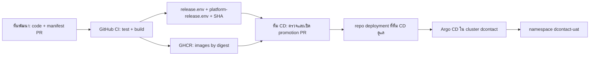

# CI/CD สำหรับ K8s UAT เมื่อทีมพัฒนาไม่มี kubeconfig

สถานะ: **ข้อเสนอออกแบบสำหรับทีม CD, ยังไม่ติดตั้ง Argo CD และยังไม่ deploy** (#625, PR #629). Owner ยืนยัน 2026-10-07 ว่าทีมพัฒนาไม่มีสิทธิ์เก็บ kubeconfig, cluster ยังไม่มี GitOps controller และยังไม่ได้เลือก secret manager. เลือก Argo CD เป็นค่าเริ่มต้นของ CD; ทีม CD เป็นผู้ติดตั้งและถือสิทธิ์ cluster.

## ขอบเขตความรับผิดชอบ

| ผู้รับผิดชอบ | ทำได้ | ไม่มีสิทธิ์/ไม่ถือ |
| --- | --- | --- |
| ทีมพัฒนา | แก้ source/manifest template, เปิด PR, ดูผล CI และสถานะ deploy แบบ read-only | kubeconfig, cluster token, DB/TLS/S3 password, สิทธิ์ Sync หรือแก้ repo deployment โดยลำพัง |
| GitHub CI ของ app repo | lint/test/render แบบ offline, build/push image ไป GHCR, ออก SHA + digest ของ release | Kubernetes/Argo CD credential, network access ไป private K8s API/DB, secret จริง |
| ทีม CD | ติดตั้ง Argo CD, bootstrap namespace/RBAC, เก็บ credential, สร้าง promotion PR, อนุมัติและสั่ง Sync, รัน one-shot Job, เก็บ deployment record/rollback | ไม่แก้ source image หลัง build; promote เฉพาะ digest ที่ตรวจกลับถึง CI run ได้ |
| Argo CD | อ่าน repo deployment แล้ว apply เฉพาะ resource ใน `dcontact-uat` ตามสิทธิ์ที่ CD กำหนด | ไม่ build image, ไม่รับ credential จากเครื่องนักพัฒนา, ไม่รัน one-shot Job อัตโนมัติ |

ทีม CD อาจมี kubeconfig สำหรับ bootstrap/break-glass ในระบบของทีมเองเท่านั้น. **ไม่มี path kubeconfig ที่ทีมพัฒนาต้องสร้างหรือรับส่ง**. GitHub Actions ของ app repo ไม่ต้องมี `KUBECONFIG`, Kubernetes API token หรือ Argo CD token. Argo CD ที่รันใน cluster ใช้ service account ของตน; ทีม CD จำกัด Kubernetes RBAC และสร้าง `AppProject` ที่อนุญาต source repo กับ destination `dcontact-uat` เท่านั้น. `AppProject` เป็นอีกชั้นของ policy และไม่ทดแทน Kubernetes RBAC.

## เส้นทาง CI → Promotion → CD

1. **PR ทีมพัฒนา:** CI ตรวจ lint, test, `k8s-uat-render.test.mjs` และ local Kustomize render. คำสั่งตรวจแบบ offline ไม่มี kubeconfig. ไม่มี deploy จาก PR หรือ push เข้า branch ใด.
2. **หลัง merge `main`:** workflow `k8s-uat-images` แบบ `workflow_dispatch` build Tenant API/ops/Console, Platform API/Console และ Keycloak จาก full `SOURCE_SHA` เดียว, push ไป GHCR แล้วออก `release.env` + `platform-release.env` ที่อ้าง `@sha256`. การกด Build ไม่เท่ากับการอนุมัติ deploy.
3. **ทีม CD ตรวจ release:** เลือก CI run บน commit ที่ merge แล้ว, ตรวจ CI pass, full SHA ของ release files ตรงกัน, image digest ทุกตัวอยู่ใน GHCR/architecture ที่ worker รองรับ และ build-time OIDC origin ถูกต้อง. Artifact ใน GitHub อยู่ 30 วัน; commit digest และ SHA ลง repo deployment เป็น record ระยะยาวหลัง promote.
4. **Promotion PR ใน repo ที่ทีม CD ดูแล:** ชื่อเสนอ `dcontact-deploy` (ยังไม่สร้าง), path `clusters/dcontact/dcontact-uat/`. ทีม CD ใช้ `scripts/k8s-uat-render.mjs` จาก source SHA ที่เลือกกับ release files และ StorageClass จริง สร้าง YAML ที่แทน placeholder แล้วเก็บแยก `foundation/`, `applications/`, `exposure/`. เพิ่ม `SealedSecret` ใน `foundation/` หลัง controller พร้อมใช้งาน. PR แสดง exact diff รวม image digest, host, TLS Secret และ DB endpoint; ไม่มี secret plaintext. ตั้ง branch protection/CODEOWNERS ให้ผู้อนุมัติเป็นทีม CD และผู้รับผิดชอบ UAT; ห้าม merge promotion โดยผู้เปิด PR คนเดียว.
5. **CD Sync:** Argo CD ติดตาม repo deployment จากใน cluster. แยก 3 Applications: `dcontact-uat-foundation`, `dcontact-uat-applications`, `dcontact-uat-exposure`; destination ทุกตัวคือ `dcontact-uat`. รอบแรก **manual Sync**, ปิด auto-prune/self-heal จนทีม CD ซ้อม rollback. `exposure` Sync หลัง private smoke ผ่านเท่านั้น. ไม่ให้ app repo หรือ CI ส่งคำสั่ง Sync ไป Argo CD.

ConfigMap ของ Caddy ใช้ Kustomize hash ในชื่อ; เมื่อเนื้อหา route เปลี่ยน ชื่อที่ Deployment อ้างจะเปลี่ยนและทำให้ pod rollout ตาม promotion commit. ทีม CD ต้องตรวจ diff ของ route ทุกครั้งก่อน Sync.

`infra/k8s/uat/bootstrap/namespace.yaml` เป็นของทีม CD ใช้ครั้งเดียวเพื่อสร้าง namespace ก่อน Applications; ไม่อยู่ใน `foundation` ที่ Argo CD ดูแล. ทีม CD ติดตั้ง Argo CD, Sealed Secrets controller/CRD, `AppProject`, RBAC และ repository credential ด้วยสิทธิ์ bootstrap ของตน. `AppProject` ต้องอนุญาต resource `SealedSecret` ใน namespace นี้ และ Application `foundation` ต้อง Sync จน Secret ที่สร้างจาก ciphertext พร้อม ก่อน Sync `applications`. แนวนี้ทำให้ Application ปกติไม่ต้องสร้าง resource ระดับ cluster.

## Secret เมื่อยังไม่มี secret manager

สำหรับ UAT ใหม่นี้เสนอ **Sealed Secrets** เป็นค่าเริ่มต้นที่ไม่ต้องเปิดบริการ Vault เพิ่ม: ทีม CD รับค่าจริงจาก DB/TLS/ผู้ดูแลระบบผ่านช่องทางลับของทีม, seal ด้วย public certificate ของ controller แบบ **strict scope** (`dcontact-uat` + ชื่อ Secret ตรงกับ contract), แล้วเก็บเฉพาะ `SealedSecret` ciphertext ใน repo deployment. Controller ใน cluster สร้าง Kubernetes Secret ที่ pod ใช้. ทีมพัฒนาไม่ได้รับไฟล์ plaintext หรือ private key. ทีม CD ต้องสำรอง private key ของ controller นอก clusterอย่างปลอดภัยและซ้อม restore; ถ้าคีย์หายจะ unseal จาก Git ไม่ได้. ห้าม seal แบบ cluster-wide โดยไม่จำเป็น.

ก่อน deploy จริง ทีม CD ต้องเลือก/อนุมัติวิธีเก็บ **ต้นฉบับ credential และ backup private key** ที่องค์กรยอมรับ; Sealed Secrets ไม่ใช่คลังรหัสผ่านสำหรับกู้คืนค่าต้นฉบับ. เปิด Kubernetes Secret encryption at rest, จำกัด RBAC อ่าน Secret, ทดสอบ rotate DB/GHCR/TLS/S3 credential และตรวจว่า Secret ทุกชื่อ/key ใน [runbook](k8s-uat-deployment.md) ถูกสร้างครบ. หากทีม CD มี Vault/secret manager ภายหลัง สามารถเปลี่ยนชั้นนี้เป็น External Secrets Operator โดยคงชื่อ/key ของ Kubernetes Secret เดิม; ไม่ต้องเปลี่ยน Deployment.

## งาน one-shot และลำดับเปิดรับผู้ทดสอบ

Jobs ใน `infra/k8s/uat/jobs/` **ไม่อยู่ใน path ที่ Argo CD ติดตาม**. ทีม CD ใช้ขั้นตอน run-once ที่มีการอนุมัติ/บันทึกผล แยกจาก sync ปกติ: backup/preflight DB → migrate/RLS → RustFS bucket/IAM/lifecycle → Keycloak config → catalog/tenant/users/operator → applications → private smoke → exposure. ต้องตรวจ Job `Complete` และ negative tests ก่อนผ่านขั้นถัดไป. ห้ามใส่ migration/provision เป็น `PreSync` ของ Applications เพราะ hook อาจรันซ้ำทุก Sync; selective sync ก็ไม่รัน hook. การเปลี่ยน schema ต้องตรวจ compatibility กับ image ก่อน promote และมีแผน restore DB เมื่อ rollback image ไม่พอ.

ทีม CD ทำ smoke/rollback ผ่าน Argo CD และเครื่องมือที่ทีม CD ควบคุม. ทีมพัฒนาดู deployment record และผลทดสอบได้โดยไม่ต้องมีสิทธิ์ cluster. บันทึกอย่างน้อย source SHA, six app image digests, Git commit ของ repo deployment, Argo revision/sync result, Job result, TLS/DNS/DB/S3 gate, เวลาและผู้อนุมัติ. Rollback แอปคือ PR ย้อน digest แล้ว Sync; การคืน schema/PVC ต้องใช้แผน backup ของทีม DB/CD.

## สิ่งที่ทีม CD ต้องส่งกลับก่อนเปิดใช้งาน

- ยืนยันว่า Argo CD รันใน cluster `dcontact`, รูปแบบ repo deployment, AppProject/RBAC, ผู้อนุมัติ promotion และวิธีให้ทีมพัฒนาดูสถานะแบบ read-only.
- ยืนยัน Sealed Secrets หรือ secret manager ทางเลือก, เจ้าของ/backup key, ช่องทางรับค่า DB/TLS/S3/GHCR และกติกา rotation. ไม่มี plaintext secret ใน GitHub PR, Actions log หรือ artifact.
- ชื่อ StorageClass, public IP/VIP/NAT ของ worker, Traefik entrypoint/TLS, GHCR pull access, DB egress IP/TLS/firewall และผล preflight ตาม runbook.
- ตกลงว่าจะเปิด auto-sync ในอนาคตหรือคง manual Sync; `exposure` และ one-shot Jobs ต้องมี gate ของทีม CD เสมอ.

## อ้างอิงการออกแบบ

- [Argo CD automated sync](https://argo-cd.readthedocs.io/en/stable/user-guide/auto_sync/), [AppProject](https://argo-cd.readthedocs.io/en/stable/user-guide/projects/) และ [Sync phases/hooks](https://argo-cd.readthedocs.io/en/stable/user-guide/sync-waves/)
- [Sealed Secrets](https://github.com/bitnami/sealed-secrets), [GitHub artifact attestations](https://docs.github.com/en/actions/how-tos/secure-your-work/use-artifact-attestations/use-artifact-attestations) สำหรับการเพิ่ม provenance verification ในระยะถัดไป
