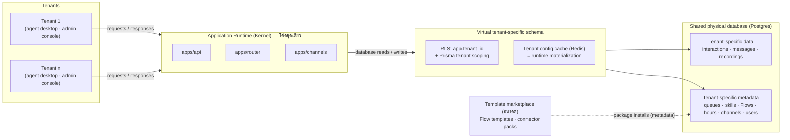

# D-Contact — สถาปัตยกรรม Multi-tenant (Metadata-Driven)

> เอกสารประกอบ [ADR-005](adr/005-multitenant-metadata-architecture.md) — ออกแบบตามต้นแบบ
> Salesforce Platform (multitenant, metadata-driven) · สถานะ: **แผน** · อัปเดต 2026-07-15

## 1. หลักการ

ทุก tenant ใช้ **runtime ชุดเดียว + database ชุดเดียว** สิ่งที่ทำให้ acme.d-contact.io
ต่างจาก demo.d-contact.io ไม่ใช่โค้ดหรือ schema — แต่คือ **metadata** ที่ kernel อ่านตอน
runtime แล้วประกอบร่างประสบการณ์ของ tenant นั้นขึ้นมา

## 2. เทียบแนวคิด Salesforce ↔ D-Contact

| Salesforce | D-Contact | สถานะ |
|---|---|---|
| Application Runtime (Kernel) | `apps/api` + `apps/router` + `apps/channels` (+ telephony/asterisk gateways, [ADR-006](adr/006-multi-vendor-telephony-gateway.md)) — stateless, deployment เดียว serve ทุก tenant | มีแล้ว (Phase 0) |
| Virtual tenant-specific schema | RLS (`app.tenant_id`) + service-layer scoping — ไม่มี schema จริงต่อ tenant | rls.sql มีแล้ว, การ engage จริงอยู่ใน iam-architecture §11 |
| Shared physical database | Postgres เดียว shared schema ทุกตารางมี `tenant_id` | มีแล้ว |
| Tenant-specific **data** | interactions, messages, recordings, contacts, agent state log | มีแล้ว |
| Tenant-specific **metadata** | tenants, users, teams, queues, skills, channel accounts, business hours, Flows, wrap-up codes | บางส่วนมีแล้ว (ดู §3) |
| Runtime materialization | tenant config cache ใน Redis + invalidation ผ่าน Kafka (§4) | ออกแบบแล้ว ยังไม่ implement |
| Metadata จาก AppExchange | template marketplace: Flow templates, connector packs, report packs | roadmap ไกล |
| Multitenant kernel reads metadata per request | router อ่าน queue/skill/hours config ตอนตัดสินใจ routing ทุกครั้ง (ผ่าน cache) | Phase 1 |

## 3. Catalog: อะไรคือ metadata อะไรคือ data

จาก `packages/db/prisma/schema.prisma` ปัจจุบัน:

| ประเภท | ตาราง | ลักษณะ |
|---|---|---|
| **Tenant metadata** (config — เปลี่ยนพฤติกรรมระบบ, แก้ผ่าน admin console, ต้อง invalidate cache) | `tenants`, `users`, `teams`, `queues`, `skills`, `agent_skills`, `queue_skills` | เขียนน้อย อ่านบ่อยมาก (ทุก routing decision) |
| **Tenant metadata (จะเพิ่มใน Phase 1+)** | business hours/holidays, **Flows/FlowVersions** ([flow-engine.md](flow-engine.md)), channel accounts (LINE/FB/WA/email), voice numbers (DID), wrap-up codes, canned responses, `field_definitions` | ตามหน้า mockups: routing.html, integrations.html |
| **Tenant data** (ผลจากการใช้งาน — append-heavy, ไม่ cache) | `interactions`, `interaction_events`, `conversations`, `messages`, `recordings`, `contacts`, `contact_identities`, `agent_state_logs` | โตตาม traffic; เป็นฐาน billing/reporting |

กติกา: ตารางใหม่ทุกตารางต้องระบุตั้งแต่ออกแบบว่าเป็น metadata หรือ data
เพราะกำหนด 3 อย่าง: เข้า cache ไหม, ใครแก้ได้ (permission), และ retention

## 4. Runtime materialization — tenant config cache

ปัญหา: router ตัดสินใจ routing หลายร้อยครั้ง/วินาที ถ้าอ่าน queue/skill/hours จาก Postgres
ทุกครั้งจะเป็นคอขวด

การออกแบบ:

- **Cache key**: `tenant:<tenantId>:config` ใน Redis — snapshot ของ metadata ที่ routing
  ต้องใช้ (queues + skills + hours + overflow rules) โหลดแบบ lazy ครั้งแรกที่ tenant มี traffic
- **Invalidation**: ทุก mutation ของ metadata ผ่าน API → produce event ลง topic ใหม่
  **`dc.tenant.events`** (key = `tenantId`) → ทุก kernel instance consume แล้วลบ/รีเฟรช
  cache ของ tenant นั้น — แนวเดียวกับ ADR-003 (ไม่มี direct call ระหว่าง service)
- **TTL กันเหนียว**: 5 นาที — ถ้า invalidation event หายด้วยเหตุใดก็ตาม config ผิดได้ไม่เกิน TTL
- Admin console แก้ config → เห็นผลใน routing ภายใน ~1 วินาที (event round-trip)

## 5. Custom fields (เฟสอนาคต — ออกแบบไว้ก่อน)

แบบ Salesforce: ไม่ ALTER TABLE ต่อ tenant

- `field_definitions` (metadata): `tenant_id, entity ('contact'|'interaction'), key, label,
  type (text|number|date|select), options, required, position`
- คอลัมน์ `custom_fields JSONB` บน `contacts` และ `interactions` (+ GIN index เมื่อต้อง filter)
- Kernel validate ค่าตาม definition ตอนเขียน; UI (ฟอร์ม contact/wrap-up) render ฟอร์มจาก
  definitions — หน้าจอเดียวกัน render ต่างกันต่อ tenant ด้วย metadata ล้วน ๆ
- Reporting: expose custom fields ผ่าน view/computed columns เมื่อถึงเวลา

## 6. Tenant lifecycle

| ขั้น | สิ่งที่เกิด |
|---|---|
| **Provision** | insert `tenants` row → สร้าง Keycloak Organization + admin คนแรก ([iam-architecture §8](iam-architecture.md)) → seed metadata เริ่มต้น (คิว default, hours default) — เสร็จในวินาที |
| **Plan/entitlements** | **quota** (seats, voice minutes, WA conversations, storage) วัดจาก `dc.interaction.events` (ADR-003) — soft limit แจ้งเตือน / hard limit block การสร้าง · **entitlement** (โมดูลเปิด/ปิด เช่น `wfm.*`) ตรวจ synchronous ก่อนทำงานผ่าน guard จุดเดียว — สองอย่างนี้เป็นคนละกลไก ดู [ADR-009](adr/009-plan-entitlement-licensing.md) + [licensing.md](licensing.md) |
| **Suspend** | `tenants.status = suspended` → guard ปฏิเสธ token ของ tenant นั้น + ปิด Keycloak org; ข้อมูลคงอยู่ |
| **Export / delete (PDPA)** | export: dump ทุกตารางด้วย `tenant_id` filter + recordings จาก MinIO prefix; delete: ลบตามลำดับ FK + KC org — ทำเป็น job มี audit |

## 7. ชั้นการ isolate (defense in depth)

1. **Token**: `tenant_id` claim จาก Keycloak (ADR-004) — ผู้ใช้ปลอม tenant ไม่ได้
2. **Guard**: cross-check `tenant_slug` กับ subdomain ของ request
3. **Service layer**: ทุก query มี `where: { tenantId }` (แนวที่ใช้อยู่)
4. **RLS**: `SET LOCAL app.tenant_id` ต่อ transaction + ต่อ DB ด้วย role `NOBYPASSRLS`
   ใน production — ชั้นสุดท้ายที่จับ bug ของชั้น 3
5. **Event backbone**: `tenantId` ใน header/payload ทุก message (ADR-003) — billing แยกได้เสมอ

## 8. Noisy neighbor & scaling path

- **ตอนนี้**: Kafka partition by key กระจายโหลดตามธรรมชาติ; Redis/Postgres ยังไกลจาก limit
- **เมื่อโต**: rate limit ต่อ tenant ที่ API gateway → table partitioning by `tenant_id`
  (interactions/messages เป็นตารางแรก) → read replica สำหรับ reporting →
  แยก consumer group ต่อ tier ของ tenant
- **สุดทาง**: dedicated instance สำหรับลูกค้าที่จ่ายเรื่อง isolation (escape hatch ใน ADR-005)

## เอกสารเกี่ยวข้อง

- [ADR-005 — การตัดสินใจและทางเลือกที่ปัดตก](adr/005-multitenant-metadata-architecture.md)
- [ADR-004 / iam-architecture.md — identity ต่อ tenant (Keycloak Organizations)](iam-architecture.md)
- [ADR-003 — tenant isolation บน Kafka + billing จาก events](adr/003-kafka-event-backbone.md)
- Mockup ฝั่ง operator: `mockups/platform.html` (Platform Console — จัดการ tenants/plans/usage)
