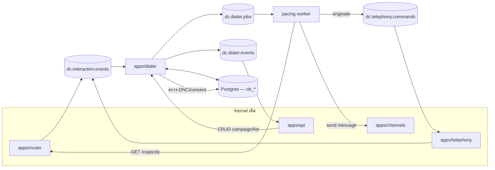

# D-Contact — Outbound, Campaign & Proactive Engagement

> ตัดสินใจเชิงสถาปัตยกรรมอยู่ที่ [ADR-011](adr/011-outbound-campaign.md) — เอกสารนี้คือรายละเอียดการทำงาน

## 1. Outbound คืออะไรในระบบนี้

inbound ตอบคำถาม *"ลูกค้าติดต่อมาแล้วใครรับ"* — outbound ตอบ *"เราต้องติดต่อใครต่อ และตอนนี้โทรได้กี่สาย"*

สามอย่างที่ต่างจาก inbound อย่างสิ้นเชิง และเป็นเหตุผลว่าทำไมต้องมี service แยก:

| ประเด็น | Inbound | Outbound |
|---|---|---|
| ใครเป็นคนเริ่ม | ลูกค้า — เรารับอย่างเดียว | เรา — เราเลือกได้ว่าจะโทรเมื่อไหร่ ถึงใคร |
| ข้อจำกัดทางกฎหมาย | น้อย | **มาก** — DNC, ความยินยอม, ช่วงเวลา, abandonment rate |
| ความเสี่ยงที่แก้ไม่ได้ | สายตก | **โทรหาคนที่ห้ามโทร** — เรียกคืนไม่ได้ ปรับได้ ฟ้องได้ |
| ตัวชี้วัดหลัก | SLA / abandon | contact rate, RPC, conversion, cost per contact |

**หลักการที่ทั้งโมดูลตั้งอยู่บน:** dialer ผลิต *งาน* ไม่ใช่ *สาย* — งานนั้นวิ่งเข้า
`apps/router` เป็น interaction ปกติตาม [ADR-001](adr/001-unified-interaction-model.md)
ทุกอย่างที่ต่ออยู่กับ interaction (recording, QM, adherence, รายงาน, billing) จึงได้มาฟรี

## 2. สถาปัตยกรรม



| Service | ภาษา | หน้าที่ | ลักษณะงาน |
|---|---|---|---|
| `apps/dialer` | TS / NestJS | CRUD campaign/list/DNC, import, disposition, callback, สถิติแคมเปญ | realtime + REST |
| `pacing worker` (โปรเซสเดียวกัน คนละ role) | TS | ลูป pacing ทุก 1 วินาที: ถามความจุ → เลือก record → ตรวจด่าน → สั่ง originate/ส่งข้อความ | ลูปถี่ ต้องเบา |

**ไม่มีภาษาที่สาม** — pacing เป็นสมการปิด ไม่ใช่ optimisation แบบ CP-SAT ใน
[ADR-008](adr/008-workforce-management.md)

### Topic ใหม่ 2 ตัว

| Topic | Key | ทิศทาง | ตัวอย่าง payload |
|---|---|---|---|
| `dc.dialer.jobs` | `jobId` | dialer → worker | `{kind:"IMPORT"\|"PACE"\|"RETRY_SWEEP"\|"PURGE", tenantId, campaignId, opts}` |
| `dc.dialer.events` | `tenantId` | dialer → api (WS fan-out) | `{type:"campaign.started"\|"record.attempted"\|"record.connected"\|"campaign.paused.compliance"\|"pacing.throttled", ...}` |

job ต้อง **idempotent ตาม `jobId`** เหมือนทุก worker ในระบบ — pace ซ้ำต้องไม่โทรซ้ำ

### วงจรของ record หนึ่งใบ

```
list import → ob_records(status=READY)         [ด่านที่ 1: DNC/รูปแบบเบอร์/ซ้ำ]
  → pacing loop เลือกขึ้นมา                     [ด่านที่ 2: DNC/consent/เวลา/retry rule]
  → ob_attempts(status=DIALING) + originate ลง dc.telephony.commands
  → telephony ตอบ: ANSWER / BUSY / NO_ANSWER / FAILED (+ AMD result)
  → ถ้าคนรับ → สร้าง interaction(direction=OUTBOUND) ส่งให้ router จับคู่ agent
      → ไม่มี agent ว่างภายใน N วินาที = ABANDONED (นับเข้าเพดาน + เล่น safe harbour)
  → agent ปิดงานด้วย disposition → ob_records อัปเดตเป็น DONE หรือ RETRY(next_attempt_at)
  → dc.interaction.events → QM/รายงาน/billing เห็นเหมือน inbound ทุกประการ
```

## 3. โหมดการโทร

| โหมด | ใครกดโทร | ใช้เมื่อ | ความเสี่ยง |
|---|---|---|---|
| **Preview** | agent เห็นข้อมูลก่อนแล้วกดเอง | งานมูลค่าสูง, collection, B2B | ประสิทธิภาพต่ำสุด แต่ไม่มี abandon |
| **Progressive** | ระบบโทรทันทีที่ agent ว่าง (1:1) | งานทั่วไปส่วนใหญ่ | abandon ~0 |
| **Predictive** | ระบบโทรเผื่อ (1:N) ตามสถิติ | แคมเปญใหญ่ agent ≥ 15 คน | **abandon** — ต้องมีเพดาน |
| **Message** | ไม่มี agent — ส่งข้อความ | แจ้งเตือน/broadcast | ร้องเรียน spam |

โหมด **Preview** เป็นโหมดเดียวที่ agent เห็นสคริปต์ (`campaign.scriptId` → [assist A6](agent-assist.md))
**ก่อน**กดโทร ไม่ใช่หลังปลายทางรับ — เป็นเหตุผลครึ่งหนึ่งที่ลูกค้ายอมแลกประสิทธิภาพเพื่อใช้โหมดนี้กับงาน
collection และ B2B ส่วน progressive/predictive สคริปต์ขึ้นพร้อมกับที่งานถูกมอบหมาย

### สูตร pacing ของ predictive

```
callsToPlace = ceil( (availableAgents + expectedFreeSoon) × overdialRatio ) − callsInFlight

overdialRatio = 1 / connectRate            เมื่อ connectRate = answered / attempted (rolling 30 นาที)
เพดาน:  overdialRatio ≤ maxOverdial (ค่าเริ่มต้น 3.0)
บังคับ: ถ้า abandonRate(rolling 60 นาที) ≥ cap → overdialRatio ← 1.0 (กลายเป็น progressive) ทันที
        และปลดล็อกก็ต่อเมื่อ abandonRate < cap × 0.7 ต่อเนื่อง 15 นาที
```

`connectRate` ต้องมีตัวอย่างอย่างน้อย 50 ครั้ง ก่อนถึงจะออกจาก progressive ได้ —
ไม่งั้นแคมเปญที่เพิ่งเริ่มจะเร่งจากตัวเลขมั่ว

## 4. กฎหมายและการปฏิบัติ (ด่านที่ห้ามข้าม)

| ด่าน | ตรวจอะไร | ถ้าไม่ผ่าน |
|---|---|---|
| **Contact Governance** | ตรวจ restriction/DNC, consent/lawful basis, preference ตาม CIF/identity/channel/purpose | ทำตาม `BLOCK`/`DEFER`/`REVIEW` |
| **ช่วงเวลา** | เวลาท้องถิ่นของ **ผู้รับ** อยู่ในหน้าต่างที่อนุญาต (ค่าเริ่มต้น 08:00–20:00) | เลื่อนไปวันถัดไป |
| **วันหยุด** | ปฏิทินวันหยุดของประเทศผู้รับ (ใช้ตัวเดียวกับ WFM sites) | เลื่อน |
| **Retry rule** | ครบจำนวนครั้ง/เว้นระยะขั้นต่ำแล้วหรือยัง | ไม่โทร |
| **Abandonment cap** | rolling abandon rate ของแคมเปญ | บีบ pacing เป็น 1:1 อัตโนมัติ |
| **Attempt/Touch policy** | ลูกค้าถูกพยายามติดต่อและติดต่อสำเร็จกี่ครั้ง **รวมทุกแคมเปญและทุก journey** | ข้ามหรือเลื่อน พร้อม reason code ([Contact Governance](contact-governance.md)) |

การถอนความยินยอมต้องมีผล **ภายในรอบ pacing ถัดไป** (≤ 5 วินาที) ไม่ใช่รอ import รอบหน้า —
เป็นเหตุผลว่าทำไม pacing ต้องเรียก `authorizeAndReserve()` ของ Contact Governance ก่อน originate/send ทุกครั้ง

ทุกการตัดสินของด่านถูกเขียนลง `cg_decision_log`; `ob_screening_log` เหลือ read model สำหรับรายงานแคมเปญ —
เวลาถูกร้องเรียนต้องตอบได้ว่า CIF/identity นี้ผ่านด่านใด Policy version ไหน และใครอนุมัติ exception

## 5. Data model

ตารางขึ้นต้น `ob_` ทั้งหมด ยกเว้นการแก้ kernel 2 จุด

### Schema change ที่ kernel (เล็กโดยเจตนา)

| ตาราง | เพิ่ม | ทำไม |
|---|---|---|
| `interactions` | `campaign_id`, `attempt_id` (nullable) | ผูกสายกลับไปหาแคมเปญเพื่อรายงาน/QM |
| `queue_members` | `outbound_reserve` (0–100) | reserve capacity ตาม [ADR-011](adr/011-outbound-campaign.md) ข้อ 3 |

### โครงหลัก (Prisma sketch)

```prisma
model ob_campaign {
  id           String   @id
  tenantId     String
  name         String
  kind         String   // VOICE | MESSAGE
  mode         String   // PREVIEW | PROGRESSIVE | PREDICTIVE
  queueId      String   // งานที่เกิดจะเข้าคิวนี้ (ใช้ skill/priority ของคิวเดิม)
  ownerTeamId  String?  // ทีมเจ้าของ; ต้องมี CONTACT scope กับ target segment ตอน publish และ execute
  targetSegmentIds String[] // segment เป้าหมาย เช่น LOND หรือ CARD; list import ไม่ใช่สิทธิ์ข้าม scope
  flowId       String?  // flow ที่เล่นเมื่อปลายทางรับ (เช่น แจ้งข้อมูลก่อนต่อ agent)
  scriptId     String?  // สคริปต์นำบทสนทนาที่ขึ้นบนจอ agent (assist A6) — ทับสคริปต์ของคิว
  status       String   // DRAFT | SCHEDULED | RUNNING | PAUSED | COMPLETED | STOPPED_COMPLIANCE
  window       Json     // { days:[1..5], from:"09:00", to:"18:00", tz:"Asia/Bangkok" }
  retryPolicy  Json     // { maxAttempts:3, minGapMinutes:180, perDisposition:{BUSY:60} }
  pacing       Json     // { maxOverdial:3.0, abandonCapPct:3.0, amd:true }
  callerIdPool String[] // เบอร์ที่ใช้แสดง (หมุนเวียนได้)
  priority     Int
  startAt      DateTime?
  endAt        DateTime?
}

model ob_list      { id String @id  campaignId String  name String  source String  importedBy String
                     total Int  accepted Int  rejected Int  rejectReasons Json }
model ob_record    { id String @id  campaignId String  listId String  contactId String?
                     phone String  attrs Json          // ฟิลด์จากไฟล์ ใช้แสดงบนหน้า agent + ตัวแปรใน flow
                     status String // READY|IN_FLIGHT|RETRY|DONE|SUPPRESSED|EXPIRED
                     attempts Int  nextAttemptAt DateTime?  tz String }
model ob_attempt   { id String @id  recordId String  startedAt DateTime  result String
                     // ANSWER|BUSY|NO_ANSWER|FAILED|AMD_MACHINE|ABANDONED
                     amdResult String?  interactionId String?  agentId String?  dispositionId String? }
model ob_disposition { id String @id  tenantId String  code String  label String
                       outcome String  // SUCCESS|RETRY|SUPPRESS|DNC
                       requiresNote Boolean }
model ob_callback  { id String @id  tenantId String  contactId String  requestedFor DateTime
                     queueId String  agentId String?  // นัดกับคนเดิมได้
                     source String  // IVR_OFFER|AGENT|WEB  status String }
```

DNC, consent, preference, exception, reservation และ decision log เป็น `cg_*` ของ
[Contact Governance](contact-governance.md) ไม่ใช่ตารางของ Outbound; หน้านี้คงเฉพาะ `ob_*` ที่เป็น
Campaign/record/attempt/callback จริง

Campaign ต้องมี `ownerTeamId` และ `targetSegmentIds` เพื่อบอกบริบทการปฏิบัติงาน เช่น Team A/C → `LOND`,
Team D → `CARD` เมื่อ publish และก่อน originate ระบบตรวจ `team_segment_scope` กับ membership ปัจจุบันของ CIF
หากไม่ผ่าน จะไม่สร้าง reservation และตอบ `403 TEAM_SEGMENT_NOT_ALLOWED`; ไม่บันทึกเป็น DNC หรือ `BLOCK` ของลูกค้า

`ob_record.attrs` เป็น JSONB โดยตั้งใจ — ไฟล์ลูกค้าไม่มีวันมีคอลัมน์เหมือนกัน และตรงกับ
หลัก metadata-driven ใน [ADR-005](adr/005-multitenant-metadata-architecture.md)

## 6. Callback — เชื่อมกับ inbound

`ob_callback` เป็นจุดบรรจบของสองฝั่ง: flow node `Callback offer` ใน
[flow-engine.md](flow-engine.md) สร้างเรคคอร์ดนี้ตอนคิวยาว แล้ว dialer เป็นคนโทรกลับตามเวลา
ในโหมด progressive โดยข้ามด่าน consent (ลูกค้าเป็นคนขอเอง) แต่ **ไม่ข้าม DNC ระดับแพลตฟอร์ม**

ตัวชี้วัดที่ต้องมีตั้งแต่วันแรก: `callbackKeptRate` — นัดแล้วโทรกลับตรงเวลากี่ %
ถ้าตัวเลขนี้ต่ำ ฟีเจอร์นี้ทำร้ายแบรนด์มากกว่าให้รอสาย

## 7. Proactive messaging (Tier 2 — เครื่องจักรเดียวกัน)

`kind = MESSAGE` ใช้ list/consent/throttle/disposition ชุดเดียวกับเสียง ต่างกันที่:

- ส่งผ่าน `apps/channels` (LINE Multicast / SMS gateway / WhatsApp template)
- ไม่กิน agent — แต่ **ต้องกำหนดคิวปลายทางไว้ล่วงหน้า** สำหรับคนที่ตอบกลับ
  (ไม่งั้น broadcast 50,000 คนจะได้ inbound พุ่งโดยไม่มีคนรับ — จุดตายของฟีเจอร์นี้)
- ต้องมี opt-out ในทุกข้อความ และ opt-out เขียนเป็น hard restriction ใน Contact Governance อัตโนมัติ
- throttle เป็นข้อบังคับของ provider (LINE/WhatsApp มี rate limit จริง) → `pacing.messagesPerSecond`

**ลำดับด่านที่ทุกโมดูลใช้เหมือนกัน** ([Contact Governance §5](contact-governance.md)):
restriction/consent/preference → กฎเฉพาะโมดูล → เวลา/Attempt/Touch → **authorize และจองสิทธิ์**
— pacing worker ต้องได้ `reservationId` ก่อนถึงจะ originate ได้ และคืนการจองเมื่อสายไม่สำเร็จ

**เพดานการติดต่อไม่ได้เป็นของแคมเปญอีกต่อไป** — ตาม [ADR-027](adr/027-contact-governance.md)
แคมเปญเป็น *ผู้ใช้* Contact Governance เหมือนกับ journey และ broadcast
เพราะลูกค้าคนเดียวอาจอยู่ใน 3 แคมเปญและ 2 journey พร้อมกัน และไม่มีใครเห็นภาพรวมถ้าเพดานอยู่ที่ระดับแคมเปญ

**ก่อนกด start ต้องแสดงตัวเลขคาดการณ์เสมอ**: จะส่งกี่ข้อความ, คาดว่าจะมีคนตอบกลับกี่คน
(จาก reply rate เดิม), คิวไหนรับ, ตอนนี้คิวนั้นมีคนกี่คน — เป็น guard rail ที่ถูกที่สุดที่ทำได้

## 8. สิทธิ์

| ทำได้ | ADMIN | SUPERVISOR | AGENT |
|---|---|---|---|
| สร้าง/แก้แคมเปญ | ✓ | ✓ (ของทีมตัวเอง) | — |
| import list | ✓ | ✓ | — |
| start / pause แคมเปญ | ✓ | ✓ | — |
| แก้ pacing / abandonment cap | ✓ | — | — |
| จัดการ DNC | ✓ | เพิ่มได้ ลบไม่ได้ | เพิ่มได้จากหน้าจอสาย |
| เห็นข้อมูลลูกค้าใน record | ✓ | ✓ | เฉพาะใบที่ระบบมอบให้ |

**การลบออกจาก DNC ต้องเป็นสิทธิ์ ADMIN เท่านั้น + audit เสมอ** — เป็นการกระทำเดียวในโมดูลนี้
ที่เปิดทางให้โทรหาคนที่เคยห้ามไว้

## 9. UI (`mockups/outbound.html`)

| view | หน้าที่ |
|---|---|
| `campaigns` | รายการแคมเปญ + สถานะ + ความคืบหน้า + ปุ่ม start/pause |
| `campaign-form` | **new/edit**: ทั่วไป, โหมด, คิว/flow, **สคริปต์นำบทสนทนา**, หน้าต่างเวลา, retry, pacing, caller ID |
| `lists` | list ที่ import + ผลการคัดกรอง (รับกี่ใบ ตัดกี่ใบ เพราะอะไร) |
| `list-form` | **new**: อัปโหลด, map คอลัมน์, เลือก DNC ที่จะใช้, preview 10 แถวแรก |
| `monitor` | จอเดินแคมเปญ: pacing จริง, abandon rate เทียบเพดาน, agent ว่าง, สายค้าง |
| `dnc` | รายการห้ามโทร + เพิ่ม/นำเข้า + เหตุผล |
| `callbacks` | คิวโทรกลับตามเวลานัด |
| `proactive` | broadcast ข้อความ (list/new/edit) + ตัวเลขคาดการณ์ก่อนส่ง |

## 10. แผนเฟส

| เฟส | ได้อะไร | ต้องมีก่อน |
|---|---|---|
| **O1** | `apps/dialer` + campaign/list/record CRUD + import + DNC + **preview dialing** | Phase 1 (voice MVP) |
| **O2** | progressive + reserve capacity ที่ router + disposition + retry engine | O1 |
| **O3** | predictive + AMD + abandonment cap + จอ monitor | O2 + สถิติจริง ≥ 2 สัปดาห์ |
| **O4** | callback (ผูก flow node) + WFM outbound requirement | O2, [ADR-008](adr/008-workforce-management.md) |
| **O5** | proactive messaging (LINE/SMS/WhatsApp) + opt-out อัตโนมัติ | O1 + `apps/channels` ครบ |

## 11. ความเสี่ยง

| ความเสี่ยง | ทางรับมือ |
|---|---|
| predictive ทำ abandon เกินเพดานโดยไม่มีใครรู้ | cap เป็น hard constraint ในลูป + event `campaign.paused.compliance` + แจ้งเตือนทันที |
| AMD ตัดสายใส่หน้าคนจริง | เก็บเสียงต้นสาย + ผล AMD ทุกครั้ง, ปิดต่อแคมเปญได้, รายงาน false positive รายสัปดาห์ |
| แคมเปญกิน agent จนสายเข้าตก | reserve capacity ที่ router + จอ monitor แสดง SLA inbound คู่กันเสมอ |
| ไฟล์ลูกค้ามีเบอร์ผิดรูปแบบ/ซ้ำ/ไม่มีความยินยอม | คัดกรองตอน import + แสดงเหตุผลรายบรรทัด + ต้องกดยืนยันก่อนใช้งาน |
| caller ID ถูกปลายทางบล็อก | หมุนเวียน `callerIdPool` + วัด answer rate ต่อเบอร์ + แจ้งเมื่อตก |
| ต้นทุนนาทีบานปลาย | quota `outboundAttemptsPerMonth` + กราฟต้นทุนต่อ conversion ในจอ monitor |

## รายงานที่โมดูลนี้เป็นเจ้าของ

`ob.campaign` · `ob.abandon` · `ob.screening` · `ob.amd.falsepositive` · `ob.retry` · `ob.list.quality` · `ob.disposition.mix` · `ob.callback.kept` · `ob.cost.conversion`

รายละเอียดของแต่ละใบ (dataset · grain · มิติบังคับ · entitlement · ชั้น · drill-down · เฟส) อยู่ที่
[reporting-data-platform §7.12](reporting-data-platform.md) ซึ่งเป็น**แหล่งความจริงเดียว** —
ใบใหม่ต้องไปลงทะเบียนที่นั่นก่อน ห้ามตั้งใบรายงานขึ้นเองในโมดูล

`ob.screening` · `ob.abandon` · `ob.amd.falsepositive` เป็นใบชั้นกำกับ — เก็บ 36 เดือน ไม่ลดตามแพ็กเกจ เพราะเป็นของที่ต้องยื่นให้ผู้กำกับดู; `ob.amd.falsepositive` บังคับรอบรายสัปดาห์ตาม §11

## เอกสารเกี่ยวข้อง

[ADR-011](adr/011-outbound-campaign.md) · [interaction-data-flow.md](interaction-data-flow.md) ·
[flow-engine.md](flow-engine.md) · [licensing.md](licensing.md) · [customer-360.md](customer-360.md)
