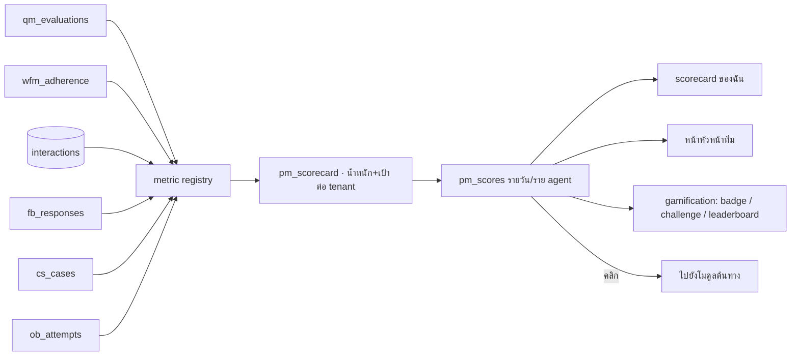

# D-Contact — Performance Management & Gamification

> ตัดสินใจเชิงสถาปัตยกรรมอยู่ที่ [ADR-018](adr/018-performance-gamification.md)

## 1. โมดูลนี้คือชั้นรวม ไม่ใช่แหล่งข้อมูล



**กฎเหล็ก:** ทุกตัวเลขบน scorecard คลิกแล้วต้องเด้งไปหน้าโมดูลต้นทางที่แสดงตัวเลขเดียวกัน
มี CI test ถาวรว่าค่าสองที่ตรงกัน

## 2. Metric registry

```jsonc
{
  "key": "qm.score.avg",
  "label": { "th": "คะแนนคุณภาพเฉลี่ย", "en": "Quality score" },
  "source": "qm_evaluations",          // ชี้ไปแหล่งเดิม ไม่คัดลอกข้อมูล
  "agg": "avg", "field": "totalScore",
  "unit": "percent", "direction": "higher_better",
  "minSample": 3,                      // ต่ำกว่านี้ = ไม่แสดงคะแนน
  "requiresPair": null
}
{
  "key": "int.aht",
  "label": { "th": "เวลาสนทนาเฉลี่ย", "en": "AHT" },
  "source": "interactions", "agg": "avg", "field": "handleSec",
  "unit": "seconds", "direction": "lower_better",
  "minSample": 20,
  "requiresPair": ["fb.csat.avg", "int.fcr"]   // บังคับต้องมีตัวถ่วงบนกระดานเดียวกัน
}
```

`requiresPair` เป็น validation ตอนบันทึก scorecard — บันทึกไม่ผ่านถ้าใส่ AHT โดยไม่มีตัวถ่วง
([ADR-018](adr/018-performance-gamification.md) ข้อ 4)

## 3. Data model

```prisma
model pm_metric    { key String @id  tenantId String?  label Json  source String  agg String
                     field String  unit String  direction String  minSample Int
                     requiresPair String[]  formula String? }   // formula สำหรับ metric ผสม
model pm_scorecard { id String @id  tenantId String  name String  appliesTo Json  // ทีม/สกิล/ทุกคน
                     items Json     // [{metricKey, weight, target, floor, ceiling}]
                     period String  // DAILY|WEEKLY|MONTHLY
                     status String  version Int }
model pm_score     { id String @id  scorecardId String  agentId String  period String
                     date DateTime  total Float  breakdown Json  sample Json  rank Int? }
model pm_goal      { id String @id  agentId String  metricKey String  target Float
                     from DateTime  to DateTime  setBy String  status String
                     coachingId String? }        // ผูกกลับ qm_coaching
model gm_badge     { id String @id  tenantId String  name String  icon String  rule Json
                     visibility String }         // PUBLIC|TEAM|PRIVATE
model gm_challenge { id String @id  tenantId String  name String  metricKey String
                     from DateTime  to DateTime  scope Json  reward String  status String }
model gm_award     { id String @id  badgeId String? challengeId String? agentId String
                     awardedAt DateTime  reason Json }
```

## 4. สูตรคะแนนรวม

```
สำหรับแต่ละ item:
  norm = clamp( (value − floor) / (ceiling − floor), 0, 1 )      # กลับด้านถ้า lower_better
  ถ้า sample < minSample → item นั้นถูกตัดออกและน้ำหนักถูกกระจายให้ตัวอื่น
total = Σ(norm × weight) / Σ(weight ที่ถูกนับ) × 100
```

การกระจายน้ำหนักเมื่อตัวอย่างไม่พอเป็นเรื่องสำคัญ: ถ้าให้คะแนน 0 แทน agent ที่ยังไม่ถูกตรวจ
จะถูกลงโทษเพราะหัวหน้าไม่ว่างตรวจ ซึ่งไม่ใช่ความผิดของเขา

## 5. Gamification — เปิดโดยตั้งใจเท่านั้น

| ระดับการเปิดเผย | เห็นอะไร |
|---|---|
| `PRIVATE` (ค่าเริ่มต้นเมื่อเปิดโมดูล) | แต่ละคนเห็นอันดับและ badge ของตัวเองเท่านั้น |
| `TEAM` | เห็นภายในทีม |
| `PUBLIC` | ทั้ง tenant — ต้องกดยืนยันว่าเข้าใจผลกระทบ |

- **badge** ให้ตามพฤติกรรมที่ทำซ้ำได้ (เช่น "ตรวจคุณภาพผ่าน 90% ติดกัน 4 สัปดาห์")
  ไม่ใช่ให้ตามอันดับ — รางวัลตามอันดับสร้างการแข่งกันเองแทนการพัฒนาตัวเอง
- **challenge** มีวันเริ่ม-จบชัดเจนและต้องระบุ metric ที่มี `requiresPair` ครบ
- ห้ามใช้ badge/อันดับเป็นเงื่อนไขในการประเมินผลงานประจำปีโดยระบบ (เป็นการตัดสินใจของ HR ไม่ใช่ของซอฟต์แวร์)

## 6. หน้าจอที่ต้องมี

| ผู้ใช้ | เห็นอะไร |
|---|---|
| **Agent** | คะแนนของฉัน + แยกตามองค์ประกอบ + แนวโน้ม + เป้าที่ตั้งไว้ + badge |
| **Supervisor** | ตารางทีม เรียงได้ทุกคอลัมน์ + ใครหลุดเป้า + ปุ่ม "เปิดการโค้ช" |
| **Manager** | เทียบข้ามทีม/ไซต์ + การกระจายตัว (ไม่ใช่แค่ค่าเฉลี่ย) |

## 7. UI (`mockups/analytics.html` — กลุ่ม Performance)

| view | หน้าที่ |
|---|---|
| `pm-team` | ตารางคะแนนทีม + ตัวกรอง + ปุ่มเปิดการโค้ช |
| `pm-scorecards` | **list** scorecard + เวอร์ชัน + ใช้กับใคร |
| `pm-scorecard-form` | **new/edit**: เลือก metric, น้ำหนัก, เป้า/พื้น/เพดาน, ตรวจ requiresPair, preview |
| `pm-goals` | **list/new/edit** เป้าหมายรายคน + ผูกกับการโค้ช |
| `pm-gamification` | เปิด/ปิด + ระดับการเปิดเผย + **list/new/edit** badge และ challenge |
| `pm-mine` | มุมมองของ agent เอง |

## 8. แผนเฟส

| เฟส | ได้อะไร | ต้องมีก่อน |
|---|---|---|
| **P1** | metric registry + scorecard CRUD + `pm_scores` รายวัน + หน้าทีม | QM Q2, WFM W2 |
| **P2** | หน้าของ agent + เป้าหมายรายคน + ปุ่มเปิดการโค้ช | P1 |
| **P3** | ผูก CSAT ([feedback](feedback-survey.md)) + เคส + outbound เข้ามาเป็น metric | F1, C3, O2 |
| **P4** | gamification (badge/challenge/leaderboard) พร้อมระดับการเปิดเผย | P2 |
| **P5** | เทียบข้ามไซต์/ประเทศ + การกระจายตัว + ส่งออก BI | [reporting](reporting-data-platform.md) R3 |

## 9. ความเสี่ยง

| ความเสี่ยง | ทางรับมือ |
|---|---|
| ตัวเลขไม่ตรงกับโมดูลต้นทาง | ห้ามคัดลอกข้อมูลดิบ + CI test เทียบค่าสองที่ + ทุกตัวเลขคลิกไปต้นทางได้ |
| ผลักพฤติกรรมผิด (คุยสั้นเข้าไว้) | `requiresPair` บังคับ + ตรวจตอนบันทึก scorecard |
| ลงโทษคนที่ยังไม่ถูกตรวจ | `minSample` + กระจายน้ำหนักแทนการให้ 0 |
| leaderboard ทำลายบรรยากาศทีม | ค่าเริ่มต้นปิด + ระดับการเปิดเผยเริ่มที่ PRIVATE + ต้องกดยืนยัน |
| กลายเป็นเครื่องมือลงโทษ | หน้าจอทุกหน้ามีปุ่ม "เปิดการโค้ช" ไม่ใช่ปุ่ม "บันทึกความผิด" |

## รายงานที่โมดูลนี้เป็นเจ้าของ

`pm.scorecard.agent` · `pm.scorecard.team` · `pm.goal.attainment` · `pm.distribution` · `gm.challenge`

รายละเอียดของแต่ละใบ (dataset · grain · มิติบังคับ · entitlement · ชั้น · drill-down · เฟส) อยู่ที่
[reporting-data-platform §7.10](reporting-data-platform.md) ซึ่งเป็น**แหล่งความจริงเดียว** —
ใบใหม่ต้องไปลงทะเบียนที่นั่นก่อน ห้ามตั้งใบรายงานขึ้นเองในโมดูล

ทุกตัวเลขบน `pm.*` ต้องคลิกกลับไปโมดูลต้นทางของ metric ได้ และ `minSample`/`requiresPair` ถูกบังคับที่ semantic layer ไม่ใช่แค่ตอนบันทึก scorecard

## เอกสารเกี่ยวข้อง

[ADR-018](adr/018-performance-gamification.md) · [quality-management.md](quality-management.md) ·
[workforce-management.md](workforce-management.md) · [feedback-survey.md](feedback-survey.md)
