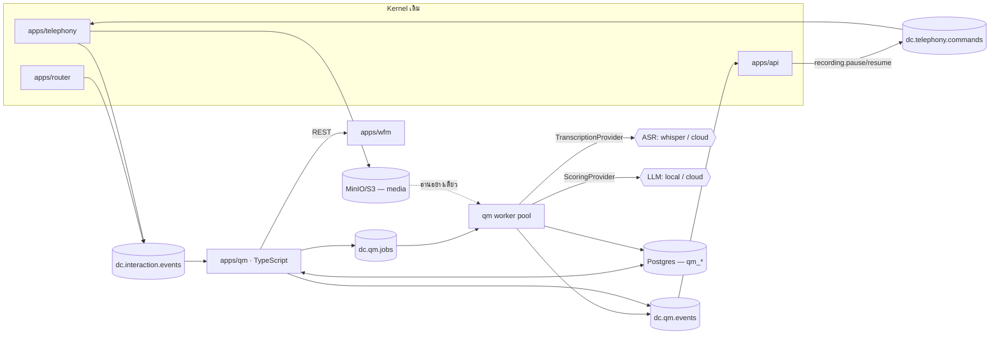

# D-Contact — Quality Management (QM)

> เอกสารออกแบบประกอบ [ADR-010](adr/010-quality-management.md) · สถานะ: **แผน (ยังไม่ implement)**
> mockup ที่ `mockups/qm.html` · อัปเดต 2026-08-07

## 1. QM คืออะไรในระบบนี้

QM ตอบคำถามเดียว: **"สายที่คุยไปเมื่อวานคุยดีหรือเปล่า และจะทำให้ดีขึ้นยังไง"**

```
Capture ──▶ Index ──▶ Target ──▶ Evaluate ──▶ Calibrate ──▶ Coach ──▶ Measure
 (อัด)   (ถอด+ติดแท็ก) (เลือกสาย)  (ให้คะแนน)   (จูนผู้ตรวจ)   (สอน)   (วัดผล)
   ▲                                                                    │
   └──────────────────────── feedback loop ─────────────────────────────┘
```

**เส้นแบ่งความรับผิดชอบ (กติกาเหล็ก):**

| telephony เป็นเจ้าของ | QM เป็นเจ้าของ | WFM เป็นเจ้าของ | Reports เป็นเจ้าของ |
|---|---|---|---|
| การอัด, pause/resume, ไฟล์ลง MinIO, `recordings` | transcript, category, ฟอร์ม, คะแนน, appeal, coaching | เวลาในตาราง (รวมช่องโค้ช) | SLA/AHT/occupancy ย้อนหลัง |

**QM ไม่สั่งอัดเอง ไม่แตะ ESL** ([ADR-010](adr/010-quality-management.md) ข้อ 2)
QM อ่านจาก `dc.interaction.events` เท่านั้น — เหมือนที่ WFM ไม่แตะ router
ผลคือ **QM ล้มได้โดยเสียงยังถูกอัดครบ** ซึ่งสำคัญกว่าการที่ QM ทำงาน เพราะเสียงที่ไม่ได้อัดกู้คืนไม่ได้

**QM ต่างจากทุกโมดูลก่อนหน้าตรงที่มันให้คะแนน *คน* ไม่ใช่ประเมิน *ระบบ*** —
ความเสี่ยงอันดับหนึ่งจึงเป็นเรื่องความไว้วางใจ ไม่ใช่เรื่องเทคนิค

## 2. สถาปัตยกรรม



| Service | ภาษา | หน้าที่ | ลักษณะงาน |
|---|---|---|---|
| `apps/qm` | TS / NestJS | CRUD ฟอร์ม/แผน/category, สร้าง assignment, รับคะแนน, appeal, calibration, ออก signed URL, retention job | realtime + stream |
| `qm worker` (โปรเซสเดียวกัน คนละ role) | TS + `ffmpeg` | consume `dc.qm.jobs`: ถอดเสียง, วัด metric จากสื่อ, จับ category, ร่างคะแนน AI, ลบตาม retention | batch, งานละวินาที–นาที |

**ไม่มีภาษาที่สาม** ([ADR-010](adr/010-quality-management.md) ข้อ 1) — งานหนักคือการเรียก provider
ไม่ใช่การคำนวณของเราเอง ต่างจาก `apps/wfm-engine` ที่ CP-SAT บังคับให้ต้องเป็น Python

### Topic ใหม่ 2 ตัว

| Topic | Key | ทิศทาง | ตัวอย่าง payload |
|---|---|---|---|
| `dc.qm.jobs` | `jobId` | qm → worker | `{kind:"TRANSCRIBE"\|"ANALYZE"\|"AUTO_SCORE"\|"PURGE", tenantId, interactionId, mediaId, opts}` |
| `dc.qm.events` | `tenantId` | qm/worker → api (WS fan-out) | `{type:"transcript.ready"\|"evaluation.assigned"\|"evaluation.published"\|"appeal.opened"\|"category.hit", ...}` |

job ต้อง **idempotent ตาม `jobId`** (วินัยเดียวกับ `eventId` ใน router และ `jobId` ใน WFM) —
consume ซ้ำต้องไม่ถอดเสียงซ้ำและไม่เผาโควตา ASR รอบสอง

### วงจรของสายหนึ่งสาย

```
interaction.ended (Kafka)
  → qm สร้าง qm_jobs(TRANSCRIBE) + produce dc.qm.jobs
  → worker ดึงไฟล์จาก MinIO, ffmpeg แยก stereo → TranscriptionProvider
  → เขียน qm_transcripts + qm_transcript_segments + qm_interaction_metrics
  → chain job ANALYZE: จับ category, sentiment, silence/talkover
  → ถ้าเข้าเงื่อนไข quality plan → สร้าง qm_assignments (คนตรวจ)
  → ถ้า qm.autoQm เปิด → chain job AUTO_SCORE → qm_evaluations(status=DRAFT)
  → produce dc.qm.events → api fan-out WS → supervisor เห็นคิวงานตรวจ
```

## 3. Data model

ตารางขึ้นต้น `qm_` ทั้งหมด ยกเว้นการแก้ `recordings` ซึ่งเป็น kernel entity
ประเภทข้อมูลตาม [multi-tenancy §3](multi-tenancy.md): **metadata** = cache ได้/แก้ไม่บ่อย,
**data** = append-heavy โตตาม traffic

| ตาราง | ประเภท | สาระ |
|---|---|---|
| `qm_categories` | metadata | นิยาม category เป็น rule DSL + เวอร์ชัน (ดู §6) |
| `qm_forms` / `qm_form_versions` | metadata | ฟอร์มประเมิน — เวอร์ชันที่ใช้แล้วแก้ไม่ได้ (ดู §8) |
| `qm_plans` | metadata | Quality plan: ตรวจใคร กี่สาย รอบไหน เงื่อนไขคัดสาย (ดู §7) |
| `qm_transcripts` | data | 1 แถวต่อ (interaction, provider, version) — มี `language`, `wer_estimate`, `edited_by` |
| `qm_transcript_segments` | **data** | ท่อนคำพูด/ข้อความ: `speaker`, `start_ms`, `end_ms`, `text`, `sentiment` — **ตารางที่โตที่สุดในระบบ QM** |
| `qm_interaction_metrics` | data | ค่าที่วัดจากสื่อ: `talk_ratio`, `silence_max_ms`, `crosstalk_pct`, `longest_monologue_ms` |
| `qm_category_hits` | data | (interaction × category × เวอร์ชันของ rule) + จุดที่แมตช์ |
| `qm_assignments` | data | "คนนี้ต้องตรวจสายนี้ด้วยฟอร์มนี้ ภายในวันนี้" |
| `qm_evaluations` | data | ผลประเมิน 1 ใบ + **`form_snapshot`** + `raw_score` / `final_score` / `status` |
| `qm_evaluation_answers` | data | คำตอบรายข้อ + `evidence` (JSONB, ดู §9) |
| `qm_appeals` | data | คำโต้แย้งของ agent + workflow อนุมัติ |
| `qm_calibrations` / `qm_calibration_scores` | data | รอบ calibrate + คะแนนของผู้ตรวจแต่ละคนบนสายเดียวกัน |
| `qm_coaching_sessions` | data | หัวข้อโค้ช + ผูก `wfm_shift_segment_id` + การรับทราบของ agent |
| `qm_media_access_log` | **data** | ใครเปิดฟัง/ดูอะไร เมื่อไหร่ จาก IP ไหน — PDPA |
| `qm_legal_holds` | metadata | ระงับการลบตาม retention |
| `qm_jobs` | data | คิวงาน + สถานะ + error (แบบเดียวกับ `wfm_jobs`) |

### Schema change ที่ kernel (เล็กมากโดยเจตนา)

```prisma
model Recording {
  // ...ของเดิมทั้งหมดคงไว้
  kind           RecordingKind @default(AUDIO)          // AUDIO | SCREEN  (เผื่อ §14)
  channelLayout  String?  @map("channel_layout")        // "stereo:agent=L,contact=R" | "mono"
  pauseIntervals Json?    @map("pause_intervals")       // [{startMs, endMs, reason:"PCI"}]
  deletedAt      DateTime? @map("deleted_at")           // soft delete — ลบไฟล์แล้วแต่เก็บหลักฐานว่าเคยมี
}
```

`channelLayout` เป็น **stereo แยก leg เป็นค่าเริ่มต้นที่แนะนำ** — ถ้าอัด mono
จะวัด talk ratio / crosstalk / silence ต่อฝ่ายไม่ได้เลย และเปลี่ยนย้อนหลังไม่ได้

### โครงหลัก (Prisma sketch)

```prisma
// ท่อนคำพูด — รูปแบบเดียวกันไม่ว่าต้นทางจะเป็นเสียงหรือข้อความ (ADR-010 ข้อ 5)
model QmTranscriptSegment {
  id           BigInt  @id @default(autoincrement())
  tenantId     String  @map("tenant_id") @db.Uuid
  transcriptId String  @map("transcript_id") @db.Uuid
  speaker      Speaker                       // AGENT | CONTACT | SYSTEM | IVR
  startMs      Int     @map("start_ms")      // แชต/อีเมล = offset จากข้อความแรก
  endMs        Int     @map("end_ms")
  text         String
  confidence   Float?                        // null สำหรับ digital (ไม่มีความไม่แน่นอน)
  sentiment    Float?                        // -1..1
  @@index([tenantId, transcriptId, startMs])
  @@map("qm_transcript_segments")
}

// ผลประเมิน 1 ใบ — snapshot ของฟอร์มอยู่ในนี้ (ADR-010 ข้อ 9)
model QmEvaluation {
  id             String   @id @default(uuid()) @db.Uuid
  tenantId       String   @map("tenant_id") @db.Uuid
  interactionId  String   @map("interaction_id") @db.Uuid
  agentId        String   @map("agent_id") @db.Uuid       // ผู้ถูกประเมิน
  evaluatorId    String?  @map("evaluator_id") @db.Uuid   // null = AI ร่าง
  source         EvalSource                                // HUMAN | AUTO_DRAFT | CALIBRATION
  formVersionId  String   @map("form_version_id") @db.Uuid
  formSnapshot   Json     @map("form_snapshot")            // ห้าม null — ดู ADR-010 ข้อ 9
  rawScore       Float?   @map("raw_score")                // คะแนนก่อนใช้ auto-fail
  finalScore     Float?   @map("final_score")              // คะแนนที่ประกาศ
  autoFailed     Boolean  @default(false) @map("auto_failed")
  status         EvalStatus                                // DRAFT | PUBLISHED | DISPUTED | AMENDED | VOID
  publishedAt    DateTime? @map("published_at")
  @@index([tenantId, agentId, publishedAt])
  @@index([tenantId, status])
  @@map("qm_evaluations")
}
```

`qm_transcript_segments` เป็น append-heavy ตัวใหม่ที่ใหญ่ที่สุด
(สายละ ~150–400 แถว) → **partition รายเดือน + retention ตาม §11** ตั้งแต่วันแรก
แนวเดียวกับ `interactions` ใน [multi-tenancy §6](multi-tenancy.md)

## 4. Recording lifecycle & compliance

นี่คือส่วนที่ **แก้ทีหลังแพงที่สุด** จึงต้องครบตั้งแต่ Q1

| เรื่อง | การออกแบบ |
|---|---|
| **PCI pause/resume** | agent กดในหน้า workspace → api → `dc.telephony.commands` → telephony สั่ง ESL หยุดเขียน; ช่วงที่หยุดลง `pause_intervals` และ **แสดงเป็นแถบสีบน waveform** ให้ผู้ตรวจเห็นว่าไม่ได้ถูกตัดต่อ |
| **auto-pause** | Flow node ที่รับเลขบัตร (DTMF) สั่ง pause อัตโนมัติ — ไม่พึ่งความจำ agent ([flow-engine.md](flow-engine.md)) |
| **การแจ้งลูกค้า** | ประกาศ "สายนี้อาจถูกบันทึก" เป็น Flow node มาตรฐาน; ตั้งค่าต่อ tenant ไม่ใช่ค่าคงที่ |
| **ไม่อัดเลย** | คิว/flow ที่ตั้งค่า `recording.mode = OFF` ต้องไม่มีไฟล์เกิดขึ้น (บางประเทศ/บางเคสห้ามอัด) |
| **การเข้าถึง** | ออก **signed URL อายุสั้น (5 นาที)** ต่อครั้ง ห้ามให้ client ต่อ MinIO ตรง และทุกครั้งลง `qm_media_access_log` |
| **สิทธิ์** | permission `listen to recordings` เดิม ([iam-architecture §6](iam-architecture.md)) — agent ฟังได้เฉพาะสายตัวเอง, supervisor ฟังได้ในทีมตัวเอง |
| **encryption** | at rest ที่ MinIO/S3 (SSE) + in transit; key เป็นของ deployment ไม่ใช่ต่อ tenant ใน v1 |
| **legal hold** | `qm_legal_holds` ระงับ retention ทุกชั้น — **ชนะทุกกฎ** และปลดได้เฉพาะ admin พร้อม `reason` |

**กติกา: การลบต้องผ่าน job ของเรา ไม่ใช่ lifecycle rule ของ S3 อย่างเดียว**
S3 ไม่รู้จัก legal hold ของเรา ถ้าปล่อยให้ bucket policy ลบเอง วันหนึ่งจะลบหลักฐานที่ศาลสั่งเก็บ

## 5. Transcript pipeline

```
recording (MinIO) ──ffmpeg──▶ mono 16k ต่อ leg ──▶ TranscriptionProvider ──▶ segments
messages (Postgres) ─────────── normalize ─────────────────────────────────▶ segments
```

```ts
interface TranscriptionProvider {
  readonly id: 'whisper-local' | 'cloud-a' | ...
  transcribe(input: {
    audio: ReadableStream            // ต่อ leg
    speaker: 'AGENT' | 'CONTACT'
    languageHint: string             // 'th-TH'
    vocabulary?: string[]            // ชื่อสินค้า/แบรนด์ต่อ tenant — ช่วย WER มากที่สุด
  }): Promise<{ segments: Segment[]; language: string; confidenceAvg: number }>
}
```

ตาม [ADR-010](adr/010-quality-management.md) ข้อ 6 — **1 provider ต่อ deployment สลับด้วย config**
และมี contract test ชุดเดียวกันทุก provider เหมือน gateway ใน [ADR-006](adr/006-multi-vendor-telephony-gateway.md)

**ประเด็นภาษาไทยที่ต้องยอมรับตั้งแต่ต้น:**

1. **WER สูงกว่าอังกฤษเสมอ** โดยเฉพาะสายคุณภาพต่ำ (G.711 8kHz) → ต้องวัด WER
   บนชุดตัวอย่างของลูกค้าจริงก่อนขาย `qm.autoQm` ไม่ใช่หลังขาย
2. **ต้องมีหน้าให้คนแก้ transcript ได้** (`qm_transcripts.edited_by`) — และการแก้ต้อง
   trigger job `ANALYZE` ใหม่ ไม่ใช่แก้แค่ข้อความให้สวย
3. **คำเฉพาะของลูกค้า** (ชื่อโปรโมชัน/รุ่นสินค้า) ใส่เป็น `vocabulary` ต่อ tenant —
   เป็น metadata ตาม [ADR-005](adr/005-multitenant-metadata-architecture.md)
4. **ช่องทาง digital ไม่ผ่าน ASR** จึงแม่น 100% → **ลูกค้าใหม่ควรเริ่มใช้ QM
   ที่ช่องทางแชตก่อน** แล้วค่อยขยับมาเสียง เป็นทางลงที่ปลอดภัยสำหรับความเชื่อมั่น

## 6. Categories — จับสายที่น่าสนใจอัตโนมัติ

Category คือ **saved query ที่มีเวอร์ชัน** ([ADR-010](adr/010-quality-management.md) ข้อ 11)

```jsonc
{
  "name": "เสี่ยงยกเลิกบริการ",
  "version": 3,
  "rule": {
    "all": [
      { "any": [ {"term": "ยกเลิก"}, {"term": "ปิดบัญชี"}, {"term": "ไม่ใช้แล้ว"} ] },
      { "near": { "terms": ["คู่แข่ง", "เจ้าอื่น", "ที่อื่นถูกกว่า"], "windowSec": 30 } },
      { "speaker": "CONTACT" }
    ],
    "not": [ { "term": "ยกเลิกนัด" } ]
  }
}
```

| ตัวดำเนินการ | ความหมาย |
|---|---|
| `term` / `any` / `all` / `not` | ตรรกะพื้นฐาน บน tsvector |
| `near` | อยู่ห่างกันไม่เกิน N วินาที (ใช้ `start_ms` ไม่ใช่ระยะคำ) |
| `speaker` | ใครพูด — แยก "agent สัญญาเกินจริง" ออกจาก "ลูกค้าพูดถึง" |
| `withinFirstSec` / `withinLastSec` | ใช้กับการทักทาย/ปิดการสนทนา |
| `metric` | เงื่อนไขบน `qm_interaction_metrics` เช่น `silence_max_ms > 30000` |

**ภาษาไทยไม่มีช่องว่างระหว่างคำ** → ต้อง tokenize ก่อนเข้า tsvector
(`pg_trgm` สำหรับ fuzzy + dictionary-based tokenizer สำหรับ term) — เขียนไว้ตรงนี้เพราะเป็น
รายละเอียดที่ถ้าลืม จะทำให้ category ภาษาไทยไม่แมตช์อะไรเลยและหาสาเหตุยาก

**การเปลี่ยน rule ต้องขึ้นเวอร์ชันใหม่เสมอ** — `qm_category_hits` เก็บเวอร์ชันที่ใช้จับไว้ด้วย
ไม่งั้นกราฟ trend จะกระโดดโดยไม่มีใครอธิบายได้ว่าพฤติกรรมลูกค้าเปลี่ยนหรือกฎเปลี่ยน

## 7. Quality plan — เลือกสายมาตรวจ

จุดที่แยกระบบที่ใช้ได้จริงออกจากระบบที่ซื้อมาแล้วทิ้ง
สุ่มล้วนจะตรวจได้ ~1–2% ของสาย และมักได้สายที่ไม่มีอะไรผิดปกติ

```jsonc
{
  "name": "ทีม Inbound — รายเดือน",
  "target": { "teamIds": ["..."], "queueIds": ["..."] },
  "formVersionId": "...",
  "period": "MONTHLY",
  "quota": { "perAgent": 4 },
  "mix": [
    { "kind": "RANDOM",   "share": 0.25 },
    { "kind": "CATEGORY", "share": 0.50, "categoryIds": ["เสี่ยงยกเลิกบริการ", "โต้เถียง"] },
    { "kind": "METRIC",   "share": 0.25, "filter": { "silence_max_ms": { "gt": 30000 } } }
  ],
  "constraints": {
    "minDurationSec": 60,          // สายสั้นเกินไม่มีอะไรให้ประเมิน
    "excludeTransferred": false,
    "evaluatorNotAgentsSupervisor": false
  },
  "assignTo": "AGENT_SUPERVISOR"   // | ROUND_ROBIN | POOL
}
```

**`minDurationSec` เป็นเรื่องใหญ่กว่าที่ดู** — ถ้าไม่ตั้ง ระบบจะแจกสาย 8 วินาที
ให้ supervisor ตรวจ แล้วไม่มีใครเปิดคิวงานตรวจอีกเลย

**เมื่อ `qm.autoQm` เปิด** สัดส่วนจะเปลี่ยนไปเป็น "AI ตรวจ 100% → คนตรวจซ้ำเฉพาะ
สายที่คะแนนต่ำสุด/ผิดปกติ/สุ่ม 10% เพื่อ audit ตัว AI เอง" — สัดส่วนสุ่มเพื่อ audit
**ห้ามตัดทิ้ง** ไม่งั้นจะไม่มีทางรู้ว่าโมเดลเริ่มเพี้ยนเมื่อไหร่

## 8. ฟอร์มประเมินและสูตรคะแนน

```jsonc
{
  "version": 7,
  "scoreMethod": "WEIGHTED_POINTS",     // | AVERAGE_OF_SECTION_PCT
  "sections": [
    {
      "name": "การเปิดสาย", "weight": 20,
      "questions": [
        { "id": "greet", "type": "YES_NO", "text": "กล่าวชื่อบริษัทและชื่อตัวเอง", "points": 10 },
        { "id": "verify", "type": "YES_NO", "text": "ยืนยันตัวตนลูกค้าครบถ้วน",
          "points": 10, "autoFail": true },
        { "id": "tone", "type": "SCALE", "scale": [1,5], "points": 10, "allowNa": true }
      ]
    }
  ],
  "requireCommentBelow": 0.6            // ให้คะแนนต่ำต้องเขียนเหตุผล
}
```

**ชนิดคำถาม v1**: `YES_NO` · `SCALE` · `SINGLE_CHOICE` · `MULTI_CHOICE` · `TEXT` (ไม่คิดคะแนน)

### สูตร

```
score_section = Σ(points_earned) / Σ(points_possible ที่ไม่ใช่ N/A)
raw_score     = Σ(score_section × weight) / Σ(weight ของ section ที่มีข้อให้คะแนน)
final_score   = autoFailed ? 0 : raw_score
```

**สามกฎที่พลาดกันบ่อยและต้องทำให้ถูกตั้งแต่แรก:**

1. **N/A ต้องหายไปจากตัวหาร ไม่ใช่ได้ 0** — ไม่งั้น agent ถูกหักคะแนนจากสถานการณ์ที่ไม่เกิดขึ้น
2. **auto-fail ทำให้ `final_score = 0` แต่ต้องเก็บ `raw_score` ไว้เสมอ** —
   ไม่งั้นจะวิเคราะห์ไม่ได้ว่า "สายที่ตกเพราะไม่ยืนยันตัวตน ส่วนอื่นทำได้ดีแค่ไหน"
3. **section ที่ทุกข้อเป็น N/A ต้องถูกตัดออกจากตัวหารของ weight ด้วย** ไม่ใช่นับเป็น 0 คะแนน

**ฟอร์มที่ถูกใช้ให้คะแนนไปแล้วแก้ไม่ได้** — แก้ = ออก `qm_form_versions` ใหม่
และผลเก่ายังอ่านได้จาก `form_snapshot` ([ADR-010](adr/010-quality-management.md) ข้อ 9)

**ข้อจำกัดที่ยอมรับใน v1**: คะแนนข้ามฟอร์มคนละชุด **เทียบกันไม่ได้**
หน้ารายงานต้องบังคับเลือกฟอร์มก่อนถึงจะแสดง trend ได้ — ห้ามเฉลี่ยรวมข้ามฟอร์มแล้วเรียกว่า
"คะแนนคุณภาพขององค์กร"

## 9. Auto-QM — AI ร่างคะแนน มนุษย์ตัดสิน

```ts
interface ScoringProvider {
  score(input: {
    formSnapshot: FormSchema
    segments: Segment[]           // transcript ทั้งสาย พร้อม speaker + timestamp
    context: { queue: string; disposition?: string; durationSec: number }
  }): Promise<AutoScoreResult>
}
```

### สัญญาหลักฐาน (evidence contract) — หัวใจของทั้งเรื่อง

```jsonc
{
  "answers": [
    {
      "questionId": "greet",
      "value": "YES",
      "confidence": 0.94,
      "evidence": [
        { "segmentIds": [10231], "startMs": 1200, "endMs": 4800,
          "quote": "สวัสดีค่ะ บริษัท... ยินดีให้บริการค่ะ" }
      ]
    },
    {
      "questionId": "verify",
      "value": "INSUFFICIENT_EVIDENCE",     // ← ไม่ใช่ NO
      "confidence": 0.31,
      "evidence": []
    }
  ]
}
```

**กติกาเหล็กสามข้อ** ([ADR-010](adr/010-quality-management.md) ข้อ 7–8):

1. **ไม่มี `evidence` = ไม่ให้คะแนน** ต้องคืน `INSUFFICIENT_EVIDENCE` แล้วส่งให้คนตัดสิน
   `INSUFFICIENT_EVIDENCE` ต้องถูกนับเป็น N/A ในสูตร §8 **ไม่ใช่ศูนย์**
2. **ทุกใบที่ AI ร่างมี `status = DRAFT` และ agent มองไม่เห็น** จนกว่ามนุษย์จะกด publish
   ไม่มี path ไหนที่ทำให้ `source = AUTO_DRAFT` ถูก publish โดยไม่มี `evaluatorId`
3. **UI ต้องกระโดดไปเล่นเสียงที่ `startMs` ของหลักฐานได้ในคลิกเดียว** —
   ถ้าผู้ตรวจต้องฟังทั้งสายเพื่อยืนยันคะแนน AI ก็ไม่ได้ประหยัดเวลาอะไรเลย
   นี่คือเงื่อนไขที่ตัดสินว่า auto-QM คุ้มหรือไม่คุ้ม

### เวอร์ชันของโมเดลคือข้อมูล ไม่ใช่ค่าคงที่

`qm_evaluations` เก็บ `provider_id`, `model_id`, `prompt_version` ทุกใบ
เพราะโมเดลเปลี่ยนแล้วคะแนนขยับ — ถ้าไม่บันทึกไว้จะแยกไม่ออกว่า **agent แย่ลงหรือโมเดลเปลี่ยน**
ซึ่งเป็นคำถามที่จะถูกถามแน่นอน

### เงื่อนไขก่อนอนุญาต auto-publish (เฟสหลัง)

ต้องมีตัวเลขจาก §10 ก่อน: `|score_AI − score_human|` เฉลี่ย < 5 จุด และ
ไม่มีข้อ auto-fail ที่ AI ตัดสินผิดในชุดทดสอบ — **เป็นเกณฑ์เชิงข้อมูล ไม่ใช่ความรู้สึกว่าแม่นแล้ว**

## 10. Calibration & Appeal — สิ่งที่ทำให้คะแนนมีความหมาย

### Calibration

รอบ calibrate = เลือก 1 สาย → ผู้ตรวจหลายคนให้คะแนน**แบบไม่เห็นของกัน** →
เปิดเผยพร้อมกัน → ดู variance ต่อข้อ

| ตัวชี้วัด | ใช้ทำอะไร |
|---|---|
| SD ของคะแนนรวม | ผู้ตรวจเข้าใจฟอร์มตรงกันหรือยัง |
| ข้อที่ variance สูงสุด | **ข้อนั้นเขียนกำกวม → ต้องแก้ฟอร์ม ไม่ใช่ต้องอบรมผู้ตรวจ** |
| ระยะห่างจากค่ากลางของแต่ละคน | ผู้ตรวจคนไหนใจดี/ใจร้ายกว่าคนอื่นเป็นระบบ |
| `AUTO_DRAFT` ใส่ร่วมรอบได้ | ได้ตัวเลข "AI ต่างจากคนเท่าไร" ฟรี → ป้อนเข้าเกณฑ์ §9 |

`source = CALIBRATION` **ไม่นับรวมในคะแนนของ agent** — เป็นการวัดผู้ตรวจ ไม่ใช่วัด agent

### Appeal

```
PUBLISHED ──agent ยื่นโต้แย้ง──▶ DISPUTED ──supervisor/ผู้ตรวจคนที่สอง──┬─▶ AMENDED (แก้คะแนน)
                                                                      └─▶ PUBLISHED (ยืนตามเดิม)
```

- **ห้ามลบใบเดิม** — `AMENDED` เก็บทั้งคะแนนเดิมและใหม่ พร้อมเหตุผล (เอกสาร HR)
- ผู้พิจารณา appeal **ต้องไม่ใช่คนให้คะแนนใบนั้น**
- สัดส่วน appeal ที่ชนะเป็นตัวชี้วัดสุขภาพของฟอร์มและผู้ตรวจ — ต้องมีบนแดชบอร์ด
- agent **เห็นคะแนนตัวเองทุกใบเสมอ** ไม่มีโหมด "ประเมินลับ"

## 11. Retention 3 ชั้น

| ชั้น | ค่าเริ่มต้น | เหตุผล |
|---|---|---|
| ไฟล์เสียง/สื่อ | `recording.retentionMonths` จาก entitlement (3/12/ตามสัญญา) | ใหญ่ที่สุด แพงที่สุด อ่อนไหวที่สุด |
| Transcript + metrics | ยาวกว่าเสียง (ค่าเริ่มต้น 24 เดือน) | วิเคราะห์ย้อนหลังได้โดยไม่ต้องถือครองเสียง |
| ผลประเมิน + appeal + coaching | ยาวสุด (ค่าเริ่มต้น 36 เดือน) | เป็นเอกสารด้านบุคคล ลบแล้วเถียงกันไม่จบ |

```
PURGE job (รายวัน)
  → หา media ที่เกิน retention และไม่มี legal hold
  → ลบไฟล์ที่ MinIO → set recordings.deleted_at (ไม่ลบแถว)
  → เขียน audit
```

**`deleted_at` แทนการลบแถว** เพราะต้องตอบได้ว่า "สายนี้เคยมีและถูกลบตามนโยบายเมื่อไหร่"
ต่างจาก "ไม่เคยมีสายนี้" อย่างสิ้นเชิงเวลาถูกตรวจสอบ

การ export/ลบตาม PDPA ต่อยอดจาก [multi-tenancy §7](multi-tenancy.md) — QM เพิ่ม prefix
ของ media และตาราง `qm_*` เข้าไปในรายการเดียวกัน

## 12. Coaching → WFM

```
supervisor สร้าง coaching session จากผลประเมิน
  → qm เรียก REST ของ apps/wfm: จอง segment ชนิด COACHING ในกะของ agent
  → wfm ตอบ segmentId (หรือปฏิเสธถ้าไม่มีช่องว่าง)
  → qm เก็บ wfm_shift_segment_id + agent เห็นในหน้า "ตารางของฉัน"
  → เวลานั้นถูกนับเป็น activity ที่ถูกต้องใน adherence ไม่ใช่ "หลุดจากกะ"
```

**ทิศทางเดียว QM → WFM ผ่าน API เท่านั้น** ([ADR-010](adr/010-quality-management.md) ข้อ 12) —
WFM ไม่รู้จัก QM และ QM ห้าม `INSERT` ลง `wfm_*` ตรง
ถ้า WFM ไม่ได้เปิดใช้ (`wfm.enabled = false`) coaching session ยังสร้างได้ แค่ไม่มีเวลาผูก

agent ต้อง **acknowledge** เซสชัน (`acknowledged_at`) — เป็นทั้งหลักฐานว่าได้รับการสอนจริง
และเป็นการบังคับให้ loop ปิด

## 13. Entitlement, quota และสิทธิ์

### Entitlement (เพิ่มใน [licensing §2](licensing.md))

```jsonc
"qm": {
  "enabled": true,
  "seats": null,          // null = เท่ากับ agentSeats
  "evaluation":    true,  // ฟอร์ม + quality plan + ให้คะแนนมือ + appeal   (Q2)
  "transcription": true,  // ASR + ค้นหาในบทสนทนา                          (Q3)
  "analytics":     true,  // category + trend + targeted sampling          (Q4)
  "autoQm":        false, // AI ร่างคะแนน — ของแพงจริง                      (Q5)
  "screenRecording": false
}
```

### Quota — สิ่งที่ WFM ไม่มีและ QM ต้องมี

```jsonc
"quotas": {
  "qmTranscriptionMinutesPerMonth": 20000,
  "qmAutoScoredPerMonth": 2000,
  "qmStorageGb": 300
}
```

**QM เป็นโมดูลแรกที่มีต้นทุนผันแปรต่อสายจริง** ([ADR-010](adr/010-quality-management.md) ข้อ 15) —
นาที ASR และ token เป็นเงินที่จ่ายออกไปทุกสาย ถ้าปล่อยให้ `qm.autoQm` เปิดโดยไม่มีเพดาน
tenant ที่คุยหนักจะทำให้ margin ติดลบโดยไม่มีใครเห็นจนสิ้นเดือน
→ **quota ต้องขึ้นพร้อมฟีเจอร์ในเฟสเดียวกัน ไม่ใช่ตามหลัง**

เมื่อชนเพดาน: **หยุดถอด/หยุดร่างคะแนนใหม่ + เตือน** — การอัดและการรับสายห้ามได้รับผลกระทบ
(กติกาเหล็กของ [ADR-009](adr/009-plan-entitlement-licensing.md))

### Permission (ต่อจาก [iam-architecture §6](iam-architecture.md))

| Permission | AGENT | SUPERVISOR | ADMIN |
|---|:-:|:-:|:-:|
| ดูผลประเมินของตัวเอง | ✓ | ✓ | ✓ |
| ยื่น appeal | ✓ | ✓ | ✓ |
| ฟังเสียงสายของตัวเอง | ✓ | ✓ | ✓ |
| ฟังเสียงสายของทีม | — | ✓ | ✓ |
| ให้คะแนน / publish | — | ✓ | ✓ |
| พิจารณา appeal | — | ✓ | ✓ |
| แก้ฟอร์ม / quality plan / category | — | — | ✓ |
| ตั้ง retention / ปลด legal hold | — | — | ✓ |

**ผู้พิจารณา appeal ต้องไม่ใช่ผู้ให้คะแนนใบนั้น** — เป็นเงื่อนไขระดับ business logic
ที่ role matrix แสดงไม่ได้ ต้องบังคับในโค้ดและมีเทสต์

## 14. ลำดับการทำ

| เฟส | ขอบเขต |
|---|---|
| **Q1** | recording lifecycle ครบวง: stereo, **PCI pause/resume**, signed URL, `qm_media_access_log`, retention job + legal hold, หน้าเล่นเสียง + waveform + ค้นหาสาย — **ยังไม่มีการประเมินเลย** |
| **Q2** | form builder + versioning + `form_snapshot`, quality plan (สุ่ม + เงื่อนไข metric), คิวงานตรวจ, ให้คะแนนมือ, หน้าคะแนนของ agent, **appeal**, **calibration** |
| **Q3** | `TranscriptionProvider` + pipeline, transcript viewer + แก้ transcript, ค้นหาข้อความข้ามสาย, normalize ช่องทาง digital |
| **Q4** | category DSL + tokenizer ไทย, `qm_category_hits`, targeted sampling, แดชบอร์ด trend + ความสัมพันธ์กับ CSAT/AHT |
| **Q5** | `ScoringProvider` + auto-QM แบบ DRAFT + evidence UI, coaching → WFM, ตัวเลขเทียบ AI vs คน |
| **Q6+** | screen recording (ต้องมี client ฝั่ง agent), behavioral scoring, auto-publish ตามเกณฑ์ §9 |

**Q1 ต้องมาก่อนทุกอย่างและห้ามข้าม** — ถ้าปล่อยให้เก็บเสียงโดยไม่มี pause/audit/retention
ไปหกเดือน ปัญหาที่ได้คือปัญหาที่แก้ย้อนหลังไม่ได้

**L1 ของ [ADR-009](adr/009-plan-entitlement-licensing.md) ต้องมาก่อน Q5** ด้วยเหตุผลเดียวกับ W4:
ห้ามปล่อยของที่มีต้นทุนต่อการเรียกใช้ออกไปโดยไม่มีอะไรกั้น

## 15. ความเสี่ยง

| ความเสี่ยง | ผลถ้าเกิด | การคุม |
|---|---|---|
| **agent มองว่าเป็นระบบสอดส่อง** | ต่อต้าน, ข้อมูลถูกบิดเบือน, ปัญหาแรงงาน | agent เห็นคะแนนตัวเองทุกใบ + appeal ได้ + AI ไม่ตัดสินเอง ([ADR-010](adr/010-quality-management.md) ข้อ 7–8, 10) |
| WER ภาษาไทยสูง | category ไม่แมตช์, auto-QM มั่ว | วัด WER กับข้อมูลลูกค้าจริงก่อนขาย · แก้ transcript ได้ · เริ่มที่ช่องทางแชต |
| คะแนน AI ผิดแล้วถูก publish | เสียความเชื่อถือถาวรภายในสัปดาห์เดียว | DRAFT-only + evidence บังคับ + สุ่ม audit ตัว AI ห้ามตัดทิ้ง |
| ผู้ตรวจให้คะแนนไม่ตรงกัน | ตัวเลขทั้งระบบไม่มีความหมาย | calibration ตั้งแต่ v1 + ดู variance รายข้อเพื่อ**แก้ฟอร์ม** |
| ต้นทุน ASR/LLM บานปลาย | margin ติดลบแบบไม่รู้ตัว | quota ขึ้นพร้อมฟีเจอร์ + หน้า usage ต่อ tenant |
| storage โตเกินประมาณ | ค่าใช้จ่ายและ backup พัง | retention 3 ชั้น + partition + `qmStorageGb` |
| อัดเลขบัตรลง storage | ผิด PCI-DSS แก้ย้อนหลังไม่ได้ | pause/resume + auto-pause จาก Flow node ใน **Q1** |
| แก้ฟอร์มแล้วคะแนนเก่าอ่านไม่ออก | เทียบข้ามเดือนไม่ได้ | `form_snapshot` + ฟอร์มที่ใช้แล้วแก้ไม่ได้ |
| ลบไฟล์ที่ติด legal hold | ปัญหาทางกฎหมาย | ลบผ่าน job ของเราเท่านั้น ห้ามพึ่ง S3 lifecycle ล้วน |
| QM ล้มแล้วเสียงไม่ถูกอัด | สูญเสียหลักฐานถาวร | การอัดอยู่ที่ telephony QM แตะไม่ได้ ([ADR-010](adr/010-quality-management.md) ข้อ 2) |

## รายงานที่โมดูลนี้เป็นเจ้าของ

`qm.score` · `qm.coverage` · `qm.autofail` · `qm.calibration` · `qm.appeal` · `qm.coaching.effect` · `qm.ai.delta` · `qm.media.metrics` · `qm.category.trend` · `qm.access.log`

รายละเอียดของแต่ละใบ (dataset · grain · มิติบังคับ · entitlement · ชั้น · drill-down · เฟส) อยู่ที่
[reporting-data-platform §7.7](reporting-data-platform.md) ซึ่งเป็น**แหล่งความจริงเดียว** —
ใบใหม่ต้องไปลงทะเบียนที่นั่นก่อน ห้ามตั้งใบรายงานขึ้นเองในโมดูล

`qm.score` **บังคับเลือก `formVersion` ก่อนแสดงผล** ตาม §8 — ห้ามเฉลี่ยข้ามฟอร์มแล้วเรียกว่าคะแนนขององค์กร; ใบชั้นบุคคลในกลุ่มนี้เก็บ 36 เดือนตาม retention ของผลประเมิน
