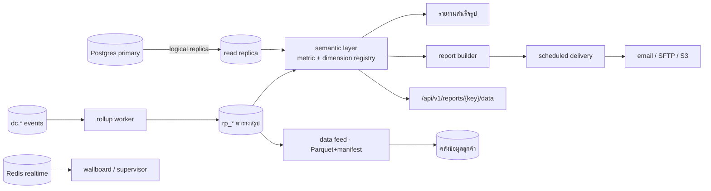

# D-Contact — Reporting & Data Platform

> ตัดสินใจเชิงสถาปัตยกรรมอยู่ที่ [ADR-019](adr/019-reporting-data-platform.md)

## 1. สี่หน้าที่ของโมดูล

| ส่วน | ตอบใคร |
|---|---|
| **รายงานสำเร็จรูป** | หัวหน้าทีม/ผู้จัดการ — เปิดแล้วใช้ได้เลย |
| **Report builder** | ผู้ใช้ที่อยากได้มุมของตัวเอง โดยไม่ต้องขอ dev |
| **Scheduled delivery** | ผู้บริหารที่อยากได้อีเมลทุกเช้าจันทร์ |
| **Data feed** | ทีม BI ของลูกค้าที่มีคลังข้อมูลของตัวเอง |

## 2. สถาปัตยกรรม



**เส้น realtime (ล่างขวา) ไม่แตะ semantic layer เลย** — คนละความต้องการ คนละความสด

## 3. Semantic layer

```jsonc
// dimension — แกนกลาง
{ "key": "queue",    "table": "rp_interaction_daily", "column": "queue_id", "label": {...} }
{ "key": "channel",  "values": ["voice","webchat","line","facebook","whatsapp","email"] }
{ "key": "date",     "grain": ["15m","hour","day","week","month"] }   // 15m เฉพาะ dataset ที่ประกาศไว้
{ "key": "team" } { "key": "agent" } { "key": "disposition" } { "key": "topic" }

// dimension — ของโมดูล (เพิ่มตาม catalog §7 — ห้ามมีใบไหนใช้มิติที่ไม่ได้อยู่ที่นี่)
{ "key": "site", "carries": "ianaTz" } { "key": "planningGroup" } { "key": "skill" }
{ "key": "flow" } { "key": "flowVersion" }        // เทียบก่อน/หลังแก้ผัง
{ "key": "formVersion" }                          // QM — บังคับใน qm.score
{ "key": "caseType" } { "key": "campaign" } { "key": "bot" } { "key": "intent" }
{ "key": "journey" } { "key": "provider" } { "key": "language" } { "key": "expertGroup" }
{ "key": "plan" } { "key": "tenant" }             // เฉพาะ catalog ฝั่ง operator (§7.13)

// metric — ใช้ registry เดียวกับ performance (ADR-018)
{ "key": "sla.pct", "label": {"th":"สายที่ตอบใน SLA"},
  "formula": "sum(answered_within_sla) / nullif(sum(offered),0) * 100",
  "unit": "percent", "grain": ["hour","day"], "requiresDim": [] }
{ "key": "abandon.pct", "formula": "sum(abandoned)/nullif(sum(offered),0)*100" }
{ "key": "aht", "formula": "sum(handle_sec)/nullif(sum(handled),0)" }
{ "key": "occupancy" } { "key": "csat.avg" } { "key": "qm.score.avg" }
{ "key": "contained.pct" } { "key": "case.reopen.pct" } { "key": "outbound.rpc.pct" }
{ "key": "int.fcr" } { "key": "int.repeat.pct" } { "key": "contact.unique" }
```

**นิยามเดียวใช้ทุกที่** — รายงานสำเร็จรูป, builder, API, feed, scorecard ของ performance
ถ้าต้องแก้นิยาม AHT แก้ที่เดียวและทุกหน้าจอเปลี่ยนพร้อมกัน

### 3.1 สามข้อที่ layer ต้องบังคับเอง ไม่ใช่ปล่อยให้แต่ละหน้าจอทำ

| ข้อ | กติกา | ที่มา |
|---|---|---|
| **เขตเวลา** | dataset ที่มีมิติ `site` ต้องรวมเป็นวัน/สัปดาห์ตาม **IANA tz ของไซต์** ไม่ใช่ tz ของ tenant — ไม่งั้นตาราง WFM กับรายงานจะคนละวันกันตอน DST | [ADR-008](adr/008-workforce-management.md) |
| **หน่วยนับ** | ช่องทางดิจิทัลนับเป็น **conversation** ไม่ใช่ interaction; `int.fcr` / `int.repeat.pct` ใช้กติกา "งานที่มี `reopenedFrom` ไม่นับเป็นการติดต่อซ้ำ" | [ADR-023](adr/023-conversation-vs-interaction.md) |
| **ขนาดตัวอย่าง** | `minSample` และ `requiresPair` เป็นการตรวจของ layer — ถ้าบังคับแค่ตอนบันทึก scorecard ผู้ใช้จะเลี่ยงได้ทันทีผ่าน builder | [ADR-018](adr/018-performance-gamification.md) |

## 4. Report builder (สิ่งที่ผู้ใช้ทำได้จริง)

```
เลือก dataset:      interactions | conversations | messages | agents | queues | flows |
                    bots | knowledge | assist | quality | feedback | topics | performance |
                    wfm_intervals | cases | campaigns | journeys | contacts |
                    collaboration | integrations | usage | audit
เลือก dimension:    สูงสุด 3 ตัว (แถว/คอลัมน์/กลุ่ม)
เลือก metric:       สูงสุด 8 ตัว
ตัวกรอง:            ช่วงเวลา (บังคับ) + คิว/ทีม/ช่องทาง/แท็ก
รูปแบบ:             ตาราง | เส้น | แท่ง | สแต็ก | heatmap (ตาม dataviz ของระบบ)
บันทึกเป็น:          รายงานส่วนตัว | แชร์ให้ทีม | ตั้งเป็น scheduled
```

ข้อจำกัดที่ตั้งใจ: ไม่มี SQL อิสระ, ช่วงเวลาบังคับมีเสมอ, ผลลัพธ์เกิน 100,000 แถว
ถูกบังคับให้ไปทาง export/feed แทนการเรนเดอร์บนหน้าจอ

**dataset ที่ห้ามเปิดให้ builder และ feed เด็ดขาด** — ห้อง `DM` ของ [collaboration](internal-collaboration.md),
transcript ดิบและเนื้อความข้อความลูกค้า, payload ของ webhook, และคอมเมนต์แบบสำรวจที่ยังระบุตัวลูกค้าได้
ของพวกนี้ค้นได้จากหน้าโมดูลที่มีสิทธิ์เฉพาะและลง audit เท่านั้น ไม่ใช่ผ่านเครื่องมือที่ตั้งเวลาส่งออกได้

## 5. Scheduled delivery

```prisma
model rp_report    { id String @id  tenantId String  name String  kind String // CANNED|CUSTOM
                     spec Json      // dataset/dims/metrics/filters/viz
                     ownerId String  shared Boolean  createdAt DateTime }
model rp_schedule  { id String @id  reportId String  cron String  tz String
                     format String  // PDF|XLSX|CSV
                     destination Json  // {kind:"EMAIL"|"SFTP"|"S3", ...}
                     ownerId String  expiresAt DateTime      // บังคับมี
                     lastRunAt DateTime?  lastStatus String }
model rp_delivery  { id String @id  scheduleId String  runAt DateTime  status String
                     rows Int  bytes Int  error String? }
model rp_feed      { id String @id  tenantId String  datasets String[]  grain String
                     destination Json  format String  // PARQUET|CSV
                     lastWatermark DateTime  status String }
```

`expiresAt` บังคับมีตาม [ADR-019](adr/019-reporting-data-platform.md) ข้อ 5 —
มีหน้ารวม schedule ที่ใกล้หมดอายุให้เจ้าของต่ออายุ ไม่ใช่ปล่อยส่งไปตลอดกาล

## 6. Data feed

```
s3://tenant-bucket/dcontact/interactions/dt=2026-08-07/part-0001.parquet
                                        /_manifest.json   { rows, from, to, schemaVersion, sha256 }
```

- รอบ: รายชั่วโมง หรือ รายวัน
- **schemaVersion** เปลี่ยนได้เฉพาะแบบเพิ่มคอลัมน์ (backward compatible); การลบ/เปลี่ยนชนิด
  ต้องขึ้นเวอร์ชันใหม่และรันคู่ขนานอย่างน้อย 90 วัน
- late-arriving data (คะแนน QM, CSAT ที่มาทีหลัง) ส่งเป็นไฟล์แก้ไขของ partition เดิม
  พร้อม `_manifest.json` ใหม่ — ผู้รับต้อง upsert ตาม `interaction_id`
- **ข้อเดียวกันนี้ใช้กับหน้าจอด้วย ไม่ใช่แค่กับ feed** — ใบใน §7 ที่รวมคะแนน QM หรือ CSAT
  ต้องแสดง as-of และบอกผู้ใช้ว่าเป็นตัวเลขที่แก้ย้อนหลังได้ (§7.1 ข้อ 6)

## 7. Report catalog — รายงานที่ต้องมี แยกตามโมดูลเจ้าของ

นี่คือ **แหล่งความจริงเดียว**ของคำถาม "โมดูลนี้ต้องมีรายงานอะไร" — module doc อื่นอธิบาย
*ตัวชี้วัด* ของโมดูลตัวเองได้ แต่ **ใบรายงานต้องมาลงทะเบียนที่นี่** ไม่งั้นจะเกิดใบซ้ำกัน
ระหว่าง analytics / reporting / performance / QM / feedback ซึ่งเป็นจุดที่ชนกันง่ายที่สุด

### 7.1 กติกาที่ใช้กับทุกใบ

1. **ทุกใบมี `key`** — `key` เดียวกันนี้คือชื่อใน `/api/v1/reports/{key}/data`, ในตัวตั้งเวลาส่ง,
   ในสิทธิ์ และในคอลัมน์ของ feed ห้ามมีรายงานที่ไม่มี key (รวมรายงานที่ผู้ใช้สร้างเอง → `custom.{id}`)
2. **metric มาจาก §3 เท่านั้น** — ถ้ายังไม่มีนิยาม ต้องเพิ่มเข้า registry ก่อน ห้ามคำนวณในตัวรายงาน
3. **ช่วงเวลาบังคับทุกใบ** และค่าเฉลี่ยต้องมาพร้อม `n` + การกระจาย (บังคับที่ layer ตาม §3.1)
4. **AHT บนใบชั้นบุคคลต้องมี `fb.csat.avg` หรือ `int.fcr` อยู่บนใบเดียวกัน** (`requiresPair`) —
   ใบที่ให้ AHT เดี่ยว ๆ แก่หัวหน้าคือใบที่ผลักให้คนคุยสั้นเข้าไว้
5. **drill-down = เปิดหน้าโมดูลเจ้าของหรือ History ด้วยตัวกรองชุดเดิม** อ่านจาก replica เท่านั้น
   (ADR-019 ข้อ 4) + ตรวจ entitlement/PII ก่อน + ลง `qm_media_access_log` เมื่อเปิดเสียงหรือ transcript
6. **ใบที่รวมคะแนน QM หรือ CSAT ต้องแสดง as-of และประกาศว่าเป็นตัวเลขที่แก้ย้อนหลังได้** —
   ข้อ late-arriving ของ §6 ใช้กับหน้าจอด้วย ไม่ใช่แค่กับ feed
7. **ไม่มี entitlement = ซ่อนใบนั้น ไม่ใช่ขึ้น error** (ยกเว้นใบชั้นกำกับ ดู 7.2)
8. **realtime ไม่อยู่ใน catalog นี้** — wallboard/supervisor/alert มาจาก Redis+WS (ADR-019 ข้อ 6)

### 7.2 ชั้นของรายงาน (คอลัมน์ "ชั้น")

| ชั้น | ใช้ทำอะไร | retention ขั้นต่ำ | สิทธิ์เริ่มต้น |
|---|---|---|---|
| **ปก.** ปฏิบัติการ | ปรับการทำงานประจำวัน | ตาม `reporting.retentionMonths` ของแพ็กเกจ — **แต่ ≥ 13 เดือนถ้าใบนั้นเทียบปีต่อปี** | ADMIN + SUPERVISOR (ขอบเขตทีมตัวเอง) |
| **บค.** บุคคล | ประเมิน โค้ช ให้คุณให้โทษ | **36 เดือน** ([quality-management §retention](quality-management.md)) | ADMIN + สายบังคับบัญชา; agent เห็นของตัวเอง |
| **กก.** กำกับ | พิสูจน์ต่อผู้ตรวจสอบ/กฎหมาย | **36 เดือน ไม่ลดตามแพ็กเกจ** + เคารพ legal hold | ADMIN / ผู้ตรวจสอบ; export ลง audit ทุกครั้ง |

ใบชั้นบุคคลมีข้อห้ามเพิ่ม: **acceptance rate ของ agent assist ห้ามลงรายบุคคลและห้ามไหลเข้า scorecard**
([agent-assist §6](agent-assist.md)) และ badge/อันดับของ gamification ไม่ใช่เอกสารประเมิน
([performance §gamification](performance-gamification.md))

คอลัมน์ **เฟส** เขียนเป็น `R? · <เฟสของโมดูลเจ้าของ>` — ใบนั้นทำได้เมื่อ **ทั้งสองฝั่ง**พร้อม

### 7.3 คิวและการกระจายงาน · เอเจนต์ · ช่องทาง (แกนกลาง — มีทุกแพ็กเกจ)

| key | รายงาน | dataset · grain | มิติบังคับ | entitlement | ชั้น | drill → | เฟส |
|---|---|---|---|---|---|---|---|
| `queue.sla` | SLA / abandon รายชั่วโมง | queues · hour | date, queue | — | ปก. | history | R1 |
| `queue.volume` | ปริมาณและผลลัพธ์รายคิว | queues · day | date, queue | — | ปก. | history | R1 |
| `queue.wait` | การกระจายเวลารอ + เวลารอสูงสุด | queues · hour | date, queue | — | ปก. | history | R1 |
| `queue.overflow` | overflow / requeue / โอนต่อเป็นลูกโซ่ | interactions · day | date, queue | — | ปก. | history | R2 |
| `queue.nomatch` | งานที่ไม่มีสกิลรองรับ หรือรอเพราะไม่มีคนพร้อม | queues · hour | date, queue, skill | — | ปก. | history | R2 |
| `agent.productivity` | ปริมาณ · AHT · occupancy ต่อคน (+ CSAT/FCR ตามข้อ 4) | agents · day | date, agent | — | บค. | history | R1 |
| `agent.state.time` | เวลาในแต่ละสถานะ + จำนวนครั้งที่เปลี่ยน | agents · 15m→day | date, agent | — | บค. | `wfm.adherence` | R1 |
| `agent.handling.detail` | hold · ACW · consult · โอนออก ต่อคน | agents · day | date, agent | — | บค. | history | R2 |
| `channel.volume` | ปริมาณต่อช่องทาง (ดิจิทัลนับเป็น conversation) | conversations · day | date, channel | — | ปก. | history | R1 |
| `channel.response` | เวลาตอบครั้งแรก / ครั้งถัดไป ของช่องทางดิจิทัล | conversations · day | date, channel, queue | — | ปก. | history | R1 |
| `channel.delivery` | ส่งสำเร็จ / ล้มเหลว / คืนโควตา ต่อ provider + template | messages · day | date, channel, provider | — | กก. | integrations | R2 |
| `channel.media.failure` | สื่อที่ล้มเหลวเพราะขนาดหรือชนิด ([ADR-024](adr/024-message-delivery-media.md)) | messages · day | date, channel | — | ปก. | history | R3 |

### 7.4 Flow ([flow-engine](flow-engine.md))

ทั้งกลุ่มนี้ต้องมี **flow trace (FL2)** เป็นแหล่งข้อมูลก่อน — ก่อนหน้านั้นทำได้แค่ตัวเลขรวมของผัง

| key | รายงาน | dataset · grain | มิติบังคับ | entitlement | ชั้น | drill → | เฟส |
|---|---|---|---|---|---|---|---|
| `flow.funnel` | เข้า → จบใน self-service → ออกไปคิว ต่อเวอร์ชันผัง | flows · day | date, flow, flowVersion | `flows` | ปก. | flow trace | R5 · FL2 |
| `flow.node.dropoff` | node ที่ลูกค้าวางสายมากที่สุด | flows · day | date, flow, flowVersion, node | `flows` | ปก. | flow trace | R5 · FL2 |
| `flow.node.exit` | ทางออกของผัง (คิว / บอต / เคส / วางสาย) | flows · day | date, flow, node | `flows` | ปก. | flow trace | R5 · FL2 |
| `flow.error` | `onError` · timeout · integration ล้ม ต่อ node | flows · hour | date, flow, node | `flows` | กก. | flow trace | R5 · FL1 |
| `flow.duration` | เวลาที่ใช้ในผังก่อนเข้าคิว | flows · day | date, flow | `flows` | ปก. | history | R5 · FL2 |

### 7.5 Virtual agent และคลังความรู้ ([virtual-agent-knowledge](virtual-agent-knowledge.md))

| key | รายงาน | dataset · grain | มิติบังคับ | entitlement | ชั้น | drill → | เฟส |
|---|---|---|---|---|---|---|---|
| `bot.containment` | containment / handoff / ละทิ้ง ต่อบอต × ช่องทาง | bots · day | date, bot, channel | `bot.faqDeflection` | ปก. | bot session | R5 · B2 |
| `bot.handoff.reason` | สัดส่วนเหตุผลที่ส่งต่อคน | bots · day | date, bot | `bot.faqDeflection` | ปก. | bot session | R5 · B2 |
| `bot.fallback` | no-intent + confidence ต่ำกว่าเกณฑ์ ต่อ intent | bots · day | date, bot, intent | `bot.faqDeflection` | ปก. | bot session | R5 · B2 |
| `bot.cost.session` | ต้นทุนต่อ session เทียบโควตา `botSessionsPerMonth` | bots · day | date, bot | `bot.ragAnswer` | ปก. | `lic.usage` | R5 · B4 |
| `bot.test.results` | ผลชุดทดสอบต่อเวอร์ชัน (หลักฐานของ publish gate) | bots · ต่อการรัน | bot, version | `bot.faqDeflection` | กก. | bot-tests | R5 · B4 |
| `kb.gaps` | คำถามที่ยังไม่มีคำตอบ + จำนวนครั้ง + ผู้รับผิดชอบ | knowledge · day | date, collection | `knowledge` | ปก. | kb-gaps | R5 · B3 |
| `kb.usage` | บทความที่ถูกใช้ / ไม่เคยถูกใช้เลย | knowledge · day | date, article | `knowledge` | ปก. | kb | R5 · B1 |
| `kb.staleness` | บทความเลยรอบทบทวน แยกตามเจ้าของ | knowledge · snapshot | owner | `knowledge` | กก. | kb | R5 · B1 |
| `kb.retrieval` | hit rate ของการค้น + คำค้นที่ไม่เจออะไรเลย | knowledge · day | date, collection | `knowledge` | ปก. | kb | R5 · B3 |

### 7.6 Agent assist ([agent-assist](agent-assist.md))

| key | รายงาน | dataset · grain | มิติบังคับ | entitlement | ชั้น | drill → | เฟส |
|---|---|---|---|---|---|---|---|
| `assist.acceptance` | acceptance rate ต่อฟีเจอร์ — **KPI ของโมดูล, ระดับทีมเท่านั้น** | assist · day | date, feature, team | `assist.autoSummary` | ปก. | — | R5 · A1 |
| `assist.latency` | latency p95 ต่อฟีเจอร์ + จำนวนที่เกิน budget | assist · hour | date, feature | `assist.autoSummary` | ปก. | — | R5 · A1 |
| `assist.acw.delta` | ACW ก่อน/หลังเปิดใช้ (ต่อทีม) | assist · day | date, team | `assist.autoSummary` | ปก. | `agent.handling.detail` | R5 · A1 |
| `assist.summary.edit` | สัดส่วนสรุปที่ถูกแก้ + ปริมาณที่แก้ | assist · day | date, feature | `assist.autoSummary` | ปก. | — | R5 · A1 |
| `assist.script.completion` | completion rate ต่อสคริปต์/เวอร์ชัน + conversion | assist · day | date, script, version | `assist.guidedScript` | ปก. | `agent.handling.detail` | R5 · A6 |
| `assist.script.dropoff` | **ขั้นที่เอเจนต์เลิกเดินกลางทาง** + เวลาเฉลี่ยต่อขั้น | assist · day | script, version, step | `assist.guidedScript` | ปก. | — | R5 · A6 |
| `assist.script.required` | ขั้นบังคับที่ถูกข้าม + เหตุผลที่ใช้บ่อย | assist · day | script, step | `assist.guidedScript` | **กก.** | — | R5 · A6 |

ใบ `assist.script.*` มีมิติเป็น **สคริปต์/ขั้น ไม่ใช่คน** โดยเจตนา — ตัวเลขพวกนี้ตอบว่า
*สคริปต์เขียนดีไหม* ไม่ใช่ *ใครเดินไม่ครบ* ([agent-assist §3 A6](agent-assist.md)) ส่วน
`assist.script.required` เป็นใบชั้นกำกับ เก็บ 24 เดือนคู่กับ `assist_script_run.path`

### 7.7 Quality management ([quality-management](quality-management.md))

| key | รายงาน | dataset · grain | มิติบังคับ | entitlement | ชั้น | drill → | เฟส |
|---|---|---|---|---|---|---|---|
| `qm.score` | คะแนนและแนวโน้ม — **บังคับเลือก `formVersion` ก่อนแสดงผล** | quality · day | date, formVersion, agent | `qm.evaluation` | บค. | qm eval | R1 · Q2 |
| `qm.coverage` | ตรวจไปกี่ % ของงาน ต่อ quality plan | quality · day | date, plan, queue | `qm.evaluation` | ปก. | qm queue | R1 · Q2 |
| `qm.autofail` | อัตรา auto-fail + `raw_score` ของสายที่ตก | quality · day | date, formVersion, question | `qm.evaluation` | บค. | qm eval | R2 · Q2 |
| `qm.calibration` | ความต่างของคะแนนระหว่างผู้ตรวจในรอบเดียวกัน | quality · ต่อรอบ | session, evaluator | `qm.evaluation` | บค. | calibration | R2 · Q2 |
| `qm.appeal` | จำนวนและผลของการอุทธรณ์ + เวลาที่ใช้ | quality · day | date, team | `qm.evaluation` | บค. | appeals | R2 · Q2 |
| `qm.coaching.effect` | คะแนนก่อน/หลังโค้ช + การรับทราบของ agent | quality · day | date, agent, coaching | `qm.evaluation` | บค. | coaching | R5 · Q5 |
| `qm.ai.delta` | คะแนนที่ AI ร่าง เทียบกับที่คนตัดสินสุดท้าย | quality · day | date, formVersion | `qm.autoQm` | บค. | qm eval | R5 · Q5 |
| `qm.media.metrics` | silence · talk ratio · monologue · crosstalk | quality · day | date, queue | `qm.transcription` | ปก. | qm eval | R2 · Q3 |
| `qm.category.trend` | category hit + แนวโน้ม (ฐานของ compliance nudge) | quality · day | date, category, queue | `qm.analytics` | ปก. | ia-search | R2 · Q4 |
| `qm.access.log` | ใครเปิดฟังเสียง / อ่าน transcript เมื่อไหร่ จาก IP ไหน | audit · day | date, actor | — | กก. | — | R1 · Q1 |

### 7.8 Feedback ([feedback-survey](feedback-survey.md))

| key | รายงาน | dataset · grain | มิติบังคับ | entitlement | ชั้น | drill → | เฟส |
|---|---|---|---|---|---|---|---|
| `fb.score` | CSAT / NPS / CES / FCR รายวัน–รายเดือน | feedback · day | date, queue, channel | `feedback.csat` | ปก. | fb-responses | R1 · F1 |
| `fb.response.rate` | response rate **คู่กับ** expired / bounced rate เสมอ | feedback · day | date, survey, channel | `feedback.csat` | ปก. | fb-responses | R1 · F2 |
| `fb.distribution` | การกระจายคะแนน ไม่ใช่ค่าเฉลี่ย | feedback · day | date, survey | `feedback.csat` | ปก. | fb-responses | R1 · F1 |
| `fb.recovery` | detractor recovery rate + time to first contact | feedback · day | date, team | `feedback.closedLoop` | ปก. | cases | R3 · F4 |
| `fb.comments.grouped` | คอมเมนต์ปลายเปิดจัดกลุ่มด้วย category ของ QM | feedback · day | date, category | `feedback.nps` | ปก. | fb-responses | R5 · F3 |

`fb.score` แยกตาม agent ได้เฉพาะเมื่อ tenant ตั้งใจเปิด (F5) — เมื่อเปิดแล้วใบนั้นเลื่อนเป็น **ชั้นบุคคล**

### 7.9 Interaction analytics ([interaction-analytics](interaction-analytics.md))

| key | รายงาน | dataset · grain | มิติบังคับ | entitlement | ชั้น | drill → | เฟส |
|---|---|---|---|---|---|---|---|
| `ia.topic.volume` | ปริมาณต่อหัวข้อ + แนวโน้ม + % โตเทียบสัปดาห์ก่อน | topics · day | date, topic | `analytics.categories` | ปก. | ia-topic-detail | R2 · N1 |
| `ia.cost.driver` | topic × AHT × ปริมาณ = เวลารวมที่หมดไป (แปลงเป็นเงินได้) | topics · day | date, topic, queue | `analytics.categories` | ปก. | ia-topic-detail | R2 · N1 |
| `ia.repeat.topic` | repeat contact rate ต่อหัวข้อ (input ของบอต/KB) | topics · day | date, topic | `analytics.categories` | ปก. | history | R2 · N1 |
| `ia.anomaly` | หัวข้อที่โตเกิน 3σ ของ baseline 4 สัปดาห์ | topics · day | date, topic | `analytics.topicDiscovery` | ปก. | ia-topic-detail | R5 · N4 |
| `ia.correlation` | topic ↔ CSAT ↔ คะแนน QM ↔ AHT | topics · week | date, topic | `analytics.correlation` | ปก. | ia-correlation | R5 · N4 |

ทุกใบในกลุ่มนี้แสดงได้เฉพาะ **topic ที่คนยืนยันชื่อแล้ว** — ที่ยังเป็น cluster ดิบอยู่ในหน้าสำรวจเท่านั้น

### 7.10 Performance ([performance-gamification](performance-gamification.md))

| key | รายงาน | dataset · grain | มิติบังคับ | entitlement | ชั้น | drill → | เฟส |
|---|---|---|---|---|---|---|---|
| `pm.scorecard.agent` | คะแนนรวมต่อคน + รายการ metric ที่ประกอบ | performance · day | date, agent, scorecard | `performance.scorecards` | บค. | source module ต่อ metric | R2 · P1 |
| `pm.scorecard.team` | เทียบทีม/ไซต์ + การกระจายในทีม | performance · week | date, team, scorecard | `performance.scorecards` | ปก. | `pm.scorecard.agent` | R2 · P1 |
| `pm.goal.attainment` | เป้าที่ตั้งไว้ เทียบผลจริง | performance · month | date, agent, metric | `performance.goals` | บค. | source module | R3 · P2 |
| `pm.distribution` | การกระจายคะแนน + จำนวนที่ต่ำกว่า `minSample` | performance · month | date, scorecard | `performance.scorecards` | ปก. | — | R3 · P1 |
| `gm.challenge` | การเข้าร่วมและผลของ challenge | performance · ต่อ challenge | challenge, team | `performance.gamification` | ปก. | — | R5 · P4 |

**ทุกตัวเลขบน `pm.*` ต้องคลิกกลับไปโมดูลต้นทางของ metric นั้นได้** (QM → qm eval, CSAT → fb-responses,
adherence → wfm) ไม่งั้น scorecard จะกลายเป็นตัวเลขที่เถียงกันไม่จบ

### 7.11 Workforce management ([workforce-management](workforce-management.md))

ทั้งกลุ่มอ่านจาก `wfm_interval_stats` และรวมเวลาตาม **tz ของไซต์** ตาม §3.1

| key | รายงาน | dataset · grain | มิติบังคับ | entitlement | ชั้น | drill → | เฟส |
|---|---|---|---|---|---|---|---|
| `wfm.forecast.accuracy` | forecast เทียบ actual (MAPE/WAPE) ต่อ interval | wfm_intervals · 15m→day | date, site, planningGroup | `wfm.forecast` | ปก. | forecast | R5 · W3 |
| `wfm.coverage` | requirement เทียบ scheduled เทียบ actual | wfm_intervals · 15m→day | date, site, planningGroup | `wfm.schedule` | ปก. | schedule | R5 · W3 |
| `wfm.adherence` | adherence รายคน รายวัน | wfm_intervals · day | date, agent, site | `wfm.adherence` | บค. | RTA board | R5 · W2 |
| `wfm.conformance` | ชั่วโมงที่ทำงานจริง เทียบชั่วโมงที่ถูกจัด | wfm_intervals · day | date, agent, site | `wfm.adherence` | บค. | schedule | R5 · W2 |
| `wfm.shrinkage` | shrinkage แยกตามเหตุ (ลา · ประชุม · โค้ช · ป่วย) | wfm_intervals · week | date, site, activityType | `wfm.schedule` | ปก. | timeoff | R5 · W2 |
| `wfm.occupancy.plan` | occupancy จริงเทียบที่วางแผนไว้ | wfm_intervals · day | date, site, planningGroup | `wfm.forecast` | ปก. | intraday | R5 · W3 |
| `wfm.timeoff.impact` | คำขอลาที่อนุมัติแล้ว เทียบ coverage ที่หายไป | wfm_intervals · day | date, site | `wfm.timeOff` | ปก. | timeoff | R5 · W2 |
| `wfm.solver.jobs` | ผลการรัน solver: สำเร็จ / time-box หมด / infeasible | audit · ต่อ job | date, site | `wfm.autoSchedule` | กก. | — | R5 · W4 |

### 7.12 Cases · Outbound · Journey ([case](case-management.md) · [outbound](outbound-campaign.md) · [journey](journey-orchestration.md))

| key | รายงาน | dataset · grain | มิติบังคับ | entitlement | ชั้น | drill → | เฟส |
|---|---|---|---|---|---|---|---|
| `cs.backlog` | เคสค้างรายวัน — **ใบบังคับมี** ([case §9](case-management.md)) | cases · day | date, caseType, team | `cases` | ปก. | cases | R2 · C1 |
| `cs.aging` | ช่วงอายุของเคสที่ยังไม่ปิด | cases · snapshot | caseType, owner | `cases` | ปก. | cases | R2 · C1 |
| `cs.sla` | SLA แยก first response / resolution + เวลาที่หยุดนาฬิกา | cases · day | date, caseType, sla | `cases.slaPolicies` | ปก. | case-detail | R3 · C3 |
| `cs.reopen` | reopen rate ต่อประเภทเคสและต่อสาเหตุ | cases · week | date, caseType | `cases` | ปก. | case-detail | R3 · C4 |
| `cs.load` | ปริมาณเคสที่ถืออยู่ ต่อคน / ต่อทีม | cases · day | date, owner | `cases` | บค. | my-cases | R3 · C1 |
| `cs.task.completion` | งานย่อยที่เสร็จ / เลยกำหนด | cases · day | date, assignee | `cases` | ปก. | case-detail | R3 · C1 |
| `cs.source.mix` | ที่มาของเคส (agent · อีเมล · API · detractor · flow) | cases · day | date, source | `cases` | ปก. | cases | R3 · C4 |
| `ob.campaign` | attempts · contact rate · RPC · conversion ต่อแคมเปญ | campaigns · day | date, campaign | `outbound.preview` | ปก. | outbound monitor | R2 · O1 |
| `ob.abandon` | abandon rate ตามนิยามที่ใช้ตอบผู้กำกับ | campaigns · day | date, campaign | `outbound.predictive` | กก. | outbound monitor | R2 · O3 |
| `ob.screening` | ผลคัดกรองทุกเบอร์: DNC · consent · หน้าต่างเวลา (**ต้องพิสูจน์ว่าเป็น 0**) | campaigns · day | date, campaign, decision | `outbound.preview` | กก. | dnc | R2 · O1 |
| `ob.amd.falsepositive` | AMD ที่ตัดสายใส่คนจริง — **รายสัปดาห์ บังคับมี** ([outbound §11](outbound-campaign.md)) | campaigns · week | date, campaign | `outbound.predictive` | กก. | outbound monitor | R2 · O3 |
| `ob.retry` | ผลของการโทรซ้ำครั้งที่ N | campaigns · day | date, campaign, attemptNo | `outbound.progressive` | ปก. | lists | R3 · O2 |
| `ob.list.quality` | penetration ของ list + ที่ถูกตัดออกเพราะอะไร | campaigns · ต่อ list | list, campaign | `outbound.preview` | ปก. | lists | R3 · O1 |
| `ob.disposition.mix` | สัดส่วนผลการโทรตาม disposition | campaigns · day | date, campaign, disposition | `outbound.progressive` | ปก. | history | R3 · O2 |
| `ob.callback.kept` | โทรกลับตรงเวลานัดกี่ % | campaigns · day | date, queue | `outbound.preview` | ปก. | callbacks | R3 · O4 |
| `ob.cost.conversion` | ต้นทุนต่อ conversion (นาที + ข้อความ + เวลาเอเจนต์) | campaigns · month | date, campaign | `outbound.preview` | ปก. | `lic.usage` | R3 · O2 |
| `jr.goal.conversion` | goal conversion ต่อ journey และต่อเวอร์ชัน | journeys · day | date, journey | `journey.enabled` | ปก. | journey-insights | R5 · J1 |
| `jr.deflected` | สายที่ไม่เกิด — **เทียบกลุ่ม holdout เท่านั้น** | journeys · week | date, journey | `journey.holdout` | ปก. | journey-insights | R5 · J4 |
| `jr.suppression` | suppression แยกกฎ Journey กับผลจาก Contact Governance | journeys · day | date, journey, gate | `journey.enabled` | ปก. | contact-governance | R5 · J1 |
| `jr.optout` | opt-out rate ต่อ journey และต่อช่องทาง | journeys · day | date, journey, channel | `journey.enabled` | กก. | contact-governance | R5 · J1 |
| `jr.time.to.goal` | เวลาจากเข้า journey ถึงบรรลุเป้า | journeys · week | date, journey | `journey.enabled` | ปก. | journey-insights | R5 · J1 |
| `cg.frequency` | CIF ที่ชนเพดาน Attempt/Touch + โควตาที่เต็มต่อช่องทาง | contact-governance · day | date, channel, purpose | `contactGovernance.frequency` | กก. | contact-governance | R3 · CG2 |
| `cg.reservation` | `RESERVED` ที่หมดอายุ · `RELEASED` · `REFUNDED` (จับ worker ตาย) | contact-governance · day | date, channel | `contactGovernance.frequency` | กก. | — | R3 · CG2 |

### 7.13 ลูกค้า · การทำงานร่วมกัน · การเชื่อมต่อ · สิทธิ์การใช้งาน

| key | รายงาน | dataset · grain | มิติบังคับ | entitlement | ชั้น | drill → | เฟส |
|---|---|---|---|---|---|---|---|
| `c360.identity.coverage` | สัดส่วนงานที่ผูกกับลูกค้าได้ + identity ต่อคน | contacts · day | date, channel | `customer360.identityResolution` | ปก. | contact-360 | R3 · U1 |
| `c360.merge.queue` | คิว `LIKELY` ที่รอยืนยัน + อายุคิว | contacts · snapshot | — | `customer360.identityResolution` | ปก. | identity-merge | R3 · U3 |
| `c360.merge.history` | การรวม / ย้อนการรวม + ใครทำ | contacts · day | date, actor | `customer360.identityResolution` | กก. | identity-merge | R3 · U3 |
| `cg.consent` | ความครอบคลุมของ consent, preference และ restriction ต่อช่องทาง | contact-governance · snapshot | channel, purpose | `contactGovernance.consent` | กก. | contact-360 | R3 · CG1 |
| `c360.pdpa` | คำขอเข้าถึง/ลบ/ถอนความยินยอม + SLA + ผลลัพธ์ | audit · ต่อคำขอ | date, kind | `customer360.dsar` | กก. | admin | R5 · U5 |
| `ic.consult.rate` | consult ต่อ 100 งาน แยกทีม/คิว | collaboration · day | date, team, queue | `collab.consult` | ปก. | workspace | R5 · CL2 |
| `ic.expert.response` | เวลาตอบครั้งแรกของผู้เชี่ยวชาญ + ที่ไม่มีใครตอบ | collaboration · day | date, expertGroup | `collab.expertRouting` | ปก. | consult | R5 · CL2 |
| `ic.consult.outcome` | สัดส่วนที่จบเป็น `ANSWERED` / `TRANSFERRED` / `ESCALATED` | collaboration · day | date, expertGroup | `collab.consult` | ปก. | consult | R5 · CL2 |
| `ic.topics` | หัวข้อที่ถามซ้ำ (ป้อน `kb_gap`) | collaboration · week | date, topic | `collab.consult` | ปก. | kb-gaps | R5 · CL2 |
| `ic.expert.load` | ภาระต่อกลุ่มผู้เชี่ยวชาญและต่อคน | collaboration · day | date, expertGroup | `collab.expertRouting` | บค. | admin | R5 · CL2 |
| `ic.access.log` | การค้น / export / legal hold ของห้องสนทนา | audit · day | date, actor | `collab.compliance` | กก. | — | R5 · CL4 |
| `int.api.usage` | เรียก API ต่อ client + ที่ถูกปฏิเสธเพราะ rate limit | integrations · hour | date, client, endpoint | `api.publicApi` | ปก. | integrations | R3 · I1 |
| `int.webhook.delivery` | สำเร็จ / retry / เข้า DLQ ต่อ endpoint | integrations · hour | date, endpoint, eventType | `api.webhooks` | ปก. | integrations | R3 · I2 |
| `int.connector.health` | ความล้มเหลวของ connector + field mapping ที่พัง | integrations · day | date, connection | `connectors.*` | ปก. | integrations | R3 · I3 |
| `int.cti.latency` | เวลาเปิด screen pop ของ CTI | integrations · day | date, app | `api.cti` | ปก. | — | R5 · I3 |
| `int.export.audit` | **การส่งออกทุกครั้ง**: ใคร ใบไหน ปลายทางไหน กี่แถว | audit · ต่อครั้ง | date, actor, report | — | กก. | — | R2 |
| `lic.usage` | นาที · ข้อความ · พื้นที่ · session เทียบโควตา ([licensing](licensing.md)) | usage · day | date, quotaKey | — | ปก. | admin usage | R1 |
| `lic.seat` | seat ที่เปิดจริงเทียบที่ซื้อ ต่อโมดูล | usage · snapshot | module | — | ปก. | admin users | R1 |
| `lic.entitlement.denied` | จำนวน `ENTITLEMENT_REQUIRED` ต่อฟีเจอร์ (สัญญาณขาย) | usage · day | date, entitlement | — | ปก. | — | R3 |
| `lic.override.expiring` | override ที่ใกล้หมดอายุ + เหตุผล + ใครอนุมัติ | audit · snapshot | entitlement | — | กก. | admin | R3 |
| `lic.state` | สถานะ license: ACTIVE / EXPIRING / GRACE + `last_seen_at` | usage · day | date | — | กก. | admin | R3 |
| `iam.login.failures` | ล็อกอินล้มเหลว + ล็อกบัญชี + แหล่งที่มา | audit · hour | date, user, ip | — | กก. | admin audit | R2 |
| `iam.role.changes` | การเปลี่ยน role และสิทธิ์ ใครเปลี่ยนให้ใคร | audit · ต่อครั้ง | date, actor, target | — | กก. | admin audit | R2 |
| `iam.permission.denied` | การเข้าถึงที่ถูกปฏิเสธ (รวม RLS) | audit · day | date, user, resource | — | กก. | admin audit | R3 |
| `adm.retention.jobs` | งาน retention / ลบข้อมูลที่รันไปแล้ว + ที่ถูก legal hold ระงับ | audit · ต่อ job | date, kind | — | กก. | admin | R2 |

### 7.14 ฝั่ง operator (`platform.html` — ข้าม tenant คนละสิทธิ์กับทุกใบข้างบน)

| key | รายงาน | dataset · grain | มิติบังคับ | ชั้น | เฟส |
|---|---|---|---|---|---|
| `op.tenant.health` | ปริมาณ · ความผิดพลาด · lag ของ consumer ต่อ tenant | usage · day | date, tenant | กก. | R3 |
| `op.usage.bytenant` | การใช้งานเทียบโควตาและแพ็กเกจ ต่อ tenant | usage · day | date, tenant, plan | กก. | R3 |
| `op.plan.mix` | การกระจายแพ็กเกจ + override ที่เปิดค้าง | usage · month | month, plan | กก. | R3 |

**ใบในกลุ่มนี้ต้องไม่มีทางเข้าถึงได้จาก token ของ tenant** — คนละ audience คนละ realm role
([iam-architecture](iam-architecture.md)) และห้ามรวมเข้า report library ของ tenant

## 8. UI (`mockups/reports.html`)

| view | หน้าที่ |
|---|---|
| `rpt-sla` / `rpt-agents` / `rpt-volume` | รายงานสำเร็จรูปเดิม (`queue.sla` · `agent.productivity` · `channel.volume`) |
| `rpt-library` | **list** รายงานทั้งหมด **จัดกลุ่มตามโมดูลเจ้าของตาม §7** + ป้ายชั้น (ปก./บค./กก.) |
| `rpt-builder` | **new/edit**: เลือก dataset/dimension/metric/filter + preview สด |
| `rpt-schedules` | **list/new/edit** การส่งอัตโนมัติ + เจ้าของ + วันหมดอายุ + ผลการส่งล่าสุด |
| `rpt-feed` | ตั้งค่า data feed + สถานะ watermark + schema version |

`rpt-library` **ซ่อน**ใบที่ tenant ไม่มี entitlement (§7.1 ข้อ 7) และแยกใบชั้นบุคคล/ชั้นกำกับ
ออกเป็นกลุ่มของตัวเองพร้อมคำอธิบายสิทธิ์ — ไม่ปนกับใบปฏิบัติการในรายการเดียว

## 9. แผนเฟส

| เฟส | ได้อะไร |
|---|---|
| **R1** | ตารางสรุป `rp_*` + semantic layer (รวม §3.1) + ใบที่ทำเครื่องหมาย R1 ใน §7 ย้ายมาใช้ layer นี้ |
| **R2** | report builder + บันทึก/แชร์ + export CSV/XLSX + `int.export.audit` + ใบ R2 |
| **R3** | scheduled delivery (email/SFTP/S3) + เจ้าของ/วันหมดอายุ + log การส่ง + ใบ R3 |
| **R4** | data feed (Parquet + manifest + late data) + คู่มือต่อ Power BI/Tableau |
| **R5** | ใบของโมดูลใหม่ — **ไม่ใช่ก้อนเดียว** แต่ทยอยตามคอลัมน์ "เฟส" ของ §7 (`R5 · W3`, `R5 · Q5`, …) |

**R1 ไม่ใช่แค่งานของทีม reporting** — ใบชั้นกำกับที่มีเฟส R1–R2 (`qm.access.log`, `iam.*`,
`adm.retention.jobs`, `int.export.audit`) เป็นเงื่อนไขของการขายเข้าองค์กรที่มีผู้ตรวจสอบ
และไม่ขึ้นกับโมดูลไหนพร้อมหรือไม่พร้อม

## 10. ความเสี่ยง

| ความเสี่ยง | ทางรับมือ |
|---|---|
| รายงานถล่ม DB จนรับสายช้า | อ่านจาก replica/ตารางสรุปเท่านั้น + จำกัดช่วงเวลา + คิวงานหนัก |
| ตัวเลขสองรายงานไม่ตรงกัน | semantic layer เดียว + ห้ามเขียน SQL ในรายงาน |
| รายงานอัตโนมัติส่งให้คนที่ลาออกแล้ว | owner + expiresAt บังคับ + หน้ารวมที่ใกล้หมดอายุ |
| ข้อมูลรั่วผ่าน export | export ทุกครั้งลง audit + ลายน้ำ tenant + จำกัดปลายทางที่อนุญาต |
| schema ของ feed เปลี่ยนแล้ว BI ลูกค้าพัง | เพิ่มคอลัมน์ได้อย่างเดียว + เวอร์ชันใหม่รันคู่ขนาน 90 วัน |
| **แชทภายในกลายเป็นเครื่องมือสอดส่อง** | ห้อง `DM` ไม่เป็น dataset (§4) + ใบ `ic.*` ให้ตัวเลขระดับกลุ่ม + `ic.access.log` เป็นชั้นกำกับ |
| **ตัวเลขเดือนที่แล้วเปลี่ยนทุกสัปดาห์** | ใบที่รวม QM/CSAT ต้องมี as-of + ประกาศว่าแก้ย้อนหลังได้ (§7.1 ข้อ 6) |
| **ใบที่ทำมาเพื่อสังเกตการณ์ ถูกเอาไปใช้ตัดสินคน** | คอลัมน์ "ชั้น" ใน §7 กำหนดสิทธิ์/retention คนละชุด + ข้อห้ามเฉพาะของ assist และ gamification |
| **โมดูลใหม่มาพร้อมรายงานซ้ำกับของเดิม** | ใบใหม่ต้องลงทะเบียนใน §7 พร้อม `key` — ถ้าซ้ำ metric กับใบเดิม ต้องรวมใบ ไม่ใช่ตั้งใบใหม่ |

## เอกสารเกี่ยวข้อง

[ADR-019](adr/019-reporting-data-platform.md) · [integration-platform.md](integration-platform.md) ·
[interaction-analytics.md](interaction-analytics.md) · [performance-gamification.md](performance-gamification.md)
