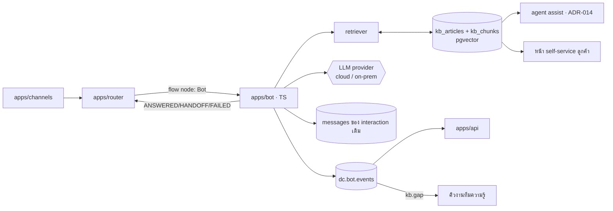

# D-Contact — Virtual Agent & Knowledge Base

> ตัดสินใจเชิงสถาปัตยกรรมอยู่ที่ [ADR-013](adr/013-virtual-agent-knowledge.md)

## 1. โมดูลนี้แก้ปัญหาอะไร

งานที่เข้ามา 100 ชิ้น มีประมาณ 30–50 ชิ้นเป็นคำถามซ้ำที่มีคำตอบตายตัว
(สถานะออเดอร์ · เวลาทำการ · วิธีรีเซ็ตรหัส · ยอดค้างชำระ)
โมดูลนี้ทำให้ **งานเหล่านั้นไม่ต้องใช้คน** และเมื่อยังต้องใช้คน ก็ส่งต่อพร้อมบริบทครบ

ตัวชี้วัดเดียวที่ตัดสินว่าโมดูลนี้คุ้มหรือไม่: **containment rate** =
จำนวน session ที่จบโดยไม่มีการมอบหมายให้ agent ÷ session ทั้งหมด
(ต้องดูคู่กับ **CSAT ของ session ที่ถูก contain** เสมอ — ไม่งั้นเรากำลังวัดว่าเราไล่ลูกค้าเก่งแค่ไหน)

## 2. สถาปัตยกรรม



**`apps/bot` ไม่มี state ของตัวเอง** — บทสนทนาอยู่ใน `messages` ของ interaction
ทำให้บอตล้มแล้ว restart ได้โดยไม่สูญบริบท และ QM ตรวจช่วงที่บอตคุยได้ทันที

## 3. โหมดการทำงานของบอต 3 ระดับ

| ระดับ | ทำอะไร | ต้องมีอะไร | ความเสี่ยง |
|---|---|---|---|
| **L1 — Menu/FAQ** | quick reply + คำตอบตายตัว จับคู่ด้วย keyword/intent | ไม่ต้องมี LLM | ต่ำ — ทำก่อนเสมอ |
| **L2 — RAG answer** | ค้นคลังความรู้ → ให้ LLM เรียบเรียงคำตอบพร้อมอ้างอิง | KB + embedding + LLM | ตอบผิด → บังคับ grounded + confidence |
| **L3 — Task bot** | ทำงานจริง (ค้นออเดอร์, นัดหมาย, เปลี่ยนที่อยู่) ผ่าน node `API call` | integration ([ADR-015](adr/015-integration-platform.md)) | ทำผิดกับข้อมูลจริง → ต้องยืนยันก่อนทุกครั้ง |

**ลำดับการทำ: L1 → L2 → L3** — L1 ให้ผลลัพธ์ 60% ของมูลค่าด้วย 10% ของความเสี่ยง

## 4. สัญญาของ node `Bot` (ต่อจาก [flow-engine §2](flow-engine.md))

```jsonc
{
  "type": "bot",
  "props": {
    "botId": "bot_support_th",
    "maxTurns": 6,                   // ครบแล้ว handoff เสมอ — กันบอตวนไม่จบ
    "minConfidence": 0.62,           // ต่ำกว่านี้ = ไม่ตอบ
    "handoffQueueId": "q_general",
    "collectBeforeHandoff": ["orderNo"],
    "allowFreeText": true
  },
  "outputs": ["answered", "handoff", "failed"]   // flow ต่อเส้นทางเองทั้งสามทาง
}
```

ผลลัพธ์ที่บอตส่งกลับ:

```jsonc
{
  "outcome": "ANSWERED",
  "text": "ออเดอร์ #A2291 อยู่ระหว่างจัดส่ง คาดว่าถึงวันพรุ่งนี้ครับ",
  "confidence": 0.81,
  "sources": [ { "articleId": "kb_812", "title": "การติดตามพัสดุ", "chunk": 3 } ],
  "collected": { "orderNo": "A2291" },
  "cost": { "inputTokens": 1840, "outputTokens": 96 }
}
```

`sources` ว่าง = ห้ามส่งข้อความออก ([ADR-013](adr/013-virtual-agent-knowledge.md) ข้อ 4)
`cost` ถูกส่งเข้า `dc.bot.events` ทุกครั้งเพื่อคิดต้นทุนต่อ tenant ได้จริง

## 5. Data model

```prisma
model bot_agent    { id String @id  tenantId String  name String  level String // L1|L2|L3
                     channels String[]  locales String[]  version Int
                     status String      // DRAFT|PUBLISHED|ARCHIVED
                     persona Json       // น้ำเสียง, ข้อห้าม, ความยาวคำตอบ
                     guardrails Json    // หัวข้อต้องห้าม, ข้อมูลที่ห้ามถาม, คำที่ห้ามพูด
                     kbCollectionIds String[]  publishedAt DateTime? }
model bot_intent   { id String @id  botId String  name String  samples String[]
                     action Json }     // ตอบตรง / เรียก flow ย่อย / เก็บข้อมูล
model bot_session  { id String @id  botId String  interactionId String  turns Int
                     outcome String    // CONTAINED|HANDOFF|ABANDONED|FAILED
                     confidenceAvg Float  costTokens Int  startedAt DateTime  endedAt DateTime? }
model bot_test_case{ id String @id  botId String  question String  expect String
                     expectSourceId String?  lastResult String? }

model kb_collection{ id String @id  tenantId String  name String  visibility String } // INTERNAL|PUBLIC
model kb_article   { id String @id  collectionId String  title String  body String
                     locale String  tags String[]
                     ownerId String                    // บังคับมี
                     reviewDueAt DateTime              // บังคับมี — เลยกำหนดแล้วเตือน + ลดน้ำหนักใน retriever
                     status String  version Int  publishedAt DateTime? }
model kb_chunk     { id String @id  articleId String  ord Int  text String
                     embedding Unsupported("vector")   // pgvector
                     tokens Int }
model kb_gap       { id String @id  tenantId String  question String  hits Int
                     firstSeenAt DateTime  status String  assignedTo String? }  // OPEN|WRITING|DONE
```

**pgvector อยู่ใน Postgres เดิม ไม่เพิ่ม vector DB ตัวใหม่** — ปริมาณบทความระดับหลักพัน–หมื่น
ต่อ tenant ไม่ต้องการโครงสร้างพื้นฐานเพิ่ม และทำให้ RLS ต่อ tenant
([multi-tenancy §7](multi-tenancy.md)) ยังคุ้มครอง embedding ด้วยโดยอัตโนมัติ

## 6. คลังความรู้ — วงจรที่ทำให้มันไม่เน่า

```
kb.gap (คำถามที่บอตตอบไม่ได้ ≥ 3 ครั้ง)
  → คิวงานทีมความรู้ → เขียนบทความ → review → publish (มี owner + reviewDueAt)
  → re-embed อัตโนมัติ → ชุดทดสอบของบอตได้เคสใหม่ 1 ข้อ
  → บทความเลย reviewDueAt → เตือนเจ้าของ 14 วันก่อน → เลยกำหนด 30 วัน = ลดน้ำหนักใน retriever
```

ทุกบทความมีตัวเลข **ถูกใช้ตอบกี่ครั้ง / นำไปสู่ handoff กี่ครั้ง / ถูกกด "ไม่ช่วย" กี่ครั้ง** —
บทความที่ถูกใช้บ่อยแล้ว handoff บ่อยคือบทความที่เขียนผิดหรือคำถามซ้อนกันอยู่

## 7. Voice bot (เฟสหลัง)

ใช้ node `Bot` ตัวเดิม แต่ห่อด้วย ASR streaming + TTS ที่ `apps/telephony`
ข้อจำกัดภาษาไทยเหมือนที่ระบุไว้ใน [quality-management §5](quality-management.md) —
**barge-in และ latency < 1.2 วินาที เป็นเงื่อนไขว่าจะทำหรือไม่ทำ** ไม่ใช่เรื่องปรับทีหลัง

## 8. UI (`mockups/ai.html`)

| view | หน้าที่ |
|---|---|
| `bots` | **list** บอต + ระดับ + ช่องทาง + containment + สถานะ |
| `bot-form` | **new/edit**: persona, guardrails, KB ที่ใช้, เกณฑ์ confidence, ช่องทาง, ทดลองคุย |
| `bot-tests` | ชุดทดสอบ + ผลล่าสุด + ปุ่ม publish (กดไม่ได้ถ้าเทสต์ไม่ผ่าน) |
| `kb` | **list** บทความ + เจ้าของ + วันครบกำหนดทบทวน + สถิติการใช้ |
| `kb-form` | **new/edit**: เนื้อหา, แท็ก, ภาษา, เจ้าของ, รอบทบทวน, preview การค้นเจอ |
| `kb-gaps` | คำถามที่ยังไม่มีคำตอบ + จำนวนครั้ง + มอบหมายให้เขียน |
| `deflection` | containment rate, ต้นทุนต่อ session, สายที่บอตส่งต่อเพราะอะไร |

## 9. แผนเฟส

| เฟส | ได้อะไร |
|---|---|
| **B1** | KB CRUD + owner/review + ค้นหาข้อความธรรมดา + ใช้ใน agent assist ก่อน |
| **B2** | บอต L1 (menu/FAQ/intent) ในช่องทาง digital + handoff พร้อมบริบท |
| **B3** | บอต L2 (RAG + pgvector + grounded answer + sources) + kb_gap |
| **B4** | ชุดทดสอบ + versioning/publish gate + จอ deflection + ต้นทุนต่อ session |
| **B5** | บอต L3 (task bot ผ่าน integration) และ voice bot ถ้า latency/ภาษาผ่านเกณฑ์ |

## 10. ความเสี่ยง

| ความเสี่ยง | ทางรับมือ |
|---|---|
| บอตตอบผิดแบบมั่นใจ | grounded only + ต้องมี sources + เกณฑ์ confidence + ชุดทดสอบก่อน publish |
| ลูกค้าติดอยู่กับบอตออกไม่ได้ | `maxTurns` + คำว่า "คุยกับคน" ต้อง handoff ได้ทุกจังหวะ ไม่มีข้อยกเว้น |
| KB เน่า | owner + reviewDueAt บังคับ + ลดน้ำหนักบทความหมดอายุอัตโนมัติ |
| ต้นทุน token บานปลาย | quota `botSessionsPerMonth` + เก็บ cost ทุก session + L1 ก่อน L2 เสมอ |
| containment สูงแต่ลูกค้าไม่พอใจ | แสดง containment คู่ CSAT ของ session ที่ contain เสมอ |
| ข้อมูลลูกค้าไหลออกไป LLM ภายนอก | ชั้น redaction ก่อนส่ง prompt + on-prem สลับ provider ได้ ([ADR-006](adr/006-multi-vendor-telephony-gateway.md)) |

## รายงานที่โมดูลนี้เป็นเจ้าของ

`bot.containment` · `bot.handoff.reason` · `bot.fallback` · `bot.cost.session` · `bot.test.results` · `kb.gaps` · `kb.usage` · `kb.staleness` · `kb.retrieval`

รายละเอียดของแต่ละใบ (dataset · grain · มิติบังคับ · entitlement · ชั้น · drill-down · เฟส) อยู่ที่
[reporting-data-platform §7.5](reporting-data-platform.md) ซึ่งเป็น**แหล่งความจริงเดียว** —
ใบใหม่ต้องไปลงทะเบียนที่นั่นก่อน ห้ามตั้งใบรายงานขึ้นเองในโมดูล

`bot.test.results` เป็นใบชั้นกำกับเพราะเป็นหลักฐานของ publish gate — ห้ามลบทิ้งพร้อมเวอร์ชันเก่า

## เอกสารเกี่ยวข้อง

[ADR-013](adr/013-virtual-agent-knowledge.md) · [flow-engine.md](flow-engine.md) ·
[agent-assist.md](agent-assist.md) · [integration-platform.md](integration-platform.md)
