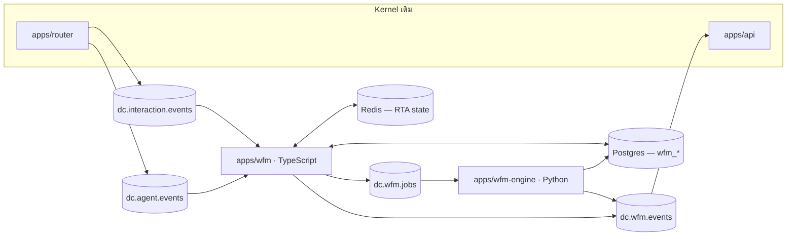

# D-Contact — Workforce Management (WFM)

> เอกสารออกแบบประกอบ [ADR-008](adr/008-workforce-management.md) · สถานะ: **แผน (ยังไม่ implement)**
> mockup ที่ `mockups/wfm.html` · อัปเดต 2026-08-07

## 1. WFM คืออะไรในระบบนี้

WFM ตอบคำถามเดียว: **"พรุ่งนี้ 10:15 ต้องมีคนกี่คน และใครบ้าง — แล้ววันนี้ทำได้ตามนั้นหรือเปล่า"**

```
ประวัติงาน ──▶ Forecast ──▶ Requirement ──▶ Schedule ──▶ Adherence ──▶ Intraday
(interval stats)  (ปริมาณ+AHT)  (คนกี่คน/ช่วง)  (ใคร/เมื่อไหร่)  (ทำได้ไหม)  (ปรับระหว่างวัน)
                                                                        │
                                                                        └─▶ ป้อนกลับเข้า forecast
```

**เส้นแบ่งความรับผิดชอบ (กติกาเหล็ก):**

| WFM เป็นเจ้าของ | Router/ACD เป็นเจ้าของ | Reports เป็นเจ้าของ |
|---|---|---|
| ตารางกะ, การลา, forecast, requirement, adherence, intraday | จับคู่ agent, reserve, ring, requeue | SLA/AHT/occupancy ย้อนหลัง |

**WFM ไม่แตะ routing** — agent นอกกะยัง login และรับงานได้ตามปกติ ([ADR-008](adr/008-workforce-management.md) ข้อ 3)
ตารางกะเป็นเครื่องมือ *วัด* ไม่ใช่เครื่องมือ *บังคับ*
ผลคือ WFM ล้มได้โดยธุรกิจไม่หยุด — ต่างจาก router/telephony

## 2. สถาปัตยกรรม



| Service | ภาษา | หน้าที่ | ลักษณะงาน |
|---|---|---|---|
| `apps/wfm` | TS / NestJS | CRUD site/กะ/ลา/activity, publish schedule, rollup interval stats, **adherence + RTA**, intraday monitor, สร้าง job | realtime + stream |
| `apps/wfm-engine` | **Python** | forecasting, staffing requirement (Erlang), schedule optimization (OR-Tools CP-SAT) | batch, รันเป็นนาที |

**ขอบเขตของ Python ถูกล้อมไว้แคบมาก**: stateless, รับ JSON คืน JSON,
ไม่แตะ auth, ไม่เป็นเจ้าของ business state, เขียน Postgres ได้เฉพาะ `wfm_jobs`
กับตารางผลลัพธ์ที่ระบุ (`forecast_intervals`, `staffing_requirements`,
`shift_instances`, `shift_segments`)

### Topic ใหม่ 2 ตัว

| Topic | Key | ทิศทาง | ตัวอย่าง payload |
|---|---|---|---|
| `dc.wfm.jobs` | `jobId` | wfm → wfm-engine | `{kind:"SCHEDULE", tenantId, scheduleId, siteId, planningGroupIds, horizon, rules, requirements}` |
| `dc.wfm.events` | `tenantId` | wfm/wfm-engine → api (WS fan-out) | `{type:"schedule.generated"\|"forecast.ready"\|"adherence.violation"\|"intraday.alert", ...}` |

**ทำไมต้อง async**: จัดกะ 1,000 agent × 4 สัปดาห์ ใช้เวลาระดับนาที
HTTP request/response รอไม่ไหวและ retry ไม่ได้ — job แบบ Kafka ได้ replay/audit ฟรีตาม [ADR-003](adr/003-kafka-event-backbone.md)

### วงจรของ job

```
planner กดสร้างตาราง
  → wfm เขียน wfm_jobs (QUEUED) + produce dc.wfm.jobs
  → wfm-engine consume, solve (time-boxed), เขียน shift_instances/shift_segments
  → wfm-engine อัปเดต wfm_jobs (SUCCEEDED/FAILED) + produce dc.wfm.events
  → api fan-out WS → หน้าจอ planner ขึ้น "ตารางเดือนหน้าเสร็จแล้ว"
```

job ต้อง **idempotent ตาม `jobId`** (วินัยเดียวกับ `eventId` ใน router) —
consume ซ้ำต้องไม่สร้างตารางซ้อน

## 3. Data model

ตารางทั้งหมดขึ้นต้น `wfm_` ยกเว้น `sites` ที่เป็น kernel entity
ประเภทข้อมูลตาม [multi-tenancy §3](multi-tenancy.md): **metadata** = cache ได้/แก้ไม่บ่อย,
**data** = append-heavy โตตาม traffic

| ตาราง | ประเภท | สาระ |
|---|---|---|
| `sites` | metadata | ไซต์/สาขา: `timezone`, `holiday_calendar_id`, `labor_rule_set_id` — `users.site_id` ชี้มาที่นี่ |
| `wfm_holiday_calendars` / `wfm_holidays` | metadata | ปฏิทินวันหยุดต่อประเทศ + ธง `affects_forecast` |
| `wfm_labor_rule_sets` | metadata | กฎแรงงานเป็น JSONB (ดู §12) |
| `wfm_planning_groups` | metadata | กลุ่มวางแผน = ชุด queue + skill ที่ถือว่า agent ภายในกลุ่มเท่าเทียมกัน |
| `wfm_activity_types` | metadata | WORK / BREAK / LUNCH / TRAINING / MEETING / OFFLINE + `is_paid`, `is_productive` |
| `wfm_state_activity_map` | metadata | map `AgentStateType` (+reason) → activity type ต่อ tenant (ดู §8) |
| `wfm_shift_templates` | metadata | รูปแบบกะ: `start_local` (**wall clock**), `duration_min`, segment pattern |
| `wfm_interval_stats` | **data** | ผลจริงต่อ (tenant, planning_group, channel, interval 15 นาที) |
| `wfm_forecasts` / `wfm_forecast_intervals` | data | ค่าพยากรณ์ + `source: MODEL\|MANUAL\|IMPORT` |
| `wfm_staffing_requirements` | data | คนที่ต้องใช้ต่อ interval + สมมติฐานที่ใช้คำนวณ |
| `wfm_schedules` | data | รอบการวางแผน: `period_start/end`, `status`, `version` |
| `wfm_shift_instances` | data | ใครทำงานกะไหน วันไหน (**UTC instant** + `date_local`) |
| `wfm_shift_segments` | data | ช่วงย่อยในกะ: งาน/พัก/อบรม |
| `wfm_time_off_requests` | data | คำขอลา + สถานะอนุมัติ |
| `wfm_adherence_daily` | data | สรุปรายวันต่อ agent |
| `wfm_adherence_exceptions` | data | ช่วงที่หลุด adherence เกิน threshold |
| `wfm_jobs` | data | คิวงานของ engine + สถานะ + error |

### โครงหลัก (Prisma sketch)

```prisma
model Site {
  id                String  @id @default(uuid()) @db.Uuid
  tenantId          String  @map("tenant_id") @db.Uuid
  name              String
  timezone          String            // IANA เช่น "Asia/Bangkok" — ห้ามเก็บ offset
  holidayCalendarId String? @map("holiday_calendar_id") @db.Uuid
  laborRuleSetId    String? @map("labor_rule_set_id") @db.Uuid
  @@unique([tenantId, name])
  @@map("sites")
}

// รูปแบบกะ — เวลาท้องถิ่นล้วน ไม่มี UTC ในตารางนี้โดยเจตนา
model WfmShiftTemplate {
  id          String @id @default(uuid()) @db.Uuid
  tenantId    String @map("tenant_id") @db.Uuid
  siteId      String @map("site_id") @db.Uuid
  code        String            // "D1", "E2", "N"
  startLocal  String @map("start_local")   // "09:00" (wall clock)
  durationMin Int    @map("duration_min")  // 540
  segments    Json              // [{activity:"LUNCH", offsetMin:240, durationMin:60}, ...]
  @@unique([tenantId, siteId, code])
  @@map("wfm_shift_templates")
}

// กะจริงของคนจริง — materialize ตอน publish เท่านั้น
model WfmShiftInstance {
  id         String   @id @default(uuid()) @db.Uuid
  tenantId   String   @map("tenant_id") @db.Uuid
  scheduleId String   @map("schedule_id") @db.Uuid
  userId     String   @map("user_id") @db.Uuid
  dateLocal  DateTime @map("date_local") @db.Date  // วันตามปฏิทินของไซต์
  startUtc   DateTime @map("start_utc")
  endUtc     DateTime @map("end_utc")
  templateId String?  @map("template_id") @db.Uuid
  @@index([tenantId, userId, startUtc])
  @@index([scheduleId])
  @@map("wfm_shift_instances")
}
```

`AgentStateLog` เดิม **ไม่ต้องแก้** — เป็น input ของ adherence ตามที่คอมเมนต์ในschema
ระบุไว้ตั้งแต่ Phase 0

## 4. Interval stats — input เดียวของทุกอย่าง

```
dc.interaction.events ──▶ apps/wfm (rollup) ──▶ wfm_interval_stats
```

| คอลัมน์ | ความหมาย |
|---|---|
| `interval_start` | ต้นช่วง 15 นาที (UTC) |
| `planning_group_id`, `channel` | มิติของข้อมูล — **channel เป็นข้อมูล ไม่ใช่ `if` ในโค้ด** |
| `offered`, `handled`, `abandoned` | จำนวนงาน |
| `aht_sec`, `acw_sec` | เวลาเฉลี่ย |
| `concurrency_avg` | เฉลี่ยจำนวน session พร้อมกัน (ใช้กับ chat) |
| `is_special_day` | ธงจากปฏิทินวันหยุด — ใช้ตัดออก/ปรับตอน forecast |

**กติกา: forecast ห้าม query `interactions` ตรง ๆ** ([ADR-008](adr/008-workforce-management.md) ข้อ 6) —
ตารางนี้เล็กและ replay สร้างใหม่ทั้งชุดได้จาก Kafka
เป็น append-heavy ต้อง partition รายเดือน + retention 24 เดือน (forecast ต้องมองย้อน 2 ปีเพื่อจับ seasonality รายปี)

## 5. Forecasting

**Input**: `wfm_interval_stats` ย้อนหลัง + ปฏิทินวันหยุด
**Output**: `wfm_forecast_intervals` (volume + AHT ต่อ 15 นาที ต่อ planning group ต่อ channel)

โครงสร้างที่พยากรณ์ = ผลคูณของ 3 ชั้น:

```
ปริมาณ(interval) = แนวโน้มระยะยาว × ดัชนีวันในสัปดาห์ × ดัชนีช่วงเวลาในวัน × ตัวปรับวันพิเศษ
```

| ขั้น | วิธี |
|---|---|
| แนวโน้ม | ค่าเฉลี่ยรายสัปดาห์ + Holt-Winters (seasonal periods = 7 วัน และ 96 ช่วง/วัน) |
| ดัชนีวัน/ช่วงเวลา | ค่าเฉลี่ยเคลื่อนที่ของสัดส่วน จาก 8–13 สัปดาห์ล่าสุด |
| วันพิเศษ | **ตัดวันหยุด/วันพิเศษออกจากฐานค่าเฉลี่ย** แล้วใส่ตัวปรับของวันนั้นแยก |
| AHT | พยากรณ์แยกจาก volume (AHT มีแนวโน้มของตัวเอง — คนใหม่เข้าทีม AHT ขึ้น) |

**วันพิเศษคือจุดที่ forecast พังบ่อยที่สุด** — สงกรานต์ ตรุษจีน Golden Week
ทำให้ pattern เพี้ยนคนละทิศ ถ้าไม่ flag ไว้ ค่าเฉลี่ยของปีถัดไปจะเพี้ยนตามไปด้วย
ปฏิทินวันหยุดจึงเป็น input ของ **forecast** ไม่ใช่แค่ของ scheduler

**Manual / imported forecast เป็นทางเข้าเท่าเทียมกับโมเดล** ([ADR-008](adr/008-workforce-management.md) ข้อ 9):
tenant ใหม่ไม่มีข้อมูลย้อนหลังเลย ต้องป้อนตัวเลขเองหรือ import CSV จากระบบเดิมได้
`source` ราย interval บอกว่าค่านั้นมาจากไหน และ planner override ทับได้เสมอ
เกณฑ์คร่าว ๆ: ต้องมีข้อมูล **≥ 6 สัปดาห์** โมเดลถึงจะให้ค่าที่เชื่อถือได้

## 6. Staffing requirement

จาก forecast → "ต้องมีคนกี่คนบนพื้นในแต่ละช่วง 15 นาที"
แยกตาม **คลาสของช่องทาง** ไม่ใช่ชื่อช่องทาง ([ADR-008](adr/008-workforce-management.md) ข้อ 7)

### 6.1 Voice (immediate) — Erlang C

ให้ `λ` = สายต่อวินาทีในช่วงนั้น, `AHT` = talk + ACW (วินาที), `T` = SLA threshold ของคิว

```
A = λ · AHT                                    (ความเข้มงาน, หน่วย Erlang)
B(0,A) = 1 ;  B(n,A) = A·B(n-1,A) / (n + A·B(n-1,A))        (Erlang B แบบ recursive)
C(N,A) = B(N,A) / (1 - (A/N)·(1 - B(N,A)))                  (โอกาสที่สายต้องรอ)
SL(N)  = 1 - C(N,A) · e^(-(N-A)·T/AHT)
ASA(N) = C(N,A)·AHT / (N - A)
Occ(N) = A / N
```

หา `N` ที่น้อยที่สุดที่ `SL(N) ≥ เป้าหมาย` (เช่น 80% ภายใน 20 วินาที) โดยต้อง `N > A` เสมอ
ใช้ Erlang B แบบ recursive เพื่อเลี่ยง factorial overflow

### 6.2 Chat (concurrent)

agent หนึ่งคนคุยได้ `c` ราย แต่ **ยิ่งคุยพร้อมกันมาก แต่ละรายยิ่งช้าลง**:

```
AHT_eff(c) = AHT_1 · (1 + α·(c-1))        α ≈ 0.20 (ปรับต่อ tenant จากข้อมูลจริง)
A_slot  = λ · AHT_eff(c)
N_slot  = Erlang C หา slot ที่ทำให้ SL ถึงเป้า
N_agent = ceil(N_slot / c)
```

ค่า `c` มาจาก concurrency ต่อ agent ที่ตั้งไว้ในหน้า People, ค่า `α` เริ่มที่ 0.20
แล้ว calibrate จาก `concurrency_avg` กับ `aht_sec` จริงใน `wfm_interval_stats`

### 6.3 Email / social (deferrable) — เฟสถัดไป

**ห้ามใช้ Erlang C** งานที่ SLA เป็นชั่วโมงไม่ใช่ปัญหา queueing แต่เป็นปัญหา backlog:

```
N = (backlog_ต้นช่วง + งานเข้าในกรอบ SLA) / (ผลิตภาพต่อคนต่อชั่วโมง × ชั่วโมงในกรอบ)
```

ใช้ Erlang C กับ email จะได้จำนวนคนที่มากเกินจริงหลายเท่า

### 6.4 Shrinkage — ขั้นที่คนลืมแล้วตารางพังทุกครั้ง

Erlang ให้ "คนที่ต้อง**อยู่บนพื้น**" ไม่ใช่ "คนที่ต้อง**จัดกะ**":

```
คนที่ต้องจัดกะ = คนที่ต้องอยู่บนพื้น / (1 - shrinkage)
```

`shrinkage` = สัดส่วนเวลาที่คนมีกะแต่ไม่ได้รับงาน (พัก อบรม ประชุม ลา ขาด สาย)
ปกติ 25–35% เก็บเป็นค่าต่อ planning group และ **คำนวณย้อนหลังจริงได้จาก
`wfm_adherence_daily` + `wfm_shift_segments`** — ไม่ต้องให้ผู้ใช้เดา

## 7. Scheduling

### 7.1 ข้อจำกัด

**Hard (ผิดไม่ได้)**
- agent หนึ่งคนมีกะซ้อนกันไม่ได้
- กฎแรงงานของไซต์ (§12) — ชม./วัน, ชม./สัปดาห์, พักระหว่างกะ, วันทำงานติดกันสูงสุด, วันหยุดขั้นต่ำ/สัปดาห์
- ลาที่อนุมัติแล้ว = ห้าม assign
- agent ต้องอยู่ใน planning group ของกะนั้น
- กะต้องอยู่ในกรอบเวลาที่ไซต์เปิด

**Soft (คะแนนใน objective, เรียงตามน้ำหนัก)**
1. คนขาด (understaffing) — น้ำหนักสูงสุดเสมอ
2. คนเกิน (overstaffing) — คือต้นทุน
3. ความสม่ำเสมอของกะต่อคน (คนเดียวไม่ควรสลับ 5 รูปแบบใน 1 สัปดาห์)
4. ความเป็นธรรมของกะดึก/เสาร์อาทิตย์

### 7.2 ซอยเป็น 3 ขั้น

| ขั้น | ปัญหา | ขนาด (1,000 agent × 28 วัน) |
|---|---|---|
| **A. Coverage** | เลือกว่าแต่ละวันใช้กะรูปแบบไหน กี่คน ให้ครอบคลุม requirement | 40 รูปแบบ × 28 วัน × 5 กลุ่ม ≈ 5,600 ตัวแปรจำนวนเต็ม — **วินาที** |
| **B. Assignment** | ใครได้กะไหน ภายใต้กฎแรงงาน + การลา | agent × วัน × รูปแบบ = 1,000 × 28 × 40 ≈ **1.12M boolean → ใหญ่เกินไปถ้าแก้ทีเดียว** |
| **C. Break placement** | วางพัก/พักเที่ยงในแต่ละกะ | ~28,000 ปัญหาเล็กที่อิสระต่อกัน — แก้เป็นชุด |

**วิธีคุมขนาดของขั้น B:**
- แยกตาม **site × planning group** — 200 คน/กลุ่ม → ~224k boolean ต่อ solve, รันขนานได้
- **symmetry breaking**: agent ที่ skill/สัญญาเหมือนกันสลับกันได้ → จัดเป็น class
  แล้วแก้ระดับ class ก่อน ค่อยแจกตัวบุคคล (ลดตัวแปรลงได้เป็นลำดับขั้น)
- **time-box 300 วินาทีต่อกลุ่ม** แล้วใช้คำตอบที่ดีที่สุดที่หาได้ (CP-SAT เป็น anytime solver
  — ตารางที่ดี 95% ภายใน 5 นาที มีค่ากว่าตาราง optimal ที่ใช้ 6 ชั่วโมง)
- เดือนถัดไปเริ่มจากตารางเดือนก่อนเป็น **solution hint** → ลู่เข้าเร็วขึ้นมากและได้ตารางที่คนคุ้นเคย

### 7.3 สถานะของตาราง

```
DRAFT ──(planner สั่ง generate)──▶ SOLVING ──▶ GENERATED ──(publish)──▶ PUBLISHED
                                       │                                    │
                                       └──▶ FAILED                          └──▶ agent เห็นกะตัวเอง
                                                                                  adherence เริ่มวัด
```

**เวลาถูกแปลงเป็น UTC ที่ขั้น publish เท่านั้น** — ก่อนหน้านั้นทุกอย่างเป็น wall clock ของไซต์

## 8. Adherence & RTA

### 8.1 State → activity mapping (tenant metadata)

| Agent state | Activity ที่ถือว่า "ตรง" | หมายเหตุ |
|---|---|---|
| `AVAILABLE`, `RESERVED`, `BUSY`, `ACW` | WORK | 4 สถานะนี้ = กำลังทำงาน |
| `BREAK` + reason `break` | BREAK | |
| `BREAK` + reason `lunch` | LUNCH | |
| `BREAK` + reason `training` / `meeting` | TRAINING / MEETING | |
| `OFFLINE` | OFFLINE | ตรงเฉพาะเมื่ออยู่นอกกะ |

ตารางนี้ **แก้ได้ต่อ tenant** — reason code ของแต่ละองค์กรไม่เหมือนกัน

### 8.2 สูตร

```
adherence %  = Σ เวลาที่ state ตรงกับ activity ตามตาราง / Σ เวลาตามตาราง × 100
conformance % = Σ เวลาทำงานจริงทั้งหมด / Σ เวลาตามตาราง × 100
```

**สองตัวนี้ต่างกันและต้องมีทั้งคู่** — คนที่มาสาย 1 ชั่วโมงแล้วอยู่ต่ออีก 1 ชั่วโมง
ได้ conformance 100% แต่ adherence พัง (ตอนที่ควรมีคนรับสาย ไม่มีคน)

### 8.3 Grace period — บังคับมี

ถ้าไม่มี grace period ตัวเลขจะแดงทั้งกระดานตั้งแต่วันแรกแล้วไม่มีใครเชื่อถืออีกเลย

| ค่า | default | ความหมาย |
|---|---|---|
| `grace_sec` | 180 | เข้า/ออกพักก่อนหรือหลังเวลา ไม่เกินนี้ ไม่ถือว่าผิด |
| `exception_min_sec` | 300 | หลุดนานกว่านี้ถึงบันทึกเป็น exception |
| `alert_sec` | 600 | หลุดนานกว่านี้แจ้ง supervisor |

### 8.4 RTA แบบเรียลไทม์

```
dc.agent.events ──▶ apps/wfm ──▶ Redis  wfm:rta:{tenantId}:{userId}
                                  { state, since, expectedActivity, outOfAdherenceSec }
                        │
                        ├─ tick ทุก 30 วินาที เทียบกับตารางกะที่ publish แล้ว
                        └─ เกิน alert_sec ──▶ dc.wfm.events {type:"adherence.violation"} ──▶ WS
```

สรุปรายวันลง `wfm_adherence_daily` ตอนปิดวันตาม timezone ของไซต์ (ไม่ใช่เที่ยงคืน UTC)

## 9. Intraday management

เทียบ **forecast vs actual ของวันนี้** ต่อ 15 นาที แล้วบอกว่าจะขาดคนตอนไหน

| ตัวชี้วัด | สูตร |
|---|---|
| variance ปริมาณ | (actual − forecast) / forecast |
| คนที่มีจริงบนพื้น | นับจาก RTA ณ ช่วงนั้น (ไม่ใช่จากตาราง — คนลาป่วยไม่มา) |
| over/under | คนที่มีจริง − requirement ที่คำนวณใหม่จาก actual |

เมื่อ variance เกินเกณฑ์ → `dc.wfm.events {type:"intraday.alert"}`
ข้อเสนอที่ระบบให้ได้ (ทั้งหมดเป็น **คำแนะนำ ไม่ใช่การสั่ง** เพราะตารางเป็น soft constraint):
เลื่อนพัก, ขอ OT, ยกเลิกอบรมช่วงบ่าย, ดึงคนจาก planning group ที่คนเกิน

## 10. Time-off

```
agent ยื่น ──▶ PENDING ──▶ supervisor อนุมัติ ──▶ APPROVED ──▶ เป็น hard constraint ของ solver
                              └──▶ REJECTED
```

- ตรวจ **coverage impact ตอนอนุมัติ**: ถ้าอนุมัติแล้ววันนั้นคนต่ำกว่า requirement ให้เตือน (ไม่บล็อก)
- ลาที่อนุมัติหลังตารางถูก publish แล้ว → ทำเครื่องหมายกะนั้นเป็นช่องว่างและแจ้ง planner
  **ไม่ re-solve ทั้งตารางอัตโนมัติ** (ตารางที่คนวางแผนไว้แล้วเปลี่ยนเองไม่ได้ — คนต้องเป็นคนกด)

## 11. Agent self-service

v1 เป็น **read-only + ยื่นลา** เท่านั้น ([ADR-008](adr/008-workforce-management.md) ข้อ 10 — ไม่มี bidding/swap)

- ดูกะตัวเอง 4 สัปดาห์ข้างหน้า (แสดงตาม timezone ของ agent เอง)
- ดู adherence ของตัวเองย้อนหลัง
- ยื่นและติดตามคำขอลา

## 12. หลายประเทศ — timezone, DST, วันหยุด, กฎแรงงาน

**กับดักที่ต้องกันไว้ตั้งแต่ schema:**

1. **shift template เก็บ wall clock ไม่ใช่ UTC** ([ADR-008](adr/008-workforce-management.md) ข้อ 4)
   "จันทร์ 09:00–18:00" ถ้าเก็บเป็น UTC instant พอเปลี่ยน DST ตารางทั้งชุดจะเลื่อน 1 ชั่วโมงเอง
2. **วันเปลี่ยน DST มี 23 หรือ 25 ชั่วโมง** — scheduler ห้ามสมมติว่าวันมี 24 ชั่วโมงเสมอ
   และห้ามคำนวณ `end = start + duration` ด้วยเลขวินาทีล้วน ต้องผ่าน timezone library
3. **เก็บ IANA timezone id (`Asia/Bangkok`) ห้ามเก็บ offset (`+07:00`)** — offset เปลี่ยนตามฤดูกาล
4. **ปิดวันตาม timezone ของไซต์** ไม่ใช่เที่ยงคืน UTC ทั้ง adherence daily และ intraday

**กฎแรงงานเป็น metadata ต่อไซต์** ([ADR-005](adr/005-multitenant-metadata-architecture.md)) —
เพิ่มประเทศใหม่ = เพิ่มข้อมูล ไม่ใช่แก้โค้ด:

```json
{
  "maxHoursPerDay": 8,
  "maxHoursPerWeek": 48,
  "minRestBetweenShiftsHours": 11,
  "maxConsecutiveWorkDays": 6,
  "minDaysOffPerWeek": 1,
  "breakAfterHours": 5,
  "minBreakMinutes": 60,
  "nightShiftStartLocal": "22:00",
  "overtimePolicy": { "allowed": true, "maxHoursPerWeek": 12 }
}
```

ทุกคีย์แปลงเป็น constraint ของ CP-SAT ตรง ๆ — นี่คือเหตุผลหลักที่คุ้มกับการรับ Python เข้ามา

## 13. สิทธิ์

| ความสามารถ | AGENT | SUPERVISOR | ADMIN |
|---|---|---|---|
| ดูกะตัวเอง / adherence ตัวเอง | ✓ | ✓ | ✓ |
| ยื่นลา | ✓ | ✓ | ✓ |
| อนุมัติลา | — | ✓ (ในทีม) | ✓ |
| ดู RTA board / intraday | — | ✓ (ในทีม) | ✓ |
| สร้าง/แก้ forecast | — | — | ✓ |
| generate / publish ตาราง | — | — | ✓ |
| แก้ site, กฎแรงงาน, planning group | — | — | ✓ |

บทบาท `WFM_PLANNER` แยกออกจาก ADMIN ทำได้ใน custom role ต่อ tenant
ตามที่ [iam-architecture §การกำหนดสิทธิ์](iam-architecture.md) เปิดทางไว้ (ยังไม่ทำใน v1)

## 14. UI (`mockups/wfm.html`)

| View | เนื้อหา |
|---|---|
| `schedule` | ตารางกะ agent × วัน (4 สัปดาห์) + แถบ timeline รายวันแสดง segment |
| `forecast` | กราฟ forecast vs actual + ตาราง requirement ราย interval + ปุ่ม override/import |
| `adherence` | RTA board — แถบตาราง (บน) เทียบสถานะจริง (ล่าง) ต่อ agent + % รายวัน |
| `intraday` | forecast vs actual ของวันนี้ + over/under staffing + alert |
| `timeoff` | คำขอลา + ผลกระทบต่อ coverage + อนุมัติ/ปฏิเสธ |
| `sites` | ไซต์, timezone, ปฏิทินวันหยุด, ชุดกฎแรงงาน, planning group |
| `my-schedule` | มุมมองของ agent — กะตัวเอง + adherence ตัวเอง + ยื่นลา |

## 15. แผนเฟส

| เฟส | ขอบเขต | ขึ้นกับ |
|---|---|---|
| **W1** | `sites` + timezone + กฎแรงงาน + activity types + shift template + ตารางกะแบบ **จัดมือ** + publish + agent self-service | ไม่ขึ้นกับอะไร ทำได้ทันทีหลัง Phase 1 |
| **W2** | time-off + adherence + RTA board | ต้องมี W1 (ตารางที่ publish แล้ว) |
| **W3** | `wfm_interval_stats` rollup + forecast (manual/import ก่อน แล้วค่อยโมเดล) + requirement (Erlang) | ต้องมีข้อมูลจริง ≥ 6 สัปดาห์ถึงจะเปิดโมเดล |
| **W4** | `apps/wfm-engine` + CP-SAT auto-scheduling + intraday | ต้องมี W3 (requirement เป็น input ของ solver) |
| **W5** | email/social (backlog model), multi-skill ขั้นสูง, shift bidding | หลัง v1 |

**ลำดับนี้จงใจให้ Python มาช้าที่สุด** — W1–W3 เป็น TypeScript ล้วน
ถ้าถึง W4 แล้วพบว่า heuristic ใน TS ดีพอ ก็ยังถอย Python ออกได้โดยไม่เสียงานที่ทำไปแล้ว

## 16. ความเสี่ยง

| ความเสี่ยง | ผลถ้าเกิด | การคุม |
|---|---|---|
| **Python เป็นภาษาที่สอง** | on-prem ต้อง ship image เพิ่ม, CI ซับซ้อนขึ้น, คนดูแลต้องอ่าน 2 ภาษา | ขอบเขต engine แคบมาก (JSON in/out, stateless) + contract test ต้องเขียวใน CI + เลื่อนไป W4 |
| **forecast ไม่แม่น** | ตารางผิดตาม ผู้ใช้โทษ "ระบบจัดกะ" | หน้า intraday เทียบ forecast vs actual ตลอดเวลา + manual override เป็นทางเข้าปกติ |
| **adherence แดงทั้งกระดาน** | ไม่มีใครเชื่อถือตัวเลขอีกเลย | grace period บังคับมี + mapping แก้ได้ต่อ tenant + ค่อย ๆ ขันเกณฑ์ |
| **planning group ไม่ตรงกับ skill จริง** | requirement สูงเกินจริง (over-staffing) | mockup แสดงความครอบคลุมของกลุ่ม + เอกสารบอกข้อจำกัดตรง ๆ + เปิดทางไป simulation |
| **solve ไม่ทันที่ 1,000 agent** | planner รอนานหรือได้ตารางแย่ | ซอย 3 ขั้น + แยกตามกลุ่ม + symmetry breaking + time-box + warm start จากเดือนก่อน |
| **`wfm_interval_stats` โตเร็ว** | reporting ช้าลง | partition รายเดือน + retention 24 เดือน ตาม [multi-tenancy §6](multi-tenancy.md) |
| **DST / timezone** | ตารางเลื่อนเอง 1 ชั่วโมง หาสาเหตุยากมาก | wall clock ใน template + UTC ตอน publish + IANA id + ทดสอบวัน DST โดยเฉพาะ |

## รายงานที่โมดูลนี้เป็นเจ้าของ

`wfm.forecast.accuracy` · `wfm.coverage` · `wfm.adherence` · `wfm.conformance` · `wfm.shrinkage` · `wfm.occupancy.plan` · `wfm.timeoff.impact` · `wfm.solver.jobs`

รายละเอียดของแต่ละใบ (dataset · grain · มิติบังคับ · entitlement · ชั้น · drill-down · เฟส) อยู่ที่
[reporting-data-platform §7.11](reporting-data-platform.md) ซึ่งเป็น**แหล่งความจริงเดียว** —
ใบใหม่ต้องไปลงทะเบียนที่นั่นก่อน ห้ามตั้งใบรายงานขึ้นเองในโมดูล

ทั้งกลุ่มอ่านจาก `wfm_interval_stats` ที่ grain 15 นาที และ**รวมเป็นวันตาม IANA tz ของไซต์** ไม่ใช่ tz ของ tenant — ไม่งั้นตารางกะกับรายงานจะคนละวันกันตอน DST
